<PageDescription>

Using your local development environment to make and test changes. Then how to deliver your changes and request a review.

</PageDescription>

<InlineNotification kind="info">

Note: this page assumes that you have completed the <a href="./one-time-set-up">one-time set-up</a> process.

</InlineNotification>

<AnchorLinks small>
  <AnchorLink>Create a new branch</AnchorLink>
  <AnchorLink>Make your changes</AnchorLink>
  <AnchorLink>Commit your changes</AnchorLink>
  <AnchorLink>Submit a pull request</AnchorLink>
</AnchorLinks>


## Create a new branch

In GitHub, each set of changes needs to be in a separate pull request (PR) for approval and merging. 
Each PR needs to have its changes in its own branch. This keeps different pieces of work separate from each other.

<InlineNotification kind="info">

For information about key GitHub terms and workflow, see [Understanding GitHub terms and workflow](./troubleshooting#understanding-github-terms-and-workflow).

</InlineNotification>

1. Ensure you have your local development environment running. If not, see [Start the development server](./one-time-set-up#start-the-development-server).

2. Open the local clone of the `/pal` repository in VS Code.

3. Create a new branch.

  a. Click on the name of the current branch (probably `master` or `main`) shown in the bottom-left corner of VS Code.
  
  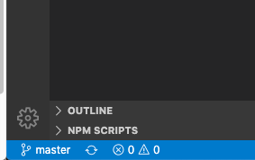

  b. Click on **Create new branch...** and specify a name for the branch. Branch names must not include any 
  spaces; use dashes instead.

  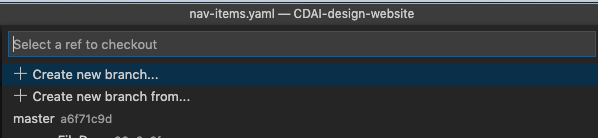

  <InlineNotification kind="info">

  When choosing a branch name, do be specific — for example:<br />
  ```updating-card-pattern-to-include-icons```<br />
  And if relevant, include the associated issue number:<br />
  ```issue-45/enhancement-to-button-pattern```

  </InlineNotification>

  You should now see the new branch listed in the bottom-left corner of VS Code.
  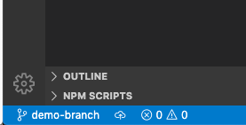

  <InlineNotification kind="warning">

  Never make changes to the master/main branch of a repository.<br />
  This is the single source of truth for the PAL site, and changes made to this branch trigger a Travis build 
  and a redeployment of the live site.<br />
  Make it a habit to check you're not on the master/main branch before editing anything.<br />
  See also: [Move your changes to a different branch](./troubleshooting#move-your-changes-to-a-different-branch)

  </InlineNotification>


## Make your changes

1. Ensure that your development server is running. If it's not, then start it by running the command:
  ```
  $ npm run dev
  ```
2. Open <http://localhost:8000/> in your browser. This should display your local version of the site.
3. Now it's time to make some edits. 

  <InlineNotification kind="info">

  If this is your first time making any changes, we suggest you experiment using the **Testing** file/page that 
  we have created for this purpose.<br />
  However, the process is the same, regardless of the file/page you are editing.

  </InlineNotification>

  a. In the left-hand **Explorer** pane in VS Code, find and open the `src/pages/testing.mdx` file.

  b. Make some edits to the file (for example, add some new text).

  <InlineNotification kind="warning">

  Note that at the top of MDX files, there is a special section starting and ending with `---`. 
  This contains meta information for the page. Unless you're really sure what you are doing, do not edit this section.

  </InlineNotification>

4. To see the effect of your edits, in your browser, navigate to the **Testing** page: <http://localhost:8000/testing> 
(or whatever page you edited) to verify your changes.

5. Review your changes. 

  a. In the left-hand toolbar in VS Code, the **Source Control** tab should have a visual indication as to the
  number of files you have changed. Click on this **Source Control** tab to see the list of files you've changed.

  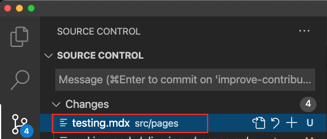

  b. If you click on an individual file in the left pane, you will see the actual changes you made highlighted 
  in the right-hand pane:

  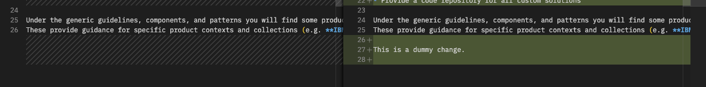

6. Add to Sidebar before submitting the changes.

  a. You will need to submit an issue titled **Add to left hand nav**. The issue needs to contain the wording of the left hand navigation item, as well as the location it should occupy within the left hand navigation. 
  For example: If your page is called Canvas your message should be similar to the following. "Please place Canvas in the Patterns section between Create flows and Breadcrumbs."

  b. Assign either [James Thompson](https://github.ibm.com/kingjames) or [Krista Starr](https://github.ibm.com/Krista-Starr) to the issue so that either one will take care of adding the new page to the left hand navigation.

  c. Once the PR is approved (usually within 1-2 business days) your new page will be accessible from the left hand navigation.

## Commit your changes

1. If you are happy with the changes that you have made, the next step is to commit them and push (upload) the
  branch to the master repository.

  a. Stage each of the files you wish to push by clicking the plus to the right of it:

    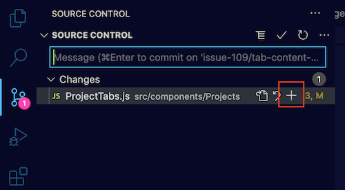

  b. Commit the changes by adding a commit message to the text box and clicking the
      checkmark / tick icon positioned above the text input field.<br />

  <InlineNotification kind="info">

  **NOTE:** Commit messages should be prefixed with `chore:`, `fix:`, or `feat:` (to denote a general 
  update, a fix or a new feature).<br />
  Some examples of good commit messages:<br />
  `chore: refactored guidance page`<br />
  `feat: new button pattern added`<br />
  `fix: spelling errors on card index file`

  </InlineNotification>

  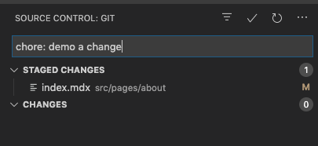

  c. Push your changes by clicking on the cloud or up arrow icon in the bottom-left of the VS Code window. 
    (Which icon you see depends on whether or not you have already pushed changes to a branch).
    If clicking on the cloud you will be asked to select where to send the changes. Select 'origin'.

    

    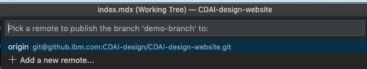

    You will see a spinner in the bottom-left of the VS Code window until the push is complete.

    Note: If you've already pushed changes to this branch previously, you'll see an icon showing an 
    up and a down arrow instead:

    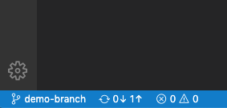


## Submit a pull request
1. Once the branch with your changes has been pushed up to the online master repository, then a pull 
request (PR) needs to be created to get the changes reviewed and merged into the master branch (which 
will cause them to be deployed to the site).

  a. Go to the master repository <https://github.ibm.com/CDAI-design/pal/> and click on the **Compare & pull request** button, 
  which should appear any time you have recently uploaded changes:

  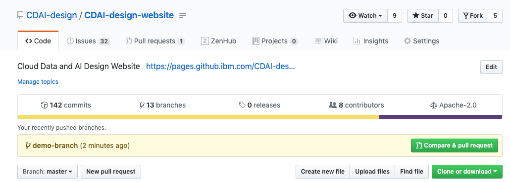

  If it does not you can achieve the same result by clicking on the **Pull requests** tab and then clicking
  the **Create pull request** button.

  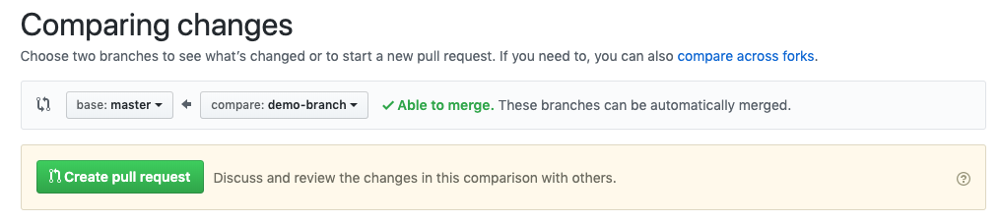

  b. Give the pull request a meaningful title and capture relevant information in the **Description** field.

  <InlineNotification kind="info">

  Providing a good summary detailing the purpose of the PR and what changes it includes is really important and will help your reviewer.<br />
  See the example PR and template text below.

  </InlineNotification>

<Accordion>
  <AccordionItem title="Example of a clear, well written pull request">

  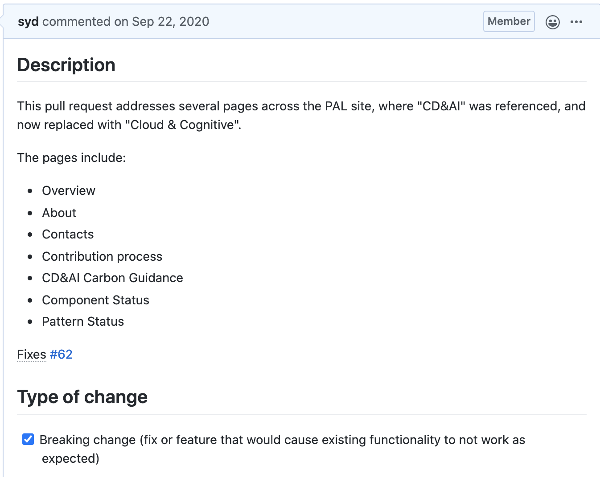

  </AccordionItem>
  <AccordionItem title="Pull request template text you can copy and paste">

```
## Description
Please include a summary of the change and which issue is fixed. Please also include relevant motivation and context. List any dependencies that are required for this change.

Fixes #(issue)

## Type of change

Please delete options that are not relevant and add an "x" into the option that is.

- [ ] Bug fix (non-breaking change which fixes an issue)
- [ ] New feature (non-breaking change which adds functionality)
- [ ] Breaking change (fix or feature that would cause existing functionality to not work as expected)
- [ ] This change requires a documentation update
```

  </AccordionItem>
</Accordion>

  c. From the **Reviewers** section in the right-hand pane, select an appropriate colleague.<br />
  (Hint: You might want to ask them via Slack first 😉)

  d. If the reviewer approves your pull request and the automated build checks complete successfully, the
    **Squash and merge** button will be green and enabled. Click this to merge your changes into the master branch.

  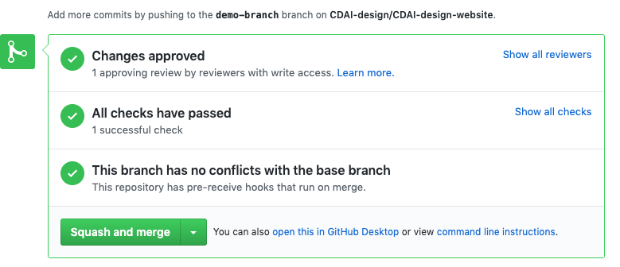

  e. A new, full deployment build will now automatically run. You can view the status of such Travis builds 
  for the site here: <https://travis.ibm.com/CDAI-design/pal/builds/>.


#### Congratulations! 🙌
You have now made and delivered changes to the site. As long as the deployment build is successful, 
the output will automatically be published to the live site within a few minutes: <https://pages.github.ibm.com/cdai-design/pal/>.
