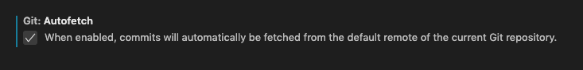
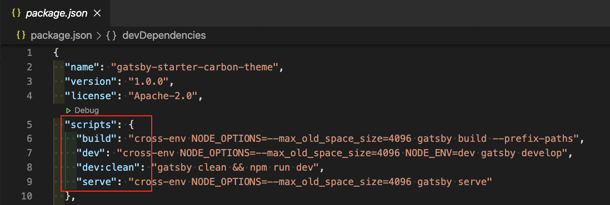
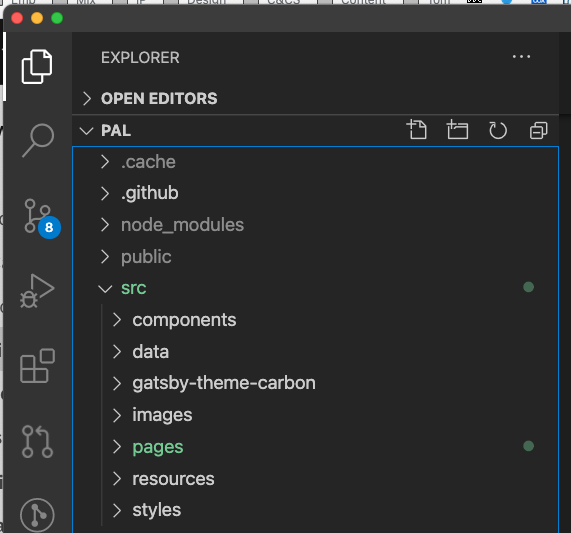
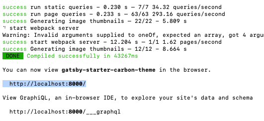

<PageDescription>

The steps you need to follow to set up a development environment on your local machine. 

</PageDescription>

<AnchorLinks small>
  <AnchorLink>Request write access to the pal repo</AnchorLink>
  <AnchorLink>Install VS Code and extensions</AnchorLink>
  <AnchorLink>Configure macOS settings</AnchorLink>
  <AnchorLink>Install NVM</AnchorLink>
  <AnchorLink>Install Node.js</AnchorLink>
  <AnchorLink>Check you have the relevant package manager installed</AnchorLink>
  <AnchorLink>Setup your github account to accept SSH connections</AnchorLink>
  <AnchorLink>Clone the pal repository</AnchorLink>
  <AnchorLink>Install the project dependencies</AnchorLink>
  <AnchorLink>Start the development server</AnchorLink>
</AnchorLinks>

<InlineNotification kind="warning">
<strong>Notes:</strong><br />
1) The following instructions assume you are using a MacOS machine.<br />
2) You'll be asked to execute some commands in the Terminal. Each command is presented like this:

```$ command options```

But when copying these commands do **not** include the dollar symbol ($).
</InlineNotification>


## Request write access to the pal repo

The ability to make updates to this site is controlled through membership of a GitHub team. Before you 
continue with the set-up, request access to the `CDAI-Design-Editors` team from one of the following people: 
- [Andy Gatford](https://ibm-casdesign.slack.com/archives/D5A3VPL90) (Design Manager)
- [David Levinson](https://ibm-casdesign.slack.com/archives/D232A13N3) (Design Principal & Visual Design Lead)
- [Conrad Schmidt](https://ibm-casdesign.slack.com/archives/D014RCL4Q3Z) (UX Engineer)
- [Stephane Rodet](https://ibm-casdesign.slack.com/archives/D3W4U63H7) (Lead UX Engineer)
- [Tom Waterton](https://w3.ibm.com/bluepages/profile.html?uid=100898866) (Content Design Lead)


## Install VS Code and extensions

You will need to use a suitable code editor both during this set-up and whenever you want to make changes to this site. 
We suggest VS Code, which is a popular code editor that has some useful features and extensions that can help
when editing project files. It is not the only option, but is recommended if you have no other strong preference.

1. Go to <https://code.visualstudio.com/> and download and install VS Code.
2. Once installed, open VS Code. 
3. Use the menu structure to click **Code** > **Preferences** > **Extensions**.

  

4. In the VS Code **Extensions** pane, search for and install the following extensions:<br />
  — `Prettier` (a code formatter which automates some code styling to keep it consistent)<br />
  — `Indent-rainbow`  (an indent highlighter, because we all love rainbows)<br />
  — `MDX` (provides syntax highlighting for MDX files which contain the content)<br />
  — `GitLens` (provides additional abilities over and above the base git VS Code integration)

5. During the VS Code install you may be offered the option to ‘auto fetchʼ updates — do enable this. 
If not, or you missed this step, click **Code** > **Preferences** > **Settings**, search for `autofetch`, 
and ensure it is checked.

  


## Configure macOS settings

<InlineNotification kind="info">

There are some special characters that can be used in the terminal to specify folders.<br/>
. (period) at the start of a path refers to the current folder<br/>
~ (tilde) at the start of a path refers to the user's specified home folder

</InlineNotification>

1. Open a finder window and locate your home folder.  
If you'd prefer, you can do this via the Terminal by running this command:
  ```
  $ open ~/
  ```

2. Create a folder called something like 'Source' or 'Projects' to hold your
git repositories. You may want to also drag this folder into your favourites
in Finder to make it easy to find later.


## Install NVM

This installs Node Version Manager, which is a convenient way to install and
manage versions of Node.js. For more details, see <https://github.com/nvm-sh/nvm/blob/master/README.md>.


1. You must have a `.bash_profile` (which is a hidden file) present in your home folder. If not go
to the MacOS terminal window and execute this command:
  ```
  $ touch ~/.bash_profile
  ```

2. To install NVM paste the following into a MacOS terminal window
  ```
  $ curl -o- https://raw.githubusercontent.com/nvm-sh/nvm/v0.35.1/install.sh | bash
  ```

  <InlineNotification kind="info">

  If you are using macOS Catalina, the default shell may be changed to zsh from bash.
  In this case you may need to copy updates that the NVM install script makes to
  `.bash_profile` into a `.zprofile` file.

  </InlineNotification>

3. Close the existing macOS Terminal window and open a new one. 
4. Then run this command: 
  ```
  $ nvm --version
  ```
This will confirm that you now have NVM installed and will list the version number.


## Install Node.js

This installs the Node.js Javascript engine that is used to build and test the website.

1. In the Terminal, run the following command:
  ```
  $ nvm install 12
  ```

  <InlineNotification kind="warning">
  Note: New versions of Node.js are released regularly, but you should only install or update Node.js 
  to a stable version, which currently is v10 or v12.
  </InlineNotification>


## Check you have the relevant package manager installed

<Accordion>
  <AccordionItem title="About package managers">
    — Package managers automate the process of installing, upgrading, configuring, and removing programs 
    and dependencies in a consistent manner.<br />
    — <strong>Yarn</strong> and <strong>npm</strong> are popular package managers.<br />
    — Note that each repo will use a specific package manager.
  </AccordionItem>
  <AccordionItem title="How to tell which package manager is being used">
    — Look in the root folder of the repo.<br />
    — If there is a <strong>package-lock.json</strong> file, then the repo is using <strong>npm</strong> as its package manager.<br />
    — If there is a <strong>yarn.lock</strong> file, then the repo is using <strong>Yarn</strong> as its package manager.<br />
    — In the rare case that both files are present, please defer to your UX engineering contact or team lead to figure out 
    which is best to use to avoid conflicts in the future.
  </AccordionItem>
  <AccordionItem title="How to know what commands to run">
    — Look in the <strong>package.json</strong> file (which will always be present, regardless of which package manager is being used).<br />
    — In the "scripts" stanza, you'll see the commands listed that you can run.
    — Note: if you're using <strong>npm</strong> as your package manager, all scripts must be proceeded by "run" (for example, `npm run dev:clean`). This is not necessary for <strong>Yarn</strong> commands.

  

  </AccordionItem>
</Accordion>

If the repo you are wanting to contribute to is using **npm** as its package manager, you don't need to 
install anything extra at this point, as npm is automatically installed as part of the Node.js install that 
you completed earlier.

However, if the repo you are wanting to contribute to is using **Yarn** as its package manager, you'll 
need to install it now.

#### To install Yarn: 
1. In your Terminal, run the command:
  ```
  $ curl -o- -L https://yarnpkg.com/install.sh | bash
  ```


## Setup your github account to accept SSH connections

<Accordion>
  <AccordionItem title="What is SSH?">
    An SSH key is an alternate way to identify yourself that doesn't require you to enter you username and 
    password every time. SSH keys come in pairs, a public key that gets shared with services like GitHub, 
    and a private key that is stored only on your computer. If the keys match, you're granted access.
  </AccordionItem>
  <AccordionItem title="Why am I doing this?">
    This step creates a seamless connection to your enterprise Github account, allowing you to push changes 
    to an IBM owned repository without having to sign in each time.
  </AccordionItem>
  <AccordionItem title="What to do if you get stuck">
    If you are not used to setting up SSH keys, this process can be a little confusing 🤔<br />
    Try following the instructions linked to below, but if you get really stuck, contact one of our friendly 
    UX Engineering team for help:<br />
    — <a href="https://ibm-casdesign.slack.com/archives/D01AW8VM7GA">Syd Rosa</a> (Central Standard Time)<br />
    — <a href="https://ibm-casdesign.slack.com/archives/D01FTH9FV7V">Matt Huntsberry</a> (Central Standard Time)<br />
    — <a href="https://ibm-casdesign.slack.com/archives/D014RCL4Q3Z">Conrad Schmidt</a> (Central European Standard Time)<br />
    — <a href="https://ibm-casdesign.slack.com/archives/D3W4U63H7">Stephane Rodet</a> (Central European Standard Time)<br />
  </AccordionItem>
</Accordion>

Follow the instructions available here: <https://help.github.com/en/github/authenticating-to-github/connecting-to-github-with-ssh>
to check if you already have SSH to github setup, and if not to create a new keypair and configure your 
machine and github to use it.

In both cases be sure to follow the instructions to ensure that your key is added to the ssh-agent, otherwise 
you will be prompted for the key passphrase every time you access github.

<InlineNotification kind="info">
The first time you use the command line to access git you will be prompted with a message along the lines of "The authenticity
of host 'github.ibm.com' cannot be established... Are you sure you want to continue connecting (yes/no)?"
<br />
Type 'yes' and press the return key.
</InlineNotification>


## Clone the pal repository

In the Terminal, you now need to navigate to the directory folder on your local machine that you specified 
in the [Configure macOS settings](#configure-macos-settings) step earlier on. 

1. In the Terminal window, use the `cd` (change directory) command, followed by the name of the directory you chose 
(e.g. "Source" or "Projects" etc.):
  ```
  $ cd ~/Source
  ```
At present this directory will be empty.

  <InlineNotification kind="info">
  You can check the contents of any directory by running the `ls` command.
  </InlineNotification>

2. To clone all of the `pal` source files into this directory on your local machine, run this command:
  ```
  $ git clone git@github.ibm.com:CDAI-design/pal.git
  ```
Your chosen directory will now contain all of the source files for this site.


## Install the project dependencies
As well as the core source files, to build the site you'll also need to install its dependencies. 
This is very quick to do.
1. In the terminal window, change directory to the `pal` directory (which was just created in the previous step) 
by running this command: 
  ```
  $ cd pal
  ```
2. Install the dependencies of the project by running this command:
  ```
  $ npm i
  ```
3. Open VS Code and from the menu, click **File** > **Open...**. In the diretory window, navigate to 
the `pal` subdirectory and click **Open**.  

  You should now see the `pal` source file structure displayed in the left-hand pane of VS Code:

  


## Start the development server

1. In the Terminal window, run this command: 
  ```
  $ npm run dev
  ```

  The first time you start your development environment server it can take longer than normal as it has additional work to do.
  When the server has started you will see the following in the terminal window:

  

<Accordion>
  <AccordionItem title="If the repo is using Yarn not npm">
  1. In the Terminal window, run this command instead:<br />

  ```
  $ yarn run
  ```

  </AccordionItem>
</Accordion>

2. In your web browser, go to <http://localhost:8000/>.  
You will see your local build of the site running.  
It will automatically update whenever you make and save any changes.


#### Congratulations! 🙌
You are now ready to start making changes in your local development environment and see the results in your 
web browser.

When you are happy with your changes, you can then contribute them to the main repo to update the live site. 
See the [Making and delivering changes](./making-and-delivering-changes) tab for details.