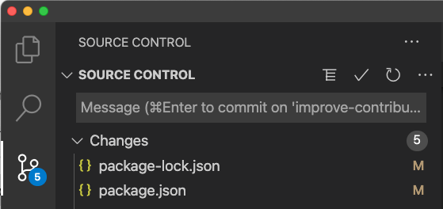
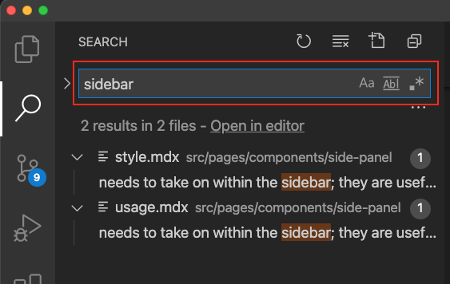

<PageDescription>

Troubleshooting hints and tips when working in your local environment

</PageDescription>

<AnchorLinks small>
  <AnchorLink>Understanding GitHub</AnchorLink>
  <AnchorLink>Repository updates</AnchorLink>
  <AnchorLink>Prevent tracking</AnchorLink>
  <AnchorLink>Finding relevant files</AnchorLink>
  <AnchorLink>Clearing cache</AnchorLink>
  <AnchorLink>Moving changes to a different branch</AnchorLink>
  <AnchorLink>Updating project dependencies</AnchorLink>
  <AnchorLink>Starting/stopping your server</AnchorLink>
</AnchorLinks>

<InlineNotification kind="warning">
<strong>Notes:</strong><br />
1) The following instructions assume you are using a MacOS machine.<br />
2) You'll be asked to execute some commands in the Terminal. Each command is presented like this:

```command options```
</InlineNotification>


## Understanding GitHub

There are lots of resources on the web that explain Git and GitHub, but here is a quick guide to some of the key terms and the workflow process. 

<Accordion>
  <AccordionItem title="Key terms used in git and GitHub">
<strong>repo</strong> (noun)<br />
  - You can think of a repo (or repository) as being like a project's folder.<br />
  - It contains all of the project files and stores each file's revision history.<br />
  - Repositories can have multiple collaborators.<br />
<strong>clone</strong> (noun)<br />
  - A clone is a copy of a repository that lives locally on your computer instead of remotely on a website's server.<br />
  - With your clone you can edit the files in your preferred editor and use Git to keep track of your changes without having to be online.<br />
  - It is, however, connected to the remote version so that changes can be synced between the two.<br />
<strong>clone</strong> (verb)<br />
  - The act of making a copy of a (remote) repo on your (local) laptop.<br />
<strong>branch</strong> (noun)<br />
  - A branch is a parallel version of a repository.<br />
  - It is contained within the repository, but does not affect the primary ('master') branch, allowing you to work freely without disrupting the master version.<br />
  - When you've made the changes you want to make, you can merge your branch back into the master branch to publish your changes.<br />
<strong>upstream</strong> / <strong>downstream</strong> (noun)<br />
  - When talking about a branch or a fork, the primary branch on the original repository is often referred to as the "upstream", since that is the main place that other changes will come in from.<br />
  - The branch/fork you are working on is then called the "downstream".<br />
<strong>commit</strong> (noun)<br />
  - A commit, or "revision", is an individual change to a file or set of files.<br />
  - Commits usually contain a commit message which is a brief description of what changes were made.<br />
  - In Git, information about each change is stored, allowing you to keep a record of what changes were made when and by who.<br />
<strong>pull</strong> (verb)<br />
  - Pulling refers to when you are fetching in changes and merging them. For instance, if someone has edited the remote file you're both working on, you'll want to pull in those changes to your local copy so that it's up to date.<br />
<strong>push</strong> (verb)<br />
  - Pushing refers to sending your committed changes from your local clone to a remote repo (e.g. one hosted on GitHub).<br />
  - For instance, if you change something locally, you'd want to then push those changes so that others may access them.<br />
<strong>pull request (PR)</strong> (noun)<br />
  - Pull requests are proposed changes to a repository submitted by a user and accepted or rejected by a repository's collaborators.<br />
  - Like issues, pull requests each have their own discussion forum.<br />
  </AccordionItem>
  <AccordionItem title="Understanding the GitHub workflow">
    See this page on the GitHub site for an interactive diagram covering a typical GitHub flow:<br />
    — <a href="https://guides.github.com/introduction/flow/">Understanding the GitHub flow</a><br />
    This page covers the process from creating a branch to committing changes to opening a pull request to changes being merged into the master branch.
  </AccordionItem>
</Accordion>


## Repository updates

This can be accomplished in two different ways.

- If you are already _in_ the master/main branch, run the following commands:
  ```
  git fetch
  ```
  ```
  git pull
  ```
- If you are in your feature branch, the first stage and commit all changes you currently have. 
Then, run the following command:
  ```
  git merge master
  ```
- You may be required to enter a merge message. If so, press **Enter** on your keyboard until you reach the `#` line. 
  You can enter `:wq!` to exit this stage and all changes from master will now be in your repository.


<Accordion>
  <AccordionItem title="If you run into merge conflicts and need help">
  
    <br />
    If you get really stuck, contact one of our friendly UX Engineering team for help:
    <br />
    <br />
    
    <iframe
      class="airtable-embed"
      src="https://airtable.com/embed/appURFSG6dypHTXcd/shrFrYWX45MnvCI3V?backgroundColor=orange&viewControls=on"
      frameborder="0"
      onmousewheel=""
      width="100%"
      height="625"
      style="background: transparent; border: 1px solid #ccc;"
    ></iframe>
  </AccordionItem>
</Accordion>

## Prevent tracking

When working in your local development environment, in VS Code, you might notice in the **Source Control** pane 
that some configuration files (for example `package.json` and `package-lock.json`) are listed under the **Changes** 
section even though you haven't manually edited those files.



Generally speaking, these files do not need to be included in commits you make. 
1. To prevent them from ever being included, run the following command: 
  ```
  git update-index --skip-worktree package-lock.json package.json
  ```

- Note that, if needed, this can be reversed by running this command: 
  ```
  git update-index --no-skip-worktree package-lock.json package.json
  ```


## Finding relevant files

Sometimes it can be hard to find the relevant file that you want to edit. Thankfully, there is a global 
search facility in VS Code that can help you find what you need. 

1. Either click on the magnifying glass icon in the left bar in VS Code or press **Cmd**+**Shift**+**F** and 
then type in a phrase from the page that you're looking for.  
Any files that contain a match will be listed underneath the search bar. You can then click on the file names to open them in the editor pane.

  


## Clearing cache

When working in your local development environment, if your changes are not being displayed as you expect 
in your web browser, it could be worth clearing the cache.
<InlineNotification kind="info">
Clearing the cache is often required if you have made changes to the left-hand navigation menu, page or tab titles, 
or introduced or modified images.
</InlineNotification>

1. In the terminal, press **Ctrl**+**C** to stop your local development build.
1. Run this command:
  ```
  npm run dev:clean
  ```

## Moving changes to a different branch

If you have started making changes but then realize that you are in the wrong branch (for example, if 
you forgot to create a new branch and have made changes in the `master` branch), this handy command will 
help.
1. Run the following command (which will remove your changes from the current branch but store them in memory):
  ```
  git stash
  ```
2. Create a new branch. (See the [Create a new branch](./making-and-delivering-changes#create-a-new-branch) section for details.) 
3. Run the following command:
  ```
  git stash pop
  ```
Your changes will now be applied to your new branch.


## Updating project dependencies

You will have run the install command (`npm i`) when you first cloned the repository. 

In general, you don't need to do this again. You can simply use the regular `npm run dev` command to 
build and start your development server. 

However, if you hit unexpected build problems it can sometimes help to update the project dependencies. 
1. First, pull the latest changes from the master repository.
2. In the Terminal run this install command:
  ```
  npm i
  ```
  
  This will update the project dependencies. You should now be able to run the standard `npm run dev` command 
  to build and start your local environment again.

## Starting/stopping your server

You will need to have a server running to be able to see the changes you're making in real time on your local environment. Starting your server is as easy as running:
  ```
  npm run dev
  ```
It is important that you close your server when you're finished making edits, as having a server running in the background can cause your machine to run slower. Closing your server can also help to avoid certain errors when starting it back up.

To close your server:
1. In the terminal, press Ctrl+C to stop your local development build.

### Common errors
  ```
  Something is already running on port 8000. 
  Would you like to run the app on another port instead? Y/n
  ```
This means that you are already running a server that wasn't previously closed. 

<InlineNotification kind="info">
This error message gives you the option of choosing "Y" which will open another port, `localhost:8001`. However, it is best practice to close other servers and only have one running.
</InlineNotification>

1. In the Terminal, press "n".
2. Run this command to find the PID number of the running server currently using port 8000:
  ```
  lsof -i :8000
  ```

  The output will be something along the lines of this:
    ```
    COMMAND   PID    USER   FD   TYPE             DEVI...
    node    41613 alarner   13u  IPv6 0xa4a1be00a46ada...
    ```

  You will need to enter the PID number below (without the brackets).

  3. Run this command:
    ```
    kill -9 <PID>
    ```

4. Start up your development server again using:
  ```
  npm run dev
  ```

Your error message should disappear, and your server should be running on `localhost:8000`

<InlineNotification kind="info">
In some cases, you may have to kill multiple servers. If you receive the above error message again, repeat the process using all other PID numbers you find.
</InlineNotification>
