<InlineNotification kind="warning">

  Please note this component is still under review.
  
</InlineNotification>

<PageDescription>

The Global Search provides a means to access desired content within a broad collection of documents, data, settings, user assets, etc. by finding matches and related references to a user's submitted keyword(s), filters, or phrases within contents' names, descriptions, and other available meta-information. 

</PageDescription>

### When to use
Use Global Search when users will benefit from searching across an entire product for content, documentation, settings, assets, tools, etc., rather than navigating to it. 
Also use when users want to find both specific content and results, as well as related information, as the Search engine itself should return similar content based on related or similar terms in addition to specific keyword strings entered by the user.  Furthermore, the Search technology should be searching more than just name and description attributes of content, but also matching these keywords and related terms within additional attributes and meta-data of the content as available.  

### When not to use
Do not use Global Search (or Search, in general) for searching limited, confined data sets such as what appears in a data table, and when the search is only of Name and Description and other specific attributes of the objects. Use Filter or Find in this case. 

### Zero state
The Global Search mechanism is embedded into the top Global Header bar, and exists in zero state as a text-entry field with a clear, helpful text prompt appropriate to the application and usage: "Enter keywords", "Create Filters", "Search Settings", etc. 

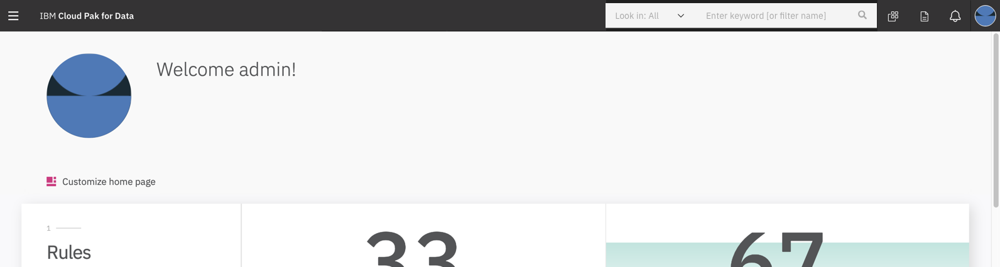

## Optional components in zero state
Design teams of each individual Cloud Pak application may consider the following options when implementing the Global Search component: 

### Icon
If space is limited, or if an application's design team determines it to be more appropriate, the Search field may be collapsed to an icon in zero state, rather than exposing the Global Search field at all times.  
On click of this icon, the field is exposed to the left, and covers any additional content already on the header bar as necessary, and the field has focus and the cursor.  
On click of anything else (so the Search field loses focus), the field collapses again, and only the icon is visible.  
On second click of the icon, the field disappears.

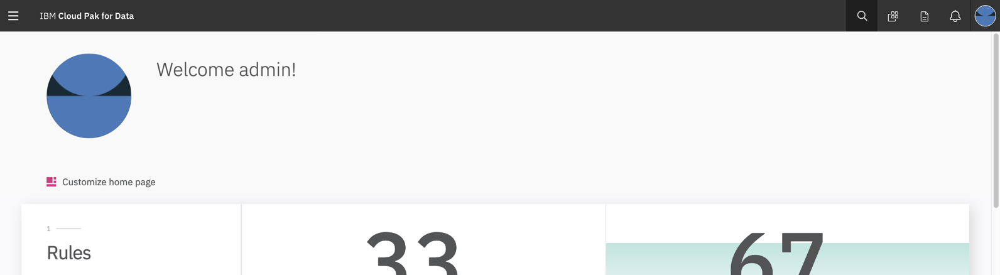

### Scoping field
* In order to reduce the scope of the application searched, an optional Scope select field may be appended to the immediate left of the Search text-entry field. 
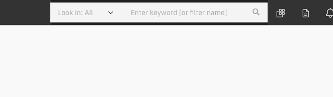

* The options of this select list reflect the high-level categories of content which a user can search. This can include individual available Cloud Pak products, or content types specific to the current application (documents, data, settings, user assets, etc. ).
* The contents of the Scoping select field should be presented in a tree structure if appropriate.
* Only one value can be defined in the Scoping field. If additional content areas should be searched at once, consider using filters in the Search Results page.
* The default value of the Scoping field is "All", and the mask is such that the selected value is preceded by "Look In: " - i.e. it will always display "Look in: &#91;value&#93;", rather than just the selected value.

### Interactions
**Focus**  
On click of the Global Search field, it becomes in "focus", with the cursor replacing the help prompt, and a flyout displays the following:
- Most recent 8 searches performed by the current user
- Link to saved searches
Selection of any of these navigates either to the Search Results page with the selected search implemented, or to the Saved Search page.  

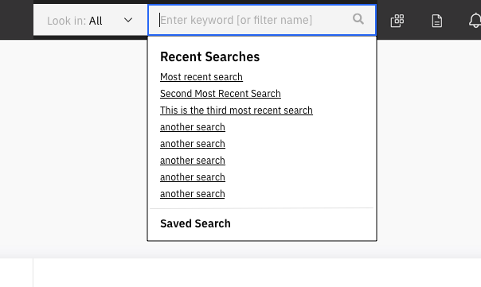

**Text entry**  
Once three characters have been entered into the text field, the recent searches content of the flyout is replaced with the top 8 results that match the current string. As the user enters additional text, the top results are updated to align with the current search string.  
Clicking any of the listed results will navigate to that page or content, or open that asset.  
Clicking the "See all results" link opens the Search Results page with all results. 

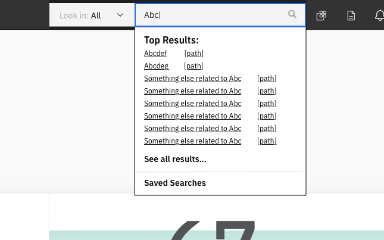

### Optional interactions with text entry:
The top results flyout can be replaced with one of two other options:
- **Suggestions**  
This is 8 text strings that match the current text in the field. This is the top 8 as ranked by a formula combining the most common strings, and most likely to yield results.  

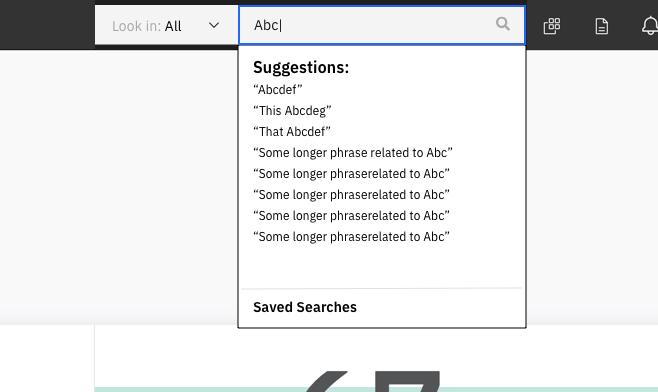

- **Filters**  
 This is a set of filters that can be applied to a specific set of contents within the application, such as system settings. A completed filter consists of up to three elements - and Filter Name, Operand (optional), and Value. This type of filtering accommodates the option of many filters. If fewer than three filters will be applied, consider the more traditional filters on the search results page (see below).   
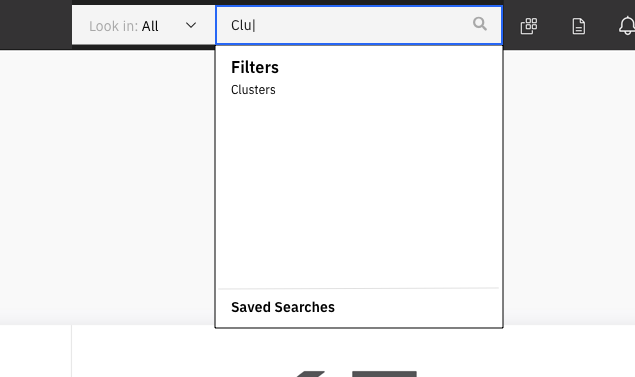
If a filter name is selected from the list, the filter construction process begins, and the user is then prompted with a new flyout containing either a list of optional operands (=, &#62;, &#60;, =&#62;, =&#60;, etc.), or  values that match the selected filter name and the operand defaults to "=". 
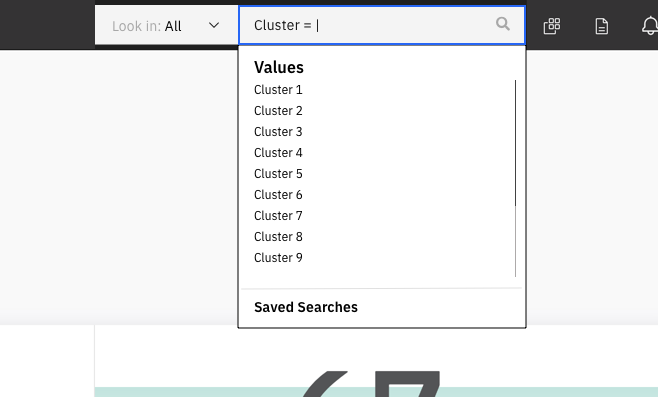
Once the value is selected, the newly-constructed filter as a pill is added to the Search field. Additional filters can be created, or &#60;Enter&#62; executes the Search.  
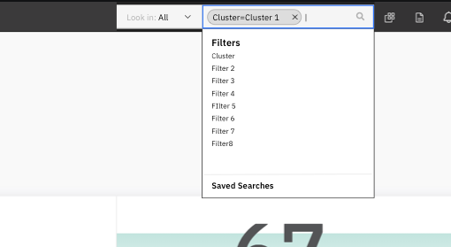
Additional filter pills can be added to the search field on the search results page also. If necessary, the field expands downward to accommodate additional pills. 
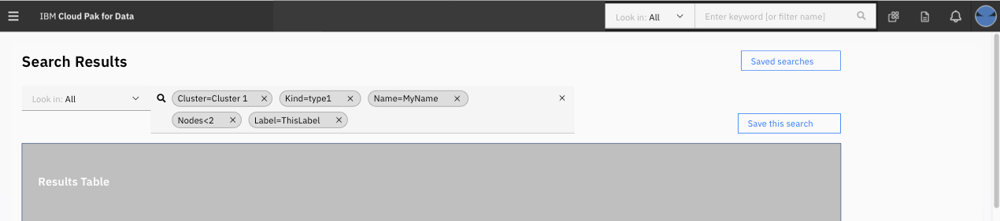

### Associated interfaces/screens 
**Search results**  
The search results page (SRP) lets the user scroll through all of the results of the search. This is accessible once the user hits &#60;Enter&#62; in the Search field.  
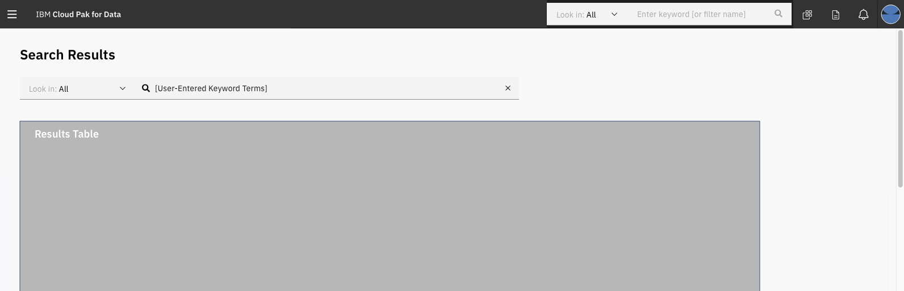

The top of the page includes a Search field. If the user did a keyword-type search (non filter), then the keyword(s) are displayed in the Search field and the user can modify the search by editing the contents of this field. If the Header bar Search includes a Scoping field, then it is included here too, and set to the value the user selected - or "All" if the user didn't change it.

The results themselves are displayed in one or more tables. If meta data (Name, description, date created, owner, etc) apply to all results, then results should appear in a single table. But if different result types require different meta data or associated information, then results are listed in a table per result type, each table with its own set of columns. The order of tables is determined by the implementing team.

### Relevant options
**Filter pills**  
If the Header Bar's Search supports filter searching, then that same support is applied to the Search Results page's field. When the SRP loads from a filter-type search, the initial pill defining the search is displayed below the field.
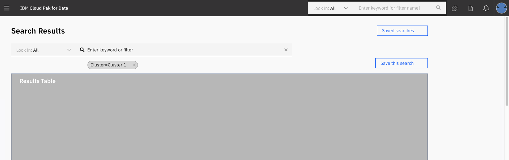

As the user adds additional filters, the pills are displayed below the field.  

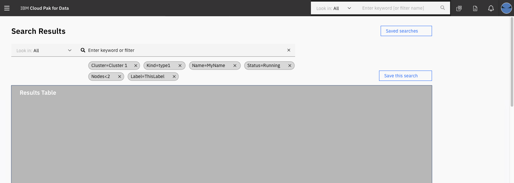

**Additional filters**  
If three or fewer filters will be applied, they can be made available as individual fields outside the Search field, either dropdown fields below the Search field, or various types to the left of results table. (These follow the standard Carbon Filter pattern).
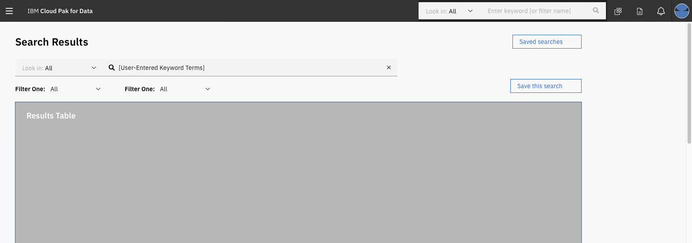

**Save this search**
Optionally, a search results page may have a save search function that allows the user to save the search parameters - not the result set - for future access and use.   
The button is right aligned, above the results data table, but below the Search field. On click it opens a modal with a field with which to name the search. 

Swiftly return to previous searches.  

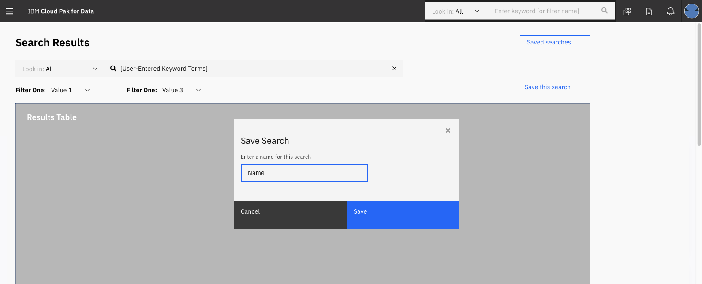

**Saved searches**   
The saved searches page provides access to all of the previously saved searches (of this user?). 

Access to this page is from both the Search field's flyout "Saved Searches" link, and from the "Saved searches" button on the Search Results page. 

Saved searches are listed in a data table with columns for Name, Keywords, Last used date, and Date created.
Actions available on the rows are Edit - which makes the Name value editable; and Remove - which removes the saved search from the table. 
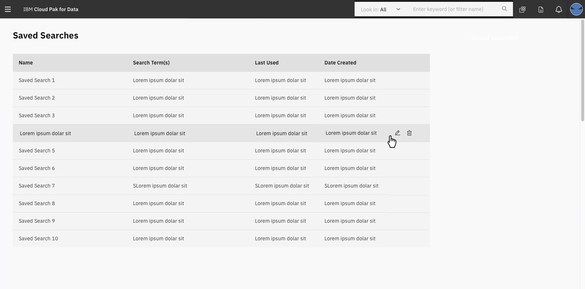
 

### Related Components
Dropdown  
Filter  
Global Header  
Data Table  

### Accessibility 
Coming soon...

### Design Specs 
Coming soon...

