## Cloud Pak for Integration

Our “integrating integration” mission is to improve the experience for users 
who use a combination of our existing integration products. Try out
Cloud Integration here: https://console.bluemix.net/integrate/overview

<Row>
  <Column colLg={8}>

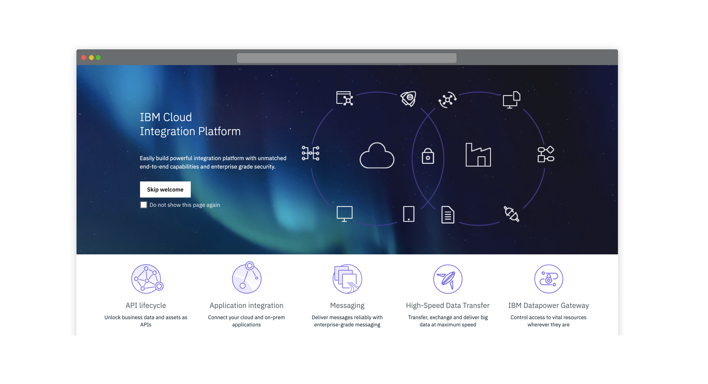

  </Column>
</Row>

| Designer           | Role            | Profile                                                                 |
| ------------------ | --------------- | ----------------------------------------------------------------------- |
| Brian Peaston      | Design Manager  | [View profile](https://w3.ibm.com/bluepages/profile.html?uid=030058866) |
| John Morgan        | Design Lead     | [View profile](https://w3.ibm.com/bluepages/profile.html?uid=111797866) |
| Tom Solomon        | UX Designer     | [View profile](https://w3.ibm.com/bluepages/profile.html?uid=123750866) |
| Malcolm Couldwell  | User Researcher | [View profile](https://w3.ibm.com/bluepages/profile.html?uid=015822866) |
| Gregor Cowie       | Visual Designer | [View profile](https://w3.ibm.com/bluepages/profile.html?uid=125293866) |

**Pictogram and Icon**

Refer here for more guidance: https://ibmcloudtool.mybluemix.net/pictograms/

<Row>
  <Column colLg={8}>

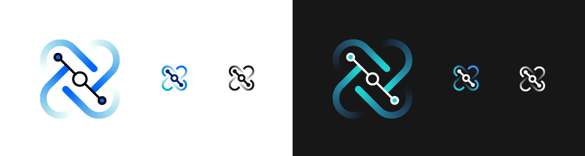

  </Column>
</Row>

<a href="resources/cloud-pak-for-integration.zip" download>Download</a>

<AnchorLinks>
  <AnchorLink>Event Streams</AnchorLink>
  <AnchorLink>Aspera</AnchorLink>
  <AnchorLink>API Connect</AnchorLink>
  <AnchorLink>DataPower Gateway</AnchorLink>
  <AnchorLink>App Connect</AnchorLink>
  <AnchorLink>Cloud Integration Platform</AnchorLink>
  <AnchorLink>MQ</AnchorLink>
</AnchorLinks>

## Event Streams

**Apache kafka for the Enterprise**

Built on open source Apache Kafka, IBM Event Streams is an event-streaming platform that helps you build smart applications that can react to events as they happen. IBM Event Streams benefits from the years of operational expertise IBM has running Apache Kafka for enterprises, making it perfect for mission-critical workloads.

<Row>
  <Column colLg={8}>

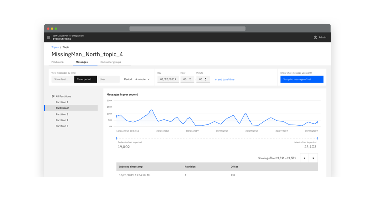

  </Column>
</Row>

| Designer       | Role            | Profile                                                                 |
| -------------- | --------------- | ----------------------------------------------------------------------- |
| Andy Gatford   | Design Manager  | [View profile](https://w3.ibm.com/bluepages/profile.html?uid=017452866) |
| Vikki Paterson | Design Lead     | [View profile](https://w3.ibm.com/bluepages/profile.html?uid=100079866) |
| Chloe Poulter  | UX Designer     | [View profile](https://w3.ibm.com/bluepages/profile.html?uid=118468866) |
| Peter Loveland | Visual Designer | [View profile](https://w3.ibm.com/bluepages/profile.html?uid=115714866) |
| Susie Wright   | User Researcher | [View profile](https://w3.ibm.com/bluepages/profile.html?uid=043195866) |

**Pictogram and Icon**

Refer here for more guidance: https://ibmcloudtool.mybluemix.net/pictograms/

<Row>
  <Column colLg={8}>

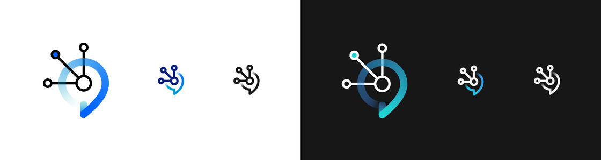

  </Column>
</Row>

<a href="resources/eventStreams_icons.zip" download>Download</a>

## Aspera

**Moving the world's data at maximum speed**

Aspera on Cloud provides a simple unified user experience,for all Aspera capabilities, such as sending, sharing, collaborating, streaming, automating and reporting to accomplish their data transfer and management needs.

<Row>
  <Column colLg={8}>

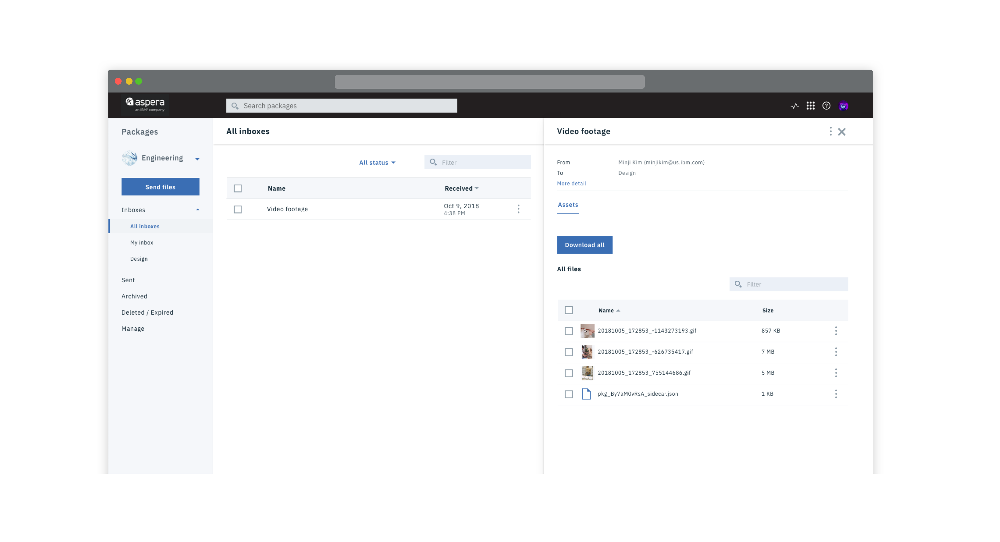

  </Column>
</Row>

| Designer         | Role             | Profile                                                                             |
| ---------------- | ---------------- | ----------------------------------------------------------------------------------- |
| Scott Robinson   | Design Manager   | [View profile](https://w3.ibm.com/bluepages/profile.html?uid=2J4151897)             |
| Marcela Cabrera  | UX Designer      | [View profile](https://w3.ibm.com/bluepages/profile.html?uid=4G6063897)             |
| Minji Kim        | UX Designer      | [View profile](https://w3.ibm.com/bluepages/profile.html?uid=4G4561897)             |
| Nehal Molasaria  | UX Designer      | [View profile](https://w3.ibm.com/bluepages/profile.html?uid=4G4493897)             |
| Boney Yeldho     | UX Designer      | [View profile](https://w3.ibm.com/bluepages/profile.html?uid=1J1030897)             |
| Cynthia Yue      | UX Designer      | [View profile](https://w3.ibm.com/bluepages/profile.html?uid=3J0856897)             |
| John Sun         | UX Design Intern | [View profile](https://w3.ibm.com/bluepages/profile.html?uid=1J7155897)             |
| Christine Song   | Visual Designer  | [View profile](https://w3.ibm.com/bluepages/profile.html?uid=2J2335897)             |
| Charles Mitchell | User Researcher  | [View profile](https://w3.ibm.com/bluepages/profile.html?email=mitchelc@us.ibm.com) |

**Pictogram and Icon**

Refer here for more guidance: https://ibmcloudtool.mybluemix.net/pictograms/

<Row>
  <Column colLg={8}>

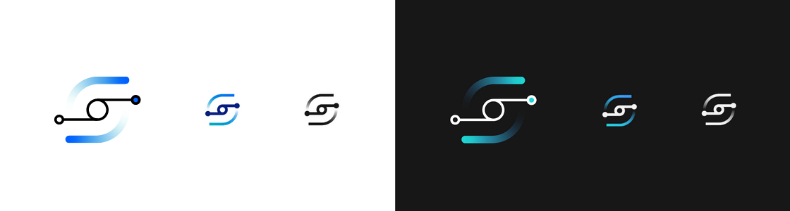

  </Column>
</Row>

<a href="resources/aspera.zip" download>Download</a>

## API Connect

**Create & Run APIs with full Lifecycle Management**

Create and secure APIs and microservices based on Node.js and Java runtimes—all managed from a single unified console. Take advantage of the rich lifecycle management capabilities.

<Row>
  <Column colLg={8}>

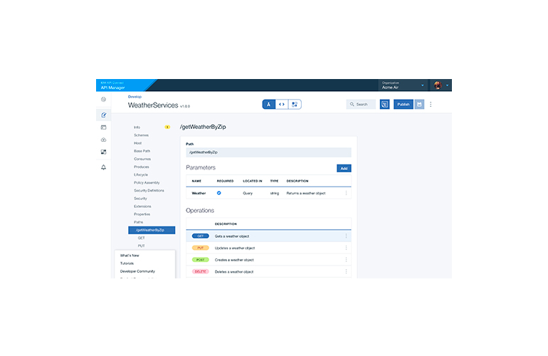

  </Column>
</Row>

| Designer        | Role             | Profile                                                                 |
| --------------- | ---------------- | ----------------------------------------------------------------------- |
| Sichao Wu       | Design Lead      | [View profile](https://w3.ibm.com/bluepages/profile.html?uid=2G0333897) |
| Wayne Chou      | Product Designer | [View profile](https://w3.ibm.com/bluepages/profile.html?uid=3G4535897) |
| Roger Davenport | UX Designer      | [View profile](https://w3.ibm.com/bluepages/profile.html?uid=675881897) |
| Jill Lin        | Product Designer | [View profile](https://w3.ibm.com/bluepages/profile.html?uid=0J1665897) |
| Keesa Robinson  | Product Designer | [View profile](https://w3.ibm.com/bluepages/profile.html?uid=2G0096897) |

**Pictogram and Icon**

Refer here for more guidance: https://ibmcloudtool.mybluemix.net/pictograms/

<Row>
  <Column colLg={8}>

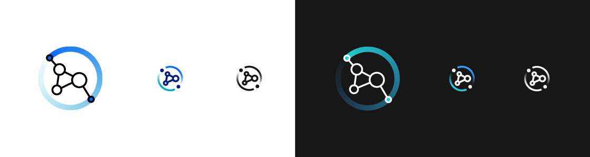

  </Column>
</Row>

<a href="resources/api-connect.zip" download>Download</a>

## DataPower Gateway

**Content to follow...**

**Pictogram and Icon**

Refer here for more guidance: https://ibmcloudtool.mybluemix.net/pictograms/

<Row>
  <Column colLg={8}>

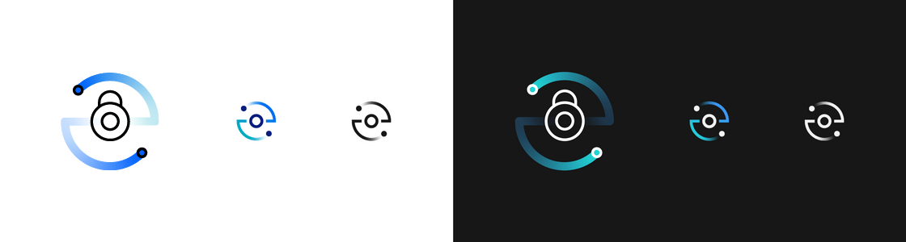

  </Column>
</Row>

<a href="resources/datapower-grid.zip" download>Download</a>

## App Connect

**Connect your business applications, no matter where they are.**

From simple, guided app-to-app connections to highly flexible integration solutions, IBM® App Connect has it covered. Try out App Connect here: https://console.bluemix.net/catalog/services/app-connect

<Row>
  <Column colLg={8}>

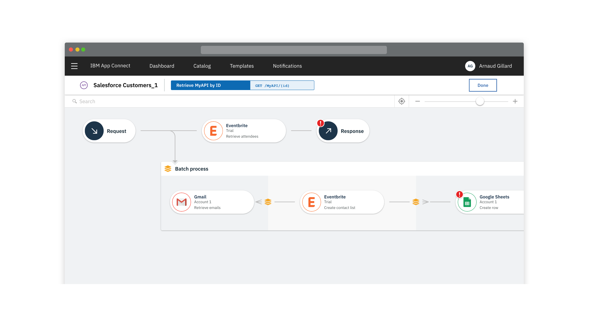

  </Column>
</Row>

| Designer         | Role                | Profile                                                                 |
| ---------------- | ------------------- | ----------------------------------------------------------------------- |
| Brian Peaston    | Design Manager      | [View profile](https://w3.ibm.com/bluepages/profile.html?uid=030058866) |
| Sarah Burwood    | Design Lead         | [View profile](https://w3.ibm.com/bluepages/profile.html?uid=102541866) |
| Lee Chase        | Front-end Developer | [View profile](https://w3.ibm.com/bluepages/profile.html?uid=079440866) |
| Eva Dage         | Visual Designer     | [View profile](https://w3.ibm.com/bluepages/profile.html?uid=119040866) |
| Sebastian Howard | Intern              | [View profile](https://w3.ibm.com/bluepages/profile.html?uid=125036866) |
| James King       | User Researcher     | [View profile](https://w3.ibm.com/bluepages/profile.html?uid=123123866) |
| Gary Thornton    | UX Designer         | [View profile](https://w3.ibm.com/bluepages/profile.html?uid=017557866) |
| Tobi Oyadiran    | UX Designer         | [View profile](https://w3.ibm.com/bluepages/profile.html?uid=118223866) |

**Pictogram and Icon**

Refer here for more guidance: https://ibmcloudtool.mybluemix.net/pictograms/

<Row>
  <Column colLg={8}>

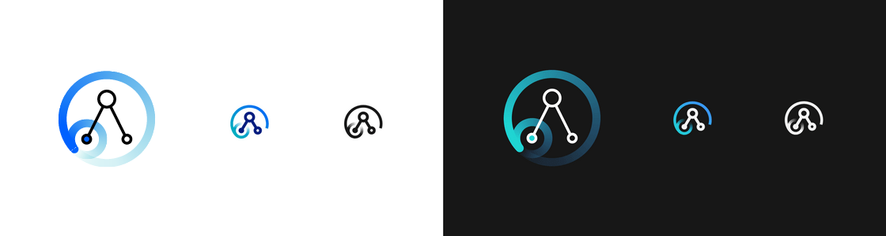

  </Column>
</Row>

<a href="resources/app-connect.zip" download>Download</a>

## MQ

**Messaging**

Our Mission is to improve the experience of existing messaging products and create experiences for new products.

<Row>
  <Column colLg={8}>

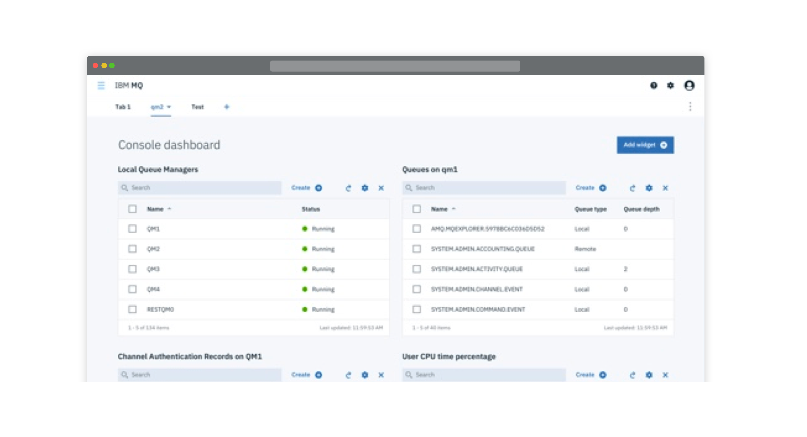

  </Column>
</Row>

| Designer          | Role                | Profile                                                                 |
| ----------------- | ------------------- | ----------------------------------------------------------------------- |
| Andy Gatford      | Design Manager      | [View profile](https://w3.ibm.com/bluepages/profile.html?uid=017452866) |
| Steve Haskey      | Design Lead         | [View profile](https://w3.ibm.com/bluepages/profile.html?uid=023416866) |
| Laura Marshall    | Visual Designer     | [View profile](https://w3.ibm.com/bluepages/profile.html?uid=125355866) |
| Sophie Rogers     | UX Designer         | [View profile](https://w3.ibm.com/bluepages/profile.html?uid=116279866) |
| Lawrence Berry    | UX Designer         | [View profile](https://w3.ibm.com/bluepages/profile.html?uid=123150866) |
| Simon Moore       | Front-end Developer | [View profile](https://w3.ibm.com/bluepages/profile.html?uid=061233866) |

**Pictogram and Icon**

Refer here for more guidance: https://ibmcloudtool.mybluemix.net/pictograms/

<Row>
  <Column colLg={8}>

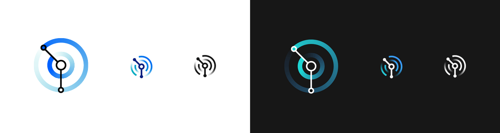

  </Column>
</Row>

<a href="resources/mq.zip" download>Download</a>

