<AnchorLinks>
  <AnchorLink>API Connect implementations</AnchorLink>
  <AnchorLink>App Connect implementations</AnchorLink>
  <AnchorLink>Aspera implementations</AnchorLink>
  <AnchorLink>Cloud Pak implementations</AnchorLink>
  <AnchorLink>Event Streams implementations</AnchorLink>
  <AnchorLink>MQ implementations</AnchorLink>
</AnchorLinks>

## API Connect implementations

<Row>
 <Column colLg={8}>

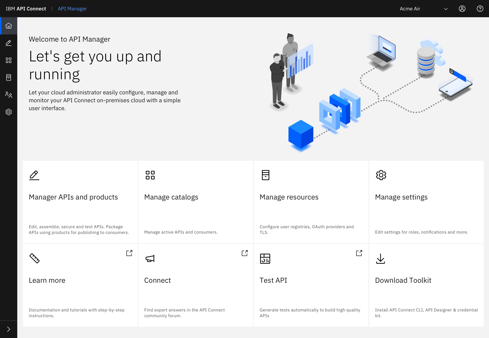

<Caption>API Connect landing page</Caption>
 </Column>
</Row>

## App Connect implementations

<Row>
 <Column colLg={8}>

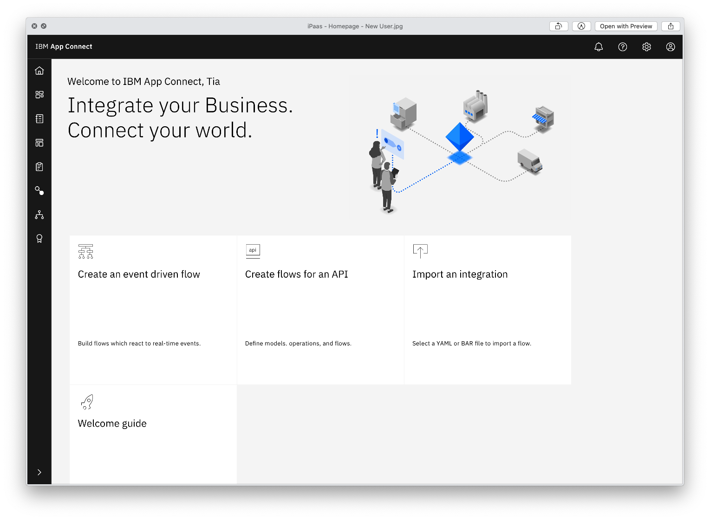

<Caption>App Connect Designer first-time user landing page</Caption>
 </Column>
</Row>

<Row>
 <Column colLg={8}>

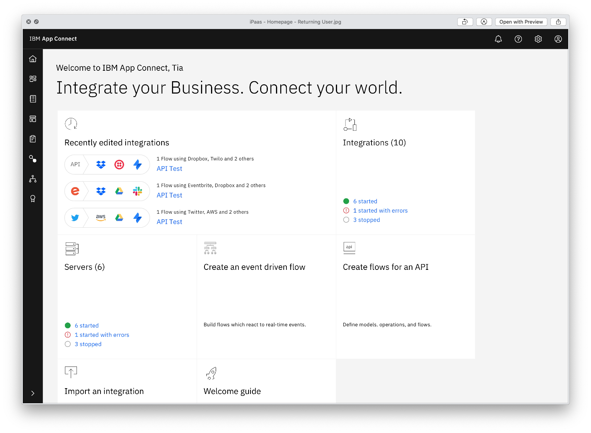

<Caption>App Connect Designer returning user landing page</Caption>
 </Column>
</Row>

<Row>
 <Column colLg={8}>

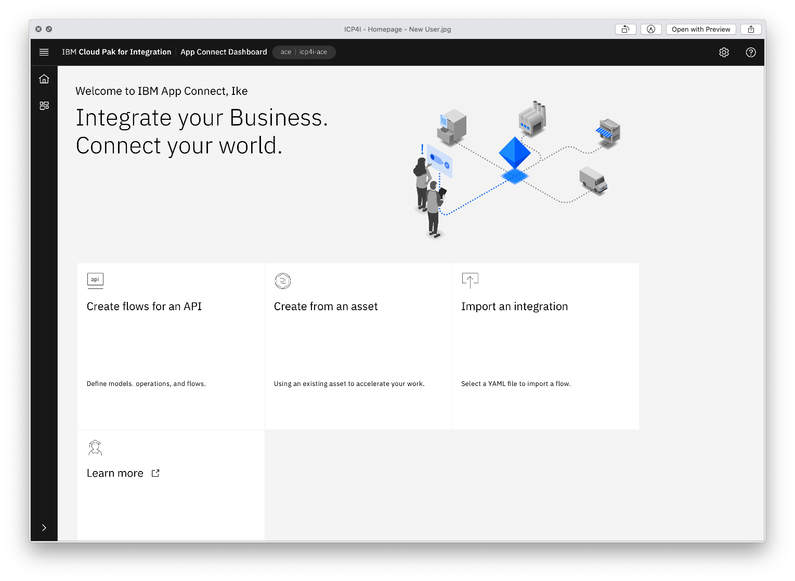

<Caption>App Connect first-time user landing page</Caption>
 </Column>
</Row>

<Row>
 <Column colLg={8}>

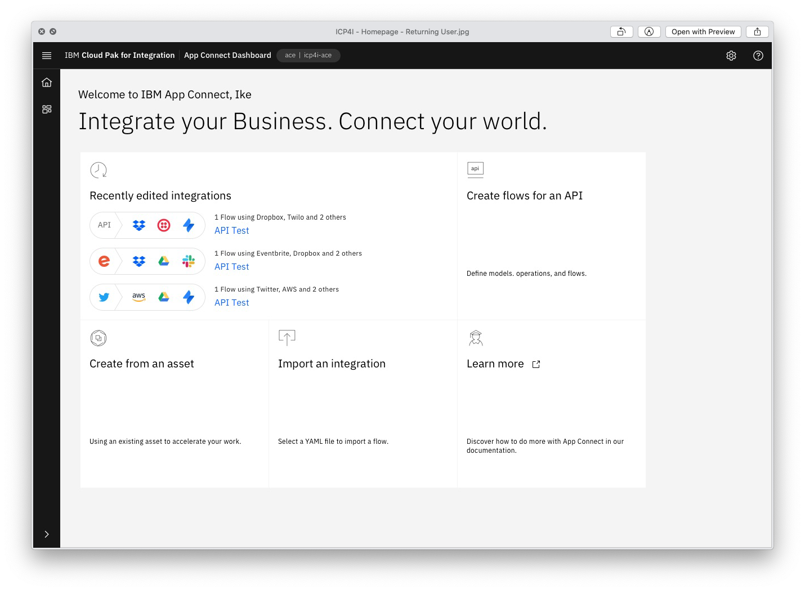

<Caption>App Connect returning user landing page</Caption>
 </Column>
</Row>

## Aspera implementations

<Row>
 <Column colLg={8}>

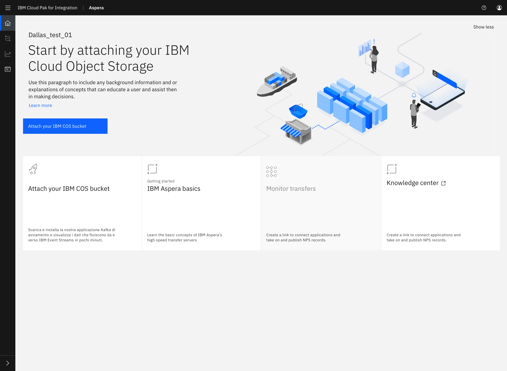

<Caption>Aspera first-time user landing page</Caption>
 </Column>
</Row>

<Row>
 <Column colLg={8}>

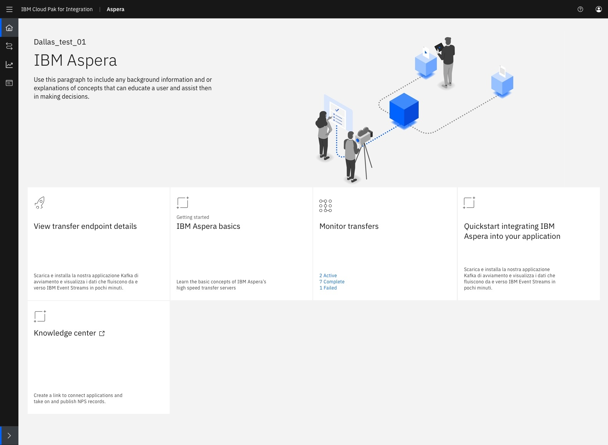

<Caption>Aspera returning user landing page</Caption>
 </Column>
</Row>

## Cloud Pak implementations

<Row>
 <Column colLg={8}>

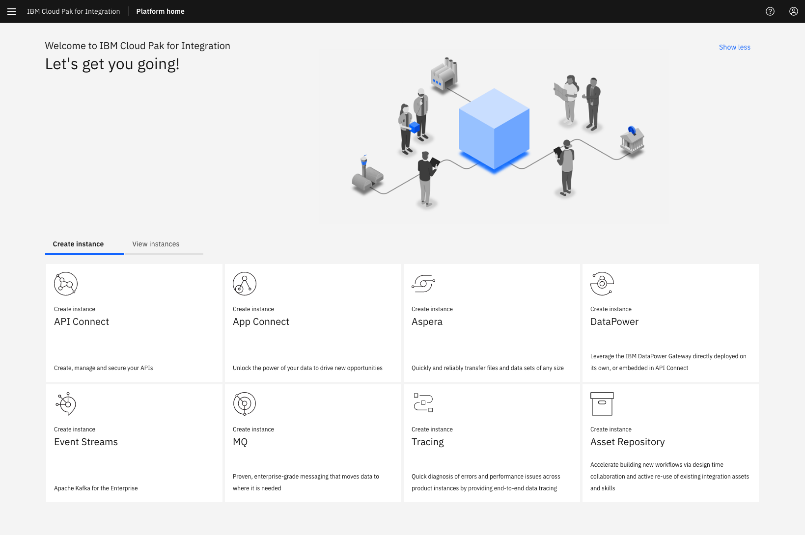

<Caption>Cloud Pak for Integration landing page</Caption>
 </Column>
</Row>

<Row>
 <Column colLg={8}>

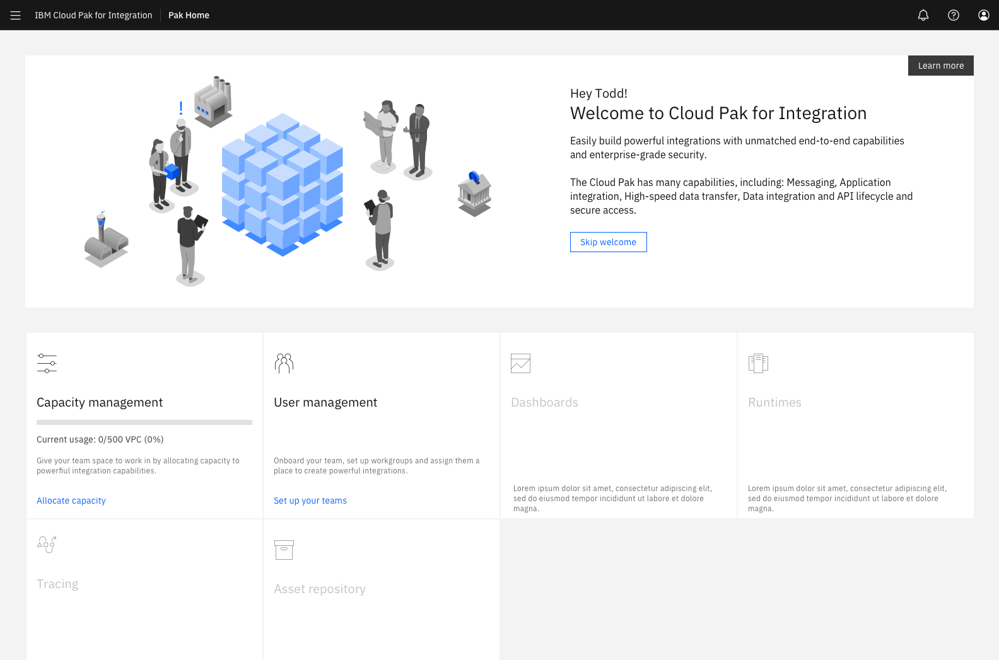

<Caption>Cloud Pak for Integration as a Service new-user landing page</Caption>
 </Column>
</Row>

<Row>
 <Column colLg={8}>

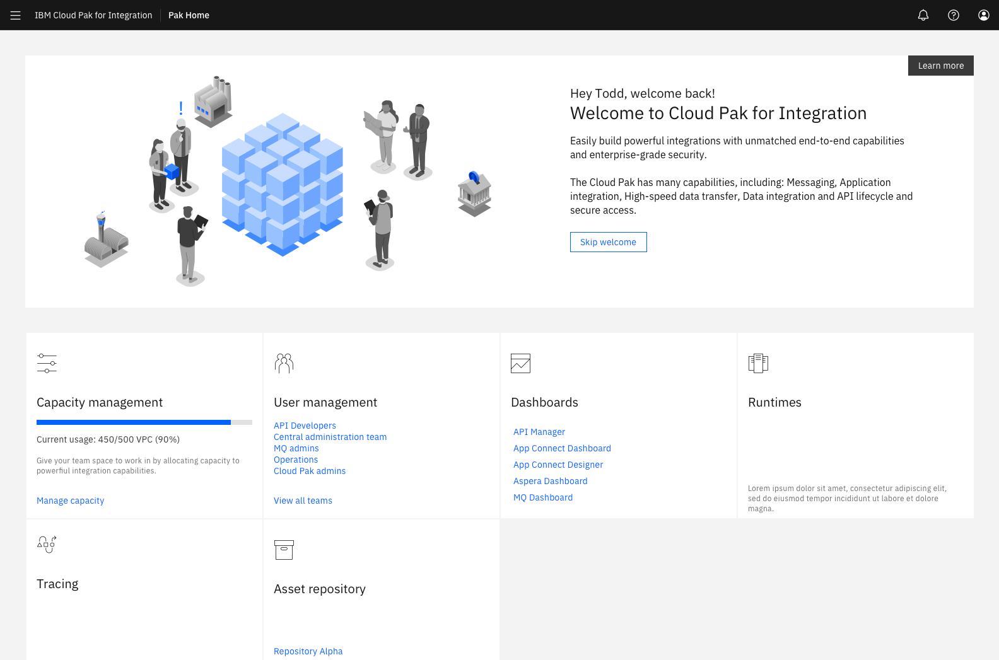

<Caption>Cloud Pak for Integration as a Service returning user landing page</Caption>
 </Column>
</Row>

## Event Streams implementations

<Row>
 <Column colLg={8}>

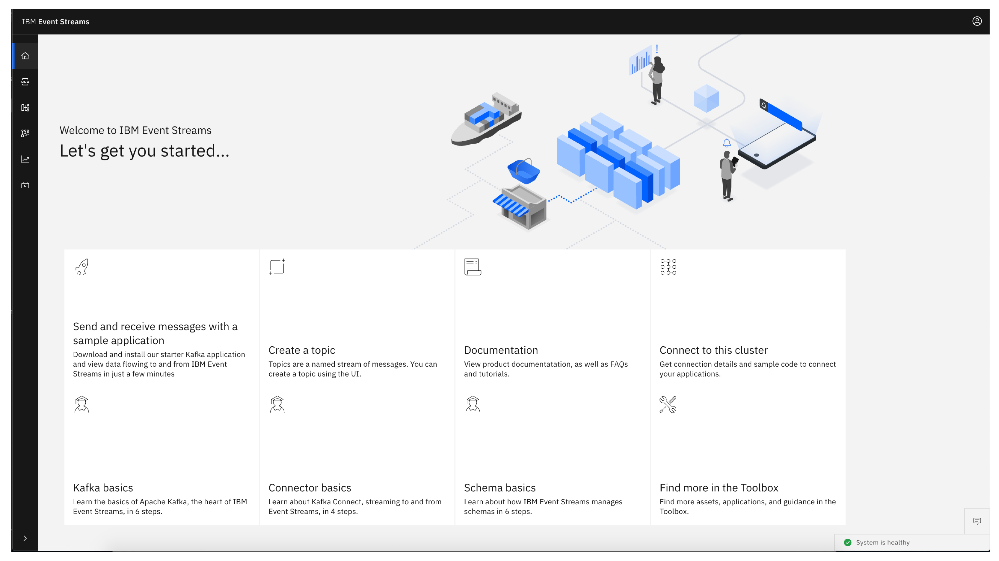

<Caption>Event Streams landing page</Caption>
 </Column>
</Row>

## MQ implementations

<Row>
 <Column colLg={8}>

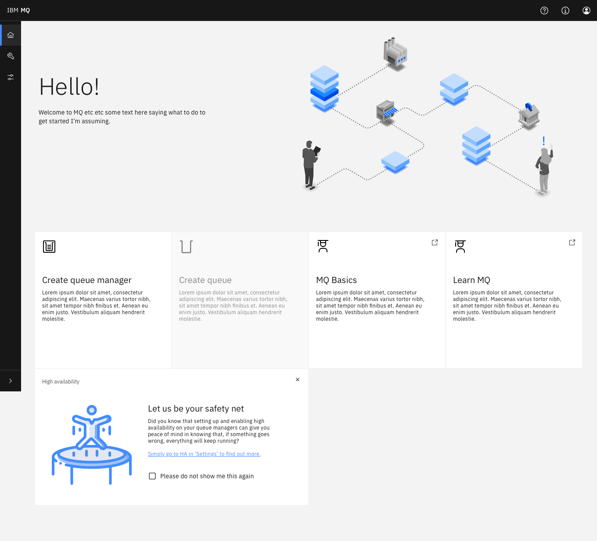

<Caption>MQ feature advert landing page</Caption>
 </Column>
</Row>

<Row>
 <Column colLg={8}>

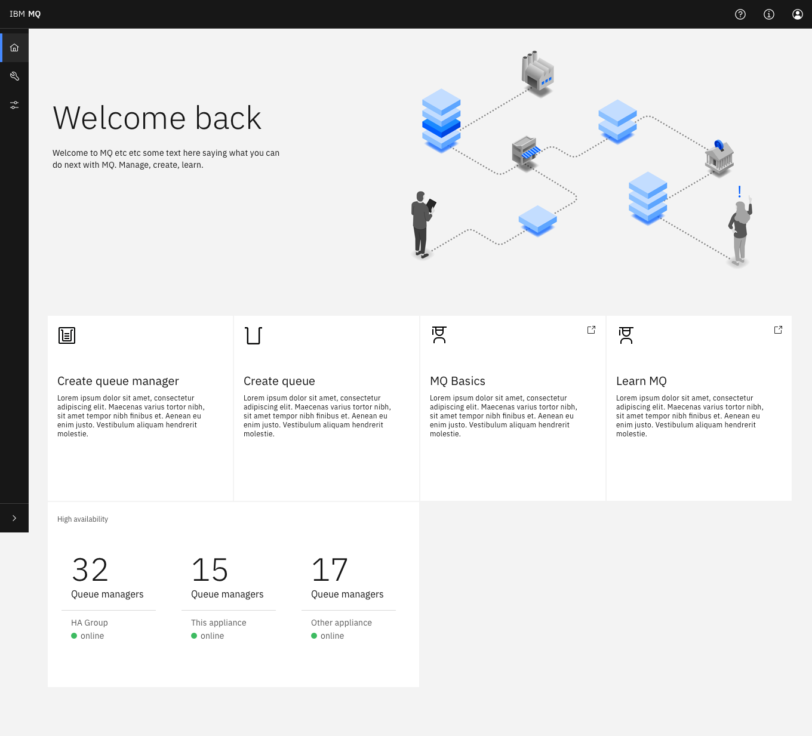

<Caption>MQ returning user landing page</Caption>
 </Column>
</Row>

