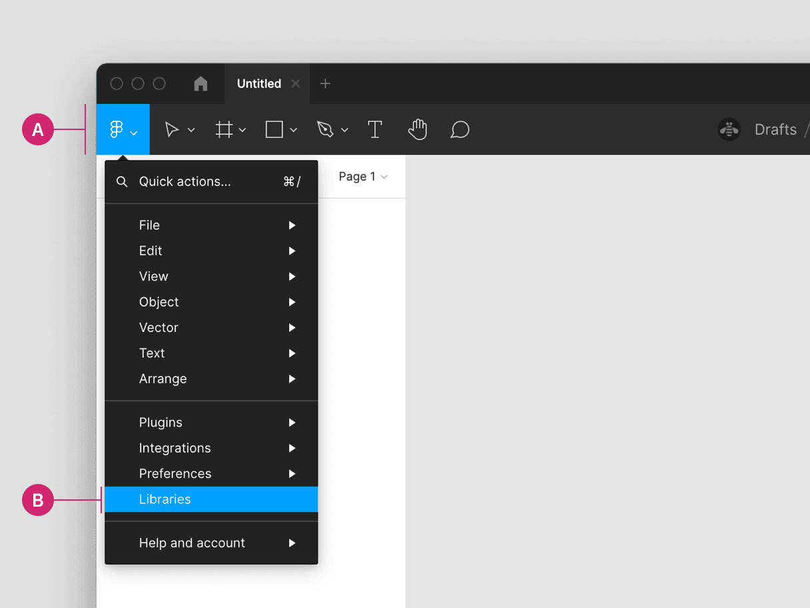
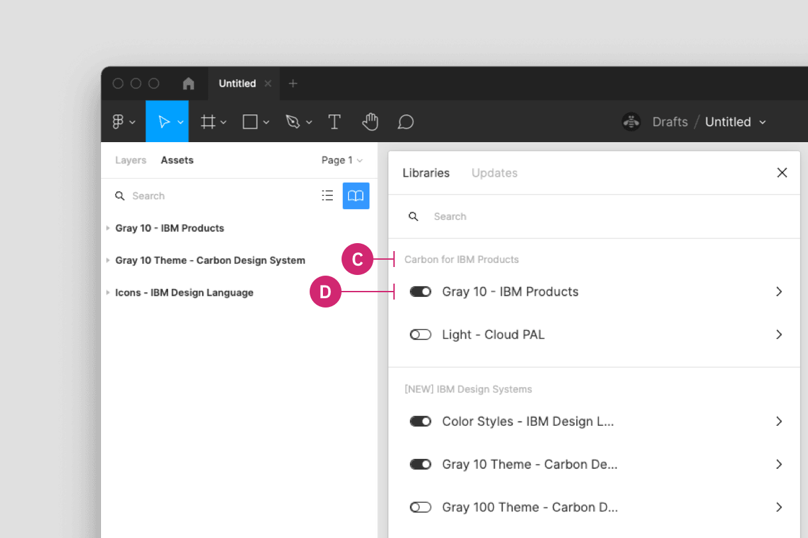
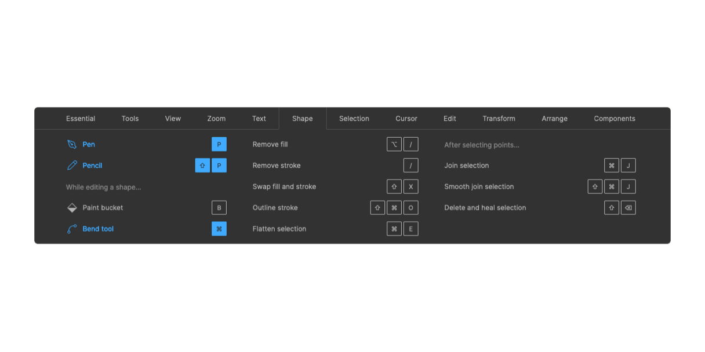

<PageDescription>

The Carbon for IBM Products Figma kits contain all the components and patterns you need to rapidly build scalable and accessible experiences.

</PageDescription>

<AnchorLinks>
<AnchorLink>Overview</AnchorLink>
<AnchorLink>Get the libraries</AnchorLink>
<AnchorLink>Start designing</AnchorLink>
<AnchorLink>Keyboard shortcuts</AnchorLink>
<AnchorLink>Tutorials</AnchorLink>
<AnchorLink>Give us feedback</AnchorLink>
</AnchorLinks>

## Overview 

The Carbon for IBM Products Figma kits reflect all the universal assets documented on our site. As more components and patterns are added to the site, we intend to keep our Figma team updated to reflect this.

At this time, Carbon for IBM Products has four Figma kits:

#### Gray 10/Gray 100 - IBM Products: 
Universal components and patterns, consumable by anyone working on product experiences. This kit is maintained by the Carbon for IBM Products team.

#### Light/Dark - Cloud PAL: 
Components and patterns created for use on IBM Cloud. However, the vast majority of these assets can be utilized outside the Cloud platform if suitable for your use case. This kit is maintained by the Cloud PAL team. For additional resources regarding the Cloud PAL Figma kit, visit [Getting started on Cloud](https://pages.github.ibm.com/cdai-design/cloud-pal/design-guidelines/getting-started/).

The Carbon for IBM Products kits should be used alongside the [Carbon Figma kits](https://www.carbondesignsystem.com/designing/kits/figma), as they extend on the core components in the Carbon Design System. The Carbon for IBM Products components are built on top of Carbon components, and are built in the same way to ensure full consistency and ease of use when delivering designs.

## Get the libraries 
#### 1. Sign in to Figma using IBM SSO
You should be added to the IBM Figma organization automatically once you sign in. You do not need to join or request to join any specific team to access the libraries.

#### 2. Turn on the design kits
Inside of a design file, navigate to the <strong>Main menu</strong> panel in the top left of the toolbar (A). Open the menu and select <strong>Libraries</strong> from the list (B). Alternatively, you can select the book icon from the assets panel.

<Row>
<Column colLg={8}>

</Column>
</Row>

Then in the Libraries modal that appears, find the team called <strong>Carbon for IBM Products</strong> (C) and switch the toggle beside a themed library, for example, the <strong>Gray 10 - IBM Products</strong>, to on (D) You may also wish to add the Light - Cloud PAL library, for additional assets produced by the Cloud PAL team.

<Row>
<Column colLg={8}>

</Column>
</Row>

#### 3. Ask your team admin to turn the kits on by default
When making a new design file in a team, you may notice that each time the Carbon for IBM Products libraries are not turned on by default.

If you require the Carbon for IBM Products libraries in your everyday design work, ask the admin of your team to turn them on by default. This way, every time you create a new design file, the kits will be on and ready to use.

## Start designing
Now you have your libraries turned on, you're ready to start designing in Figma.

Included in the library are all the components and patterns from the Carbon for IBM Products site. To insert a component, go to the Asset panel and find the component you would like to use. Drag it from the asset panel onto the canvas.

View the name of the component in the right sidebar. If the component has variants, you'll see fields underneath the component name to configure the properties and values of that component set.

For more help on how to use Figma components, see the [Figma docs](https://help.figma.com/hc/en-us/articles/360056440594-Create-and-use-variants#Use_variants).

For further guidance on how to set up your Figma design file, see the [Carbon guidance about Figma](https://www.carbondesignsystem.com/designing/kits/figma#start-designing).

## Keyboard shortcuts
To accelerate design efforts, becoming familiar with keyboard shortcuts in Figma is essential.

To bring up the Figma keyboard shortcuts panel, enter the following shortcut:

<strong>Ctrl + Shift + ?</strong>

<Row>
<Column colLg={8}>

</Column>
</Row>

### Recommended shortcuts when designing in Figma

| Keyboard shortcut    | Result   |
| ------- | ------ | ---------- |
| Cmd Click |  Use this to click into nested components. E.g., Use Cmd Click to select the button within a page header.           |
| Enter     |  While having a component selected, you can press the Enter key to go down a layer in the layers panel.        |
| Shift + A       |  Use this to create an auto-layout. Auto-layout helps designers create layouts that reflow as contents change.          |
| Cmd + Shift + K       |  Create a local component within your design file. Local components are designer-hosted components that can used within slots— optional placeholders found in components within our design libraries.          |
| Cmd + '     |  Reveal/hide the pixel grid.     |
| Control + G     |  Reveal/hide the layout grid.  |

## Tutorials
Using Figma is similar to Sketch in many ways, but there are a few differences that require a little bit of getting used to. We are planning to release some specific Carbon for IBM Products Figma tutorials over the next few months. If there is anything you'd like to learn, please raise an issue in our [GitHub repo](https://github.ibm.com/CDAI-design/pal/issues/new?assignees=&labels=Figma+kit&template=Figma-bug-enhancement-requests.md&title=Figma+kit).

For additional support on all things Figma, you can attend bi-weekly events hosted by the Figma Guild. The Figma Guild (#figma-guild) is a community of designers and engineers creating a fun and safe space for anyone to learn, share, and ask questions about all things Figma. 

Enroll to the [Figma Guild series](https://ec.yourlearning.ibm.com/w3/series/10200299?layout=grid) on YourLearning.

You can also watch the [Intro to Figma recording](https://secure.video.ibm.com/channel/23570833/playlist/641336/video/130750615) to learn the basic concepts of Figma.

## Give us feedback
We want the Carbon for IBM Products Figma kits to be the very best they can be, so we are asking you to let us know areas you think need improving (documentation, tutorials and the Figma kit itself), as well as any bugs you run into while using the kit. We also plan to continually update the kit as new components are added to the site, so stay tuned for future updates!

Please raise any issues surrounding the IBM Products Figma kit in our [GitHub repo](https://github.ibm.com/CDAI-design/pal/issues/new?assignees=&labels=Figma+kit&template=Figma-bug-enhancement-requests.md&title=Figma+kit), and feel free to ask any questions about the kit in the <strong>#ibmproducts-pal</strong> slack channel. For any issues relating to the Cloud PAL Figma kit specifically, you can raise an issue in the [Cloud PAL GitHub repo](https://github.ibm.com/CDAI-design/cloud-pal/issues/new?assignees=morganadalmeida%2C+Asha-Newsom%2C+kcamelo&labels=Figma&template=figma-bug-or-enhancement-report.md&title=%5BFigma+bug+%26+enhancements%5D).
