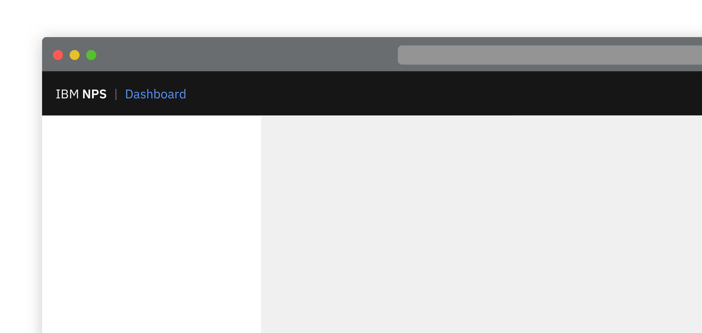
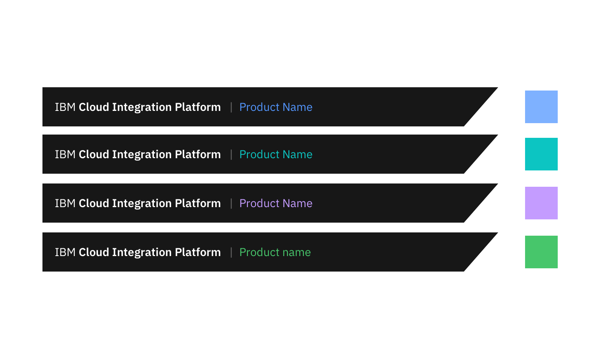
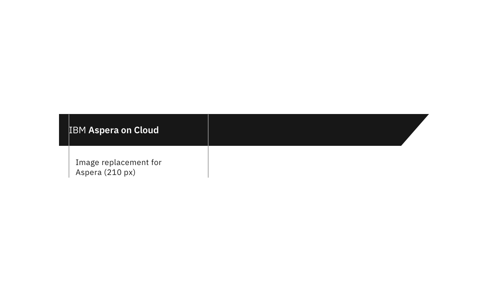
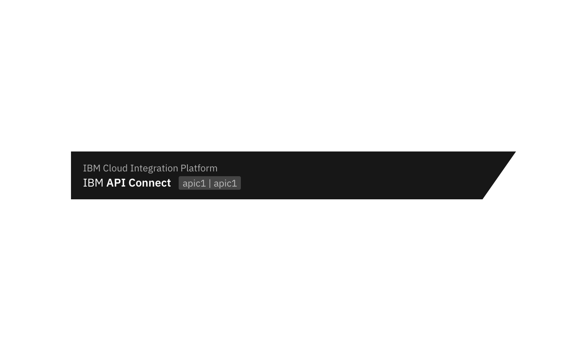

<PageDescription>

  All products within the IBM Cloud Pak for Integration should use the recommended header.
  Exception is if a product requires a version of the header that needs to allow for customization by customers
  
</PageDescription>

<Row>
  <Column colLg={8}>

  </Column>
</Row>

#### Options

<AnchorLinks>
  <AnchorLink>Product UIs represented by coloured tiles</AnchorLink>
  <AnchorLink>Adding customer branding in header</AnchorLink>
  <AnchorLink>Dual level banner for platform, product and instance</AnchorLink>
</AnchorLinks>

## Product UIs represented by coloured tiles

<Row>
  <Column colLg={8}>

  </Column>
</Row>

## Adding customer branding in header

Product logo needs to be replaceable by customer to customize branding.

<Row>
  <Column colLg={8}>

  </Column>
</Row>

## Dual level banner for platform, product and instance

<Row>
  <Column colLg={8}>

  </Column>
</Row>

## Linked to

[Exporting](../../common-patterns/exporting)
