<PageDescription>

  This page describes how to contribute content and updates to this website.

</PageDescription>

## Overview

* The source, including all content,  of this website is held in IBM's
internal Github Enterprise instance, here: <https://github.ibm.com/CDAI-design/CDAI-design-website>

* The site is based on gatsby-theme-carbon (<https://github.com/carbon-design-system/gatsby-theme-carbon>), with
minimal changes.

* Almost all of the content is created as MDX markup (a hybrid of Markdown and JSX). See: <https://mdxjs.com/>

* A travis build automatically builds and deploys updates to the master branch.
PRs (git pull requests) are also built but not deployed, just to test that they build correctly.
(<https://travis.ibm.com/CDAI-design/CDAI-design-website/builds>)

* Updates to the site are made via PRs that must pass
the automated Travis build and review by at least one other authorised person.
PRs are based on branches created within the git repository, not in any forked
repositories.

* In order to contribute, a local development environment is needed that can access the
git repository, edit the source, run a local build and deploy, and display
the site. The tooling needed includes: git, an editor, Node.js, Yarn, and a
browser.

## Detailed instructions for MacOS environment setup

The following is one option for setting up the necessary environment on MacOS:

### Request Write access

The ability to make updates to these pages is controlled through membership of a github team.
While you will be able to complete the setup detailed below, updates to the repository will fail without
the apprpriate permissions.

Before you continue with the setup, request access to the CDAI-Design-Editors team from one of its maintainers.

Unfortunately github does not make identifying maintainers easy. Try viewing the list of
[contributors](https://github.ibm.com/CDAI-design/CDAI-design-website/graphs/contributors) or those who have [recently submitted
commits](https://github.ibm.com/CDAI-design/CDAI-design-website/commits/master) to identify somebody active on the project.
They should be able to either grant you access or identify a maintainer of the org or CDAI-Design-Editors team.

### Source Code Editor - VSCode

We need to use a suitable editor both during this set up and to make changes to this site. We suggest VSCode is a popular
code editor which has extensions and features that can help
when editing project files. It is not the only option, but is recommended if
you have no other strong preference.

<InlineNotification kind="info">

After installing VSCode and configuring as suggested the command `code` will be available in the terminal window.
We will use it to create and edit files both during this setup and creating an example PR.
<br />
Instructions on use of another editor in the terminal window are not provided.

</InlineNotification>

### Install the VSCode editor and some extensions for editing the site.

Skip this section if you are not using VSCode to [Configure MacOS Settings](#configure-macos-settings)

Go to <https://code.visualstudio.com/> and download and install VSCode.

Once installed, start VSCode from the applications menu.

Locate the 'Extensions' menu option as shown in this image.

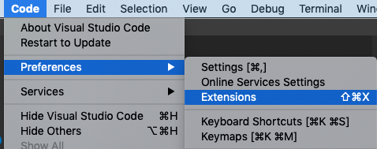

In the extensions side bar search for and install the following extensions.

- Prettier: A code formatter which automates some code styling to keep it consistent.
- MDX: Syntax highlighting for MDX files which contain the content.
- Indent-rainbow: Indent highlighter, because we all love rainbows.
- GitLens: Provides additional abilities over and above the base git VSCode integration.

To enable the VSCode editor to be started from the terminal window using the command `code` open the command pallete as shown.

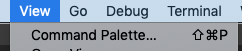

Type `shell` in the search and click on `Shell command: Install...`

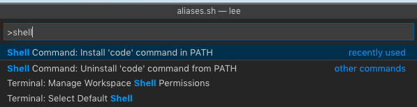

<InlineNotification kind="info">

There are some special characters that can be used in the terminal to specify folders.
<br/>
. (period/full-stop) at the start of a path refers to the current folder
<br/>
~ (tilde) at the start of a path refers to the users home folder
<br/>
<br/>
We will use these during this setup.
</InlineNotification>


Finally, at some point during the VSCode install you may be offered to option to
‘auto fetchʼ updates - do enable this. If not or you miss this step open settings, search for autofetch and ensure it is checked.

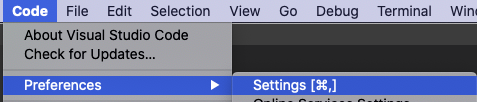

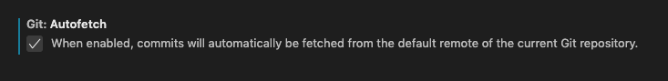

### Configure MacOS settings

1. Open a finder window and locate your home folder. (You can do this by
opening a MacOS terminal window and executing `open ~/`)

2. Create a folder called something like 'Source' or 'Projects' to hold your
git repositories. You may want to also drag this folder into your favourites
in Finder to make it easy to find later.

3. In Finder press `cmd+shift+.` to toggle the visibility of hidden files to make them visible.

### Install NVM

This installs Node Version Manager, which is a convenient way to install and
manage versions of Node.js. See: <https://github.com/nvm-sh/nvm/blob/master/README.md>

You must have a `.bash_profile` (which is a hidden file) file present in your home folder. If not go
to the MacOS terminal window and execute this command
```
touch ~/.bash_profile
```

To install NVM paste the following into a MacOS terminal window
```
curl -o- https://raw.githubusercontent.com/nvm-sh/nvm/v0.35.1/install.sh | bash
```

<InlineNotification kind="info">

If you are using MacOS Catalina the default shell may be changed to zsh from bash.
In this case you may need to copy updates that the NVM install script makes to
`.bash_profile` into a `.zprofile` file.

</InlineNotification>

<InlineNotification kind="warning">
If you don't have Xcode command line tools installed then at this point
the NVM installer will try to automatically install them. If you do not have
network access to Apple this will fail by hanging. Press command+c to cancel the install, ensure you can access
the apple.com website and try again.
</InlineNotification>

Close the existing MacOS terminal window and open a new one. Then,
type `nvm --version` at the new MacOS terminal window to check that NVM is installed.

### Install Node.js

This installs the Node.js Javascript engine that is used to build and test
the website.

At a MacOS terminal window issue the command:
```
nvm install 10
```

### Install Yarn

See: <https://yarnpkg.com/lang/en/docs/install/#mac-stable> for detailed info.

At a MacOS terminal window issue the command
```
curl -o- -L https://yarnpkg.com/install.sh | bash
```

### Setup your github account to accept SSH connections.

During the following instructions you will be asked to execute a number of commands in the terminal window. These command
are typically look like this

```
$ command options
```

<InlineNotification kind="warning">
When copying these commands DO NOT include the $ as this is used to signify the ternimal prompt.
</InlineNotification>

Use the instructions here: <https://help.github.com/en/github/authenticating-to-github/connecting-to-github-with-ssh>
to check if you already have SSH to github setup, and if not to create a new keypair and
configure your machine and github to use it.

In both cases be sure to follow the instructions to ensure that your key is
added to the ssh-agent, otherwise you will be prompted for the key passphrase
every time you access github.

<InlineNotification kind="info">
The first time you use the command line to access git you will be prompted with a message along the lines of "The authenticity
of host 'github.ibm.com' cannot be established... Are you sure you want to continue connecting (yes/no)?".
<br />
Type 'yes' and press the return key.
</InlineNotification>

### Clone the CDAI-design-website repository

At a MacOS terminal window `cd ~/Source` to the folder you created earlier in 'Configure MacOS settings' and then issue the command:
```
git clone git@github.ibm.com:CDAI-design/CDAI-design-website.git
```

### Install the project dependencies, build it, open the prect for editing and start the development server

In the terminal window

1. Change directory to the folder created by git clone

```
cd CDAI-design-website
```

2. Install the dependencies of the project by running.

```
yarn install
```

3. Open in VSCode

```
code .
```

4. Start the devlopment server

```
yarn dev
```

The first time you start the server with `yarn dev` it can take longer than normal as it has additional work to do.
When the server has started you will see the following in the terminal window.


Point a browser at <http://localhost:8000> and see the
local copy of the driver running. It will automatically update whenever changes
are made to the source code in the local, cloned repository.

<InlineNotification kind="info">

The `yarn install` command only needs to be run the very first time the repository
is cloned or when the NPM packages that
are dependencies change. Running `yarn dev` is normally sufficient to
build and start the development server. If you have unexpected build problems
after updating from the master repository then run `yarn install` to be sure that
you have the latest depencencies installed.

</InlineNotification>

## Workflow - how to update the site

1. Open the local clone of the CDAI-design-website repository in VSCode.

2. Create a new branch by clicking on 'master' in the bottom left corner. Each set of
changes needs to be in a separate PR for approval and merging. Each PR needs to
have its changes in its own branch. Give the branch a meaningful name.

  a. Click on master
  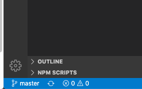

  b. Click on 'Create new branch...' and specify a name for the branch.

  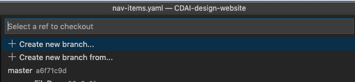

  c. You should now see the new branch selected bottom left
  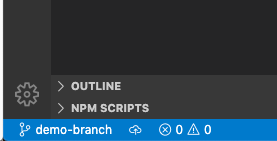

3. Now, make your first edits.

  a. In the left hand panel find and open the file `src/pages/get-started/about.mdx`

  b. Add a message to yourself in the file.

<InlineNotification kind="warning">

The top of the file contains a special section starting and ending with ---. This contains meta information for the page and
is not part of the normal display content. Unless you are really sure what you are doing, do not edit this.

</InlineNotification>

4. To see the effect of your edits make sure the development server is running
  (as described above). If it is not then start it using the `yarn dev` command in the terminal provided
  by VSCode.

  Open http://localhost:8000/get-started/about in your browser and verify your changes. Continue
  making changes until you are happy with the results.

5. Review your changes: In the left-hand toolbar in VSCode you should see an indication as to the
  number of files changed. Clicking it will show your changed files.

  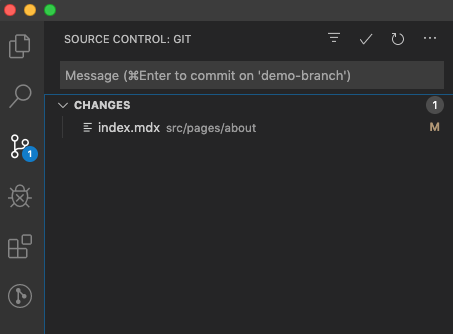

  Clicking on individual files will show the changes you have made:

  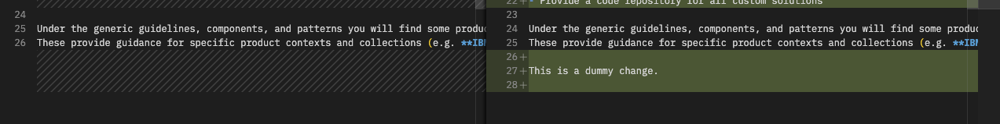

6. If the changes are OK then the next step is to commit them and push (upload) the
  branch to the master repository.

  a. Stage each of the files you wish to push by clicking the plus to the
    right of it:

    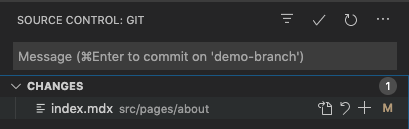

  b. Commit the changes by adding a message to the text box and clicking the
      checkmark above. (NOTE: all messages must be prefixed with `chore:`, `fix:`
      or `feat:` to denote a general update, fix or new feature):

  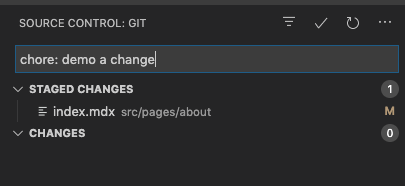

  c. Push your changes by clicking on the cloud or up arrow (depends on
    whether you have already pushed changes to a branch previously or not).
    If clicking on the cloud you will be asked to select where to middle
    top. Select 'origin'.

    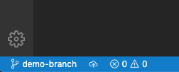

    

    You will see a spinner bottom left until the upload is complete.

    If you've already pushed then the cloud is not displayed, just up and
    down arrows:

    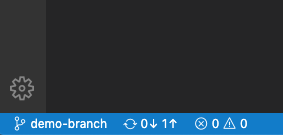

7. Once the branch with the changes has been pushed up to the master
  repository then a PR (pull request) needs to be created to get the
  changes reviewed and merged into the master branch (which will cause
  them to be deployed to the site).

  a. Go to the master repository <https://github.ibm.com/CDAI-design/CDAI-design-website> and click on ‘Compare & pull requestʼ, which should
    appear any time you have recently uploaded changes:

    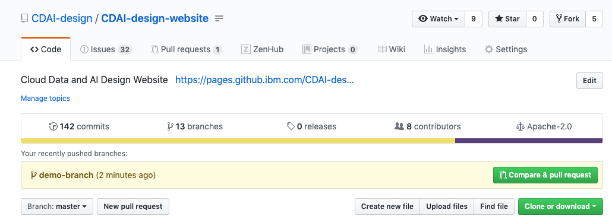

    If it does not you can achieve the same thing from the 'Pull requests'
    tab by clicking 'Create pull request':

    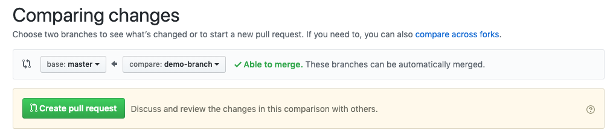

  b. Give the pull request a useful title, and if a specific reviewer is
    desired then assign them. If the change is non-trivial then some description
    of the changes will probably aid the reviewer.

  c. When the review is completed and the build checks are complete the
    'Squash and merge' button will be green and enabled. Merging the PR then
    completes the process.

    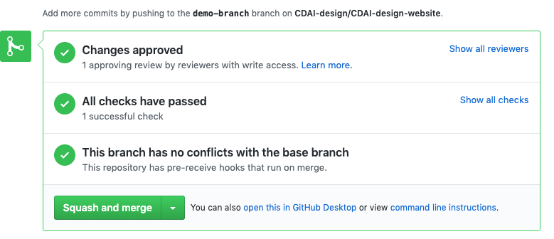
