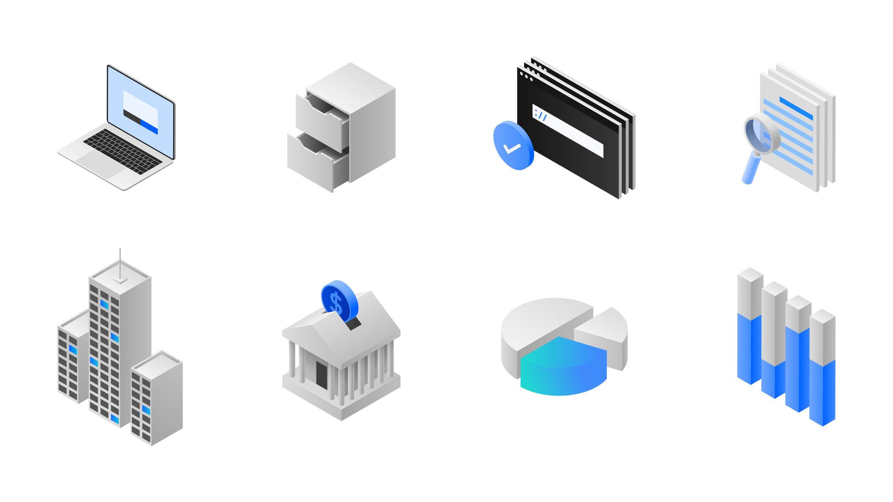
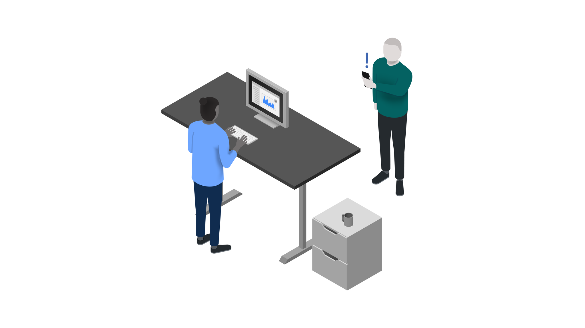
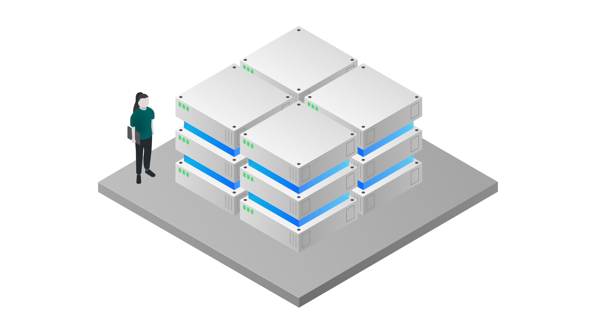
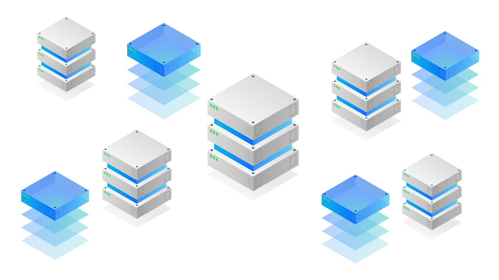
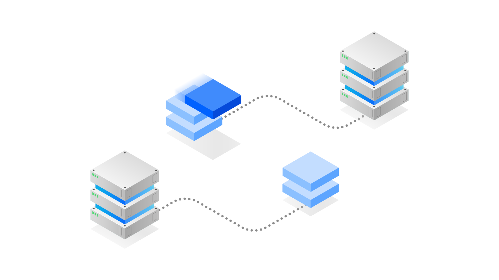
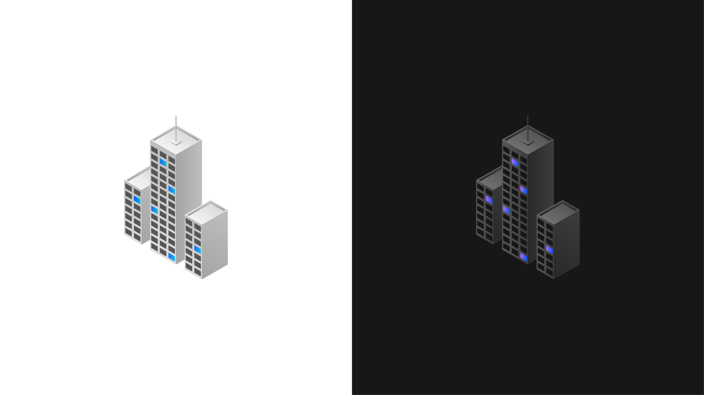
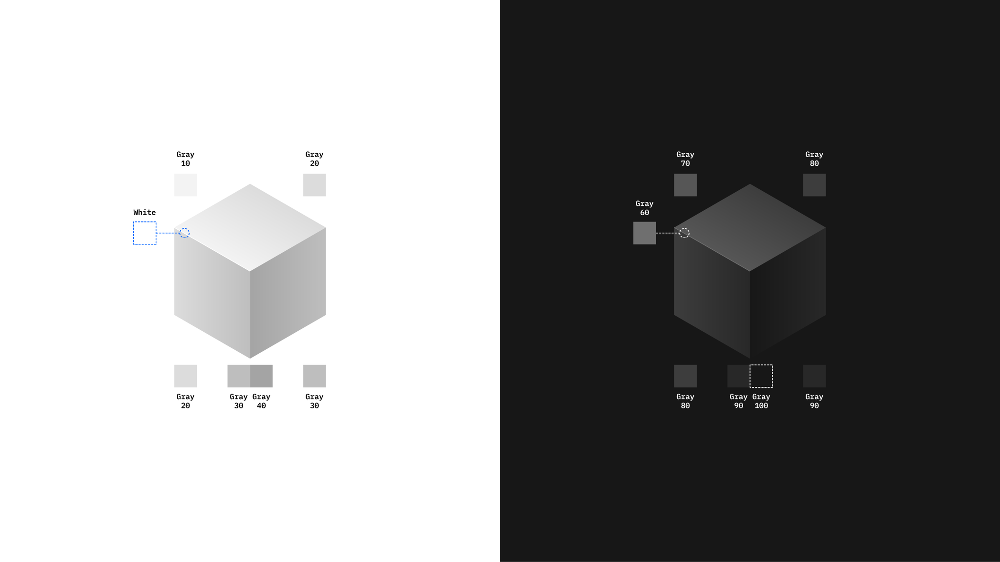
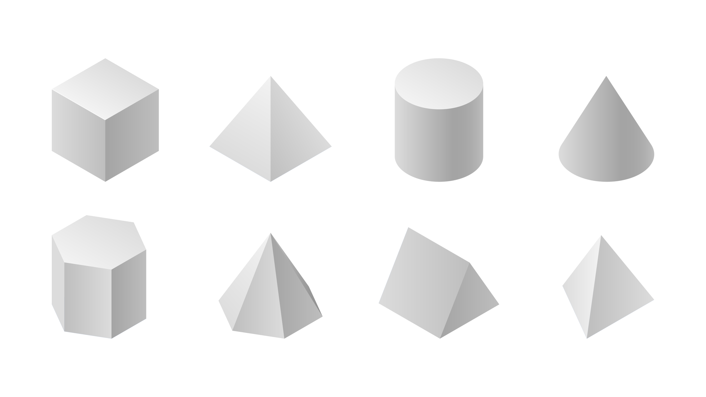

## Overview

<AnchorLinks>
  <AnchorLink>Overview</AnchorLink>
  <AnchorLink>Using assets</AnchorLink>
  <AnchorLink>Abstract vs Literal</AnchorLink>
  <AnchorLink>Color</AnchorLink>
  <AnchorLink>Light and shadow</AnchorLink>
  <AnchorLink>Creating/requesting missing items</AnchorLink>
  <AnchorLink>Empty state illustrations</AnchorLink>
</AnchorLinks>

<Row>
<Column colLg={8}>

</Column>
</Row>

The Cloud, Data and AI illustration library has been created as an extension to the [IBM Design Language illustration guide](https://www.ibm.com/design/language/illustration/overview/), to help bring unification across our portfolio. The library features a range of isometric assets to aid in the creation of illustrations for use in product, marketing and educational materials or wherever illustration can be used to enhance the user experience.

Illustrations should be clear and purposeful, working to support content and guide a user to understand difficult concepts, products or services. When used correctly, illustrations should engage and create meaningful connections with our users and not distract from their productivity. Always begin illustrations with a clear, purposeful story. This will keep the imagery focused and not ornamental.

Each asset can be downloaded individually as an SVG, alternatively, for designers who feel more confident in their illustration abilities, a master illustrator file is also available for download.

A range of isometric human figures is also being developed for use in compositions alongside the base objects library.

<Row>
<Column colLg={8}>

</Column>
</Row>

(Humans library coming soon…)

## Using assets

It is advisable to be highly selective when using assets in compositions and adopt a less is more approach if possible. Using too many assets within a composition can make it seem crowded which makes it harder for a user to intuit the intended meaning from the overall illustration.

<Row>
<Column colLg={8}>

</Column>
</Row>

It is also recommended to not re-use the same component more than twice unless you have a very good reason to do so (multiple servers in a server farm would be an acceptable example). Excessive re-use of components can make a composition seem lazy and poorly thought-out if not well executed.

<DoDontRow>
  <DoDont colLg={8} caption="The server farm illustration above is a good example of how well-considered reuse of a single component can help to create an effective composition.">

  </DoDont>
</DoDontRow>
<DoDontRow>
  <DoDont type="dont" colLg={8} caption="The illustration above is an example of what not to do when creating compositions, the repeated reuse of components without a well defined structure seems lazy and sloppy. It is also recommended that you do not use randomly resized components as depicted above, scale can be an effective way to help communicate relationships and concepts, and as such should not be used without consideration.">

  </DoDont>
</DoDontRow>

## Abstract vs Literal

When creating illustrations try to consider where they sit on the scale between abstraction and literal representation. Some complex technologies and systems may be better served by abstract representations while literal illustrations of physical technologies such as servers or laptops can be accurately represented without the need for abstraction.

Some compositions may also benefit from a combination of abstract and literal representations, with physical objects helping to keep the more abstract concepts grounded in reality.

<Row>
<Column colLg={8}>

</Column>
</Row>

## Color

The illustration library makes use of the Carbon 10 color palette and uses primarily the neutral gray tones. Blue and teal are used as accent colors in the light theme, while the dark theme (currently in development) uses blue and purple.

<Row>
<Column colLg={8}>

</Column>
</Row>

Light theme illustration assets have been optimized for use on both white and gray 10 backgrounds. If you are looking into introducing some high contrast elements, they can also be used on the gray 90 and gray 100 backgrounds (vice versa for the dark theme).

While illustration library assets are primarily grey, color can be used to draw attention to main ideas and important elements within an illustration, however, use it sparingly to avoid competing with other page objects such as primary Call's to action which use Blue 60.

## Light and shadow

Subtle gradients are used to give an increased sense of depth and form to the illustration assets, they also help to suggest material qualities and source of light.

<Row>
<Column colLg={8}>

</Column>
</Row>

The asset library contains a range of basic isometric forms with predefined gradient shading if you require custom assets we suggest using these forms as a point of reference when considering source of light and shading.

<Row>
<Column colLg={8}>

</Column>
</Row>

Shadows cast by objects can be applied in a variety of ways, however, to ensure the quality of illustrations they must be applied consistently. The asset library prefers to use hard shadows and avoids using any kind of blur effects to keep illustrations as sharp and focused as possible.

## Creating/requesting missing items

The illustration library has a range of assets to help designers create compositions with ease, however, it is not an exhaustive library. There may be times where a specific item you need to help communicate a concept is missing.

If this is the case, and you feel comfortable doing so, please make use of the master illustrator file and guidance provided to create the missing item yourself. This custom asset can then be reviewed for contribution back to the library so that others may also make use of it. Submit your design by opening an issue in the [CD&AI](https://github.ibm.com/CDAI-design/pal/issues) git repo.

Alternatively, if illustration is not one of your key skills and you would like some help in the creation of the required asset, please reach out to our team via the [#cdai-pal](https://ibm-casdesign.slack.com/archives/CQGR0HC05) slack channel.

## Empty state illustrations

A subset of illustrations has been created for use within the [empty state pattern extension](https://pages.github.ibm.com/cdai-design/pal/patterns/empty-state/usage). These illustrations are monochromatic greyscale versions of core objects, each of which relates to a specific empty state scenario.
