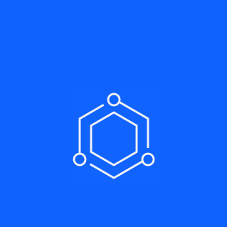

import HomepageTemplate from "gatsby-theme-carbon/src/templates/Homepage";
export default HomepageTemplate;

<Row className="image-card-group">

<Column colMd={4} colLg={4} noGutterSm>

<ImageCard
  title="Product-Led Growth"
  subTitle="Initiatives"
  href="/saas-for-hyperscalers/overview"
>

</ImageCard>

<ImageCard
  title="How can I contribute?"
  subTitle="Contribution"
  href="/contributing/updating-this-site/overview/"
>

</ImageCard>

</Column>

<Column colMd={4} colLg={4} noGutterSm>

<ImageCard
  title="Carbon 11"
  subTitle="Design System"
  href="https://carbondesignsystem.com/migrating/guide/overview/"
>

</ImageCard>

<ImageCard
  title="YourLearning course"
  subTitle="Get Started"
  href="https://yourlearning.ibm.com/activity/PLAN-23664761452B"
>

</ImageCard>

</Column>

<Column colMd={4} colLg={4} noGutterSm>

<ImageCard
  title="What is Carbon for IBM Products?"
  subTitle="Overview"
  href="/overview/about"
>

</ImageCard>

</Column>

</Row>

<Row className="grid-callout">

<Column colMd={4} colLg={4}>

## Resources

</Column>

<Column colMd={4} colLg={8}>

Find those resources you’re always digging around the PAL site for, right here once and for all.

</Column>

</Row>

<Row className="resource-card-group">

<Column colMd={4} colLg={4} noGutterSm>

<ResourceCard
  subTitle="Slack"
  title="ds_adoption_guild"
  href="https://join.slack.com/share/enQtNjAyMzI4MTQ5NzcwMy02MmZiYzc0ZjY1YjNlNWI2OTg4NmE3ZTg4NWEzZThjYmMzMTljOGQ3YzA4ZDJiYTg5YmJlYTRmNjJhZjk4ZGM2">

</ResourceCard>

</Column>

<Column colMd={4} colLg={4} noGutterSm>

<ResourceCard
  subTitle="Slack"
  title="ibmproducts-pal"
  href="https://join.slack.com/share/enQtNjA2MTA2NjM2MDM4NC0yZWJjOTVkZDk3NGQ0MjJkODk0Yzg1MTczZDczZmI5YWY5NzgwYWM3YWIyYWY0NTJhMGIwOTJkYTI2MTk5Zjhm">

</ResourceCard>

</Column>

<Column colMd={4} colLg={4} noGutterSm>

<ResourceCard
  subTitle="Github"
  title="Carbon for IBM Products design GitHub"
  href="https://github.ibm.com/CDAI-design/pal"
>

</ResourceCard>

</Column>

<Column colMd={4} colLg={4} noGutterSm>

<ResourceCard
  subTitle="Events & Calendar"
  title="DSAG meeting Th 11:00AM EST"
  href="https://ec.yourlearning.ibm.com/w3/event/10377319">

</ResourceCard>

</Column>

<Column colMd={4} colLg={4} noGutterSm>

<ResourceCard
  subTitle="Figma kit"
  title="Carbon for IBM Products Figma kit"
  href="/design-kits/figma"
>

</ResourceCard>

</Column>

<Column colMd={4} colLg={4} noGutterSm>

<ResourceCard
  subTitle="Airtable"
  title="Pattern & components request form"
  href="https://airtable.com/appURFSG6dypHTXcd/shrayne6McJFr3wOM"
>

</ResourceCard>

</Column>

</Row>

### Development resources

<Row className="resource-card-group">

<Column colMd={4} colLg={4} noGutterSm>

<ResourceCard
  subTitle="Slack"
  title="ibmproducts-pal-dev"
  href="https://join.slack.com/share/enQtNjA2MTI5NDU2OTM2MC1kZjcxMGQ4NTVkYmNmNDc2ZmFkZWU2NGNiYTY5MDdiYWVlODEzNGRlNjc2ZDY3OWU4MzUwODFiZWI4NjFlMmY3">

</ResourceCard>

</Column>

<Column colMd={4} colLg={4} noGutterSm>

<ResourceCard
  subTitle="Storybook"
  title="Carbon for IBM Products Storybook"
  href="https://carbon-for-ibm-products.netlify.app"
>

</ResourceCard>

</Column>

<Column colMd={4} colLg={4} noGutterSm>

<ResourceCard
  subTitle="Github"
  title="Carbon for IBM Products development GitHub"
  href="https://github.com/carbon-design-system/ibm-products"
>

</ResourceCard>

</Column>

<Column colMd={4} colLg={4} noGutterSm>

<ResourceCard
  subTitle="Events & Calendar"
  title="Development office hours Wed 11:30AM EST"
  href="https://ec.yourlearning.ibm.com/w3/meeting/10373279">

</ResourceCard>

</Column>

</Row>
