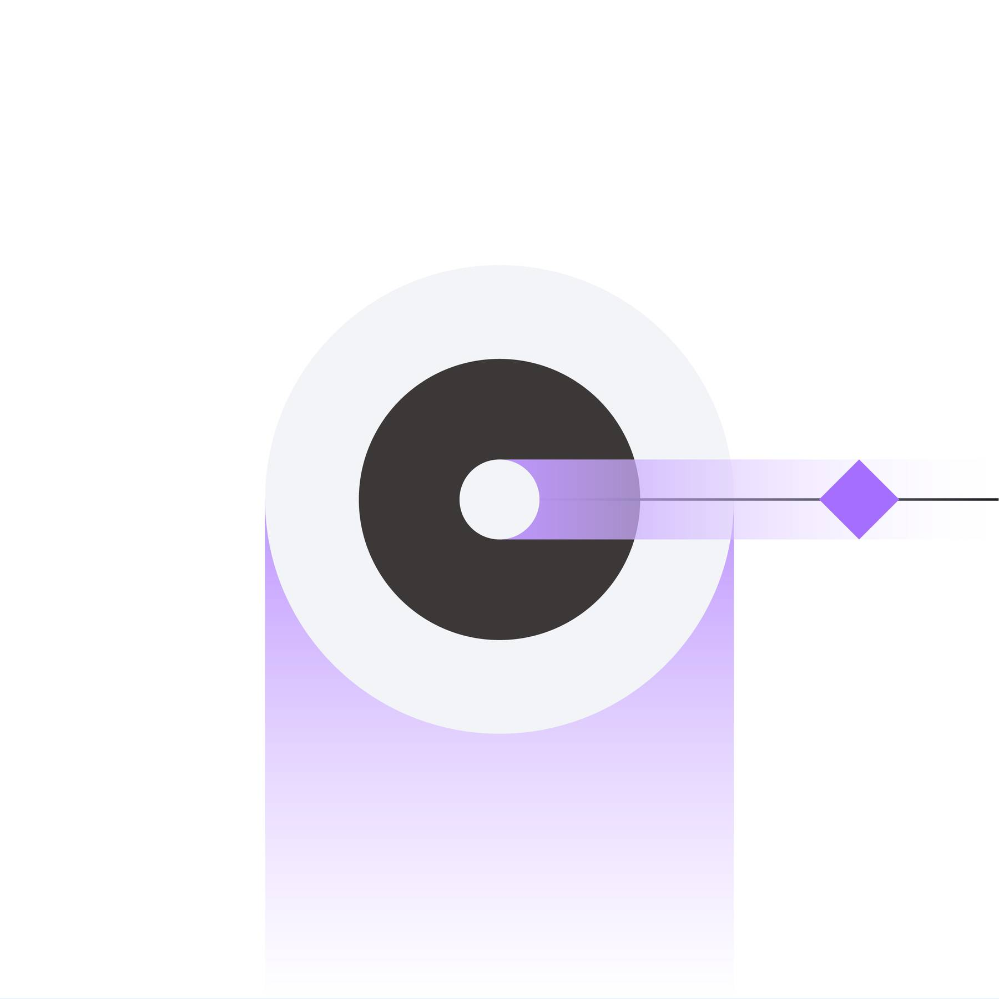

import HomepageTemplate from "gatsby-theme-carbon/src/templates/Homepage";
export default HomepageTemplate;

## Getting started

<Row className="image-card-group">

<Column colMd={4} colLg={4} noGutterSm>

<ImageCard
  title="Overview"
  titleColor="dark"
  hoverColor="dark"
  href="/overview/about"
>

</ImageCard>

<ImageCard
  title="Carbon 11"
  titleColor="dark"
  hoverColor="dark"
  href="https://carbondesignsystem.com/migrating/guide/overview/"
>

</ImageCard>

</Column>

<Column colMd={4} colLg={4} noGutterSm>

<ImageCard
  title="Product-Led Growth"
  titleColor="dark"
  hoverColor="dark"
  href="/saas-for-hyperscalers/overview"
>

</ImageCard>

<ImageCard
  title="Contribution"
  titleColor="dark"
  hoverColor="dark"
  href="/contributing/overview/"
>

</ImageCard>

</Column>

<Column colMd={4} colLg={4} noGutterSm>

<ImageCard
  title="YourLearning course"
  titleColor="dark"
  hoverColor="dark"
  href="https://yourlearning.ibm.com/activity/PLAN-23664761452B"
>

</ImageCard>

<ImageCard
  title="Contributing Badge"
  titleColor="dark"
  hoverColor="dark"
  href="https://www.credly.com/org/ibm/badge/carbon-design-system-contributor.1"
>

</ImageCard>

</Column>

</Row>

## Need to know

<Row className="resource-card-group">

<Column colMd={4} colLg={4} noGutterSm>

<ResourceCard
  subTitle="Slack"
  title="ds_adoption_guild"
  href="https://ibm-casdesign.slack.com/archives/CHJSPKW9Y/">

</ResourceCard>

</Column>

<Column colMd={4} colLg={4} noGutterSm>

<ResourceCard
  subTitle="Slack"
  title="ibmproducts-pal"
  href="https://ibm-casdesign.slack.com/archives/CQGR0HC05/">

</ResourceCard>

</Column>

<Column colMd={4} colLg={4} noGutterSm>

<ResourceCard
  subTitle="Figma kit"
  title="Carbon for IBM Products"
  actionIcon="none"
  href="/design-kits/figma"
>

</ResourceCard>

</Column>

<Column colMd={4} colLg={4} noGutterSm>

<ResourceCard
  subTitle="Github"
  title="Carbon for IBM Products"
  href="https://github.ibm.com/CDAI-design/pal"
>

</ResourceCard>

</Column>

<Column colMd={4} colLg={4} noGutterSm>

<ResourceCard
  subTitle="Subscribe"
  title="DSAG: Th 11:00 am EST"
  actionIcon="calendar"
  href="https://ec.yourlearning.ibm.com/w3/event/10377319">

</ResourceCard>

</Column>

<Column colMd={4} colLg={4} noGutterSm>

<ResourceCard
  subTitle="Airtable"
  title="Pattern & Components Request Form"
  href="https://airtable.com/appURFSG6dypHTXcd/shrayne6McJFr3wOM"
>

</ResourceCard>

</Column>

</Row>

## Dev resources

<Row className="resource-card-group">

<Column colMd={4} colLg={4} noGutterSm>

<ResourceCard
  subTitle="Slack"
  title="ibmproducts-pal-dev"
  href="https://ibm-casdesign.slack.com/archives/C013ZTX0N6B/">

</ResourceCard>

</Column>

<Column colMd={4} colLg={4} noGutterSm>

<ResourceCard
  subTitle="Storybook"
  title="Carbon for IBM Products"
  href="https://carbon-for-ibm-products.netlify.app"
>

</ResourceCard>

</Column>

<Column colMd={4} colLg={4} noGutterSm>

<ResourceCard
  subTitle="Github"
  title="IBM Products"
  href="https://github.com/carbon-design-system/ibm-products"
>

</ResourceCard>

</Column>

<Column colMd={4} colLg={4} noGutterSm>

<ResourceCard
  subTitle="Office Hours"
  title="With the Dev team"
  actionIcon="calendar"
  href="https://ec.yourlearning.ibm.com/w3/meeting/10373279">

</ResourceCard>

</Column>

</Row>
