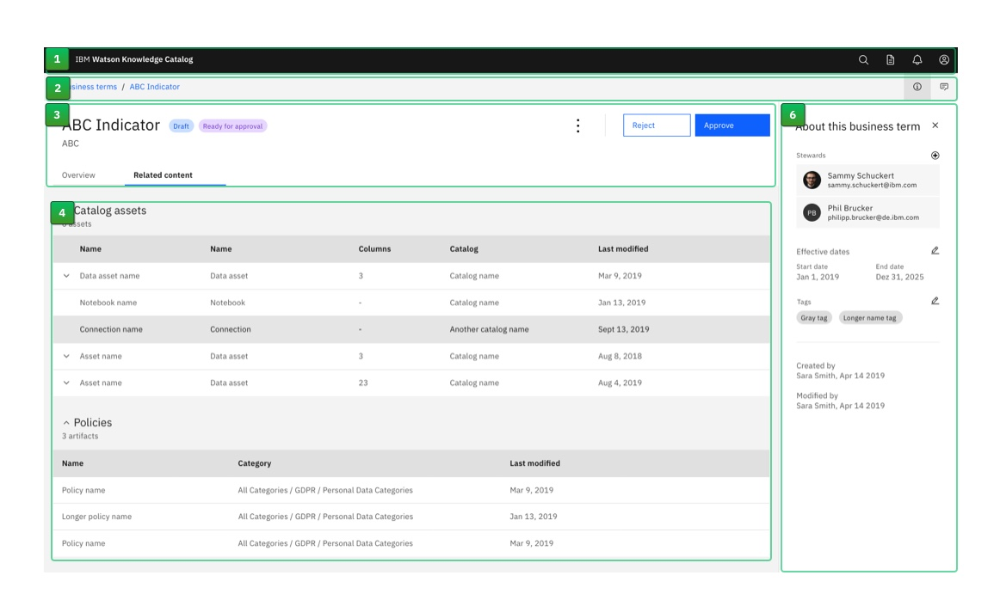

<PageDescription>

</PageDescription>

<AnchorLinks>
  <AnchorLink>Overview</AnchorLink>
  <AnchorLink>Requirements</AnchorLink>
  <AnchorLink>1. Note keyboard navigation in wireframes</AnchorLink>
  <AnchorLink>2. Specify the tab order</AnchorLink>
  <AnchorLink>3. All components are reachable by keyboard</AnchorLink>
  <AnchorLink>4. Reduce tabbing</AnchorLink>
</AnchorLinks>

## Overview

This document provides guidance and examples on how to integrate a high-level keyboard navigation concept and tab order annotation for wireframes to improve the experience for users that prefer keyboard navigation and the ones who rely on it.
Designers should specify how interactive content is reached in ensuring everything can be done by keyboard. Information conveyed in wireframes helps developers implement all keyboard interactions.

Designers need to determine the keyboard operation rules for the specific components or widgets that are not defined in this pattern.

## Requirements

IBM Accessibility Requirements mandates that all content can be navigated with a keyboard or keyboard interface.

**Design for keyboard navigation:**

- Note intended keyboard navigation in wireframes
- Specify the tab order
- Ensure all mouse-operable components are reachable by keyboard
- Reduce tabbing by effective grouping of components

Source: [IBM Accessibility keyboard user experience design](https://www.ibm.com/able/toolkit/design/ux/navigation)

## 1. Note keyboard navigation in wireframes

To ensure the successful implementation of accessibility, designers need to provide specific guidance on keyboard navigation by adding annotation to the wireframe.
For a series of similar pages, it is only necessary to detail keyboard navigation once. 
Use clear and consistent symbols, icons, and lines to annotate wireframes

### Keyboard navigation annotation examples

<Row>
<Column colMd={12} colLg={12}>

</Column>
</Row>

#### Best practices:

**Do's**

- Keep annotations clear and concise as possible.
- Provide consistent annotations to show the tab order between interactive components.

**Don'ts**

- Don't provide too many annotations, or include tab stops that have already been established with your developers.

## 2. Specify the tab order

Tab order is how a user navigates sequentially through the UI when pressing Tab on the keyboard. The order of content in the source code should typically be the same as the visual presentation of the content to avoid confusion for assistive technology users ([WCAG2.0 C27](https://www.w3.org/TR/WCAG20-TECHS/C27.html)).

1. The order will follow the reading order, from upper left to lower right. If the order is illogical or unintuitive, it will be difficult to navigate or understand.
2. In the wireframe, specify the order in which the user should encounter the interactive components on the page. This will let the developer properly code the navigation.
3. Non-interactive and visually hidden content should not be included in the tab order.

### Types of tab stops

There are two types of tab stops, single action tab stops and container tab stops.

### 1. Single action tab stop

- A single action tab stop is an element that bears a single action, such as a link or a button, etc.
- The elements can be activated with Space or Enter.
- Tooltips are also single action tab stops, but are activated on focus.

<Row>
<Column colMd={6} colLg={6}>

</Column>
</Row>

### 2. Container tab stop

- A container tab stop comprised of various interactive widgets, such as a hamburger menu, dropdown menus, or a tab sets.
- A data table is a container tab stop.
- Users can move the focuses inside the container with the arrow keys.
- Widgets that can receive keyboard focus are activated with Space or Enter.

**Note:** WAI-ARIA defines a grid widget (such as a data table) as a container that enables users to navigate the information or interactive elements it contains using directional navigation keys, such as arrow keys, Home, and End. (See [WAI-ARIA definition for Girds](https://www.w3.org/TR/wai-aria-practices/#grid))

<Row>
<Column colMd={6} colLg={6}>

</Column>
</Row>

**Annotation example for tabs**

|            |             |
| ------------------------------------ | ------------------------------------ |
| **Light theme**                      | **Dark theme**                       |
| Focus Ring style: blue-60, 2px       | Focus Ring style: white, 2px         |
| Container border width: #AA50CA, 1px | Container border width: #DE92D1, 1px |

**Data table with interactive elements within cells**

- A data table is a container with a single tab stop.
- Arrow keys are used to move the focus inside the table.

**Note:** Like an HTML table element, a WAI-ARIA table is a static tabular structure and its cells are not focusable or selectable. WAI-ARIA suggests using "[grid pattern](https://www.w3.org/TR/wai-aria-practices/#grid)" to make an interactive widget that has a tabular structure to reduce the length of the page tab sequence because a grid is a composite widget that can contain other widgets.

Source: WAI-ARIA [Layout grid](https://www.w3.org/TR/2021/NOTE-wai-aria-practices-1.2-20211129/examples/grid/LayoutGrids.html), [Data grid](https://www.w3.org/TR/2021/NOTE-wai-aria-practices-1.2-20211129/examples/grid/dataGrids.html)

**Data table with clickable rows**

In a rare case that a table row contains multiple interactive elements, annotate the focus order from left to right. 
If the table row contains a row action, it should be the first focus when the user navigates to this row with keyboard.
Non-interactive data should not be included in the focus order.

**Note:** Designer can change the order based on the use case.

Keyboard operation example of data table:

## Tab n

WCAG 2.0 Success Criterion 2.4.1 - [Bypass Blocks](https://www.w3.org/TR/2016/NOTE-WCAG20-TECHS-20161007/G1) suggests bypassing blocks of content that are repeated on multiple Web pages by providing “Skip to main content” link at the start of users' keyboard navigation. When users visit a page and hit the tab key for the first time, they should see a menu appears in the upper left corner. This tab stop is hidden to regular mouse users and is referred to as "Tab n."

The tab n menu is a container tab stop which includes two options:

1. Skip to main content
2. View keyboard shortcuts (optional)

_Note: A screen reader will always try to read aloud any navigation it comes across on every page load. Providing a Skip to main content link can greatly improve the experience of the user using a screen reader._

- [Tab n live demo](https://pages.github.ibm.com/Jan-Hassel/static-prototype-archive/202111_skip-link/?v=b)

### 1. Skip to main content

When keyboard-only users use the tab key to jump from link to link, they must tab through header every time they come to a new page just to get to the main content. Providing a Skip to main content link allows them to easily bypass this.

Skip to Main Content is the first option on the Tab n menu and should be focused by default. Hitting the enter key will move the focus to where the page's main content begins.

### 2. View keyboard shortcuts (optional)

When the Tab n menu is open, users can move the focus down with the arrow key and press Enter to launch the keyboard shortcuts modal.

**More details:** [Keyboard shortcut guidance](https://pages.github.ibm.com/cdai-design/pal/patterns/keyboard-shortcut-guidance/usage)

## Best practices

### Do's

**Make all interactive elements focusable.**

- Users should be able to tab to every interactive element on the screen unless it is currently disabled.
- Interactive elements include links, buttons, form fields and other input controls.
- It can also include some hoverable elements, such as tooltips, or other important information included in a hoverable element.
- Watch out for "keyboard traps," elements that receive input focus then prevent it from moving away.

**Make the tab order consistent with the logical order that's communicated visually.**

- In most cases, tab order should match the expected reading order (left-to-right and top-to-bottom).
- In some exceptions, tab order may not follow the reading order, but the expected actions instead. For example, the first interactive element in a passive non-destructive modal is oftentimes the primary button but in a destructive or irreversible modal, the default focus is on the Cancel button.

**Make sure elements that appear in multiple views have a consistent tab order.**

- For example, if multiple views in an application have a navigation bar, a search field, and a settings menu, these elements should have the same relative tab order in every view.
- All focus changes that occur should be a predictable result of user action.

### Don'ts

- Don't include non-interactive or currently disabled elements as part of the tab order.
- Don't allow users to tab to text elements (such as labels) or other static content.
- Don't allow users to tab their way out of a modal dialog. Users must actively dismiss the dialog (for example, using an OK or Cancel button, or the Esc key).
- Don't move input focus unexpectedly.

## 3. All components are reachable by keyboard

Any component that can be operated with a mouse should be reachable and operable by keyboard, or have a keyboard equivalent.

- Ensure to include the information that is revealed only on mouse hover in the tab order.
- All tooltips, whether reached though hovering or by clicking, should be included in the tab order.
- Ensure all pointer interactions have keyboard equivalence. For example, there should be a keyboard equivalent for drag and drop:
  - How to select the item (drag source)
  - How to move the item
  - Where to drop the item (drop target)

## 4. Reduce tabbing

We can reduce the number of tab stops to lessen the need for keyboard users repeatedly pressing the Tab key in order to begin a task. It is the designer's responsibility to define the individual areas for a given user interface.

UI regions

- Keep the number of UI regions below 10 at any given time.
- The order of UI regions should typically follow the visual representation and make sense to the user when jumping through
- Users should be able to jump through all UI regions by pressing the following keyboard shortcuts:

|                                                       | Windows and Linux | MacOS        |
| ----------------------------------------------------- | ----------------- | ------------ |
| Browser applications: to focus the next UI region     | Ctrl+F6           | Cmd+F6       |
| Browser applications: to focus the previous UI region | Shift+Ctrl+F6     | Shift+Cmd+F6 |
| Desktop applications: to focus the next UI region     | F6                | F6           |
| Desktop applications: to focus the previous UI region | Shift+F6          | Shift+F6     |

**Annotation example of the UI regions**
UI region outline annotation : 2px #00C063 Alpha:60%

<Row>
<Column colMd={12} colLg={12}>

This animation shows the region boundaries and the focus ring when the user jumps through all UI regions by pressing the keyboard shortcuts.

</Column>
</Row>

The first interactive component in the UI region will be focused by default when the region is focused. 
To inform the user about the scope of a UI region, it has a discreet blue outline. This outline should only be visible when the user is navigating with the [F6] keyboard shortcuts. If the focus is set by clicking on an element within an area, the area outline will not be shown.

#### UI regin visual Style

|                         | Light theme                   | Dark theme                    |
| ----------------------- | ----------------------------- | ----------------------------- |
| Wireframe annotation    | 2px solid, #00C063, Alpha:60% | 2px solid, #00C063, Alpha:60% |
| UI border style         | 2px solid, blue 60            | 2px solid, white              |
| Focus within the region | Carbon component style        | Carbon compoenent style       |

- In both themes, the annotation outline should be placed inside the ui region.
- The focus border of an element within the region should overlay the region border.

**UI regions for different type of pages**

<Row>
<Column colMd={8} colLg={8}>

</Column>
</Row>

### Sketch symbol library and examples

<Row className="resource-card-group">
  <Column colMd={4} colLg={4} noGutterSm>
    <ResourceCard
      subTitle="Symbol library and examples"
      title="Keyboard annotation"
      aspectRatio="2:1"
      actionIcon="download"
      href="https://ibm.ent.box.com/file/969067117699"
    ></ResourceCard>
  </Column>
</Row>

### Annotation elements

<Row>
<Column colMd={8} colLg={8}>

</Column>
</Row>

## References:

- [IBM Accessibility keyboard user experience design](https://www.ibm.com/able/toolkit/design/ux/navigation)
- [IBM Accessibility drag and drop guidance](https://www.ibm.com/able/toolkit/design/ux/keyboard/#dragdrop)
- [W3 Data grid example](https://www.w3.org/TR/2021/NOTE-wai-aria-practices-1.2-20211129/examples/grid/dataGrids.html)
- [Skip to main content](https://accessibility.oit.ncsu.edu/it-accessibility-at-nc-state/developers/accessibility-handbook/mouse-and-keyboard-events/skip-to-main-content/)
- [IT Accessibility at NC State](https://accessibility.oit.ncsu.edu/)

## Related

[Keyboard shortcut guidance](https://pages.github.ibm.com/cdai-design/pal/patterns/keyboard-shortcut-guidance/usage)
