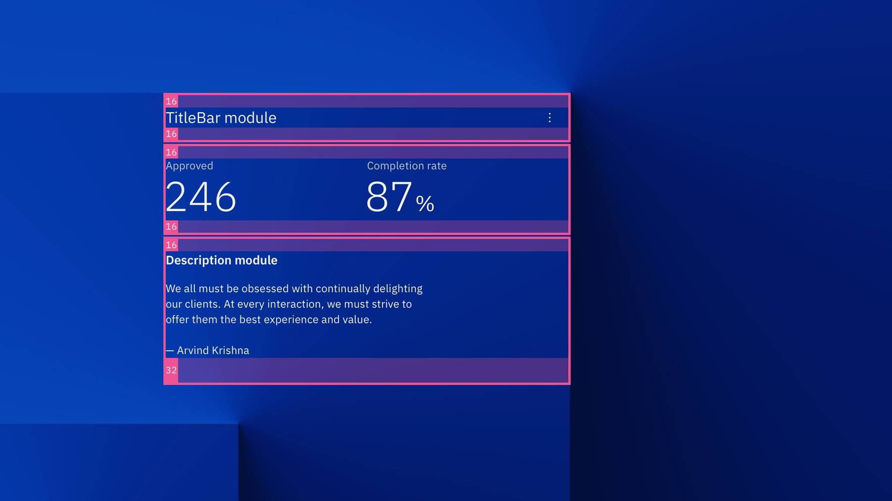

## Resources

<Row className="resource-card-group">
  <Column colMd={4} colLg={4} noGutterSm>
    <ResourceCard
      subTitle="Carbon for C&CS Layouts"
      actionIcon="launch"
      aspectRatio="2:1"
      href="sketch://add-library/cloud/8f922fac-1243-44d7-a551-bd31d5ded1fd">

  </ResourceCard>
  </Column>
</Row>

## Page layouts

<FeatureCard
  title="Usage guidance"
  actionIcon="arrowRight"
  href="./usage#layouts"
  color="light">

</FeatureCard>

### Storybook page layouts library

<Row>
  <Column colMd={4} colLg={4} noGutterSm>
    <ImageCard
      aspectRatio="4:3"
      href="https://ibm-security.carbondesignsystem.com/?path=/story/page-layouts-canary-detail--default"
      actionIcon="launch"
      subTitleColor="light"
      subTitle="Details page layout">

  </ImageCard>
  </Column>
  <Column colMd={4} colLg={4} noGutterSm>
    <ImageCard
      aspectRatio="4:3"
      href="https://ibm-security.carbondesignsystem.com/?path=/story/page-layouts-canary-overview--default"
      actionIcon="launch"
      subTitleColor="light"
      subTitle="Overview page layout">

  </ImageCard>
  </Column>
</Row>

## Micro layouts

<FeatureCard
  title="Usage guidance"
  actionIcon="arrowRight"
  href="./usage#micro-layouts"
  color="light">

</FeatureCard>

### Storybook micro layouts library

<Caption>The micro layouts section will become available pending the migration between Carbon repos across C&CS and Security.</Caption>

<Row>
  <Column colMd={4} colLg={4} noGutterSm>
    <ImageCard disabled aspectRatio="4:3" subTitle="Screenshot card layout">

  </ImageCard>
  </Column>
  <Column colMd={4} colLg={4} noGutterSm>
    <ImageCard disabled aspectRatio="4:3" subTitle="DescriptionList card layout">

  </ImageCard>
  </Column>
  <Column colMd={4} colLg={4} noGutterSm>
    <ImageCard disabled aspectRatio="4:3" subTitle="Query card layout">

  </ImageCard>
  </Column>
  <Column colMd={4} colLg={4} noGutterSm>
    <ImageCard disabled aspectRatio="4:3" subTitle="Threat card layout">

  </ImageCard>
  </Column>
  <Column colMd={4} colLg={4} noGutterSm>
    <ImageCard disabled aspectRatio="4:3" subTitle="Task list layout">

  </ImageCard>
  </Column>
  <Column colMd={4} colLg={4} noGutterSm>
    <ImageCard disabled aspectRatio="4:3" subTitle="Timeline list layout">

  </ImageCard>
  </Column>
</Row>

## Layout modules

<FeatureCard
  title="Usage guidance"
  actionIcon="arrowRight"
  href="./usage#layout-modules"
  color="light">

</FeatureCard>

### Storybook layout modules library

Usage guidance, developer options, and variant examples for each of the individual layout modules can be found in the Carbon for Security Storybook.

<Row>
  <Column colMd={4} colLg={4} noGutterSm>
    <ImageCard
      aspectRatio="4:3"
      href="https://ibm-security.carbondesignsystem.com/?path=/docs/layout-modules-actionbarmodule--default"
      actionIcon="launch"
      subTitleColor="light"
      subTitle="ActionBar module">

  </ImageCard>
  </Column>
  <Column colMd={4} colLg={4} noGutterSm>
    <ImageCard
      aspectRatio="4:3"
      href="https://ibm-security.carbondesignsystem.com/?path=/docs/layout-modules-icamodule--default"
      actionIcon="launch"
      subTitleColor="light"
      subTitle="ICA module">

  </ImageCard>
  </Column>
   <Column colMd={4} colLg={4} noGutterSm>
    <ImageCard
      aspectRatio="4:3"
      href="https://ibm-security.carbondesignsystem.com/?path=/docs/layout-modules-buttonclustermodule--default"
      actionIcon="launch"
      subTitleColor="light"
      subTitle="ButtonCluster module">

  </ImageCard>
  </Column>
  <Column colMd={4} colLg={4} noGutterSm>
    <ImageCard
      aspectRatio="4:3"
      href="https://ibm-security.carbondesignsystem.com/?path=/docs/layout-modules-cardareamodule--default"
      actionIcon="launch"
      subTitleColor="light"
      subTitle="Card area module">

  </ImageCard>
  </Column>
  <Column colMd={4} colLg={4} noGutterSm>
    <ImageCard
      aspectRatio="4:3"
      href="https://ibm-security.carbondesignsystem.com/?path=/docs/layout-modules-descriptionmodule--default"
      actionIcon="launch"
      subTitleColor="light"
      subTitle="Description module">

  </ImageCard>
  </Column>
  <Column colMd={4} colLg={4} noGutterSm>
    <ImageCard
      aspectRatio="4:3"
      href="https://ibm-security.carbondesignsystem.com/?path=/docs/layout-modules-descriptionlistmodule--default"
      actionIcon="launch"
      subTitleColor="light"
      subTitle="DescriptionList module">

  </ImageCard>
  </Column>
  <Column colMd={4} colLg={4} noGutterSm>
    <ImageCard disabled aspectRatio="4:3" subTitle="ListItem module (available late April)">

  </ImageCard>
  </Column>
   <Column colMd={4} colLg={4} noGutterSm>
    <ImageCard
      aspectRatio="4:3"
      href="https://ibm-security.carbondesignsystem.com/?path=/docs/layout-modules-titlebarmodule--default"
      actionIcon="launch"
      subTitleColor="light"
      subTitle="TitleBar module">

  </ImageCard>
  </Column>
</Row>
