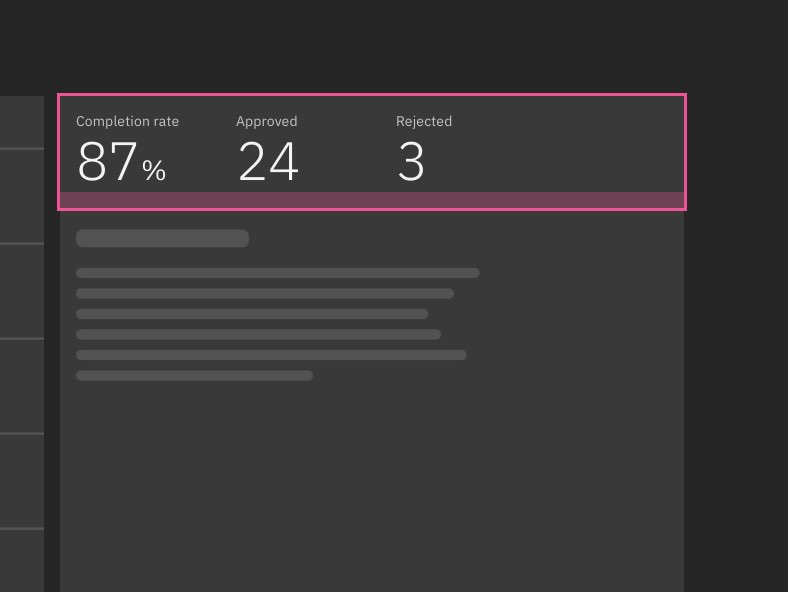
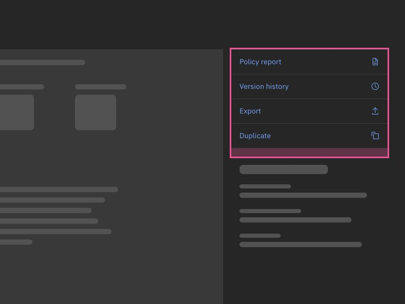
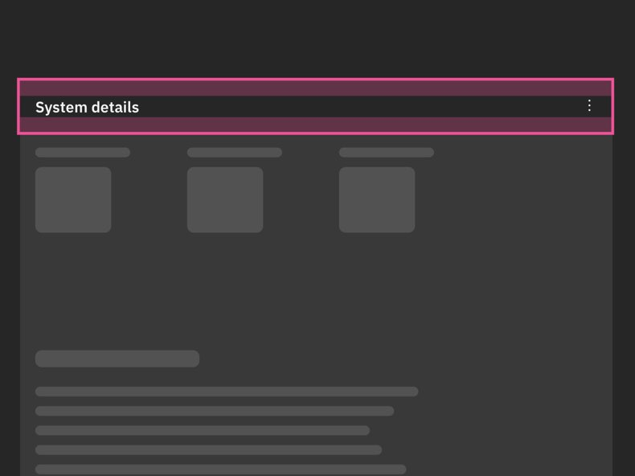

## Page layouts

<FeatureCard
  title="Usage guidance"
  actionIcon="arrowRight"
  href="./usage#layouts"
  color="light">

</FeatureCard>

### Storybook library

<Row>
  <Column colMd={4} colLg={4} noGutterSm>
    <ImageCard
      aspectRatio="4:3"
      href="https://ibm-security.carbondesignsystem.com/?path=/story/patterns-unstable-modular-page-layouts--detail"
      actionIcon="launch"
      subTitleColor="light"
      subTitle="Details page layout">

  </ImageCard>
  </Column>
  <Column colMd={4} colLg={4} noGutterSm>
    <ImageCard
      aspectRatio="4:3"
      href="https://ibm-security.carbondesignsystem.com/?path=/story/patterns-unstable-modular-page-layouts--overview"
      actionIcon="launch"
      subTitleColor="light"
      subTitle="Overview page layout">

  </ImageCard>
  </Column>
</Row>

## Micro layouts

<FeatureCard
  title="Usage guidance"
  actionIcon="arrowRight"
  href="./usage#micro-layouts"
  color="light">

</FeatureCard>

### Storybook Library

<Caption>Coming soon</Caption>

<Row>
  <Column colMd={4} colLg={4} noGutterSm>
    <ImageCard disabled aspectRatio="4:3" subTitle="Screenshot card layout">

  </ImageCard>
  </Column>
  <Column colMd={4} colLg={4} noGutterSm>
    <ImageCard disabled aspectRatio="4:3" subTitle="DescriptionList card layout">

  </ImageCard>
  </Column>
  <Column colMd={4} colLg={4} noGutterSm>
    <ImageCard disabled aspectRatio="4:3" subTitle="Query card layout">

  </ImageCard>
  </Column>
  <Column colMd={4} colLg={4} noGutterSm>
    <ImageCard disabled aspectRatio="4:3" subTitle="Threat card layout">

  </ImageCard>
  </Column>
  <Column colMd={4} colLg={4} noGutterSm>
    <ImageCard disabled aspectRatio="4:3" subTitle="Task list layout">

  </ImageCard>
  </Column>
  <Column colMd={4} colLg={4} noGutterSm>
    <ImageCard disabled aspectRatio="4:3" subTitle="Timeline list layout">

  </ImageCard>
  </Column>
</Row>

## Layout modules

<FeatureCard
  title="Usage guidance"
  actionIcon="arrowRight"
  href="./usage#layout-modules"
  color="light">

</FeatureCard>

### Storybook library

<Row>
  <Column colMd={4} colLg={4} noGutterSm>
    <ImageCard
      aspectRatio="4:3"
      href="https://ibm-security.carbondesignsystem.com/?path=/docs/patterns-unstable-layout-modules-actionbarmodule--default"
      actionIcon="launch"
      subTitleColor="light"
      subTitle="ActionBar module">

  </ImageCard>
  </Column>
  <Column colMd={4} colLg={4} noGutterSm>
    <ImageCard
      aspectRatio="4:3"
      href="/"
      actionIcon="launch"
      subTitleColor="light"
      subTitle="BigNumbers module">

  </ImageCard>
  </Column>
   <Column colMd={4} colLg={4} noGutterSm>
    <ImageCard
      aspectRatio="4:3"
      href="/"
      actionIcon="launch"
      subTitleColor="light"
      subTitle="ButtonCluster module">

  </ImageCard>
  </Column>
  <Column colMd={4} colLg={4} noGutterSm>
    <ImageCard
      aspectRatio="4:3"
      href="/"
      actionIcon="launch"
      subTitleColor="light"
      subTitle="Card module">

  </ImageCard>
  </Column>
  <Column colMd={4} colLg={4} noGutterSm>
    <ImageCard
      aspectRatio="4:3"
      href="/"
      actionIcon="launch"
      subTitleColor="light"
      subTitle="Description module">

  </ImageCard>
  </Column>
  <Column colMd={4} colLg={4} noGutterSm>
    <ImageCard
      aspectRatio="4:3"
      href="/"
      actionIcon="launch"
      subTitleColor="light"
      subTitle="DescriptionList module">

  </ImageCard>
  </Column>
  <Column colMd={4} colLg={4} noGutterSm>
    <ImageCard
      aspectRatio="4:3"
      href="/"
      actionIcon="launch"
      subTitleColor="light"
      subTitle="ListItem module">

  </ImageCard>
  </Column>
   <Column colMd={4} colLg={4} noGutterSm>
    <ImageCard
      aspectRatio="4:3"
      href="/"
      actionIcon="launch"
      subTitleColor="light"
      subTitle="TitleBar module">

  </ImageCard>
  </Column>
</Row>
