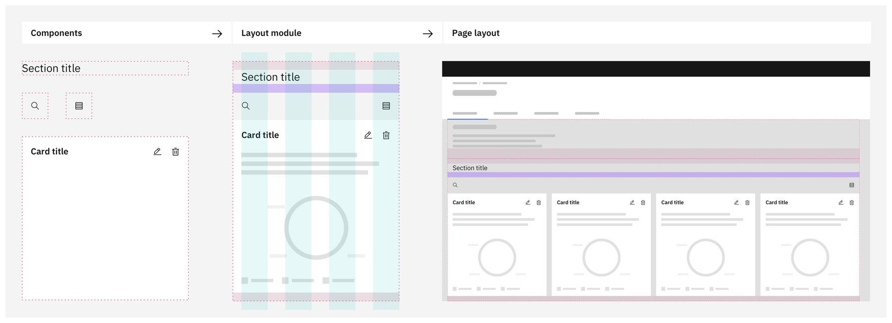
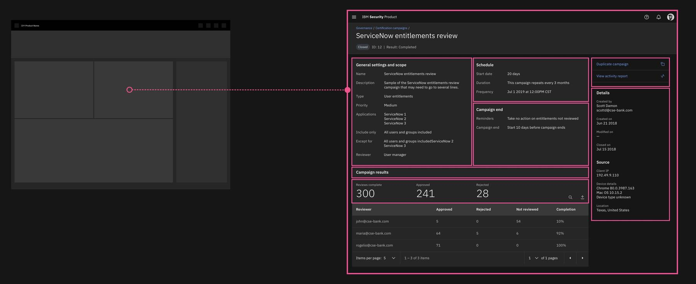

### Proper visual hierarchy, typographic choices, and whitespace are key ingredients to optimize readability and guide our customers to important information and actions. Page layout consistency, within an offering and across a portfolio, creates a common visual expression and enhances usability through familiarity and reliable way-finding.

<AnchorLinks>
  <AnchorLink>Layout modules</AnchorLink>
  <AnchorLink>Layouts</AnchorLink>
  <AnchorLink>Contribute</AnchorLink>
  <AnchorLink>Feedback</AnchorLink>
</AnchorLinks>

<InlineNotification>

**Assets coming soon:**
Layout modules will be available via the C&CS Sketch library and Carbon for Security Storybook the week of April 5

</InlineNotification>

## Layout modules

Layout modules are the combination of components, spacing tokens, icons, and type styles packaged as a single grid-aware, unit. The layout modules framework enables us to build page layouts with greater rigor, quality, and consistency. They are designed to work in tandem with other modules and Carbon components so that they can be quickly arranged into layouts with the confidence that they are consistent with all of our other pages.

### Anatomy of a layout module

Layout modules come in many types but maintain consistent anatomical characteristics.

<Row>
  <Column colMd={8} colLg={8}>

  

  </Column>
</Row>

1. **Top spacer (optional):** Offsets the layout module from the object positioned directly above it. Top spacers use `layout tokens`
2. **Title section (optional):** Layout modules often include nested titles or sub-titles. Reference the titleModule for header styles and tokens.
3. **Component spacer (optional):** Offsets multiple objects within a single layout module. Component spacers use `spacing tokens`
4. **Main content:** The core component or attribute of the layout module.
5. **Bottom spacer:** Creates padded space between the layout module and the object positioned directly below it. Bottom spacers use `layout tokens`

### When to use

Since layout modules are the combination of elements of the Carbon Design System, they can be used in your page the same as any other component available through Carbon. Because of this, layout modules can be used to construct the entire page layout or used as individuals within the page layout.

### Structural layout modules

Structural layout modules, using the 2x Grid, set the page layout scaffolding. By arranging and sizing these modules we begin to create the hierarchy and flow of the page. They are designed to house more detailed content modules. Components like `Cards`, `Panels` and `Tearsheets` can also provide structure for content modules.

Reference: `ContainerModule` `CardAreaModule`

### Content layout modules

Content layout modules are used to create content hierarchy, often accepting multiple variants. They work in tandem with other modules, as well as base Carbon components, to create page layouts. They can be placed directly on the page or nested inside structural modules, cards, panels, and tearsheets.

Reference: `ActionBarModule` `DescriptionModule` `ListItemModule` `TitleBarModule` 

### Variants

Layout modules are design and coded to adapt with ease, accepting variants needed for each condition. They allow the flexibility needed when exploring page designs while still retaining consistency across broad page layout applications.

<Video src="images/variants-pal.mov">
  <track kind="captions" src="images/variants-pal.mov" />
</Video>

## Layouts

Layouts are the result of layout modules applied within the canvas. There are many benefits to starting from existing page layouts. They come ready using the 2x Grid, incorporate tokens for theme switching, and address responsive behaviors. Using the page layouts also fosters familiarity for our users as they move across our products.

### Page layouts

Full page layouts are primarily constructed using layout modules, therefore they can adapt to your use case with adjustments made where needed. If a page layout or module doesn’t exist for your needs, that’s okay. You can mix the modules with other components from Carbon to create a page layout.

<Row>
<Column colMd={8} colLg={8}>
  
<Aside>
If there are no existing layouts that can be leveraged for your design, that’s okay. Create your own design using the modules and contribute it back into the library.
</Aside>

</Column>
</Row>

### Micro layouts

Micro layouts are smaller layouts within a larger page layout. They follow the same principles and are still the combination of layout modules. Their primary purpose is to create content hierarchy within smaller, contained, sections of the page. They are typically nested inside structural layout modules or components like cards, panels, and tearsheets.

### Theming

Page layouts are built using theme tokens, particularly for Gray 10 and Gray 100 themes. Theme switching is supported, enabling easier user preference setting. Find more information about Carbon theming [here](https://www.carbondesignsystem.com/guidelines/themes/overview).

### Grid & responsive behavior

The layouts are coded specifically for the 2x Grid and built to maintain proper spacing and content hierarchy from small to large screen sizes. Refer to the page layouts on Storybook for examples.

### Redlining

Layout modules are designed to decrease friction between design and development team handoffs. Since layout modules include type styles, theming, spacing, and components, they help to minimizing the amount of redlining required and reduce the noise for developers. From the Sketch kit, each module includes a symbol embedded to easily convert the page designs to a redlined document.

## Contribute

Layout modules function to drive consistency, improve team efficiency, and remove unnecessary layout ambiguity. Identifying new modules and page layouts is encouraged as it helps build a more robust library of common designs and code. If there isn't a layout that meets your team’s need, it should be seen as an opportunity rather than a blocker. Carbon thrives on our open community as a means to grow. In order for us to continually excel together, we look to teams to build off current structures and contribute new layout modules, variants, page layouts, and micro layouts. Join us in creating a more open and shared ecosystem.

If you are interested in contributing, start by creating an issue on [GitHub](https://github.com/carbon-design-system/ibm-cloud-cognitive/issues/new/choose).

## Feedback

Help us improve layout modules by providing feedback, asking questions, and leaving any other comments on [Slack](https://ibm-casdesign.slack.com/archives/CQGR0HC05).
