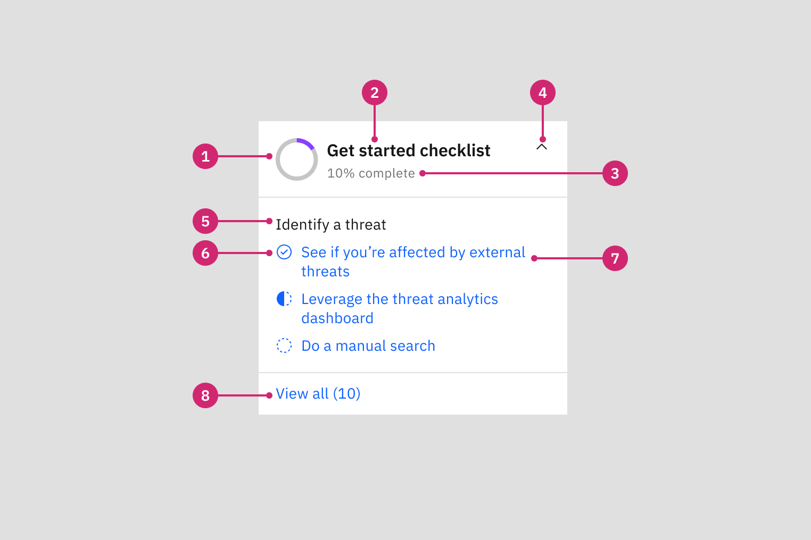
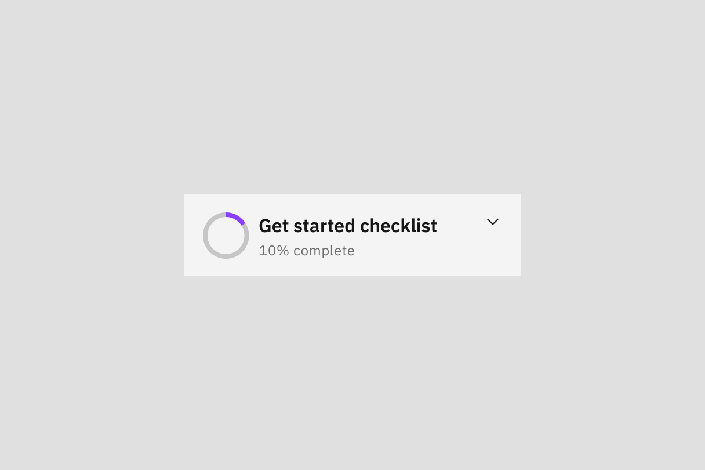
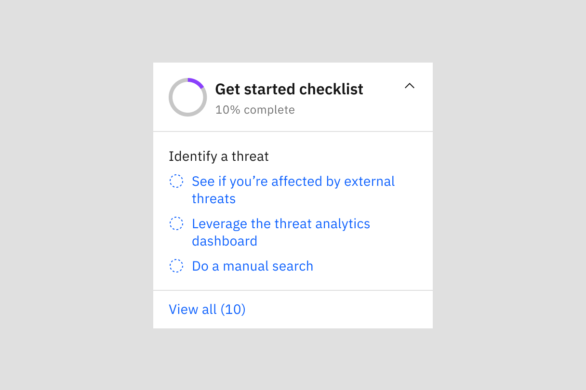

← [Back to Novice to pro components overview](/novice-to-pro/components/overview)

<PageDescription>

The checklist component displays a list of items users should complete (e.g. tasks, walkthroughs, etc.) in order to learn about and/or onboard to a product.

</PageDescription>

<AnchorLinks>
   <AnchorLink>Overview</AnchorLink>
   <AnchorLink>Formatting</AnchorLink>
   <AnchorLink>Content</AnchorLink>
   <AnchorLink>Behaviors</AnchorLink>
   <AnchorLink>Related</AnchorLink>
   <AnchorLink>References</AnchorLink>
</AnchorLinks>

<Row>
<Column colMd={12} colLg={12}>

<Video src="images/checklist-01.mp4" autoPlay loop>
    <track kind="captions" src="images/checklist-01.mp4" />
</Video>

</Column>
</Row>

## Overview

This component exists to facilitate onboarding experiences and provide users with a place to find recommended learning material.

### When to use
- To help users learn and get oriented in a product.
- To show a user how to get the most value out of the product.
- To nudge users to achieve key milestones.
- To help users stay on track of their onboarding tasks.

### When not to use

Do not use the checklist for non-onboarding checklists that are part of everyday use flows.

## Formatting

### Anatomy

<Row>
<Column colMd={8} colLg={8}>

</Column>
</Row>

1. **Progress donut:** The progress donut gives users a visual representation of their progress on the checklist.
2. **Checklist header:** Give your checklist a name that briefly describes the intent or purpose of its tasks.
3. **Checklist progress:** This is where you display the completion progress value represented in the progress donut.
4. **Chevron icon:** The chevron icon indicates if the checklist preview is open or closed.
5. **Section label (optional):**  When multiple tasks fit into a category, use a section label to summarize the tasks. 
6. **Status indicator:** The status indicator icon helps the user know their progress on a task.
7. **Task name:**  The name of the task should be brief and clear and be limited to two lines. 
8. **"View all" link:** The "view all" link takes users to a full view of tasks and indicates the number of tasks displayed in the full list.

### Status Variants

The checklist component leverages Carbon’s [status indicator pattern](https://carbondesignsystem.com/patterns/status-indicator-pattern/#medium-attention) to provide users with a quick way to evaluate the status of a task.

| Status   | Purpose                                                                                                                                       |
| --------- | ---------------------------------------------------------------------------------------------------------------------------------             |
| Not started   | Indicates that a task has not yet been started.                                                                      |
| In progress   | Indicates a task has started but has not been finished. For items where the actual progress is unknown (e.g. WalkMe smart walk-throughs), mark the task as ‘in progress’ if the user clicked the task until it is known that the task has been completed. |
| Completed     | Indicates a successfully completed task.                                                                       |
| Completed - not clickable | Indicates a successfully completed task which cannot be revisited.                                                     |
| Error | Indicates an error associated with the task that needs attention.                                                     |

<Row>
<Column colMd={8} colLg={8}>

</Column>
</Row>

## Content

### Checklist header
The checklist header should describe the intent of the checklist’s tasks. It should not exceed 1 line, if possible. 

### Section label (optional)
The section label should be brief, and direct and summarize the tasks within it. It should not exceed 1-2 lines. A checklist should have section labels if the tasks listed can be grouped into smaller, more digestible sections based on their topics. 

### Task name
The name of the task should be brief, direct and relevant to its content. The task name should not exceed 1-2 lines.

## Behaviors

### States

#### Collapsed
When the checklist is collapsed, only its title and progress are displayed.

<Row>
<Column colMd={8} colLg={8}>

</Column>
</Row>

#### Expanded
The checklist component can be expanded by clicking on the chevron icon. Once expanded, the checklist will display only one section at a time, with a maximum of 4 tasks below the section label. Sections are displayed in the order listed. Once all the tasks under a section are completed, the next section on the checklist is displayed. 

<Row>
<Column colMd={8} colLg={8}>

</Column>
</Row>

## Related
- [Status indicators](https://carbondesignsystem.com/patterns/status-indicator-pattern/)

## References
- Appcues, [User Onboarding Checklists: 6 Examples and How-to Guide](https://www.appcues.com/blog/best-checklist-examples)
- Appcues, [Bite-sized user onboarding: How breaking things down can improve product adoption](https://www.appcues.com/blog/bite-sized-user-onboarding)
