← [Back to Novice to pro components overview](/novice-to-pro/components/overview)

<PageDescription>

Coachmarks are just-in-time messages used to draw a user’s attention and explain new functionality or concepts they might not 
otherwise notice or understand.

</PageDescription>

<AnchorLinks>
   <AnchorLink>Overview</AnchorLink>
   <AnchorLink>Variants</AnchorLink>
   <AnchorLink>Formatting</AnchorLink>
   <AnchorLink>Content</AnchorLink>
   <AnchorLink>Illustration</AnchorLink>
   <AnchorLink>Modifiers</AnchorLink>
   <AnchorLink>Related</AnchorLink>
   <AnchorLink>References</AnchorLink>
</AnchorLinks>

<Row>
<Column colMd={8} colLg={8}>

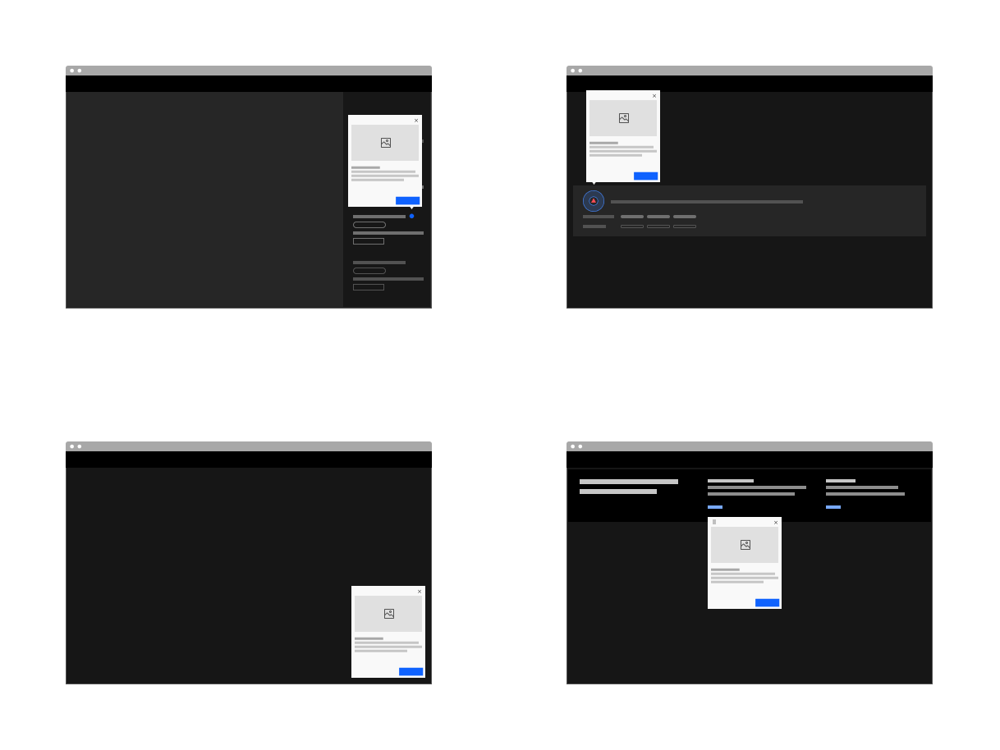

</Column>
</Row>

## Overview

Coachmarks are used to call out specific functionality or concepts within the UI that may not be intuitive but are important for 
the user to gain understanding of the product’s main value and discover new use cases. They can be used for first-time use, as well 
as secondary onboarding and to highlight new functionality.

### When to use
- To guide a users attention to the most important actions to take or concepts to understand in the UI. 
- To explain a workflow or feature in context using bite-size content and visuals. 
- To highlight a new feature in the UI.

### When not to use

Do not use coachmarks for functionality and concepts a user likely already understands or can easily find 
on their own.

## Variants
| Variant   | Purpose                                                                                                                                       |
| --------- | ---------------------------------------------------------------------------------------------------------------------------------             |
| [Tooltip](#tooltip)   | Draws the user’s attention to a specific area within the UI.                                                                      |
| [Fixed](#fixed)       | Calls attention to an action the user should take or a concept they should understand that is not specific to one area of the UI. |
| [Stacked](#stacked)   | Provides additional context to the main coachmark message.                                                                        |
| [Floating](#floating) | Paired with an insight to provide additional context or detailed information.                                                     |

### Tooltip

#### With beacon
To call a user’s attention to a specific area in the UI, use a pulsing beacon. When the user clicks 
the beacon, a tooltip should appear and the selected beacon should change to its active state (see beacon 
states below). After the user dismisses the tooltip, the beacon disappears. Do not show more than 2 beacons 
on a page at the same time (use other novice to pro components to guide users as needed), and do not show a 
new beacon immediately after the user dismisses another to avoid making the user weary of them.

<Row>
<Column colMd={8} colLg={8}>

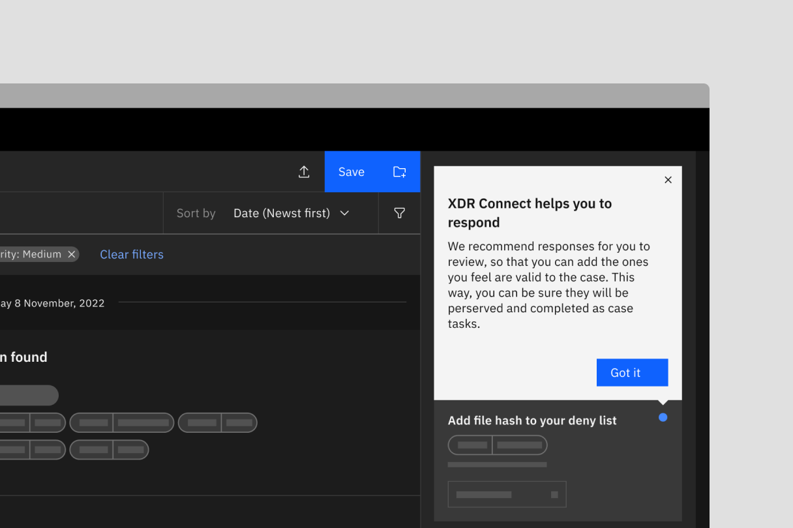

</Column>
</Row>

The beacon variant of the coachmark has two states: animated, which is how it appears before the user 
clicks it; and active (i.e. non-animated), which is how it appears when the tooltip is open. When a user 
dismisses the tooltip, the beacon disappears as well.

<Row>
<Column colMd={8} colLg={8}>

<Video src="images/coachmark-03.mp4" autoPlay loop>
    <track kind="captions" src="images/coachmark-03.mp4" />
</Video>

</Column>
</Row>

<!-- #### With ring beacon
To draw the user’s attention to an important icon or icon button within the UI, use the ring beacon. The 
ring beacon’s appearance should automatically be accompanied by its tooltip so it won’t conflict with any 
of the icon’s interactions (i.e. any hover or click functionality of the icon should work even when the 
beacon is visible). Because it will automatically show the tooltip inside the page, it should only be used 
when the user has requested to see more info (e.g. clicking a “show me” button from a 
[guide banner](/novice-to-pro/components/guide-banner/usage) or [inline tip](/novice-to-pro/components/inline-tip/usage)), 
or on page load when it is the very first thing you want the user to pay attention to when that element is 
in view. When a user dismisses the tooltip, the ring beacon should also disappear. Because these are 
disruptive, use these sparingly. 

<Row>
<Column colMd={8} colLg={8}>

<Video src="images/coachmark-04.mp4" autoPlay loop>
    <track kind="captions" src="images/coachmark-04.mp4" />
</Video>

</Column>
</Row> -->

### Fixed

This variant appears fixed at the bottom right corner of the browser window  with page load. It starts in a minimized 
state to cover as little of the UI as possible (in tests, when shown expanded by default, users immediately closed 
them without reading to get them out of their way). When dismissed, it slides down off the page. Be sure these are used 
very intentionally for key information a user will need to know when viewing the page. Showing these too often will 
likely produce user fatigue with the coachmark.

<Row>
<Column colMd={12} colLg={12}>

<Video src="images/coachmark-05.mp4" autoPlay loop>
    <track kind="captions" src="images/coachmark-05.mp4" />
</Video>

</Column>
</Row>

#### Without illustration
When an illustration isn’t helpful for the fixed coachmark, include an idea icon above the content. This helps frame 
the coachmark as a teaching moment and minimizes the chance it will be interpreted as a system or status notification.

<Row>
<Column colMd={8} colLg={8}>

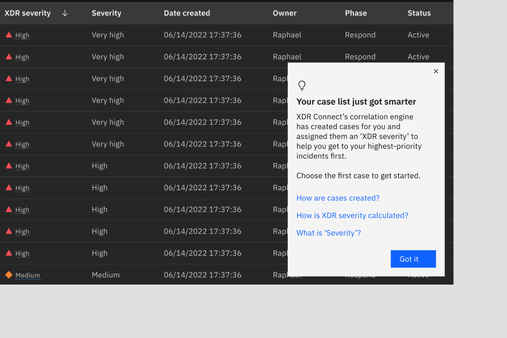

</Column>
</Row>

 

<DoDontRow>

<DoDont caption="Do start the fixed coachmark in a minimized state.">

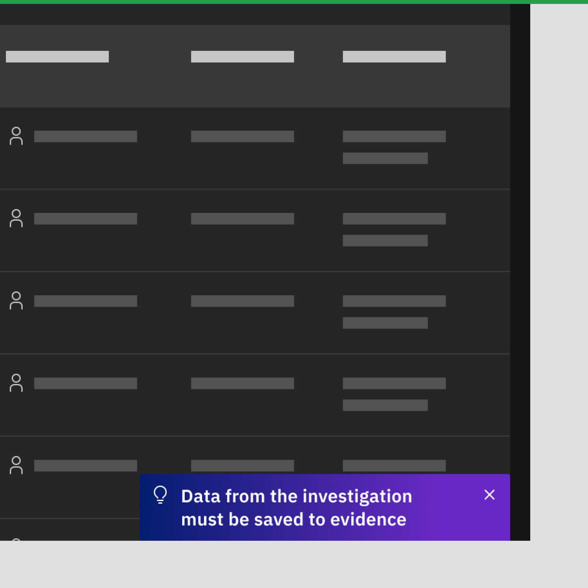

</DoDont>

<DoDont type="dont" caption="Do not show the fixed coachmark expanded to start because it is too disruptive.">

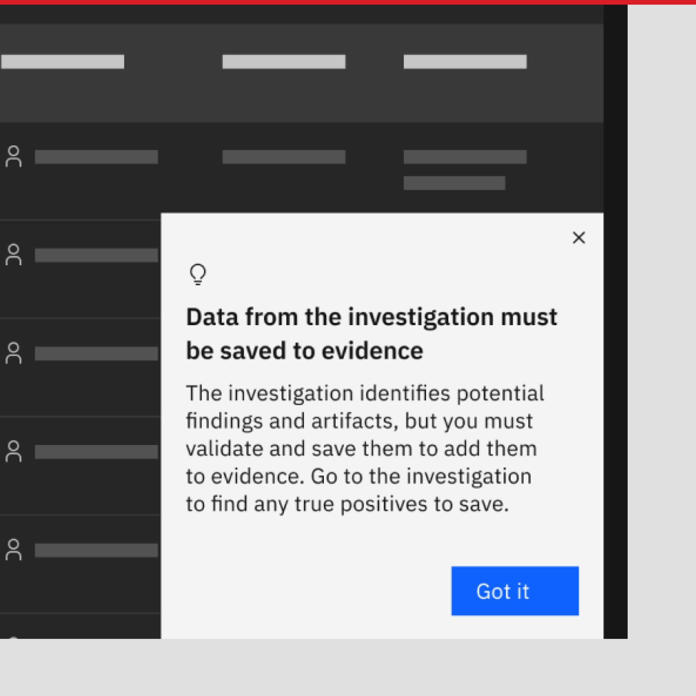

</DoDont>

</DoDontRow>

### Stacked
Sometimes a capability or concept introduced in a fixed coachmark needs supporting information to help a user understand a concept 
more fully. You may want to nudge the user to interact with a capability without bogging them down with more information, but know 
some users will need further clarification before they will move forward. The stacked coachmark can be used in this case. 

Like the fixed coachmark, the main layer of a stacked coachmark starts in a minimized state. It can include ghost buttons to trigger 
another layer to slide up  to stack on top of it, much like the [stacked tearsheet](https://pages.github.ibm.com/cdai-design/pal/components/tearsheet/usage/#navigation). When dismissed, the stacked layer exits by sliding 
back down, revealing the main layer. Up to 3 ghost buttons can be used on the main layer to trigger stacked layers, and only one layer 
can be stacked on the main layer.

<Row>
<Column colMd={12} colLg={12}>

<Video src="images/coachmark-06.1.mp4" autoPlay loop>
    <track kind="captions" src="images/coachmark-06.1.mp4" />
</Video>

</Column>
</Row>

### Floating

Sometimes content in a guide banner or inline tip may warrant further detail or context, but it may not make sense to send 
the user away to documentation. In those cases, you can include a ghost button to trigger the floating coachmark to provide 
the additional detail (see example below). This variant can be dragged around the page since it isn’t specific to a UI 
element and could be blocking part of the page the user wants to see. This variant is also unique in that it can be opened 
multiple times after dismissing since the trigger is a button. 

<Row>
<Column colMd={8} colLg={8}>

</Column>
</Row>

## Formatting

### Anatomy

<Row>
<Column colMd={8} colLg={8}>

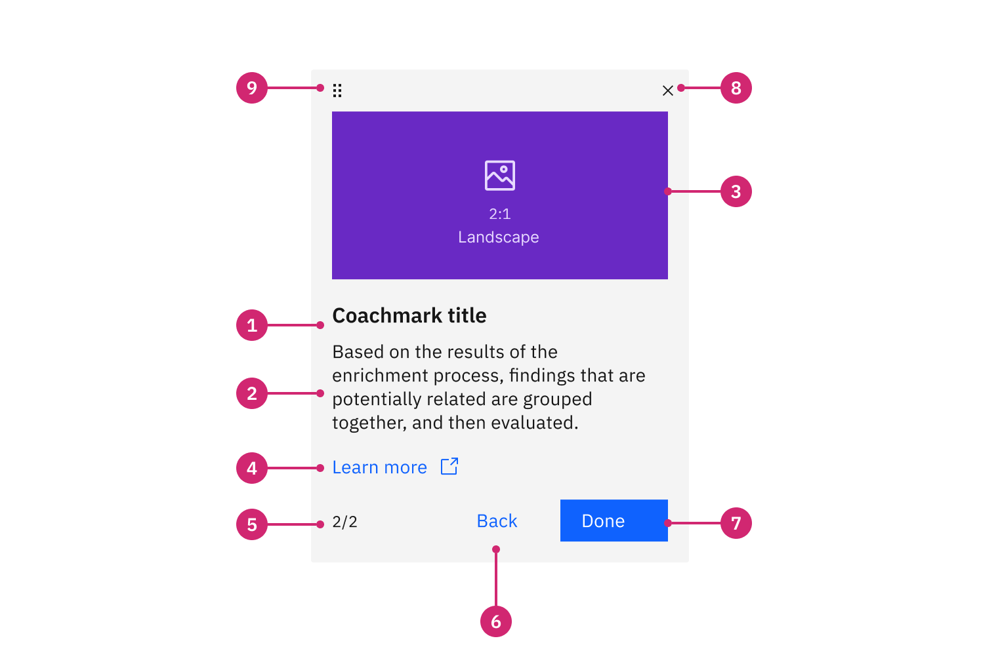

</Column>
</Row>

1. **Title:** The title should briefly summarize the action for the user to take or the main idea of the functionality or 
concept. The user should be able to get the gist without having to read the body content.
2. **Body content:** The body content provides additional context to the title, and should be brief.
3. **Media (optional):** An illustration (animated or static) can be used to provide additional context to the content. 
If an illustration is not included for the fixed variant, use the idea icon above the content.
4. **“Dive deeper” action (optional):** When appropriate, a link can be included to direct the user to further documentation, or 
a ghost button can be added to answer related questions in a stacked coachmark. The linked text should be written as a directing 
statement or action, for example, “Learn more about XDR.”
5. **Pagination (optional):**  If the coachmark requires more content, it should be broken up into smaller, more digestible 
steps, and show the user’s place in the flow with pagination. 
6. **Back button (optional):** If the coachmark uses steps, the back button is needed to navigate to the previous step.
7. **Primary action button:**  The primary button is used to navigate to the next step (if stepped) and/or to dismiss the coachmark. 
These should read ”Done,“ when indicating the completion of a set of slides/steps; or “Got it,” when moving on from a single 
statement, such as as introductory message, or a short line of explanatory text. 
8. **Close icon:** Allows the user to dismiss the coachmark.
9. **Draggable icon (optional):**  Floating coachmarks have a draggable icon to indicate the coachmark can be moved around 
the page.

### Alignment

When used with a beacon, the tooltip coachmark’s caret should be aligned to the beacon much like a standard toggletip or popover 
would be. The beacon and caret tip should be center-aligned with each other to clearly associate the tooltip coachmark and the beacon. Refer to the Carbon [toggletip](https://carbondesignsystem.com/components/toggletip/usage/) and [popover](https://carbondesignsystem.com/components/popover/usage/) guidance for more detail. 

<Row>
<Column colMd={12} colLg={12}>

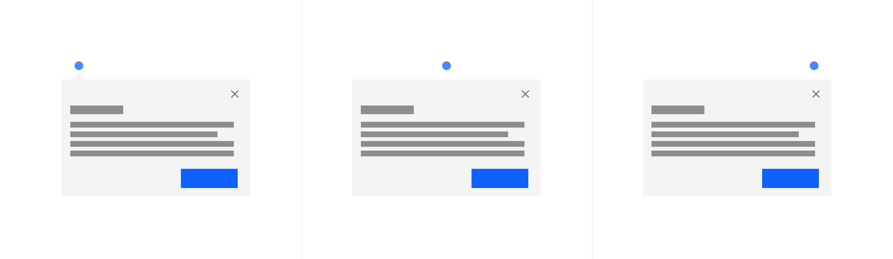

</Column>
</Row>

### Placement

Coachmark placement is determined by the variant. 

**Tooltip coachmarks** should not cover the related parts of the UI that are essential to the user’s tasks. They should not bleed off page or sit behind other content. Because the tooltip (regardless of the variant) will not go away unless the user dismisses it, or refreshes or navigates to another page, the tooltip will remain connected to the element and beacon if the user scrolls the page.

**Fixed coachmarks** will always sit flush with the bottom right corner of the browser window, and will not scroll away when the user scrolls the page. 

**Floating coachmarks** will sit `8px` under the button that triggered it, unless the user drags the coachmark to another position. Closing the floating coachmark will reset its position.

<DoDontRow>

<DoDont caption="Do position the tooltip to show essential information.">

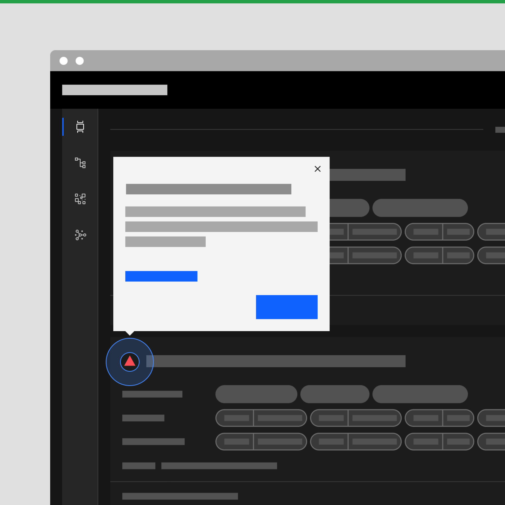

</DoDont>

<DoDont type="dont" caption="Don't position the tooltip to cover the related parts of the UI.">

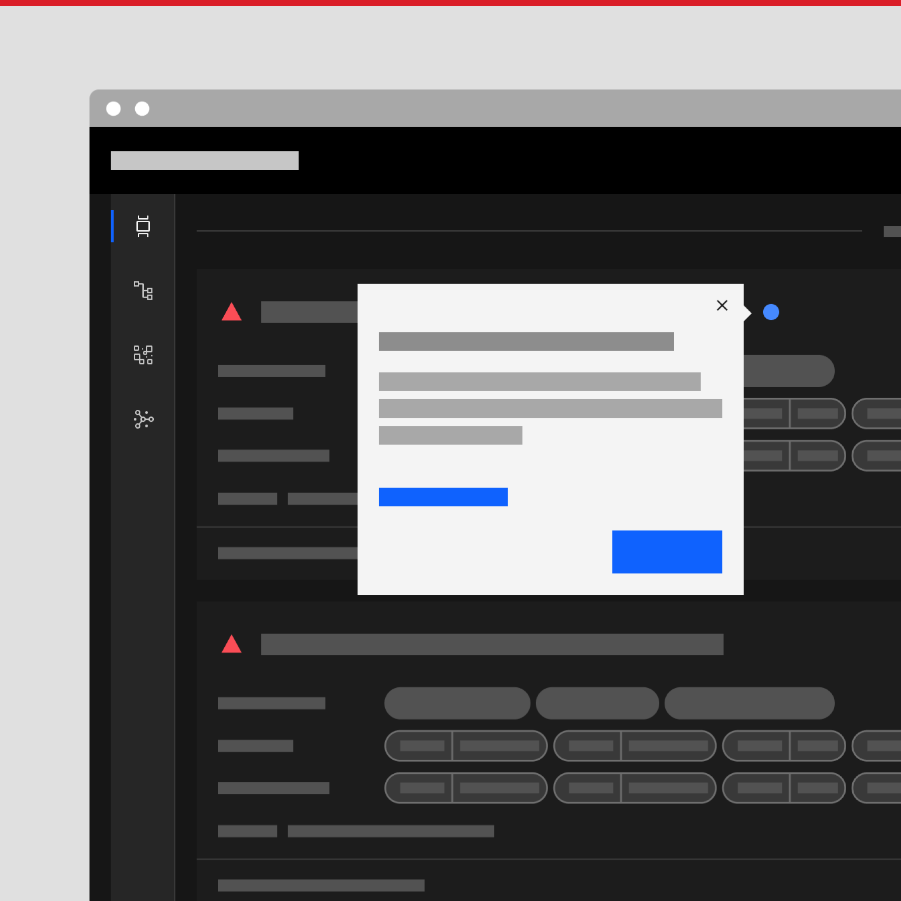

</DoDont>

</DoDontRow>

## Content

### Main elements

#### Heading
The heading should be direct, and be as brief as possible while still being clear, descriptive, and detailed enough to get the main 
idea across. Assume that the user will not read the body content, so try to ensure that the heading will accurately communicate the 
message you want to deliver.  

#### Body content
The body content should contain information that provides additional detail or context to the heading, without repeating the title itself. 

### Additional content information

#### Stepped coachmarks
When a concept is too complex or detailed to fit into a single coachmark, the content can be split into smaller steps (ideally 2-3, 
and up to 5 max.), each step containing a unique heading, illustration (if applicable), and body content. 

### Content best practices
When writing content for your novice to pro experiences, remember the following best practices:
- To keep the content more future-proof, avoid referring to specific places in the UI according to their placement. For example, 
instead of “Go to the Investigation tab,” just write “Go to the Investigation.”
- Be consistent when labelling buttons: instead of using a variety of similar terms for similar actions, choose one and use it 
throughout. For example, rather than switching between “Finish,” “Complete,” and “End,” use “Done”.

## Illustration

Illustrations within a coachmark are used to guide users through a teachable moment. Illustrations should be used to familiarize 
users with what they will experience in the product or to explain complex concepts.

<Row>
<Column colMd={8} colLg={8}>

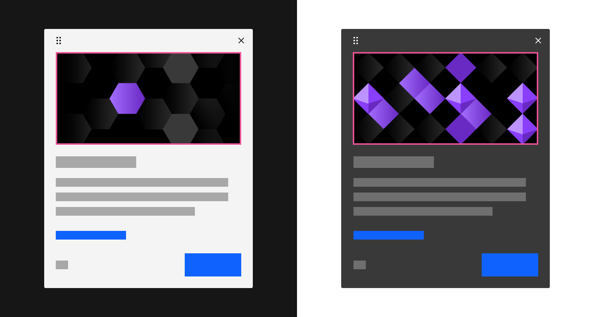

</Column>
</Row>

### Illustration best practices

- A coachmark illustration uses a 2:1 (landscape) aspect ratio.
- It is recommended to create these illustrations in Adobe Illustrator, sized at 1600 x 800 px, using the Coachmark Adobe 
Illustrator template. 
- Identify the intent of this illustration experience: Is this a teachable moment or a moment to highlight the concepts within 
the content?
- Use color to draw the viewer to the visual anchor point of this illustration.
- Refer to [IBM Design Language Illustration Guidance](https://www.ibm.com/design/language/illustration/overview/).
- Animations should be kept brief, as they are meant to complement and not distract from written content. Refer to 
[IBM Design Language Animation Guidance](https://www.ibm.com/design/language/animation/overview/) if incorporating motion to these 
illustrations. 
- [Lottie](https://airbnb.design/lottie/) powers the animated SVGs, so it is recommended to use After Effects to create the vector 
animation and export using the [Bodymovin](https://aescripts.com/bodymovin/) plugin. 
- [Lottiefiles.com](https://lottiefiles.com/) is a good resource to check the integrity of the animation post-export.

### Illustration references

<Row className="resource-card">
  <Column colMd={4} colLg={4} noGutterSm>
    <CardGroup>
        <MiniCard title="Coachmark illustration template" href="https://ibm.box.com/s/076atkopskqk15nr1shdy3c5zftfoqo4" />
    </CardGroup>
  </Column>
</Row>

## Modifiers

### Themes

Coachmarks use inverse theming so use the light theme when using the coachmark component on a dark theme and the dark theme against a light-themed background. 

<Row>
<Column colMd={8} colLg={8}>

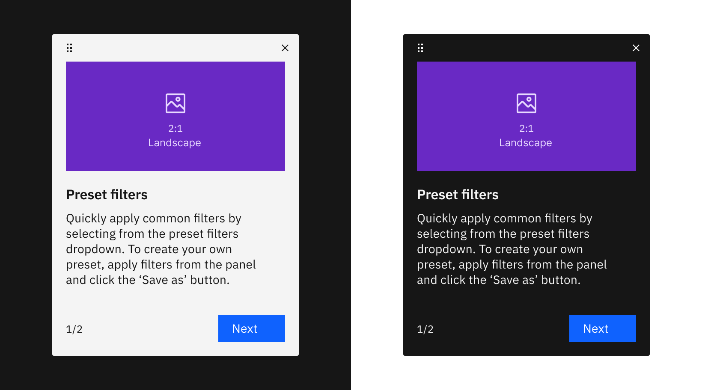

</Column>
</Row>

## Related

– [Toggletip](https://carbondesignsystem.com/components/toggletip/usage/)
- [Popover](https://carbondesignsystem.com/components/popover/usage/)

## References

– Adobe [Spectrum](https://spectrum.adobe.com/page/coach-mark/#Anatomy), Coach mark
