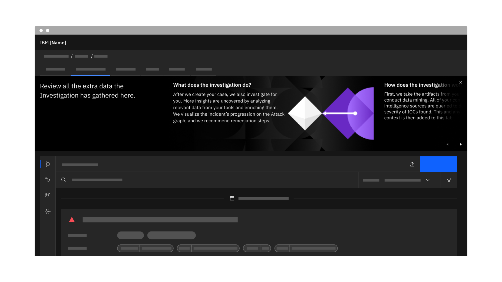
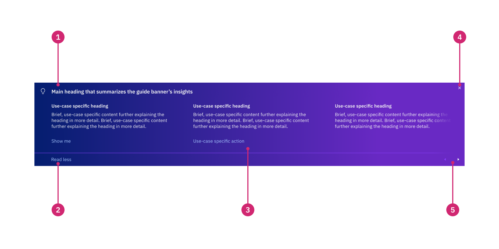
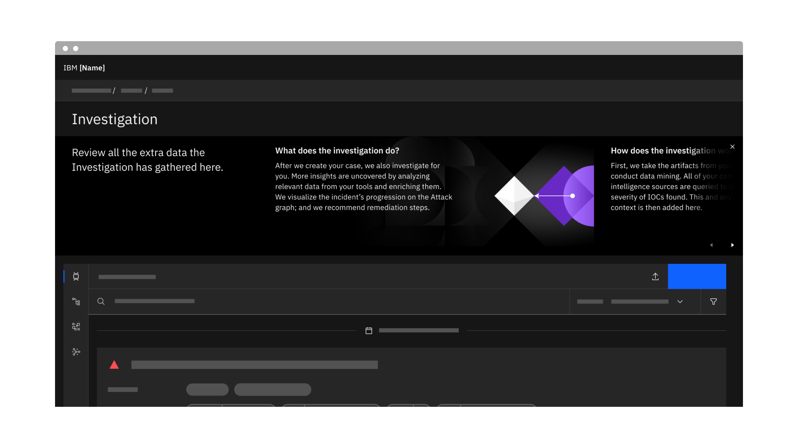
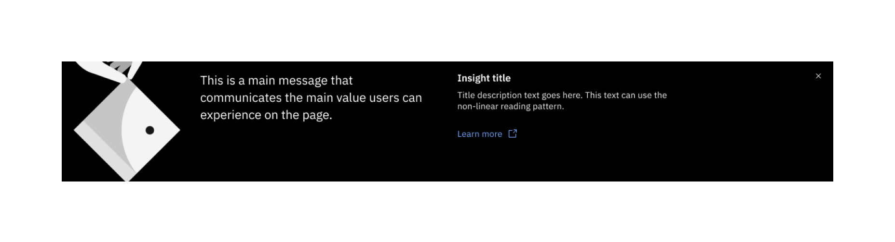
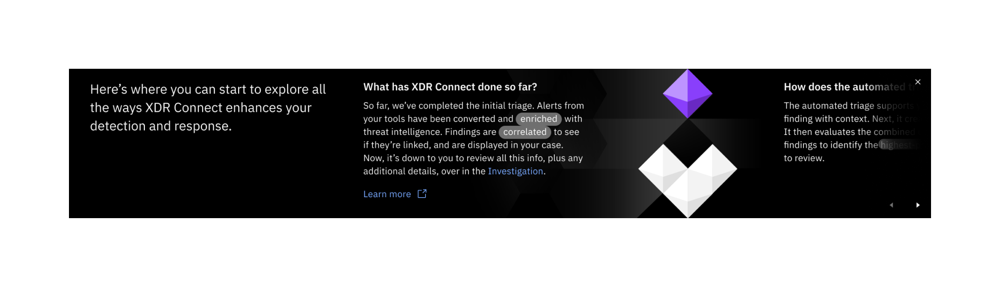
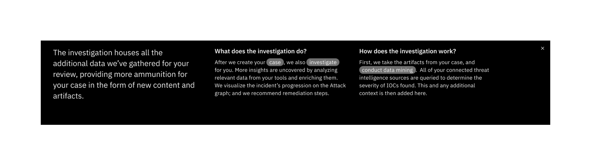

← [Back to Novice to pro components overview](/novice-to-pro/components/overview)

<PageDescription>

Guide banners are used to give a bird’s eye view of information users need to know before diving into the page’s workflow.

</PageDescription>

<AnchorLinks>
   <AnchorLink>Overview</AnchorLink>
   <AnchorLink>Formatting</AnchorLink>
   <AnchorLink>Types</AnchorLink>
   <AnchorLink>Content</AnchorLink>
   <AnchorLink>Behavior</AnchorLink>
</AnchorLinks>

<Row>
<Column colMd={12} colLg={12}>

</Column>
</Row>

## Overview

Guide banners sit at the top of a page or larger section of content to orient users on their first time accessing a page or 
after significant page updates and to introduce related foundational concepts. 

### When to use
The guide banner should be used to explain key concepts or functionality that is not otherwise intuitive on the page during 
first-time use, or after significant page-level updates. Because banners are often disregarded when users are in the flow of 
getting a job done, they should be used as supportive content for when the user is ready to engage with it. 

### When not to use
- Do not use the guide banner to explain what is already obvious, easily discoverable, or nonessential. 
- Do not use more than one guide banner on a page
- Do not use the guide banner on the homepage or in smaller components like tearsheets. Instead, use the homepage welcome banner or [inline tip](/novice-to-pro/components/inline-tip/usage). 

## Formatting

### Anatomy

<Row>
<Column colMd={12} colLg={12}>

</Column>
</Row>

1. **Main heading:** The main heading is limited to one line and is used to highlight the main idea and summarize any guide banner insights. 
2. **Expand/collapse button:** A ghost button to expand and collapse the guide banner. The collapsed banner shows only the main heading.
3. **Insight:** The insight consists of a heading, body copy and an optional CTA launch to dive deeper (e.g. "Learn more" link to 
documentation, "Show me" ghost button to highlight a specific area of the page, or "See how it works" ghost button to launch a 
floating [coachmark](/novice-to-pro/components/coachmark/usage)). The body copy can use the [non-linear reading](/novice-to-pro/components/nonlinear-reading/usage) component to provide additional context progressively. 
  Up to 4 insights can be included in the guide banner.
4. **Close button:** The close button to dismiss the guide banner is required and should be placed in the top right corner. Once 
dismissed, it will not reappear on subsequent sessions.
5. **Carousel navigation buttons (optional):**  When there is overflow content in the guide banner, include navigation arrows to allow 
the user to see the remaining content as a carousel. Whenever the guide banner is a carousel, include a scroll gradient.

### Alignment and placement

The guide banner spans the full width of the screen, aligning to the Carbon 2x Grid for the min and max sizes. The guide banner is 
responsive to the screen width and to the height of the content within it.

The guide banner lives between the page header (or tab group) and page content, or at the top of a main section on the page. When 
the page is scrolled, the guide banner will scroll with the content (i.e. it does not stick to the top of the page or section).  

<Row>
<Column colMd={12} colLg={12}>

</Column>
</Row>

## Types

### Carousel

Guide banners can have up to 4 insights. When the insights overflow, the guide banner should act as a carousel and include navigation 
controls in the bottom right corner to allow the content to scroll forward and backward. 

<Row>
<Column colMd={12} colLg={12}>

</Column>
</Row>

### With a primary action

When needed, a tertiary button can be included below the first insight to call the user’s attention to take a specific action. Primary 
buttons are not used in guide banners to avoid conflicting with a primary button that may be on the page. 

<Row>
<Column colMd={12} colLg={12}>

</Column>
</Row>

## Content

### Main elements

#### Main message
The guide banner’s main message succinctly summarizes the content presented in its insights. The information given should be 
important and relevant to what’s on the page.

#### Insights
The insight heading should be brief, direct and relevant to its content. The heading should not exceed 1-2 lines. The body copy should be succinct, and give practical guidance or clearly explain a concept. It 
should link seamlessly to the heading, and should not exceed 3-4 lines when collapsed (e.g. if using [non-linear 
reading](/novice-to-pro/components/nonlinear-reading/usage)). However, when [non-linear reading](/novice-to-pro/components/nonlinear-reading/usage) is activated, the body text can expand as much as needed. 

#### Call to action or dive deeper
If needed, a primary action related to the first insight can be included as a tertiary button. If documentation is available to further explain an insight in more detail, include a “Learn more” link with 
launch icon to open the docs page in a new tab. Alternatively, you can include a ghost button with a descriptive label (e.g. “See how it works”) to launch a [floating coachmark](/novice-to-pro/components/coachmark/usage#floating) 
with a few steps to explain the concept further. If the insight is related to a specific place in the page, you can include a “Show me” ghost button to launch a [tooltip coachmark](/novice-to-pro/components/coachmark/usage#tooltip) 
in that place or launch a WalkMe tour. 

### Content best practice
When writing content for guide banner, to keep the content more future-proof, avoid referring to specific places in the UI according to their placement. For example, 
instead of “Go to the Investigation tab,” just write “Go to the Investigation.” 

## Behavior

### Collapse and expand

The guide banner can expand and collapse and can start in either state based on the use case. Sometimes a guide banner may be needed to orient the user when there is 
also more important content to view first on the page. In this case, the guide banner should start in the collapsed state with a direct and brief message that gives 
context to the information they would be able to read in the expanded state. In either state, the guide banner can be dismissed.

<Row>
<Column colMd={12} colLg={12}>

</Column>
</Row>