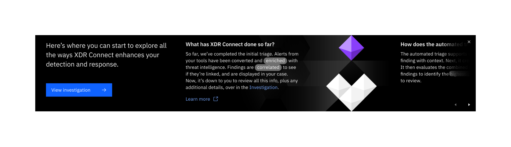
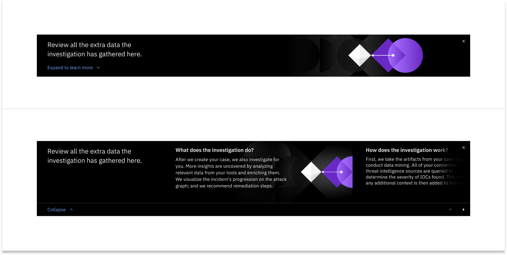

← [Back to Novice to pro components overview](/novice-to-pro/components/overview)

<PageDescription>

Guide banners are used to give a bird’s eye view of information users need to know before diving into the page’s workflow.

</PageDescription>

<AnchorLinks>
   <AnchorLink>Overview</AnchorLink>
   <AnchorLink>Formatting</AnchorLink>
   <AnchorLink>Types</AnchorLink>
   <AnchorLink>Content</AnchorLink>
   <AnchorLink>Illustration</AnchorLink>
</AnchorLinks>

<Row>
<Column colMd={12} colLg={12}>

</Column>
</Row>

## Overview

Guide banners sit at the top of a page or page-level tab to orient users on their first time accessing a page or after significant 
page updates and to introduce foundational concepts related to its content.

### When to use
The guide banner should be used to explain key concepts or functionality that is not otherwise intuitive on the page during 
first-time use, or after significant page-level updates.

### When not to use
Do not use the guide banner to explain what is already obvious, easily discoverable, or nonessential. Do not use the guide 
banner on the homepage or in smaller components like tearsheets. Instead, use the homepage welcome banner or inline tip. 

## Formatting

### Anatomy

The guide banner is comprised of 5 zones, allowing the flexibility to include (or exclude) zones depending on the context and 
needs of the content.

<Row>
<Column colMd={12} colLg={12}>

</Column>
</Row>

1. **Main message:** The main message is used to highlight the main idea and value provided in the page. It should be 4 lines or 
less (approx. 150 characters). When needed, a primary button can be included below the message to call the user’s attention to take 
a specific action if it is not obvious on the page. 
2. **Insight:** The insight consists of a title, body copy and an optional CTA launch to dive deeper (e.g. "Learn more" link to 
documentation, "Show me" ghost button to highlight a specific area of the page, or "See how it works" ghost button to launch a 
floating [coachmark](/novice-to-pro/components/coachmark/usage)). The body copy can use the [non-linear reading](/novice-to-pro/components/nonlinear-reading/usage) component to provide additional context progressively. 
  Up to 4 insights can be included in the guide banner.
3. **Illustration (optional):** An illustration can accompany the main message or 1 insight.
4. **Close button:** The close button to dismiss the guide banner is required and should be placed in the top right corner. Once 
dismissed, it will not reappear on subsequent sessions.
5. **Carousel navigation buttons (optional):**  When there is overflow content in the guide banner, include navigation arrows to 
allow the user to see the remaining content as a carousel. Clicking either button scrolls the content progressively (1 at a time). 
Whenever the guide banner is a carousel, include a scroll gradient.

### Alignment and placement

The guide banner spans the full width of the screen, aligning to the Carbon 2x Grid for the min and max sizes. The guide banner is 
responsive to the screen width and to the height of the content within it.

The guide banner lives between the page header (or tab group) and page content. When the page is scrolled, the guide banner will 
scroll with the content (i.e. it does not stick to the top of the page). 

<Row>
<Column colMd={12} colLg={12}>

</Column>
</Row>

## Types

### With illustration

Illustrations are recommended when possible because they help to highlight the value and communicate the idea at a glance. There 
are 2 options for placement: Next to the main message or the insight. Only use 1 illustration per guide banner. 

#### Next to main message
An illustration that complements the main message can be included to the left of the message. 

<Row>
<Column colMd={12} colLg={12}>

</Column>
</Row>

#### Next to insight
The first insight in a guide banner can have an associated illustration that sits to the right of the content. The content will 
partially overlap the illustration. 

<Row>
<Column colMd={12} colLg={12}>

</Column>
</Row>

### Without illustration

When an illustration is not helpful or not possible to include, all content aligns left.

<Row>
<Column colMd={12} colLg={12}>

</Column>
</Row>

### Carousel

Guide banners can have up to 4 insights. When using more than 1 insight and an illustration, or more than 2 insights without an 
illustration, the guide banner should act as a carousel and include navigation controls in the bottom right corner. 

When the user clicks the "next" button, the content scrolls to the left. 

<Row>
<Column colMd={12} colLg={12}>

</Column>
</Row>

### With a primary action

When needed, a primary button can be included below the message to call the user’s attention to take a specific action if it is 
not obvious on the page, or to reinforce the primary action.

<Row>
<Column colMd={12} colLg={12}>

</Column>
</Row>

### Collapsible

Sometimes a guide banner may be needed to orient the user when there is also more important content to view first inside the page. 
In this case, the guide banner should start in the collapsed state with a value-focused message that both orients the user to the 
page and gives context to the information they would be able to read in the expanded state. The collapsed guide banner can be 
expanded or dismissed. When expanded, the guide banner can be collapsed or dismissed.

<Row>
<Column colMd={12} colLg={12}>

</Column>
</Row>

## Content

### Main elements

#### Main message
The guide banner explains new concepts, or non-obvious key value workflows. The information given should be important and relevant 
to what’s on the page, so that it will help users understand what the page is about.

#### Insights
The insight title should be brief, relevant to its content, and grab the user’s attention—for example, it can be phrased as a 
question. The title should not exceed 1-2 lines. The body copy should be succinct, and give practically applicable guidance. It 
should link seamlessly to the title, and should not exceed 3-4 lines when collapsed (e.g. if using short variant or [non-linear 
reading](/novice-to-pro/components/nonlinear-reading/usage)). However, when [non-linear reading](/novice-to-pro/components/nonlinear-reading/usage) is activated, the body text can expand as much as needed. 

#### Call to action or dive deeper
If needed, a primary action from the main message or the option to dive deeper from an insight can be included. If documentation is 
available to further explain an insight in more detail, include a “Learn more” link with launch icon to open the docs page in a 
new tab. Alternatively, if the content is either not in documentation or is better explained in a brief stepped [coachmark](/novice-to-pro/components/coachmark/usage), you can include a ghost button with a descriptive label (e.g. “See how it works”). If the insight is related to a specific place in the page, 
you can include a “Show me” ghost button to launch a tooltip [coachmark](/novice-to-pro/components/coachmark/usage) in that place. 

### Content best practice
When writing content for guide banner, to keep the content more future-proof, avoid referring to specific places in the UI according to their placement. For example, 
instead of “Go to the Investigation tab,” just write “Go to the Investigation.” 

## Illustration

Illustrations within the guide banner function to visualize the value. They are paired with relating content to draw attention to 
key subjects of importance.

<Row>
<Column colMd={12} colLg={12}>

</Column>
</Row>

### Illustration best practices

- The ratio for this illustration is 2:1 (landscape). 
- It is recommended to create these illustrations in Adobe Illustrator, sized at 1600 x 800 px, using the Banner Adobe 
Illustrator template.
- Identify the intent of this illustration experience: Is this a teachable moment or a moment to highlight the concepts within 
the content?
- A banner illustration should have two sides, a focus area — where the focal point of the illustration should be placed, and a 
copy zone — the section of the illustration that should be dark so that banner copy can be placed over it. The copy zone side of 
the illustration should be low contrast, passing 4:5:1 with the text, ensuring accessibility.
- To accommodate for instances when a banner may increase in height when using the [non-linear reading](/novice-to-pro/components/nonlinear-reading/usage) component, create banner 
illustrations with no visible hard edges on the bottom of the illustration.
- If the illustration represents content that sits to the left, the focus area is on the right.
- If the illustration represents content that sits to the right, the focus area is on the left. 
- Use limited colors to draw the viewer to the visual anchor point of the illustration.
- In order to not detract from the written content, **do not** incorporate motion within guide banner illustrations. 
- Refer to [IBM Design Language Illustration Guidance](https://www.ibm.com/design/language/illustration/overview/).

### Illustration resources

<Row className="resource-card">
  <Column colMd={4} colLg={4} noGutterSm>
    <CardGroup>
        <MiniCard title="Guide banner illustration template" href="https://ibm.box.com/s/5g8afutzx6rhz1wvw6swasq8emjlkq15" />
    </CardGroup>
  </Column>
</Row>
