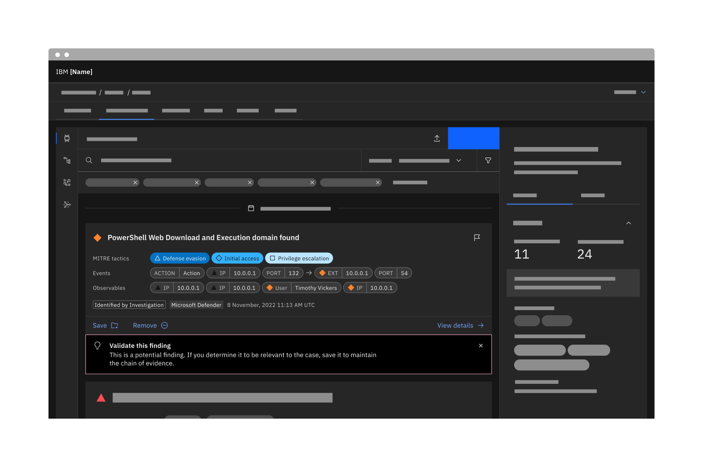
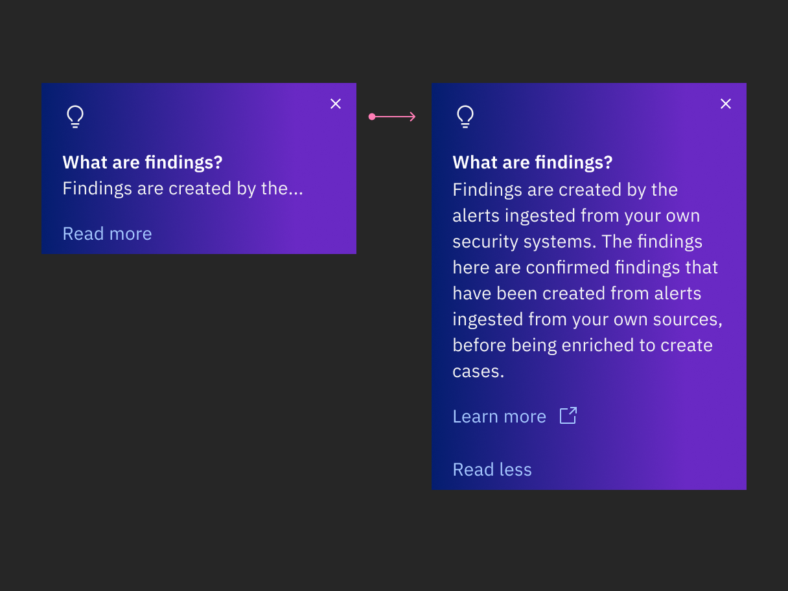
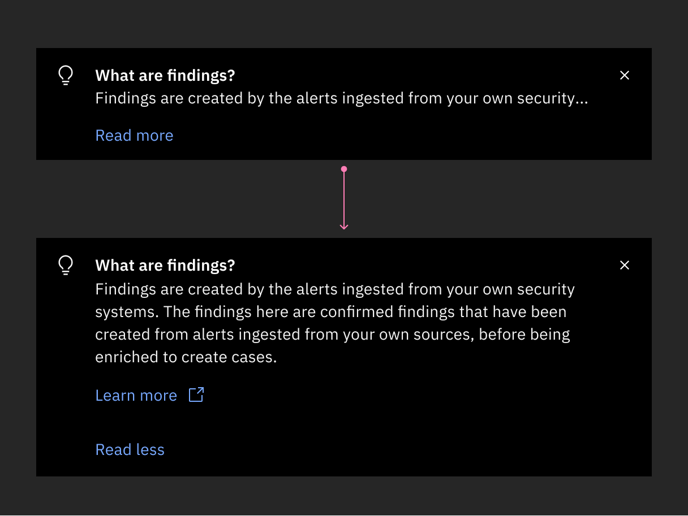
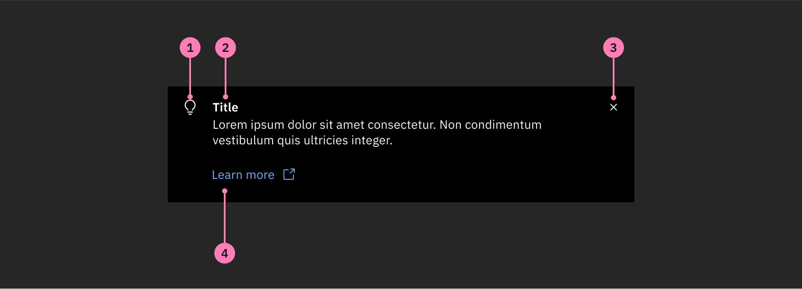
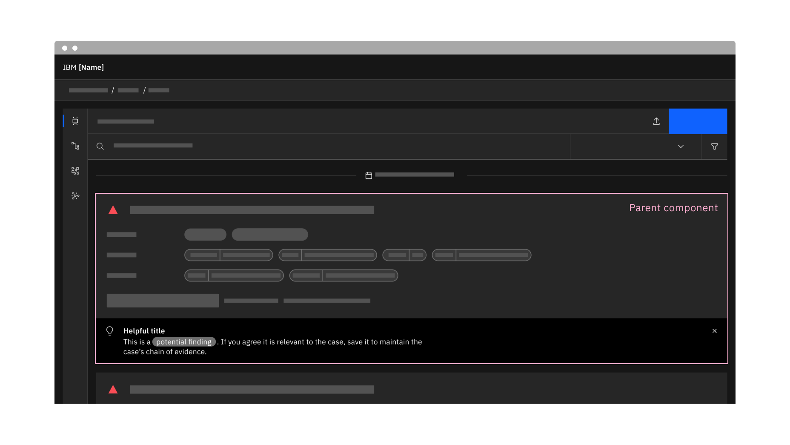
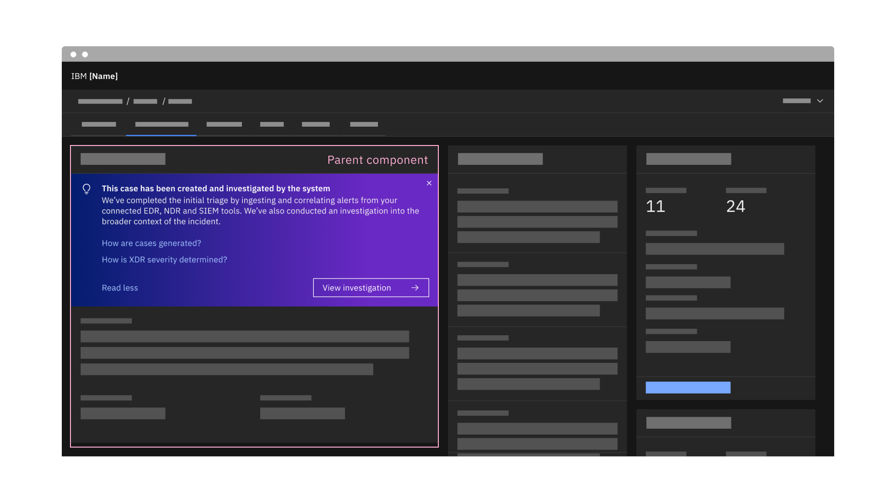
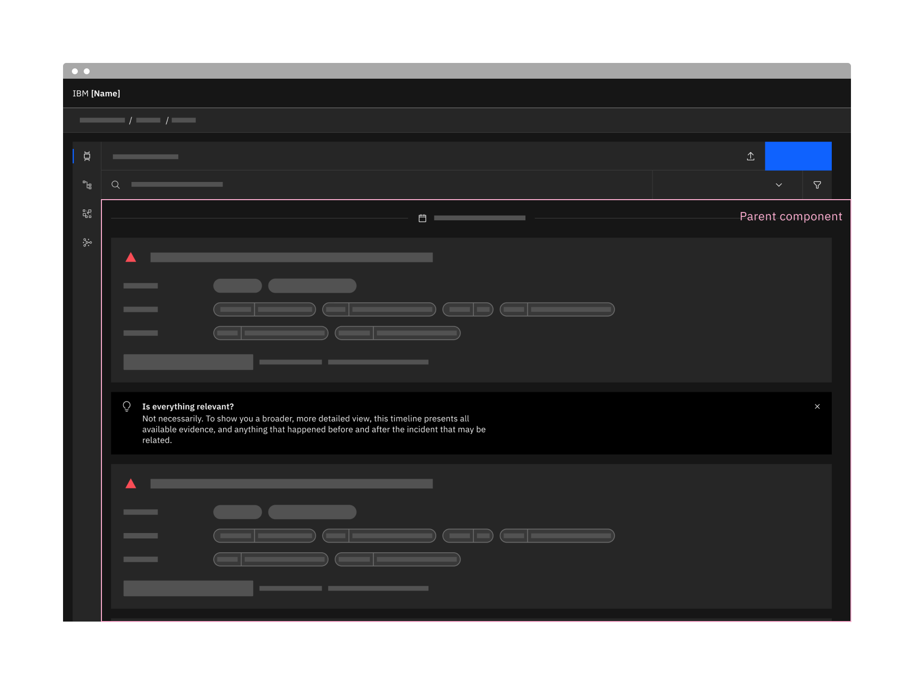
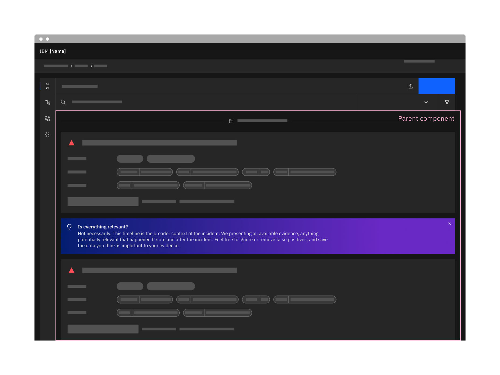

← [Back to Novice to pro components overview](/novice-to-pro/components/overview)

<PageDescription>

Inline tips are messages embedded within other components that provide an ambient way to deliver learning content without 
distracting the user from their flow. 

</PageDescription>

<AnchorLinks>
   <AnchorLink>Overview</AnchorLink>
   <AnchorLink>Example</AnchorLink>
   <AnchorLink>Formatting</AnchorLink>
   <AnchorLink>Content</AnchorLink>
</AnchorLinks>

## Overview

This component exists to facilitate just-in-time focused learning, in-context of the relevant component or when the user is in a 
focused state.

<Row>
<Column colMd={12} colLg={12}>

</Column>
</Row>

### When to use

- When context or guidance relating to a specific UI element is needed but not worth distracting the user from their flow.
- This component can be used for all stages of onboarding and learning.

### When not to use

- Do not use if there is already another inline tip in the viewport.
- Do not user if it will interfere with or distract from key content on the screen.
- When the information should be part of everyday explainability, use an info icon and [toggletip](https://carbondesignsystem.com/components/toggletip/usage/) instead.
- If you want to facilitate progressive, stepped content, consider using a [stepped coachmark](/novice-to-pro/components/coachmark/usage#stacked) instead.
- If the content is providing wider page orientation to the user, use the [guide banner](/novice-to-pro/components/guide-banner/usage) instead.

### Variants

#### Narrow

When horizontal space is narrow, align the idea icon to the top of the content.

<Row>
<Column colMd={8} colLg={8}>

</Column>
</Row>

#### Short

When vertical space needs to be preserved, include a "read more" button to allow the user to expand the content if they want to 
read the full tip. 

<Row>
<Column colMd={8} colLg={8}>

</Column>
</Row>

#### With abstract UI illustration

When the goal is to teach a simple action on the page, animated abstract UI illustrations showing how to perform the action can be 
very useful in inline tips. 

<Row>
<Column colMd={8} colLg={8}>

</Column>
</Row>

## Formatting

### Anatomy

<Row>
<Column colMd={12} colLg={12}>

</Column>
</Row>

1. **Idea icon:** This icon sits left of the content and helps to distinguish the component as a learning tip.
2. **Insight:** This is where you add your learning content. Avoid generic headings and aim to pack as much value as possible into 
a few lines.
3. **Close button:**  The close button dismisses the component.
4. **Ghost button or link (optional):**  You can add a ghost button or link to dive deeper, or a tertiary button to lead into a 
related action. Do not use primary or secondary buttons as those would likely conflict with other main actions on the page.

### Alignment and placement

Inline tips live inside a parent component.  They take on the width properties of the parent. They should flow with elements 
inside of the parent e.g. at the top, bottom or sides.

<Row>
<Column colMd={12} colLg={12}>

</Column>
</Row>

<Row>
<Column colMd={12} colLg={12}>

</Column>
</Row>

<Row>
<Column colMd={12} colLg={12}>

</Column>
</Row>

## Content

### Main elements

#### Insight

The insight heading should be brief, direct and relevant to its content. The heading should not exceed 1-2 lines. 

The body copy should be succinct, give practically applicable guidance, and link seamlessly to the title. 