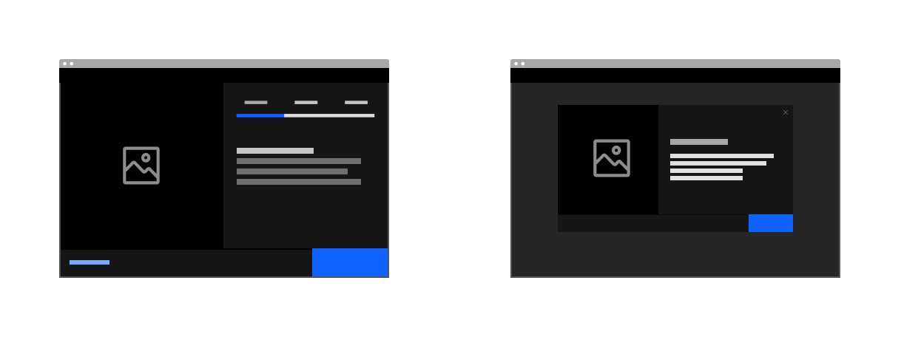
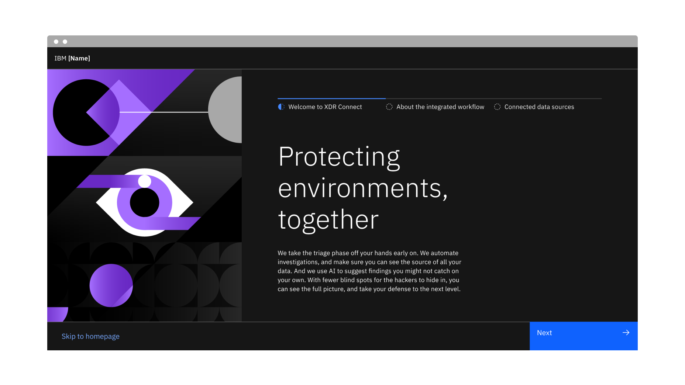
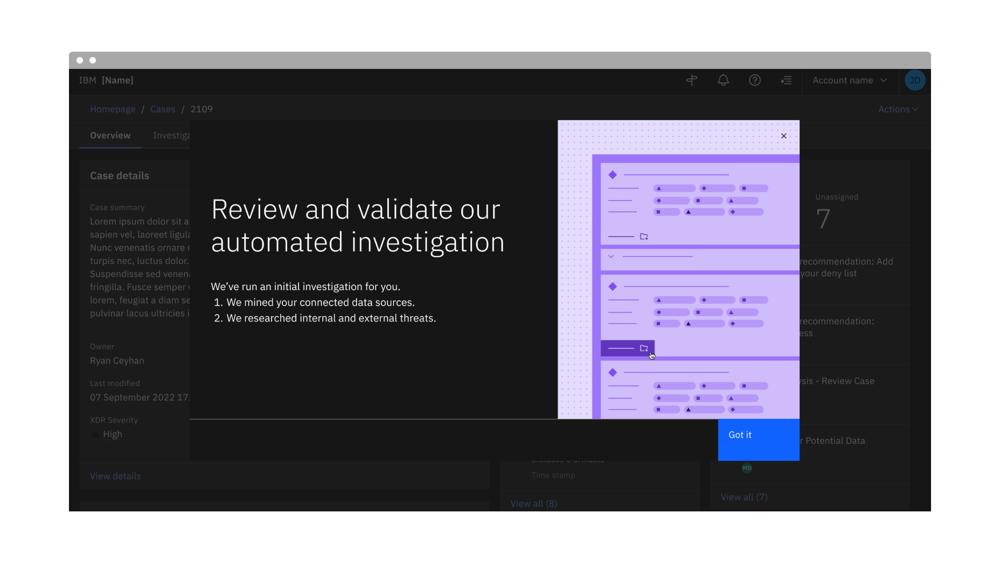
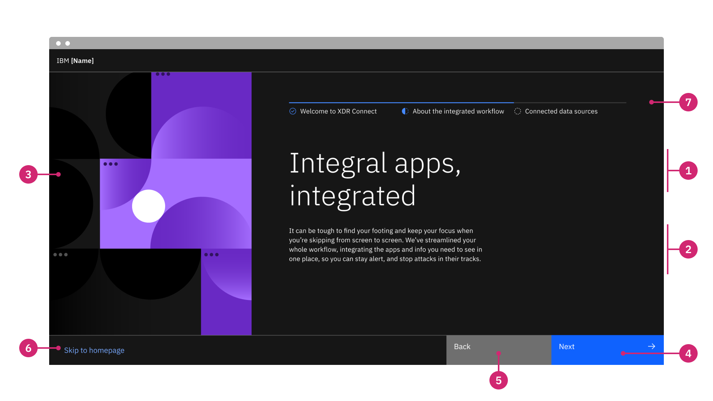
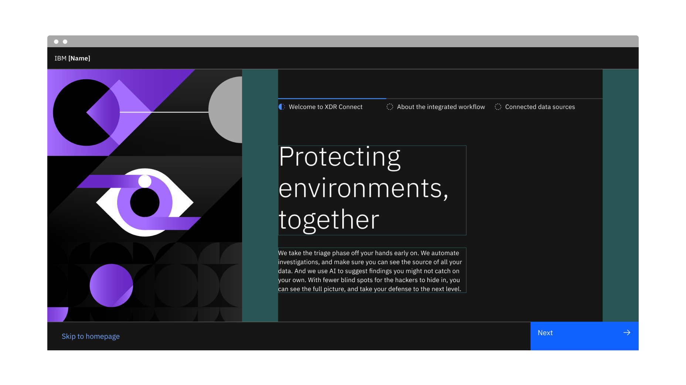
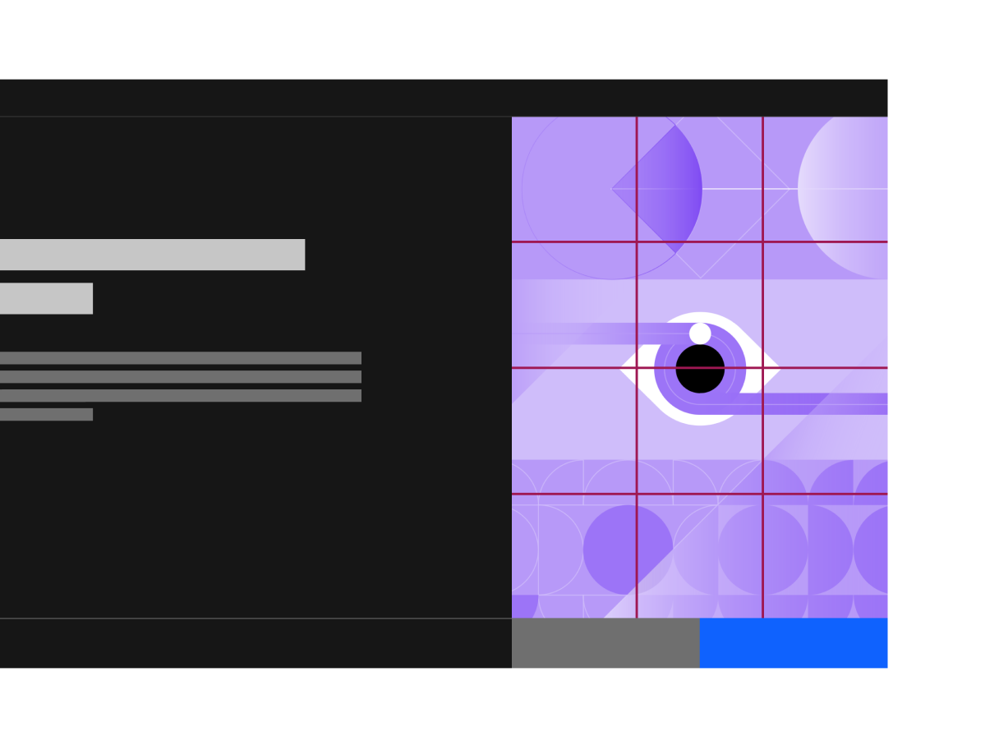

← [Back to Novice to pro components overview](/novice-to-pro/components/overview)

<PageDescription>

The interstitial screen introduces users to a new experience and sets their expectations for the key value they will encounter. 

</PageDescription>

<AnchorLinks>
   <AnchorLink>Overview</AnchorLink>
   <AnchorLink>Example</AnchorLink>
   <AnchorLink>Variants</AnchorLink>
   <AnchorLink>Formatting</AnchorLink>
   <AnchorLink>Content</AnchorLink>
   <AnchorLink>Illustration</AnchorLink>
   <AnchorLink>Behaviors</AnchorLink>
   <AnchorLink>Related</AnchorLink>
</AnchorLinks>

## Overview

Interstitial screens can be a full page or an overlay, and are shown on the first time a user accesses a new experience 
(e.g. upon first login or first time opening a page where a newly purchased capability is presented).

<Row>
<Column colMd={8} colLg={8}>

</Column>
</Row>

### When to use

- To welcome new users to an app and set their expectations around the value the app provides.
- To introduce a newly purchased add-on. 
- To allow the user to tailor their experience to their interests/preferences.

### When not to use

- Do not use to inform users of a minor update to the app/experience.
- Do not use to highlight a feature that has already been available in the app.

## Example

<Row>
<Column colMd={12} colLg={12}>

<Video src="images/interstitial-02.mp4" poster="images/interstitial-02.png" autoPlay loop>
    <track kind="captions" src="images/interstitial-02.mp4" />
</Video>

</Column>
</Row>

## Variants

| Variant                 | Purpose                                                                                                                           |
| ---------               | --------------------------------------------------------------------------------------------------------------------------------- |
| [Full page](#full-page) | Introduces users to new applications or welcomes users to new application add-ons. They can be single or multi-stepped.                                                                      |
| [Overlay](#overlay)     | Calls attention to an action the user should take or a concept they should understand that is not specific to one area of the UI. |

### Full page

The full page interstitial should appear the first time a user has logged into an application, before they land on the product’s 
homepage. It can have up to 3 steps to outline the key value of the product. When stepped, always allow the user to skip the interstitial flow entirely with a "Skip to homepage" button.

<Row>
<Column colMd={12} colLg={12}>

</Column>
</Row>

### Overlay

The overlay version of the interstitial should behave much like a modal upon the first time accessing a page where a newly 
purchased capability is presented. A brief animated illustration to accompany the message should be used if possible and should 
play one time. Users can choose to continue to the page by clicking the “Get started” button or the close button. The overlay 
interstitial can also use a stepped design if the content needs to be broken into distinct value statements.

<Row>
<Column colMd={12} colLg={12}>

</Column>
</Row>

## Formatting

### Anatomy

<Row>
<Column colMd={12} colLg={12}>

</Column>
</Row>

1. **Title:** The title highlights the key value. 
2. **Body content:** The body content should provide additional context to the title and should give a user a more comprehensive 
idea of the value the application/experience is going to be providing to their overall workflow.
3. **Media:** An animated illustration should be used in order to provide additional context to the content.
4. **Primary button:** The primary button is used to navigate to the next step (if stepped) and/or to continue to the app/page.
5. **Back button:** If the interstitial uses steps, the back button is needed to navigate to the previous step.
6. **Skip button:** If the interstitial uses steps, the skip button is used to navigate directly to the homepage (if full page) or 
page (if overlay).
7. **Progress indicator (optional):** If the interstitial uses steps, use the progress indicator to show the user where they are 
in the flow.

### Alignment

The animated illustration should always sit at the left side of of the text. The footer (which contains the buttons) should expand 
the full width of the page or overlay.

For interstitials with steps, the progress indicator should align with the text below it.

<Row>
<Column colMd={12} colLg={12}>

</Column>
</Row>

## Content

### Main elements

#### Title
The interstitial screen title should be value oriented and as brief as possible, while still being clear and descriptive enough 
to get the main idea across. When writing the title, you should assume that the user will not read the body content, so try to 
ensure that the title will accurately communicate the message you want to deliver. 

#### Body content
The body content should contain information that provides additional detail or context to the title, without repeating the title 
itself. It should aim to build the user’s anticipation and pique their interest about what they will be able to do in the product.

## Illustration

Illustrations within interstitial screens visually enhance the content of the page and should help highlight the value. They serve 
as the initial introduction to an experience a user is accessing for the first time. 

<Row>
<Column colMd={8} colLg={8}>

</Column>
</Row>

### Illustration best practices

- The ratio for this illustration is 4:3 (portrait) and sits to the left of the content.
- Use this space to highlight the main value of the experience a user is being introduced to for the first time. 
- Interstitial illustrations should complement the content of the displaying step.
- Use the interstitial Adobe Illustrator template to start creating an illustration. Refer to [IBM Design Language Illustration Guidance](https://www.ibm.com/design/language/illustration/overview/).
- Animations should be kept brief, as they are meant to complement and not distract from written content. Refer to 
[IBM Design Language Animation Guidance](https://www.ibm.com/design/language/animation/overview/) if incorporating motion to these 
illustrations. 
- [Lottie](https://airbnb.design/lottie/) powers the animated SVGs, so it is recommended to use After Effects to create the vector 
animation and export using the [Bodymovin](https://aescripts.com/bodymovin/) plugin. 
- [Lottiefiles.com](https://lottiefiles.com/) is a good resource to check the integrity of the animation post-export.

### Illustration resources

<Row className="resource-card">
  <Column colMd={4} colLg={4} noGutterSm>
    <CardGroup>
        <MiniCard title="Insterstitial illustration template" href="https://ibm.box.com/s/xqoffxbhdqanjdayfq2t7hplsedhu5aa" />
    </CardGroup>
  </Column>
</Row>

## Behaviors

#### Page height
The interstitial page extends the height of the screen and the modal is set to a fixed height, therefore they do not 
allow for content to scroll. Ensure all the information that is used for the design either fits on the page, or separate the 
information into distinct value statements for the user to consume as steps. 

## Related

– [Progress indicator](https://carbondesignsystem.com/components/progress-indicator/usage/)
