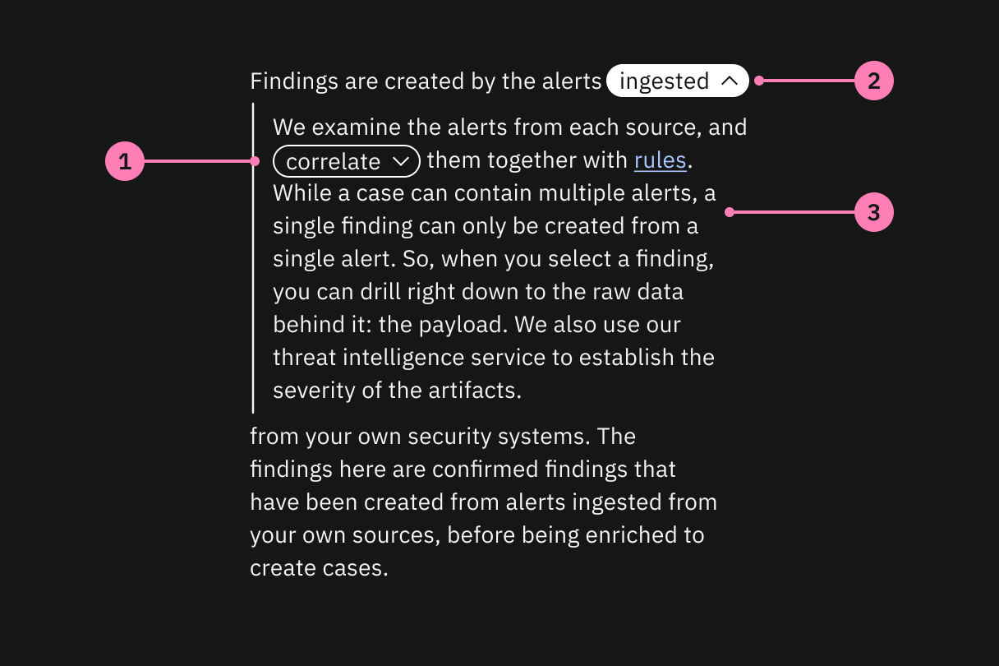
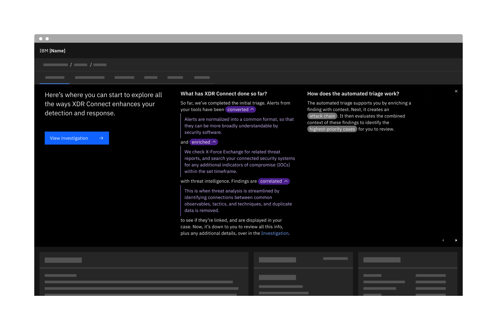
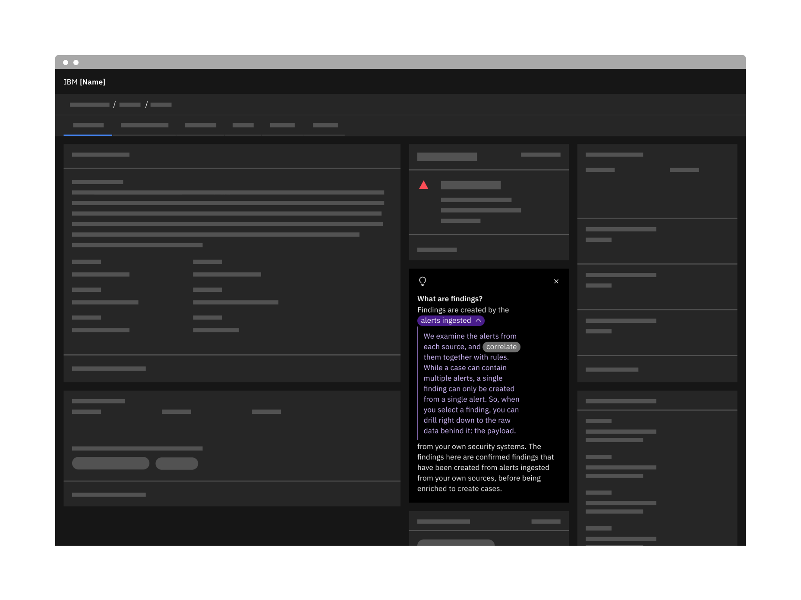
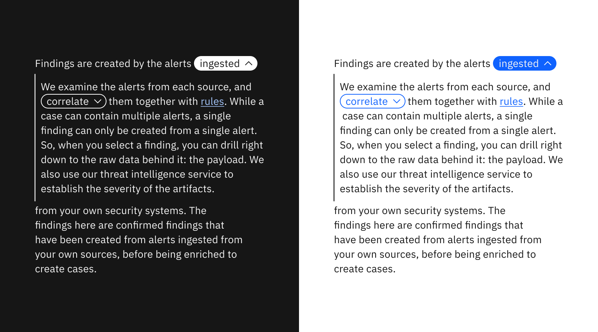

← [Back to Novice to pro components overview](/novice-to-pro/components/overview)

<PageDescription>

The non-linear reading component provides a way to explain concepts more broadly and succinctly while allowing users to read more 
detail as needed without leaving their context. 

</PageDescription>

<AnchorLinks>
   <AnchorLink>Overview</AnchorLink>
   <AnchorLink>Example</AnchorLink>
   <AnchorLink>Formatting</AnchorLink>
   <AnchorLink>Content</AnchorLink>
   <AnchorLink>Behaviors</AnchorLink>
   <AnchorLink>Modifiers</AnchorLink>
   <AnchorLink>Related</AnchorLink>
</AnchorLinks>

## Overview

Non-linear reading gives users control over the level of detail they read about a topic according to their maturity level. 

### When to use

- When space is limited to share a brief, at-a-glance, summary of a concept that may require more explanation for some users.
- When the level of detail or the amount of context needed on a topic will vary across users you don’t want to over-explain to 
more mature users. 
- To provide context for the first time a user engages with the product, as well as for introducing new concepts later on as they 
get more familiar with base-level functionality. 

### When not to use

- Do not use for defining terms (use the [definition tooltip](https://carbondesignsystem.com/components/tooltip/usage/) instead).
- Do not use in place of documentation when the information is very complex or dense 
(instead, use non-linear reading to introduce a higher level detail with a link to 
read more in the documentation). 
- Do not use inside other components or areas where expanding the content would conflict with the component’s 
functionality (e.g. [coachmarks](/novice-to-pro/components/coachmark/usage)) or impede other 
elements on the page. 
- Do not use inside interstitial pages where content is meant to be a brief introduction to the value of the 
product and not a place to dive deeper. 

## Example

<Row>
<Column colMd={12} colLg={12}>

<Video src="images/nonlinear-reading-01.mp4" autoPlay loop>
    <track kind="captions" src="images/nonlinear-reading-01.mp4" />
</Video>

</Column>
</Row>

## Formatting

### Anatomy

<Row>
<Column colMd={8} colLg={8}>

</Column>
</Row>

1. **Non-linear key word:** This is a word you want to add context to. It should not be more than 2 words and should not wrap to 
two lines.
2. **Expanded key word:** This is the selected state of a key word.
3. **Key word context:** When a key word is clicked, the additional detail is revealed. It is indented to distinguish 
it from the rest of the content and to maintain a connection with the key word. Only the first indented level of key word context can contain 
additional key words.

### Placement

Non-linear reading is best used in components like the guide banner or inside inline tips, where space is limited. The height of the parent 
component will adjust as the non-linear key words are expanded.

<Row>
<Column colMd={12} colLg={12}>

</Column>
</Row>

## Content

### Main elements

#### Initial content

Though brief, the initial amount of detail of non-linear reading content should provide enough context to understand the concept at 
a high level without being too obvious or too general. In other words, the initial detail should provide helpful information the 
user likely would have not known on their own. 

#### Additional context

The content shown when a non-linear key word is expanded should add further context to the word without being a mere definition. It 
also should provide valuable information to the user, leaning more towards technical than superficial or marketing language.

## Behaviors

### States

#### Collapsed

Non-linear reading always begins fully collapsed.

<Row>
<Column colMd={12} colLg={12}>

</Column>
</Row>

#### Expanded

As non-linear key words are clicked, additional context is revealed. In general, non-linear reading will expand the height of its 
parent container, and should never create a separate scrolling section. Only 2 levels of indentation are allowed to maintain 
readability (consider providing a link to documentation if the content requires more explanation). When a parent-level non-linear 
key word is collapsed, any child-level key words are also collapsed.

<Row>
<Column colMd={12} colLg={12}>

</Column>
</Row>

## Modifiers

### Themes

Use the light version when using non-linear reading on a dark theme and the dark version against a light-themed background. 

<Row>
<Column colMd={8} colLg={8}>

</Column>
</Row>

## Related

– [Definition tooltip](https://carbondesignsystem.com/components/tooltip/usage/#definition-tooltip)
