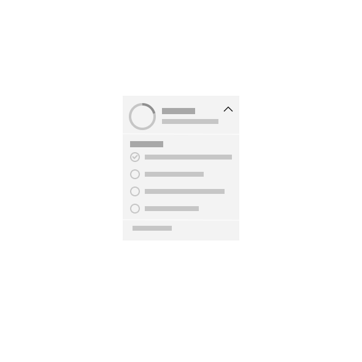
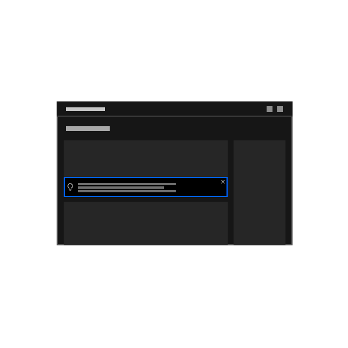
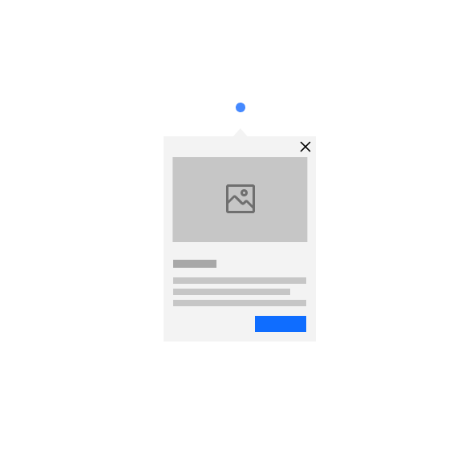
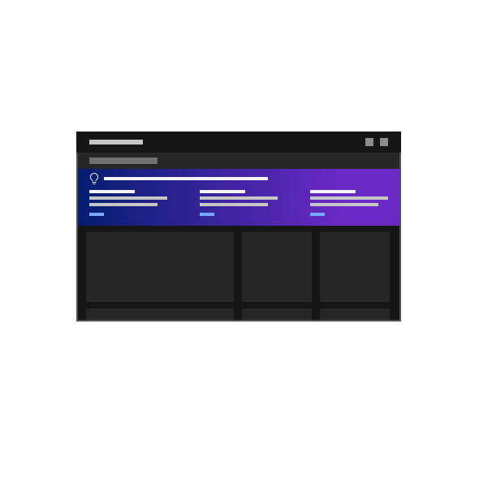

<PageDescription>

Novice to pro components are built to equally support those who want to get in and 
"figure it out" on their terms, asking for support when and if they need it, as well as 
those who are seeking more explicit guidance via step-by-step learning paths and tutorials.

</PageDescription>

## Overview

Novice to pro components are Carbon-native (available with Carbon v10 and v11) and implemented via a factory model to keep the 
novice to pro code within product light, the implementation easy, and the files in a single place to enable easier content 
translation and maintenance. Novice to pro currently consists of the following components, designed to be choreographed with each 
other and natively complement experiences: checklist, coachmark, guide banner, inline tip, interstitial screen, and non-linear reading.

<Row className="image-card-group">

<Column colMd={3} colLg={3} noGutterSm>

<ImageCard 
sub-title="Checklist"
sub-titleColor="dark"
hoverColor="dark"
href="/novice-to-pro/components/checklist/usage">

</ImageCard>

<ImageCard
sub-title="Inline tip"
sub-titleColor="dark"
hoverColor="dark"
href="/novice-to-pro/components/inline-tip/usage">

</ImageCard>

</Column>

<Column colMd={3} colLg={3} noGutterSm>

<ImageCard 
sub-title="Coachmark"
sub-titleColor="dark"
hoverColor="dark"
href="/novice-to-pro/components/coachmark/usage">

</ImageCard>

<ImageCard 
sub-title="Interstitial"
sub-titleColor="dark"
hoverColor="dark"
href="/novice-to-pro/components/interstitial/usage">

</ImageCard>

</Column>

<Column colMd={3} colLg={3} noGutterSm>

<ImageCard
sub-title="Guide banner"
sub-titleColor="dark"
hoverColor="dark"
href="/novice-to-pro/components/guide-banner/usage">

</ImageCard>

<ImageCard
sub-title="Nonlinear reading"
sub-titleColor="dark"
hoverColor="dark"
href="/novice-to-pro/components/nonlinear-reading/usage">

</ImageCard>

</Column>

</Row>
