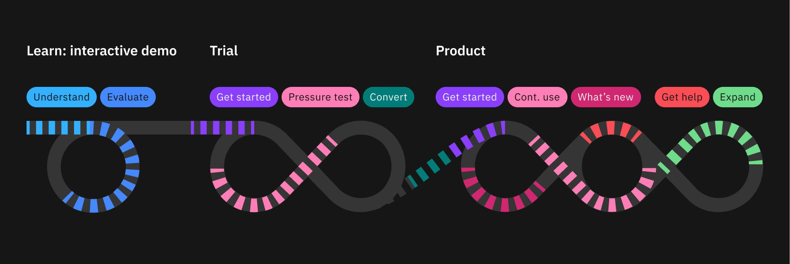
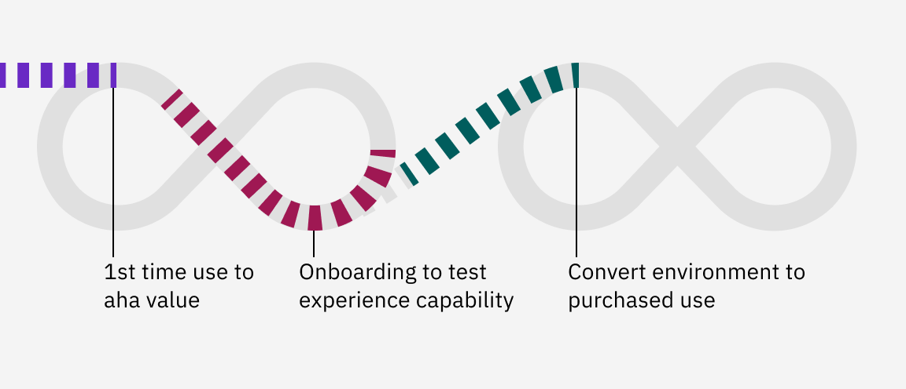
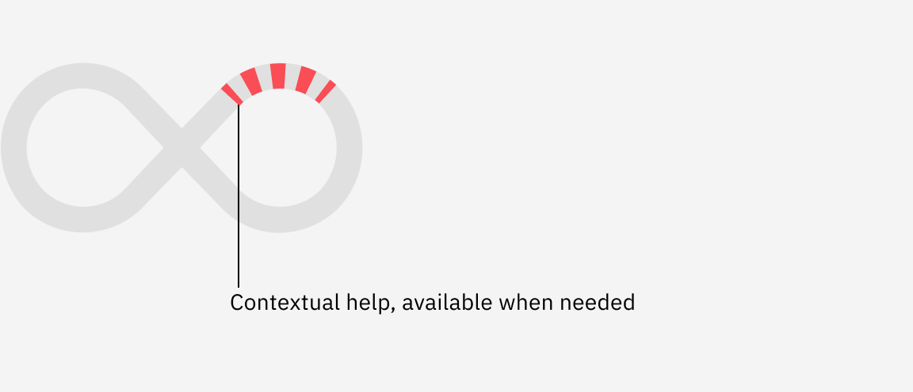
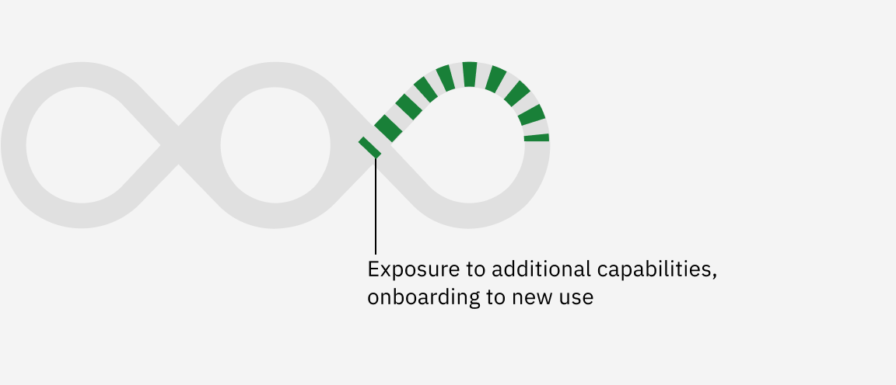

<PageDescription>

Through all [universal experiences](https://w3.ibm.com/design/experience-standards/universal-experiences/overview/introduction) from discovery to end use, users are informed and guided, build relationships, and make decisions with us. Novice to pro is positioned to augment our users’ understanding and shape impressions at several key lifecycle moments, not just within the product itself.

</PageDescription>

<AnchorLinks>
   <AnchorLink>Pre-purchase evaluation</AnchorLink>
   <AnchorLink>Post-purchase use</AnchorLink>
   <AnchorLink>Get help</AnchorLink>
   <AnchorLink>Expand use</AnchorLink>
</AnchorLinks>

<Row>
  <Column colMd={12} colLg={12}>

  </Column>
</Row>

## Pre-purchase evaluation

### Learn

#### Interactive demo

<Row>
  <Column colMd={6} colLg={6}>

  </Column>
</Row>

<Row>
<Column colMd={8} colLg={8}>

An interactive demo is qualified as a hands-on experience within a product powered by generic, demonstrative data and easily accessible by anyone. The interactive demo is often an extension from marketing channels, therefore it’s an important experience that bridges communications, proves marketing value statements via immersive stories, and leaves potential customers with a positive, visceral impression¹. Novice to pro is tailored to deliver value-driven experiences and memorable takeaways necessary at this stage where a prospect is evaluating whether or not to engage further. Using novice to pro, there are three main elements key to an immersive experience:
* Show the value, not everything
* Tell them a story, both just-in-time and guided
* No dead ends, meaning that every path has a clear next step

</Column>

<Column colMd={2} colLg={3} offsetMd={1} offsetLg={1}>
  <Aside>

**¹Three levels of emotional processing**

Visceral, behavioral, and reflective emotions, defined by Don Norman,  provide a better human understanding to create memorable UX experiences.

[Learn more](https://www.nngroup.com/videos/3-levels-emotional-processing/)

  </Aside>
</Column>
</Row>

#### Considerations
Storytelling is the priority over teaching how to use the product. Use the [experience playbook](/novice-to-pro/experience-playbook) to identify experience value stories that connect and reinforce marketing messages.
* Use the [peak-end rule](https://lawsofux.com/peak-end-rule/) when structuring story paths and just-in-time callouts to maximize memory retention and reflective emotions about the experience.
* Keep paths brief with value-driven copy.
* Avoid calling out obvious UI elements.
* Use the novice to pro components and the implementation framework to deliver a native and complementary experience.

<CardGroup><MiniCard
  title="More about interactive demos"
  href="https://pages.github.ibm.com/security/security-design/teams-across-security/interactive-demo/overview/"
  />
</CardGroup>

### Try

#### Proof of concepts/Trials

<Row>
  <Column colMd={6} colLg={6}>

  </Column>
</Row>

Time-to-initial-value and sustainable value can make or break a trial. Best-in-class trials adapt to user roles and display crystal-clear value quickly and frequently. The novice to pro framework is tailored to guide prospects towards relatable benefits as they are closing in on a purchase decision.

In addition, many customers are now prioritizing the ease with which their team can learn new tools. In one [study](https://www.forrester.com/report/analyst-experience-ax-security-analysts-finally-escape-the-shackles-of-bad-ux/RES177301), 30% of decision-makers noted training as a key determining factor. A mature learning ecosystem is a differentiator, showing in-context that there is a path to speed up the training process and continuously up-level their team within the product. 

> *Training is an area where it might cause issues…because it’s quite an intense platform; sometimes certification paths can take up to 30 hours; can’t learn quickly and sales couldn’t tell them a path to get people trained more quickly,* ***it was kind of just “learn it,” which was a big issue.***
> 
> <cite>– Prospective customer, responsible for tooling</cite>

#### Considerations
* Identify what the goals of the trial are upfront to better cater to onboarding.
* Expose user roles to their main use case so they see value as quickly as possible.
* Provide context back to current workflows/tools they use, emphasizing key differentiators.
* Account for different proficiency levels.
* After completing key milestones, prompt next steps so users never feel abandoned or left with confusion regarding where to go.
* Allow users to give feedback about their first impression of their experience.
* Monitor behaviors that may be a disincentive to purchase (to create experiences to help them avoid going into those experiences).
* Track and correlate the steps performed to purchases (e.g. are the steps you're driving to correlating to purchases?).

## Post-purchase use

<Row>
<Column colMd={8} colLg={8}>

There is an antiquated perception that onboarding occurs only within product as first-time use, and concludes once a specific task(s) is complete or after a certain period of time. In reality, users are always exploring and learning new ways to use the tool, to perform their job easier and more efficiently. Likewise, the product’s experiences mature through continuous delivery to introduce new features and tune existing workflows to make them more effective. Therefore, onboarding should be thought of as phases that support users’ growth through their entire lifecycle. A common way of breaking this down is by **primary, secondary, and tertiary onboarding².**

</Column>

<Column colMd={2} colLg={3} offsetMd={1} offsetLg={1}>
  <Aside>

**²Guide to Continuous Onboarding for Saas**

What is continuous onboarding and why should organizations embrace primary, secondary and tertiary onboarding.

[Learn more](https://userpilot.com/blog/secondary-onboarding/)

  </Aside>
</Column>
</Row>

### Use: Primary onboarding

#### New user, new tool

<Row>
  <Column colMd={6} colLg={6}>

  </Column>
</Row>

Users are naturally inquisitive when encountering new experiences. They will be looking for immediate aha moments to understand what’s possible, and to map, translate, and apply their existing knowledge within a “foreign” ecosystem. Primary onboarding is specific and guiding. It helps new users become oriented to a brand new experience with the goal of getting them to a memorable moment of value. The ultimate goal of primary onboarding is to quickly get users to clearly observe the product’s main value, with the intention of creating a great first impression, establishing the first step toward retention, and setting the tone for how the user will perceive the rest of the experience moving forward.

#### Considerations
* Identify what the goals of the use are upfront to better cater to primary onboarding.
* Account for different proficiency levels.
* Expose user roles to their main use case so they see value as quickly as possible.
* Celebrate the first moments of realized value to amplify memory cognition.
* Don't labor obvious points or call attention to evident UI.
* Consider how a previous trial experiences may connect to use. Consider a whole team coming in to a brand environment vs a new user in a mature environment.
* Consider that there may not be much (or any) data or content on their first time use...so if possible use canned content for them to learn from where appropriate.
* Monitor first-time use paths and time to milestones (to ensure users have frictionless primary onboarding experiences).

### Use: Secondary onboarding

#### Driving maturity

<Row>
  <Column colMd={6} colLg={6}>

  </Column>
</Row>

<Row>
<Column colMd={8} colLg={8}>

Secondary onboarding is key to continuously up-leveling users, introducing them to areas of the experience they may have not encountered or functionality they are not fully taking advantage of. At this phase, users have realized core value through primary onboarding and now have the goal of conducting their jobs to be done, to effectively use the product. This is the opportunity to roll out new use cases and efficiency improvements based on the user’s continued maturity. Going back to the forgetting curve³, choreography plays a critical part in the experience delivery to improve memory cognition and repeat behaviors. 

Secondary onboarding isn’t done all at once. That would be overwhelming for a user to intake all that the product has to offer, especially if it’s multifaceted like a platform. Think of secondary onboarding as a timed and choreographed long game.  For example, start with showcasing a key function that would drive their job to be done. Later, present how it can be accomplished more effectively through integrated workflow options. Finally, note how they can increase speed and power use through (keyboard) shortcuts. Secondary onboarding also presents an opportunity to monitor experience adoption by tracking first time exposure, activation, and follow up use.

</Column>

<Column colMd={2} colLg={3} offsetMd={1} offsetLg={1}>
  <Aside>

**³Ebbinghaus Forgetting Curve**

A graphical representation of the forgetting process. The curve demonstrates the declining rate at which information is lost if no particular effort is made to remember it.

[Learn more](https://practicalpie.com/ebbinghaus-forgetting-curve/)

  </Aside>
</Column>
</Row>

#### Considerations
* Craft continuous learning experiences that cater to different types of users, accounting for what motivates them (e.g. reference the [Bartle taxonomy](https://www.gamify.com/gamification-blog/the-make-up-of-gamers-the-bartle-test-of-gamer-psychology): just-in-time for Explorers, modules and guided paths for Achievers).
* Consider learning fatigue — use ambient learning so you’re not disrupting the user’s flow.
* Personalize secondary onboarding by the user’s maturity with the product.
* Use analytics to understand, choreography, and deliver tailored adoption nudges.
* Design and track experiences for first exposure, activation, use and follow up use.
* Cultivated habits of “use” considering memory + motivation. Use events to deliver more meaningful, contextual “use” reminders to drive users towards sustained usage.

### Use: Tertiary onboarding

#### Continuous growth

<Row>
  <Column colMd={6} colLg={6}>

  </Column>
</Row>

Tertiary onboarding, like secondary, is also continuous. Tertiary onboarding can serve two main functions. The first is as an opportunity to keep the user up-to-date as the product matures and delivers new capabilities. Onboarding to new functionality reinforces that it’s a living, improving product, helps to maintain continued interest, and gives users a sense of being a part of the growth. The second is as an opportunity to understand and react to key adoption milestones for better retention. Tertiary onboarding can also be complementary to the product experience, delivered through supporting channels like email nurturing, and driven by appealing content like key workflow tutorials.

#### Considerations
* Consider tips that will help users work more efficiently using the knowledge they’ve gained via secondary onboarding.
* Deliver tertiary onboarding via just-in-time for contextual adoption.
* Deliver tertiary onboarding via just-in-case to catalog the updating cadence, highlighting product growth/maturity.
* What’s new highlights should be presented when it will enhance the user's experience not frivolous updates.
* Consider holistic experience touchpoints to drive continuous nurturing and retention, both in-product and out-of-product.
* Consider methods to gather feedback from users about what is working and not working with their learning paths.

## Get help

#### Just-in-case learning, on-demand guidance

<Row>
  <Column colMd={6} colLg={6}>

  </Column>
</Row>

Getting help is a key facet of a learning framework. Users are inclined to troubleshoot issues and get quick answers by themselves prior to seeking additional support. “Get help” destinations, like Assist Me, give the learning content they may experience via continuous onboarding a permanent home and an additional access point. These learning moments and guided experiences can often address contextual answers to the user’s current state as well as provide easy-to-follow paths towards resolution.

#### Considerations
* Consider how just-in-time and just-in-case content and paths can be used to complement self-service help.
* Consider how in-product support connects and extends out-of-product documentation.
* Provide supplementary links to similar content that may help users understand the topic they are getting help about.
* Track pages where help was sought to target in-product experiences improvements.

## Expand

Up-sell, cross-sell

<Row>
  <Column colMd={6} colLg={6}>

  </Column>
</Row>

Over time, an organization may mature past the capabilities offered in their available package, or they may find the need to expand for evolving use cases. At key strategic moments where a user may encounter higher-tiered locked capabilities, it may be appropriate to expose and guide users down paths to obtain the functionality, either through trial opportunities or purchase routes.

If an organization expands their offering, it is important to introduce the users to their new capabilities. As with starting a new product experience, use primary onboarding to introduce users to the new experience value and craft continuous onboarding phases to promoting clear paths to use.

#### Considerations
* Set user expectations in the UI where interactions will lead to an up-sell moment. 
* Consider up sell moments that are contextually triggered and well-timed to avoid exposure fatigue.
* Be thoughtful about hinting functionality when it’s not available in a user’s purchased package.
* Communicate expansion value, backed up by clear evidence of what they will get.
* Provide clear steps forward, whether it be an unlocked trial or purchase.
* In the customer's expanded product, follow onboarding guidance to get users to value and help them effectively use their new workflow additions.
* Use analytics to measure up-sell exposure to purchase, then to track onboarding exposure, activation, and use.
