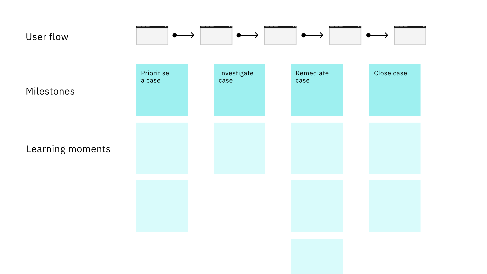
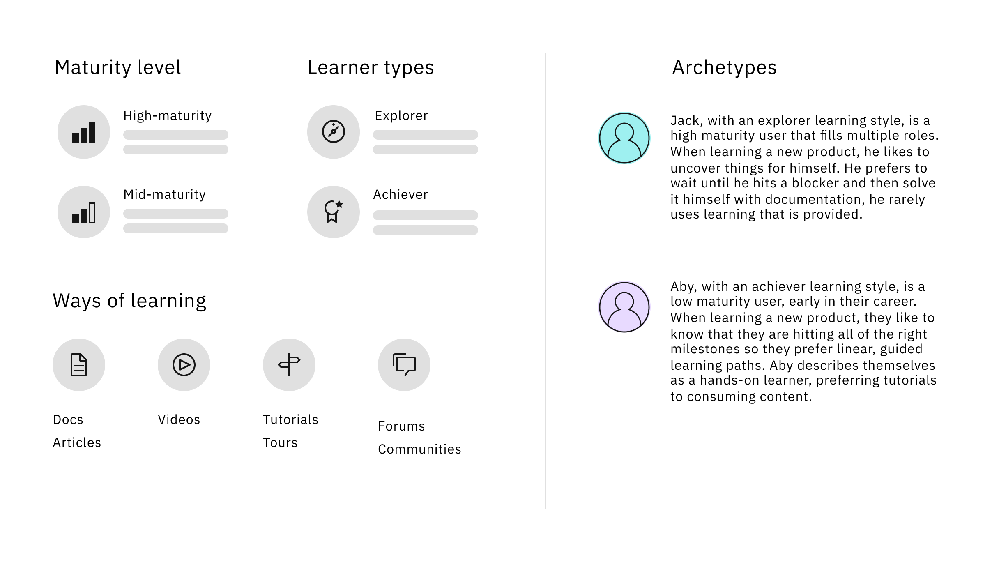
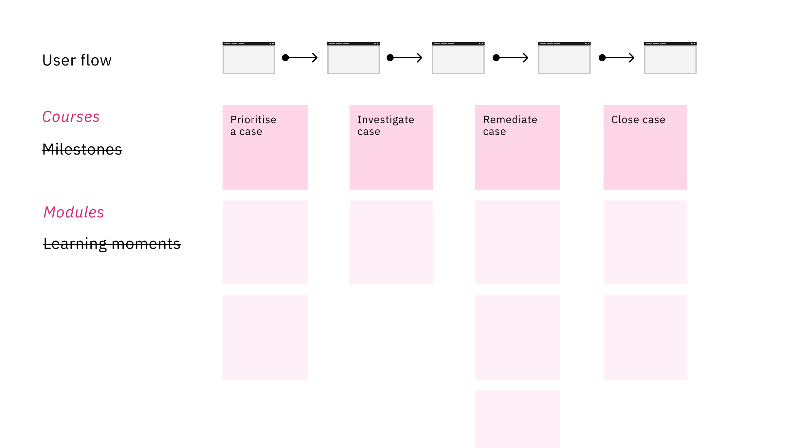
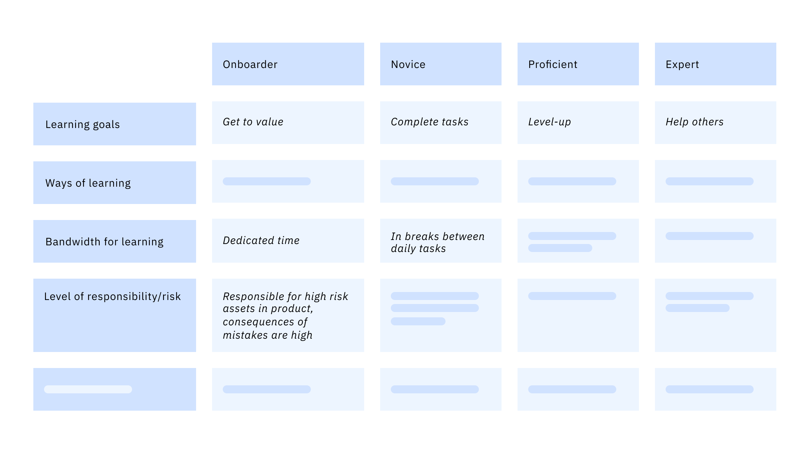
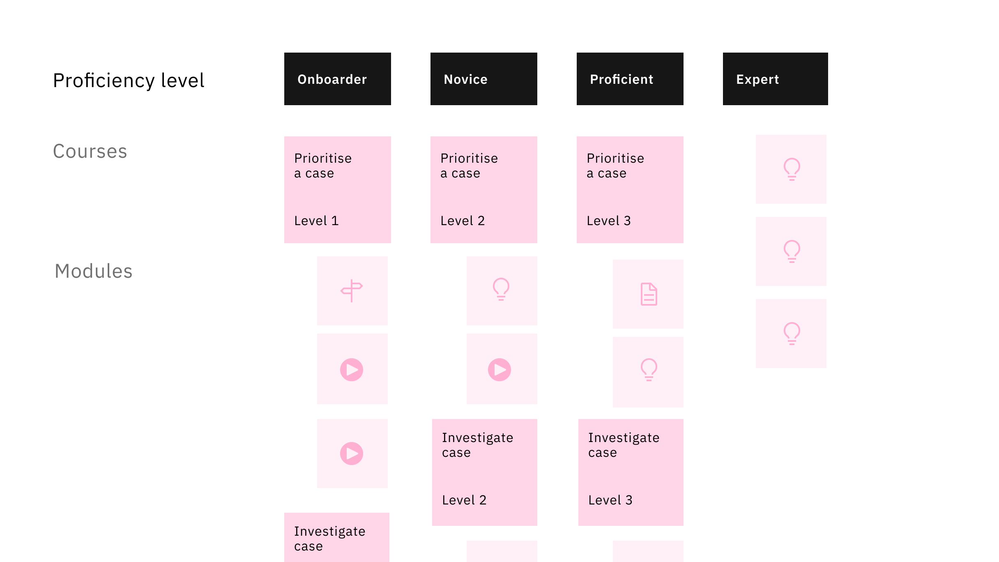
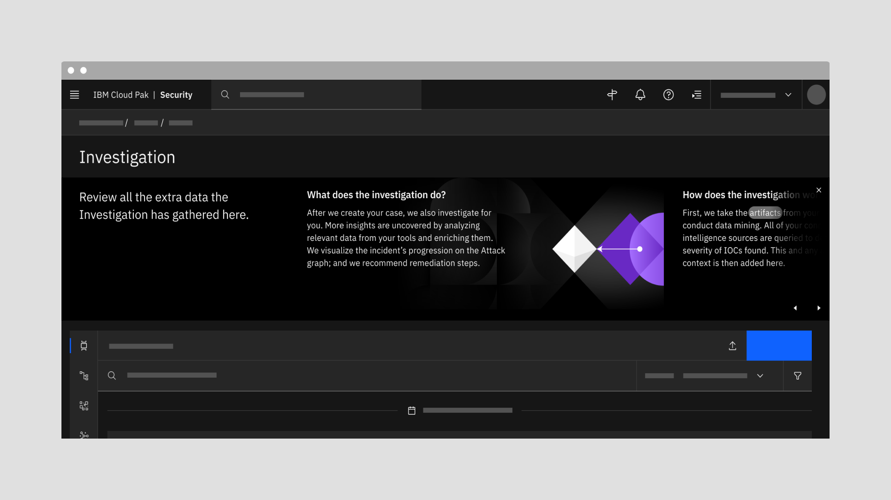
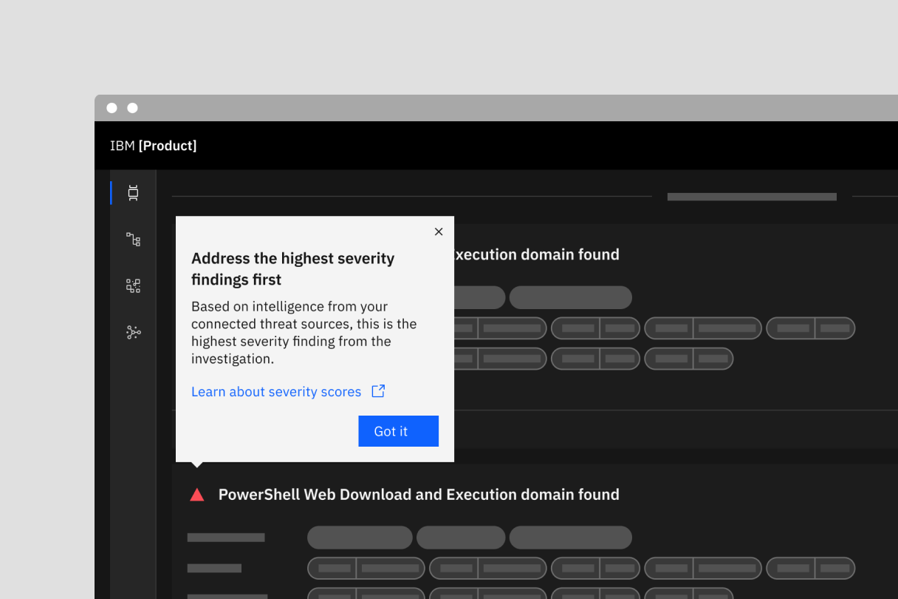
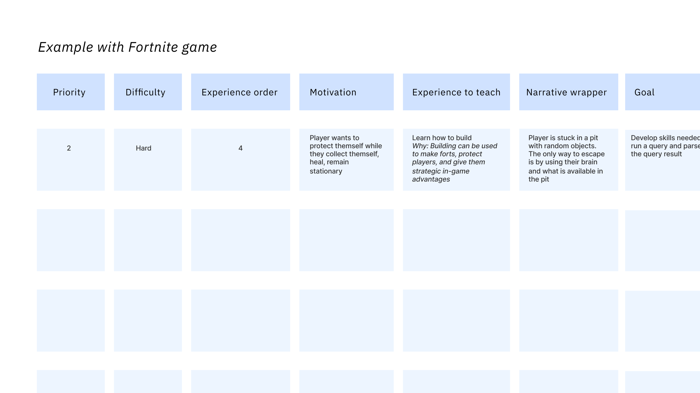

<PageDescription>

The purpose of the experience playbook is to help you create a novice to pro experience within your product.

</PageDescription>

<AnchorLinks>
  <AnchorLink>Identify opportunities</AnchorLink>
  <AnchorLink>Translate value</AnchorLink>
  <AnchorLink>Create the curriculum</AnchorLink>
  <AnchorLink>Choreograph the experience</AnchorLink>
  <AnchorLink>Write the content</AnchorLink>
</AnchorLinks>

## Identify opportunities 

### Value propositions

In identifying opportunities for novice to pro, you are really looking for areas where you can guide a user to experience the product’s value. Begin by outlining the product’s key value propositions with your product manager. Then outline the as-is path of the product’s full, end-to-end workflow. We recommend doing this even if you already have a particular area in mind, as it allows you to step back and view the user’s full journey with objectivity.

### As-is flow and milestones

As you map out the flow, identify the key milestones that a user needs to reach in order to experience the value propositions you have defined. Next, add any user feedback from testing, NPS, support, technical sales, and D&UX reviews to highlight areas where users may need guidance or further understanding.

When you are finished, use voting dots to highlight the top learning opportunities to reach each milestone. These should be key areas that guide the user to value and impact.  

#### Do’s
- Think about key concepts that a user needs to understand to continue on the path toward the milestone.
- Consider explainability of what the system is doing so that the user can build trust in the product.
- Identify new skills that a user needs to develop to reach the milestone.

#### Don’ts
- If they can comfortably reach the milestone without assistance, then let them. Don’t provide arbitrary guidance that will impede or frustrate them.
- It can be tempting to explain around known blockers in the product, but novice to pro should not be used as a band-aid for fundamental issues or pain points.

### User learning workshop

Once you have mapped out your flow, invite key stakeholders from your product team to a workshop. Include product management, technical SME’s, content creators, design research, support, and technical sales.

Bring your as-is flow into a Mural or FigJam file. Simplify it into something that participants can quickly understand, and include product screens. Walk them through the flow and ask them to vote on the areas that they see as key milestones to achieve the value propositions. The goal here is more about encouraging engagement with the flow so that the participants fully understand the content before moving on. However, if they identify additional milestones here, that’s a bonus.

<Row>
<Column colMd={8} colLg={8}>

</Column>
</Row>

The second, and key, part of the workshop is where you get content from the participants. Reveal the milestones that you have already identified in the context of the user-flow. Under each milestone, ask participants to add what they think a user would need to learn, or do, in order to be able reach this milestone. Ask them to think about tasks a user needs to learn to do and concepts a user needs to understand. Cluster and synthesize as usual. This will form the basis of your learning curriculum.

## Translate value

### Value-driven user need statements

The next step is to reframe this content as user epics and stories.

Use the milestones as a guide for writing your epics. You can do this by rewording your milestones as a value-driven user needs statement. For example, a milestone like "User closes a case" can become "User needs to know how to complete steps to resolve an incident so that they can close a case."

Underneath each milestone epic, bring in the learning moments identified in the workshop. These learning moments will become the stories needed to achieve that epic. Start to reframe these as user need statements also.

Ask product managers and user-focused SME’s to vote on the most impactful epics and stories to get the user to realize the value propositions. Once you have your prioritized epics and stories, outline the ideal to-be scenario. Highlight the milestones that the user is reaching with your interventions and where they’re achieving the value propositions.

## Create the curriculum

The key component of the novice to pro experience is the learning content itself — the success of the learning experience hinges on this. Before creating the curriculum, it’s important to understand the user’s learning style and motivations as well as identifying the level of detail needed.

### User research

Use generative research to understand more about your user. We recommend free-form interviews with a loose guide. If you have access to real users, that is ideal, but this can also be conducted successfully with Respondent users.

#### Research objectives

- Understand day-in-the-life of your users and where learning fits into it
- Understand the ways your users learn and engage with learning
- Understand level of detail required for your users when learning
- Understand the user’s motivations to learn
- Establish maturity of your users

#### Script and setup

- Allow some time for the user to talk about themselves, their job, their company, and industry.
- Ask the user probing questions to establish if they are motivated in their role, if and why they learn.
- Craft questions that will help you understand the ways the user learns and how the user engages with learning. A good reference here is the [Bartle Taxonomy](https://en.wikipedia.org/wiki/Bartle_taxonomy_of_player_types); you can further validate by showing them the taxonomy afterwards and asking them to self-identify.
- Ask the user to tell you about the last time they onboarded to a product. Bear in mind that they will be telling you what they remember versus what actually happened, but it should still generate valuable insights about how they approach and incorporate learning. See the [peak-end rule](https://en.wikipedia.org/wiki/Peak%E2%80%93end_rule) to understand how memory of an experience differs from the action experience.
- Set up a scenario for them where they’re using your product for the first time. Allow them to walk through the product without any guidance and ask them to think aloud, describing what they are thinking and what questions they have. Use this to understand how far a user can get on their own, as novice to pro should be used sparingly.

#### Outcomes

After synthesizing, use your insights to craft high-level archetypes of your user. These should outline their maturity level and learning type.

<Row>
<Column colMd={8} colLg={8}>

</Column>
</Row>

### Outline courses and levels

Use a Mural or FigJam file. List out the milestones (or epics) again, but this time think of them as learning “courses”. Arrange the stories below them as learning modules included in the course. Surface any existing learning for your product – tutorials, videos, courses – and cross-reference them with the modules you have listed. Add any existing content where relevant.

<Row>
<Column colMd={8} colLg={8}>

</Column>
</Row>

Revisit your user research, archetypes, and learning styles to define what proficiency means for your user. It’s important to note that proficiency is very different from maturity. A user’s maturity denotes how experienced and skilled they are in their role, while a user’s proficiency is how experienced and skilled they are in your product. Past experience with similar products can advance a user’s proficiency in your product. A highly mature onboarder doesn’t necessarily need a lot of hand-holding. Their first-time use might be an exercise in learning to trust your product, and they may need more access to in-depth technical information to achieve this. Conversely, proficient or expert learning doesn’t need to be more complex. These can just be things that come when a user is completing tasks that they may not get to the first few times, or level-ups to make their workflow more efficient. 

<Row>
<Column colMd={8} colLg={8}>

</Column>
</Row>

With this in mind, think about the key things that a user will need to know the first time they use the product versus things that can come later. It’s also important to consider how much time they will have for learning. Tag the learning modules by proficiency level:

#### Onboarder
- [Primary onboarding experience](/novice-to-pro/experience-integration/#use:-primary-onboarding)
- Goal: Quick time to value    
- Introduction to the product
- Orienting to the product
- Achieving a milestone

#### Novice
- [Secondary onboarding experience](/novice-to-pro/experience-integration/#use:-secondary-onboarding)
- Goal: Completion of daily tasks  
- Completing tasks for a second time
- Uncovering nested tasks or concepts

#### Proficient
- [Tertiary onboarding experience](/novice-to-pro/experience-integration/#use:-tertiary-onboarding)
- Goal: Level-ups  
- Shortcuts to make their workflow more efficient
- More complex and powerful ways of doing things

#### Expert 
- [Expand experience](/novice-to-pro/experience-integration/#expand); [tertiary onboarding experience](/novice-to-pro/experience-integration/#use:-tertiary-onboarding)
- Goal: Supporting user to support their team 
- Upgrades, add-ons, and expansions
- Learning content for the user deliver
- Ways for the user to assist others
- Ways for the user to elevate the team workflow

<Row>
<Column colMd={8} colLg={8}>

</Column>
</Row>

Organize your learning courses by proficiency level — you will likely have a lot of the same courses for different levels. Use the learning styles generated from your user research to define the type of learning modules needed: just-in-time insight, video, abstract animation, article, tutorial, tour. This is how you will deliver the learning content to the user.

## Choreograph the experience

Your curriculum should form the order in which to choreograph all of this information. Less is more — reduce the upfront learning content to the bare minimum needed to get to value. If you saturate the user with learning content, they won’t retain anything. A choreographed learning experience will include some upfront orientation information, just-in-time learning, option to launch guided learning, and a way to get help.

<Row>
<Column colMd={8} colLg={8}>

</Column>
</Row>

### Just-in-time workflow

A good way of progressively disclosing key information is with a just-in-time workflow. This is when you serve up valuable, relevant information to a user when they interact with a related component or task. This workflow adapts and responds to the user as they lead the way through the product, answering their questions only as they occur. While powerful, use just-in-time content lightly to avoid a whack-a-mole experience where something pops-up every time a user clicks. It should feel ambient, not intrusive.

<Row>
<Column colMd={8} colLg={8}>

</Column>
</Row>

### Guided learning

Guided learning is another option for users who prefer tutorials. This is something that works best for learning how to complete specific and complex tasks, like building a query or connecting a data source. We do not recommend WalkMe tours to orient users to a product or long, complex WalkMe click-throughs to understand a workflow. Keep WalkMe tutorials scoped to very specific actions. The user should always initiate the tour themselves and there should not be more than 2 tours in one experience. Ideally, don’t use more than 3 clicks to complete the tour because, if the user falls out of the tour, there’s no way to return to where they left off. Bear in mind that many users will have cookies disabled and won’t see WalkMe at all, so don’t ever use it for critical information.

### Get help

Choreographing the learning journey can be overwhelming. Because there is so much the user needs to know, and so many potential paths they could take through the product, there is always a fear that they will miss your interventions. Remember that a user always has the option to "Get help." This is where you should provide access to all of the content in your learning curriculum for the user to peruse. Make it easy for them search, find, and filter down to what they need instead of trying to envision all of the right answers.

### Motivations table

A tool that can help with choreography, and prioritizing the key learning content, is Celia Hodent’s [prioritized learning table](https://www.youtube.com/watch?v=XIpDLa585ao).

> If you start with the narrative, which is tempting because we all love stories, you actually take the risk of adjusting your onboarding to the narrative which could hurt the experience.
>
> <cite>– Celia Hodent, PhD, Game UX Strategist</cite> 

<Row>
<Column colMd={8} colLg={8}>

</Column>
</Row>

  <Column colMd={4} colLg={4} noGutterMdLeft>
    <ResourceCard
      subTitle="Excel"
      title="Motivations table template"
      color="light"
      href="https://ibm.box.com/s/xeorscj4ww8jtrywst5kkyjps243xaa5"
    ></ResourceCard>
  </Column>

## Write the content

We recommend engaging your content writer as early in the process as possible, particularly as you conduct user research and outline the curriculum. They will have expertise in terms of how the information is written, but also how and when it is conveyed. Conversations to have with your content writer include:

- Tone
- Level of detail
- Progressive disclosure

It’s also important to engage the content team early on so that they can participate in the understanding phase with you, and plan their own work.

The creation process for learning content is long and complex. Be sure to provide sufficient lead time for the content writer to understand each story, explore and draft, finalize the content, and get sign-off from stakeholders. The content writer often becomes the point of convergence between technical teams, product management, and design. They will have to do a lot of work to align the content to meet all of the needs, as well as getting sign-off from their own chain of management and quality assurance. We are currently working on a content section that will provide support for content writers, including tips and tools for managing stakeholders, juggling feedback, and securing sign-off.
