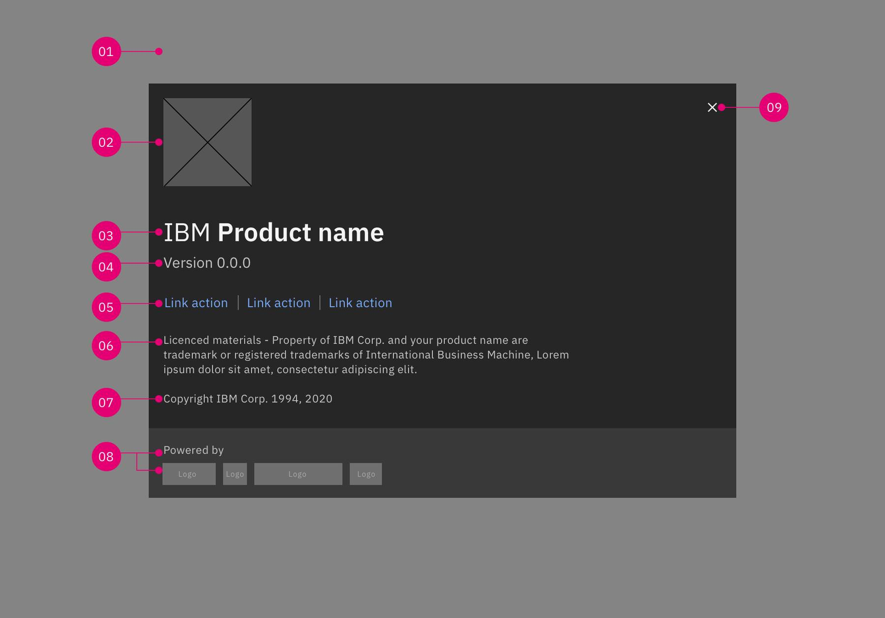
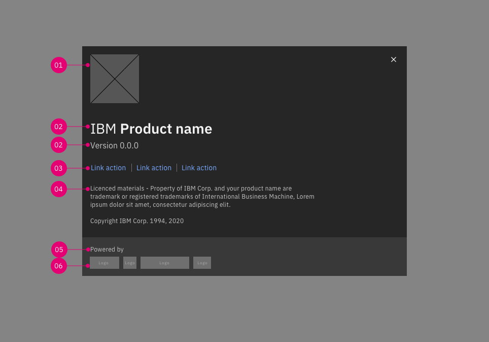
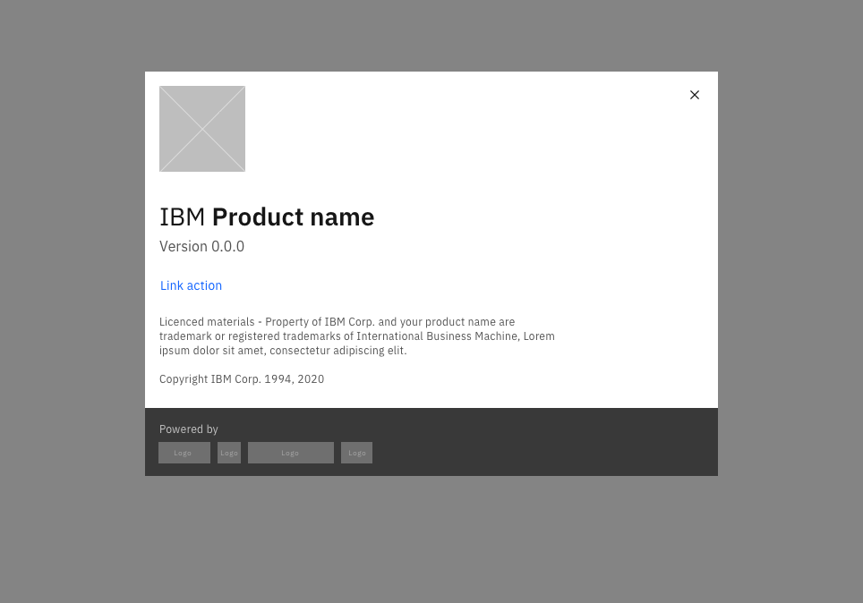
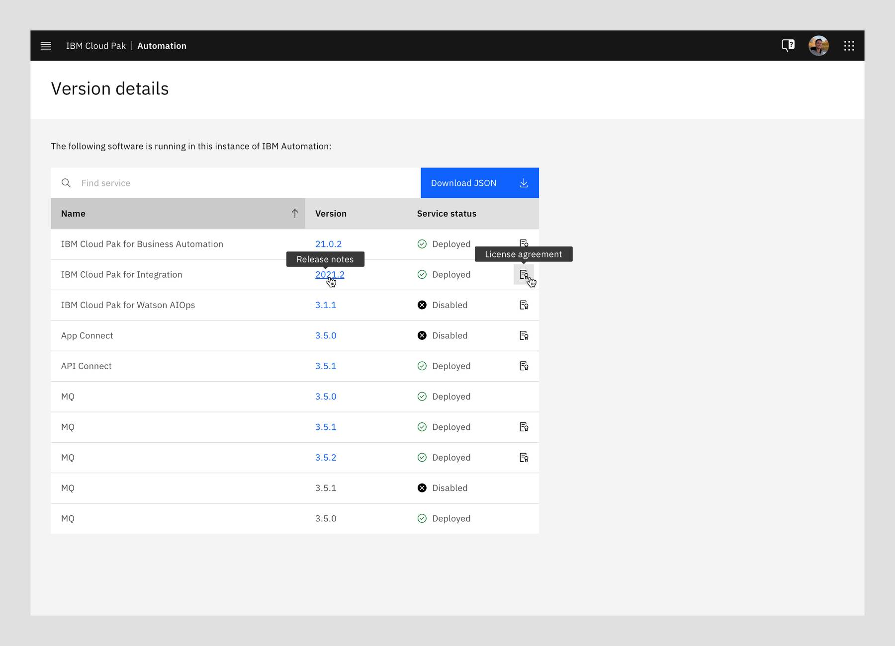

<PageDescription>

The About modal component provides a way to communicate product information to users and sits on top of an applications' main window.

</PageDescription>

<AnchorLinks>
  <AnchorLink>Overview</AnchorLink>
  <AnchorLink>Anatomy</AnchorLink>
  <AnchorLink>The solution</AnchorLink>
  <AnchorLink>Related</AnchorLink>
  <AnchorLink>References</AnchorLink>
  <AnchorLink>Feedback</AnchorLink>
</AnchorLinks>

## Overview

The _about modal_ is triggered by a user’s action which appears on top of the main page content, and is persistent until dismissed. The purpose of this modal should be immediately apparent to the user, with a clear and obvious path to completion.

## Anatomy

The about modal should provide information about the product. It may include the product name, logo, version numbers, and any appropriate legal text.

1. **Overlay:** Screen overlay that obscures the on-page content.
2. **Pictogram/Icon:** Visual symbols used to represent your product.
3. **Product name:** Header text that provides the product name. The IBM Services logo consists of two discrete, but required, elements: the iconic IBM 8-bar logo represented alongside the IBM Services logotype. Please follow these guidelines to ensure proper execution.
4. **Version number:** Text that provides information on the version number of your product.
5. **Links (_optional_):** User links if there are additional information to call out within the card. The about modal should be used to display the product information and not where users go to find help
6. **General text (_optional_):** Subhead text providing any relevant product disclaimers including legal information.
7. **Trademark and copyright information:** Displays first year of product release to current year.
8. **Powered by logos (_optional_):** If you are legally required to display logos of technologies used to build your product.
9. **Close button**

Each about modal is built out with content blocks of elements related to the product or topic. The about container (modal), title and version number are required to provide enough information about the intention of the card. All other elements are optional and layout can vary depending on the information that the modal provides.

The vertical navigation only contains one panel with all menu items listed within it. Sub-items will directly nest under the first level categories.  Click on the first level menu item will  open up all the sub-levels.

#### Alignment

Inside of an about modal, body copy, including titles, have a 20% [margin-right](https://www.carbondesignsystem.com/components/modal/style#margin-right)
- Text and IBM Service name should only be 80% of the modal’s width. If your IBM Service name exceeds the 80% it should wrap and fall to the second line.  Please follow these [guidelines](hhttps://www.ibm.com/brand/systems/services/logo/) to ensure proper execution.

#### Type Scale

All card titles, subtitles, labels and description are set in sentence case. Set titles, subtitles and body text appropriately based on content.

| Elements                                        |      Style                      |   Specs                                                       |
| -------------                                  | -------------------------------- | --------------------------------                              |
| 01. Product logo/icon                                      | | 96px by 96px |
| 02. Title                                      | `Text-01: Productive-heading-04` | IBM 8-bar logo: IBM Plex Sans (Regular) - 28px, IBM Product name: IBM Plex Sans (Medium) - 28px |
| 02. Version number                                   |   `Text-02: Body-short-02`    |   IBM Plex Sans (Regular) - 16px |
| 03. Link(s) / Action(s)                              |   `Body-short-01, link-01`  |    IBM Plex Sans, 14px |
| 03a. Link(s) dividers                              |   `$ui-04`  |    16px height |
| 04. Copyright and disclaimers                            |   `Text-02: Label-01`    |    IBM Plex Sans (Regular) - 12px |
| 05. Powered by / title                      |   `Text-02: Label-01`   |    IBM Plex Sans (Regular)  - 12px |
| 06. 3rd party logos | |    24px height, width can vary. Follow their logo guidelines. |

#### Spacing

Since cards present different type of content, some spacing between the elements can vary according to the context. The following specs present some of the constant spacing such as internal padding, space between images, title, description and links.

#### Light option

By default, we recommend each products to use the dark theme for their about modals as they are triggered from the About section within the profile menu in the main navigation. However, you may opt to chose the light version if this is a product requirement.

## The solution

The about modal  triggers a state (or mode) that focuses the user’s attention exclusively on one task or piece of relevant information. When a modal is active, the content of the underneath page is obscured and inaccessible until the user completes the task or dismisses the modal.

#### Accessing the about modal

About modals appear from the About section within the profile menu in your main navigation. Clicking the profile icon will launch a dropdown menu. The menu should always include an option labeled "About" that launches the about modal.

#### Functionality

Use the about modal to provide information about the product including the product name, logo, version numbers, and any appropriate legal text.

#### Dismissing the modals

- **X:** Clicking the x icon in the upper right will close the modal without submitting any data and return the user to its previous context.
- **Click elsewhere:** Clicking outside the passive modal area will automatically close the modal.
- **Esc:** Press ESC on the keyboard

### Behaviors

#### Overflow content

When the about modal content is longer than the about modal height then the body section should scroll vertically with the header and footer remaining fixed in place. The content should visibly fade at the end of the modal body area to indicate there is additional content out of view.

About modal content should never scroll horizontally; instead, use a larger size about modal.

#### Displaying service version details

If your product is comprised of multiple services and it is important for your customers to know what they are and what version of each service they might be using, you can link to a separate page from the modal to a "Version details" page. The page contains a data table listing each service, its corresponding version number and status. 

The version number can link to an external page displaying the version release information. License agreements for each service can be linked to as well via an icon in the same table row.

## Related

Components
- [Modal](https://www.carbondesignsystem.com/components/modal/usage)

Patterns
- [Dialog](https://www.carbondesignsystem.com/patterns/dialog-pattern)

## References

Apple Human Interface Guidelines, [Modality](https://developer.apple.com/design/human-interface-guidelines/ios/app-architecture/modality/)
 (2019)
Apple Human Interface Guidelines, [Dialogs](https://developer.apple.com/design/human-interface-guidelines/macos/windows-and-views/dialogs/)(2019)
Therese Fessenden, [Modal & Nonmodal Dialogs: When (& When Not) to Use Them](https://www.nngroup.com/articles/modal-nonmodal-dialog/) (Nielsen Norman Group, 2017)
James Jacobs, [Modern Enterprise UI design — Part 2: Modal dialogs](https://medium.com/pulsar/modern-enterprise-ui-design-part-2-modal-dialogs-2ccd3cc33c92) (2019)
Micosoft Docs, [About Dialog Boxes](https://docs.microsoft.com/en-us/windows/win32/dlgbox/about-dialog-boxes) (2019)
[Web Content Accessibility Guidelines](https://www.w3.org/WAI/standards-guidelines/wcag/) (W3C, 2018)

## Feedback

Help us improve this pattern by providing feedback, asking questions, and leaving any other comments on [GitHub](https://github.com/carbon-design-system/carbon-website/issues/new?assignees=&labels=feedback&template=feedback.md)