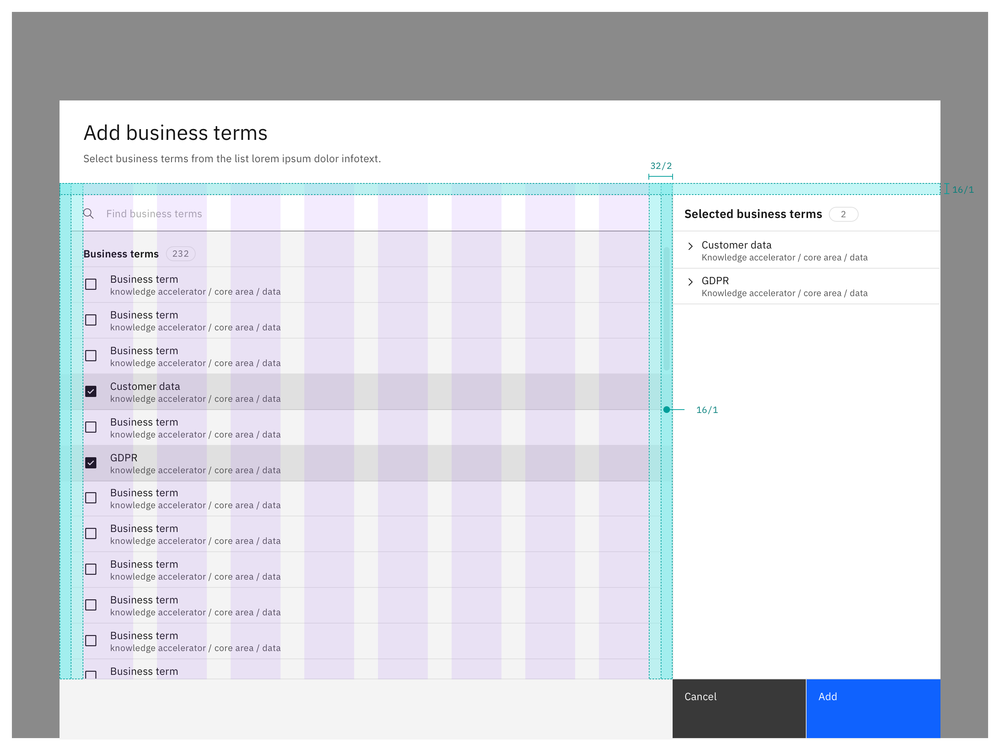
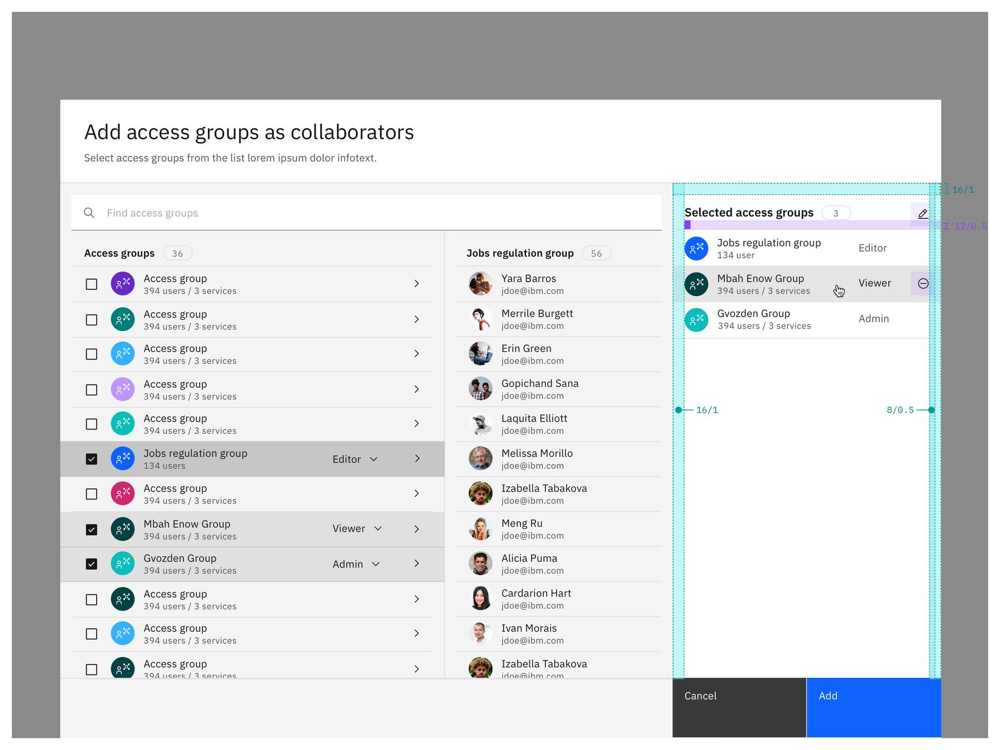
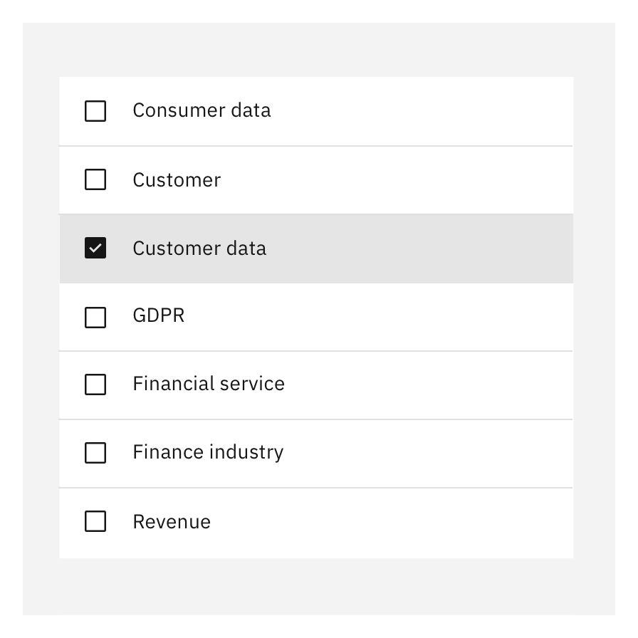
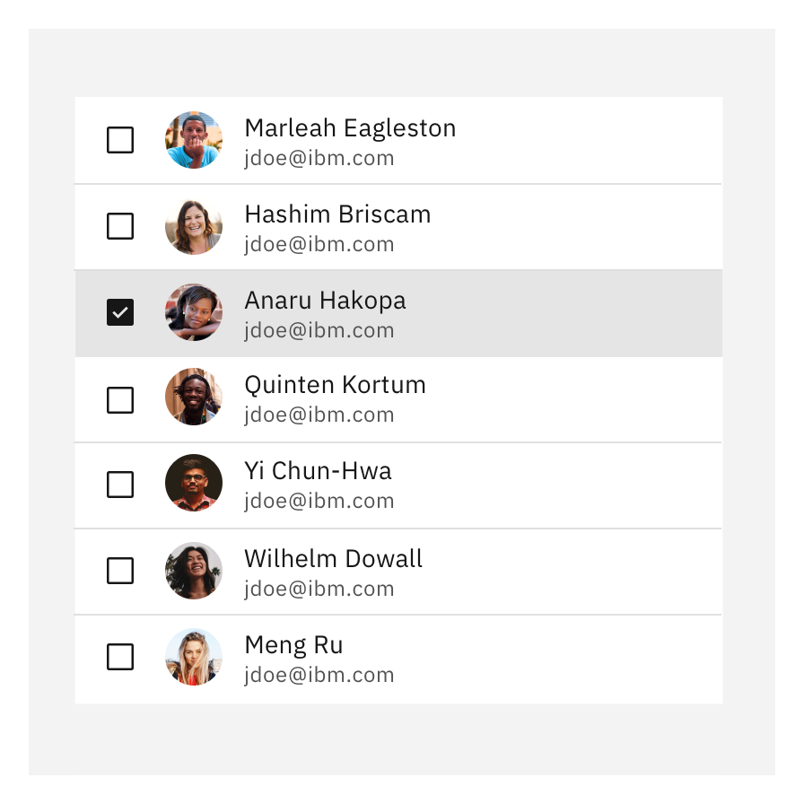
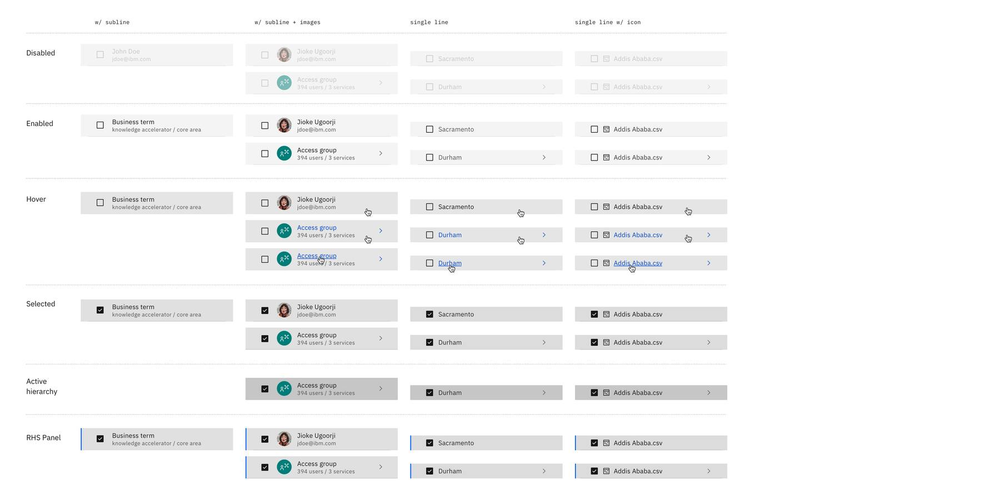

<PageDescription>

The add and select pattern offers simple and complex variations in the format of narrow and wide tearsheets.

</PageDescription>

<AnchorLinks>
   <AnchorLink>Grid</AnchorLink>
   <AnchorLink>Tearsheet</AnchorLink>
   <AnchorLink>List</AnchorLink>
   <AnchorLink>Sidepanel</AnchorLink>
   <AnchorLink>Table row actions</AnchorLink>
</AnchorLinks>

### Grid
The grid refers to the guidelines of the [tearsheet](https://pages.github.ibm.com/cdai-design/pal/components/tearsheet/usage) component and [2x grid](https://www.carbondesignsystem.com/guidelines/2x-grid/overview/). 

 

### Tearsheet
The tearsheet refer to the guidelines of the [tearsheet](https://pages.github.ibm.com/cdai-design/pal/components/tearsheet/usage) component and [create flows](https://www.carbondesignsystem.com/community/patterns/create-flows/).

 

### Sidepanel
The side panel follows the guidelines of the [sidepanel](https://pages.github.ibm.com/cdai-design/pal/components/side-panel/usage) component. The size for the side panel in this pattern is 360 px by default. Call to action buttons are aligned with the side panel to keep those aligned. If a stacked tearsheet is used on top of this tearsheet, buttons should follow the same size to avoid that buttons are changing position. The sidepanel acts like a shopping cart – it is a summary of the selection the user made and provides an overview about the selection the user made before adding the items. The sidepanel always contains a title and a tag indicating the amount of selected items and cannot be dismissed/closed by the user.

 

### List
The list follows the styles and interactions of the [Carbon table rows](https://www.carbondesignsystem.com/components/data-table/style#interactive-states). In the most minimal version an item in the list is represented by its name. Additional information may be shown to uniquely identify an item. For example, for users the email and a profile component is well suited. 

<Row>
  <Column colMd={4} colLg={4}>

 

##### Single-line item
<Caption>
  {' '} A single-line item contains a label.
{' '}
</Caption>

 </Column>

  <Column colMd={4} colLg={4}>

 

##### Two-line item
<Caption>
  {' '} A two-line item contains a label and a one-line description or a detail that helps the user to distinguish items.
{' '}
</Caption>

  
  </Column>
</Row>

 

### Table row interactions
For styling and interactions of the table row interactions follow the guidelines of the [clickable row items](https://pages.github.ibm.com/cdai-design/pal/patterns/data-table/clickable-row-items) data table pattern. 

 
