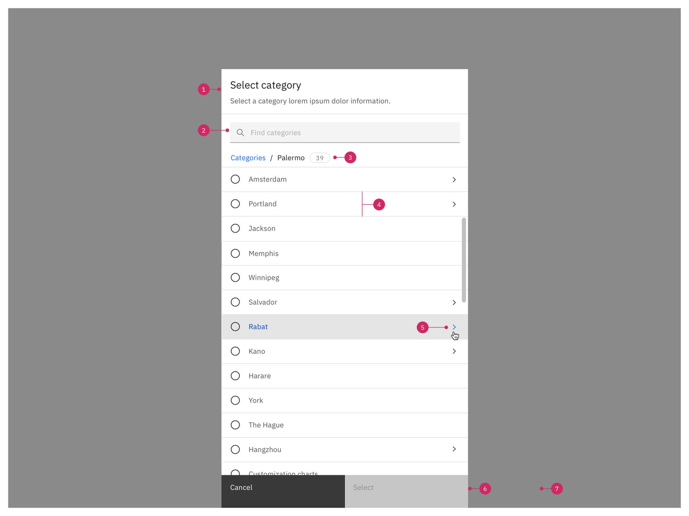
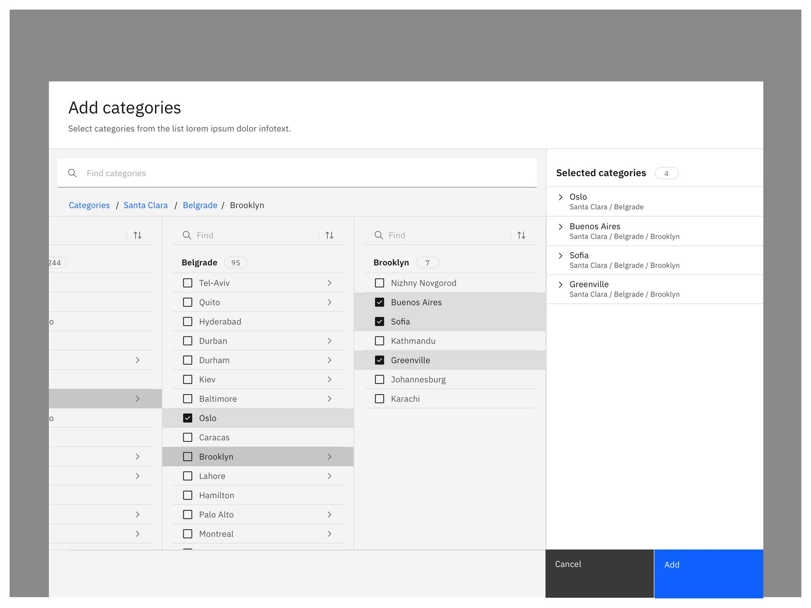
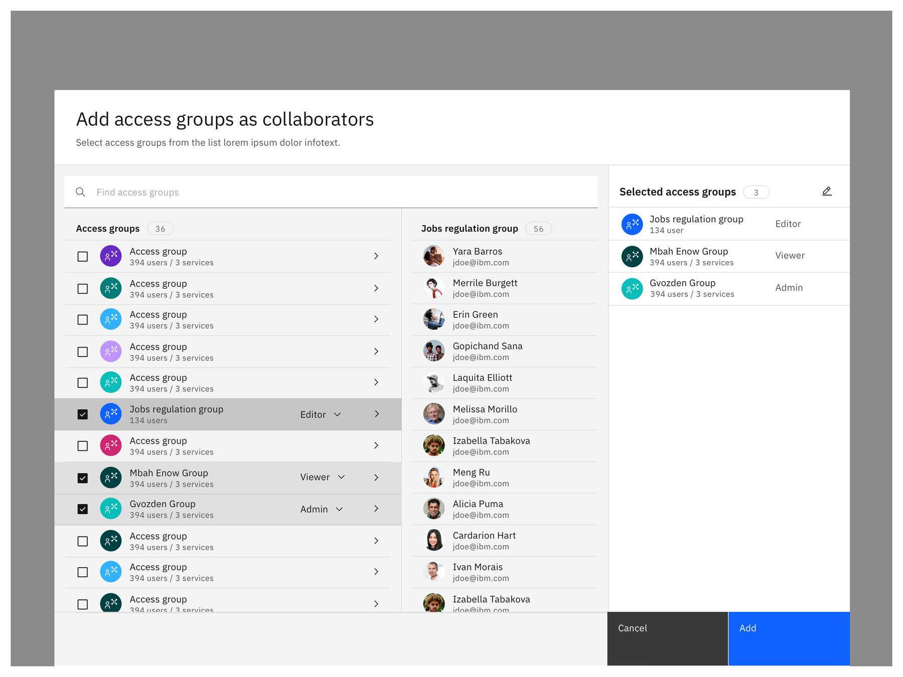
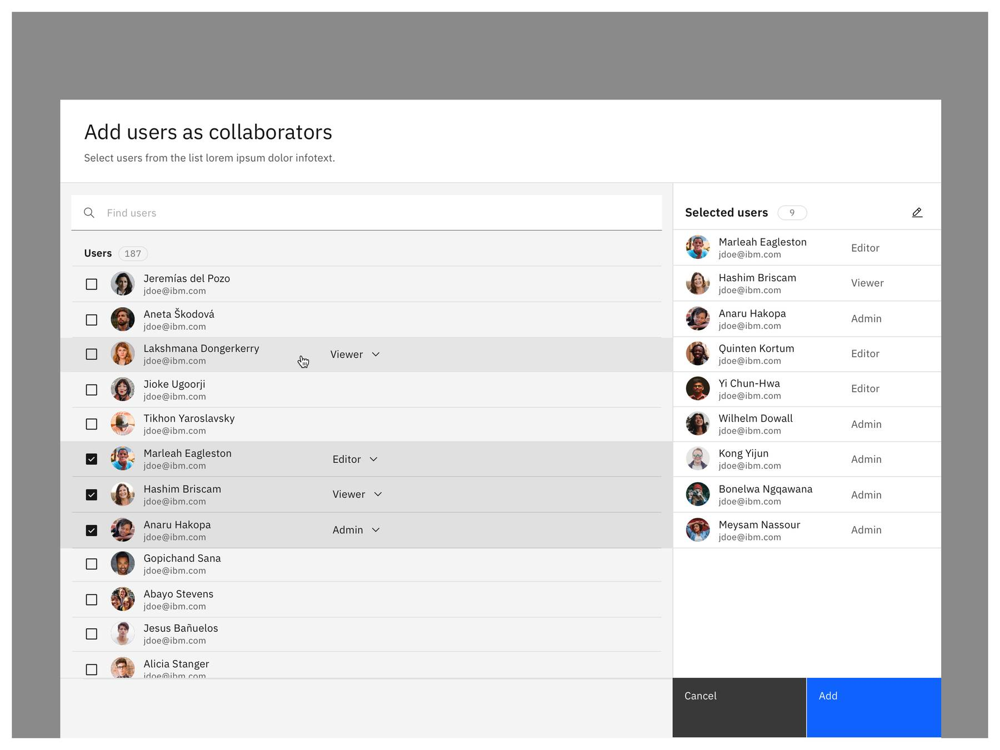
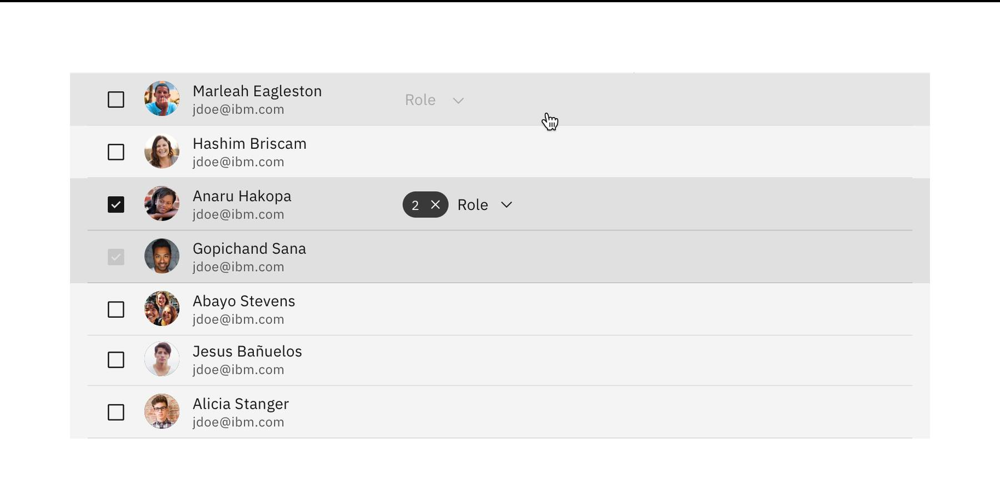
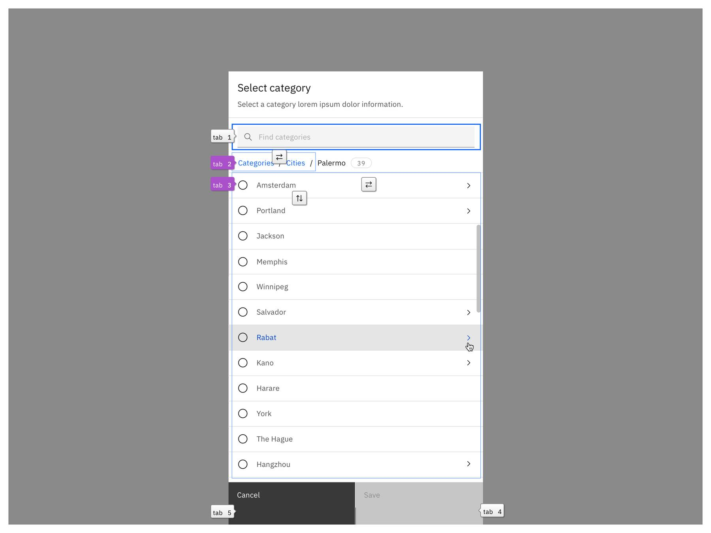

<PageDescription>

The add and select pattern offers simple and complex variations in the format of narrow and wide tearsheets.

</PageDescription>

<AnchorLinks>
   <AnchorLink>Overview</AnchorLink>
   <AnchorLink>Types</AnchorLink>
   <AnchorLink>Anatomy</AnchorLink>
   <AnchorLink>Behaviors</AnchorLink>
   <AnchorLink>Accessibility</AnchorLink>
   <AnchorLink>Related</AnchorLink>
</AnchorLinks>

<Row>
<Column colMd={8} colLg={8}>

</Column>
</Row>

## Overview
Users often need to add or select one or more items from larger lists or hierarchies. They may have additional requirements such as reviewing the items and specifying additional characteristics how they are added or selected. To select is to reference an existing resource. To add is to include an existing resource in a list of references. Both are distinct from creating which generates a new resource and from editing an existing resource. As part of creating and editing a resource the user may need to add or select other resource(s) related to it.

 

## Types

There are two types of flows: Add & select. Adding items from a list can involve additional user steps and is a more complex flow.

### Select flow

Use the select dialog to set or change a resource property or setting that may hold one item or a small condensed list of items. Use it when the items are selected from a large list or hierarchy and the user may have the need to navigate, find or assess items to complete the task.

- Use to set or change a resource property or setting that typically references exactly or at most one item. For example, an Owner property references a user and a source property a file.

- In a select flow the user looks up and selects a single item from a list or hierarchy. Once found, the user confirms this selection to set the item for the property.

- Use to set or change a resource property or setting that holds a small list of items in a condensed form. In this case use a large tearsheet to provide the user with a visible list of their selection in the RHS panel.

### Add flow

Use the add dialog to add one or multiple items to a resource property or setting that holds a list of items. Use it when the items are selected from a large list or hierarchy and the user may have the need to navigate, find or assess items to complete the task.

- Use to add one or multiple items to a list

- The resource property or setting to be set or changed holds a list of items. The flow is used to add items to the list.

- In an add flow the user looks up and selects one or many items from a list or hierarchy. At any time and typically before completing the task the user may review and adjust the selected items.

 

**When to use**

- Use in context of creating a resource (in a tearsheet w/ progress indicator OR as stacked tearsheet)
- Use in context of editing a property or setting
- Use to add one or multiple items from a list or hierarchical structure to a list.
- Use to add one or multiple related items as relationships to an item.
- Use to add users and groups to a lists of collaborators, recipients, etc.
- Use to add files from a folder hierarchy to a list of files.

 

**When not to use**

- Don’t use this pattern for creating or editing a resource but you can use it in context of these. Use the [Create flows](https://www.carbondesignsystem.com/community/patterns/create-flows/) pattern to create a resource.
- Do not mix the add pattern with editing an existing list of items. This is typically realized by Multi-select & batch action as covered in the Carbon [data table](https://www.carbondesignsystem.com/components/data-table/usage/#multi-select-and-batch-action) component. Though in simple cases where the items are represented in a compact list e.g. of tags you can use the Select flow - multiple items to edit the list. In many situations the two actions (edit and add) differ as the list of possible items to add is significantly more than the number of items in the list to edit. Take the example of a list of collaborators in a project compared to the potential users in an organisational directory to add collaborators from.
- Don’t use when the items are from a small and easy to grasp list that does not require navigation and inspection. Use an Inline selection e.g. with a Dropdown or a Modal instead.

<Row>
  <Column colMd={4} colLg={4}>
  <DoDontExample type="do" caption="Use to add one or multiple items to a list.">

  </DoDontExample>
  </Column>
  <Column colMd={4} colLg={4}>
  <DoDontExample type="dark" caption={To create a new resource follow the <a href="https://www.carbondesignsystem.com/community/patterns/create-flows/" >Create flows pattern</a>.}>

  </DoDontExample>
  </Column>
</Row>

 

## Anatomy
### Select flow

<Row>
<Column colMd={8} colLg={8}>

<Caption>
  {' '}
  Select from list {' '}
</Caption>

</Column>
</Row>

<Row>
<Column colMd={8} colLg={8}>

<Caption>
  {' '}
  Select from hierarchy {' '}
</Caption>

</Column>
</Row>

1. **Header:** Includes a title, optional label and description. The title should be brief and clearly describe the dialogs’s task or purpose. Use the optional label above the title set the context for the information in the dialog.
2. **Search:** to find items in the list or hierarchy (optional: filter)
3. **Heading for list / Breadcrumb for hierarchy:** shows user context and count for the list of items.
4. **List of items:** Items are listed with their name, optional additional information and a radio button for selection.
5. **Drill down:** a signifier behind the name of a structural element in a hierarchy indicates that it can be navigated.
6. **Actions:** The primary action is Save, and Cancel aborts the task.
7. **Background overlay:** Screen overlay that obscures the on page content.

| Title                                           | Button label (CTA)                                                                                                                            |
| ---------------------------------------------- | --------------------------------------------------------------------------------------------------------------------------------- | ------------------------------------------------ |
| Select [asset] (Singular)                 | Select / Select & replace                                                                              | 

 

### Add flow

<Row>
<Column colMd={8} colLg={8}>

<Caption>
  {' '}
  Add from list {' '}
</Caption>

</Column>
</Row>

<Row>
<Column colMd={8} colLg={8}>

<Caption>
  {' '}
  Add from hierarchy {' '}
</Caption>

</Column>
</Row>

1. **Header:** Includes a title, an optional label, and an optional description. The title should be brief and clearly describe the dialogs’s task or purpose. Use the optional label above the title set the context for the information in the dialog.
2. **Search:** to find items in the list or hierarchy (optional: filter)
3. **Breadcrumb** (Add from hierarchy only): shows context in the hierarchy and user can navigate the hierarchy.
4. **List header:** shows context and count for the in the list, current location in hierarchy, or search results.
5. **List of items:** Items are listed with their name, optional additional information and a checkbox to select them for adding.
6. **Drill down:** indicates that an item can be navigated as a structural element in a hierarchy. Alternatively as preview of the item’s content if this helps user to make their decision.
7. **Search and sort** (Add from hierarchy only): optional element that allows to search for and sort by items on a specific level 
8. **Preview:** previews the content of the focused item.
9. **Modifier** (Add with modifier only): Include an optional property the user can change defining a detail how the item is added e.g. the role of a collaborator. Modifier appears on hovering row only.
10. **Selected section:** shows user items they have collected and their count. If items are added with a modifier, an Edit action allows the user to make bulk changes.
11. **List of selected items:** lists items with additional information and modifier. Items can be directly removed from list. They can be opened to preview content if this helps user to make their decision.
12. **Actions:** The call to actions are Add, and Cancel.
13. **Background overlay:** Screen overlay that obscures the on page content. See Tearsheet component.

| Title                                           | Button label (CTA)                                                                                                                            |
| ---------------------------------------------- | --------------------------------------------------------------------------------------------------------------------------------- | ------------------------------------------------ |
| Add [assets] (Plural)                 | Add                                                                               | 

### Deciding what to use

For multi-select, make sure you always use a large tearsheet and include a side panel so the user can see which items where selected and can see the selection at a glance before adding to a list.
For single select a narrow tearsheet is recommended (some exceptions are listed below).

| Interaction                       | Type                                                                 | When to use                                                                                                                    |
| ------------------ | --------------------------------------------------------------------------- | ------------------------------------------------------------------------------------------------------------------------------ |
| Select item non-hierarchical           | Narrow tearsheet      | Use when the user needs to find a single item in a large list by scrolling and searching. |
| Select item hierarchical           | Narrow tearsheet      | Use when the user needs to find a single item in a hierarchy by scrolling, navigating and searching.                                                            |
| Add items non-hierarchical           | Wide tearsheet      | For add-flows: Use when the user needs to find multiple items in a large list by scrolling and searching. In some use cases the large tearsheet can be also used for the Select flow: Use when the user wants to select a small set of items from a large list by scrolling and searching (e.g. selecting filters). Use for flat lists only. This select-flow has the same richer anatomy as specified for the Add flow. |
| Add items hierarchical           | Wide tearsheet      | Use when the user needs to find multiple items in a hierarchy by scrolling, navigating and searching. In some use cases the wide tearsheet can be used also for single-select flows – but only when adding an item involves further steps or significant resources or if the user needs further context of the items in order to make an informed decision. See section additional content or navigating a hierarchy.             |
| Add items with modifier           | Wide tearsheet      | Use when adding items from a large list or hierarchy – optionally with preview – when user can specify a detail how to add each item. |
| Add items with additional context           | Wide tearsheet      | Use when adding items from a large list or hierarchy and when the user needs to preview details of the item to decide. |

## Behaviors

<AnchorLinks>
   <AnchorLink>Entrypoint</AnchorLink>
   <AnchorLink>Item selection</AnchorLink>
   <AnchorLink>Flow completion & loading</AnchorLink>
   <AnchorLink>Sidepanel</AnchorLink>
   <AnchorLink>List of items</AnchorLink>
   <AnchorLink>Empty and error states</AnchorLink>
   <AnchorLink>Scrolling</AnchorLink>
   <AnchorLink>Navigating a hierarchy</AnchorLink>
   <AnchorLink>Search and filter</AnchorLink>
   <AnchorLink>Modifier and bulk actions</AnchorLink>
   <AnchorLink>Additional context</AnchorLink>
</AnchorLinks>

 

### Entrypoint

A **select flow** is usually started when the user clicks on a button to set, select, or change an item referenced in an asset or settings page. An **add flow** is usually starts when the user clicks on an add button to add one or multiple items to a list in an asset or settings page. 

Most often these are not the only property on the page and an icon button, tertiary or ghost button should be used. Consider what is most appropriate for your use case. After clicking on the action button, one of the above forms of Add or Select dialogs opens in a tearsheet. The user typically finds the desired item(s) through a combination of scrolling, searching and navigating the list or hierarchy. 

 

<Row>
  <Column colMd={4} colLg={4}>

 

##### Forms (Select single item)

<Caption>
  {' '}
  After the user selected an item, the action button changes from “select” to “edit”.  After clicking the edit   button, the user can select a different item and replace the current one.{' '}
</Caption>

  </Column>

  <Column colMd={4} colLg={4}>

 

##### Forms (Add multiple items)

<Caption>
  {' '}
  After adding multiple items, those will be added to a list. Keep the “add” icon in the right corner of the list. To remove items the user can hover the row and click the remove or delete icon. 
{' '}
</Caption>

  </Column>
</Row>

 

<Row>
  <Column colMd={4} colLg={4}>

 

##### Cards (Select single item)

<Caption>
  {' '}
  After the user selected an item, the action button changes from select to edit.  After clicking the edit button, the user can select a different item and replace the current one. 
{' '}
</Caption>

  </Column>

  <Column colMd={4} colLg={4}>

 

##### Cards (Add multiple items)

<Caption>
  {' '}
  After adding multiple items, those will be added to a list. Keep the add icon in the right corner of the list. To remove items the user can hover the row and click the remove or delete icon. 
{' '}
</Caption>

  </Column>
</Row>

 

<Row>
  <Column colMd={8} colLg={8}>

 

##### Tables (Add multiple items)

<Caption>
  {' '}
  If multiple items should be added, it is recommended to use the data table empty state as entry point. The primary action button on the table triggers the tearsheet/add-flow. Single selections should not be displayed in a table view.
{' '}
</Caption>

  </Column>
</Row>

 

### Item selection

In a **select flow** the user picks an item and confirms the selection using the Select primary button. The primary CTA button label in select-flows is “Select” (or “Select & replace”). In an **add flow** the user selects items which are collected in a list of selected items. At any time and typically before completing their task the user can review and adjust the selected items. Eventually users complete the task by confirming to add the selected items using the CTA button. The primary CTA button label in add-flows is “Add”.

 

### Flow completion & loading

When the user clicks “Select” or “Add” button consider to use an indication of loading or submitting if the operation may take longer. See Carbon’s Loading pattern. Also, see specific guidance for latency (loading) in the Tearsheet component.

The user stays on the same page and typically no additional notification is required for the successful completion. 

#### Dismissing flows
In an add or select flow, the tearsheet does not have a close icon in the top right. This is to enforce the user’s decision to exit the select or add flow by clicking on the word “Cancel”.

 

### Sidepanel

In an add flow the currently selected items are collected and displayed in a side panel. The user can continue discovering and adding further items while keeping track of those already collected. The number shows the count of all selected items not limited by what items are currently shown in the list. At any time the user may decide to remove selected items.

<Row>
  <Column colMd={4} colLg={4}>

 
 

##### Tag to indicate amount of selected items

<Caption>
  {' '}
  Selected items are collected in a side panel. The amount of selected items is indicated in the Carbon outline tag next to the title.{' '}
</Caption>

 </Column>

  <Column colMd={4} colLg={4}>

 

##### Remove selected items

<Caption>
  {' '}
  The user can also remove already selected items by clicking the remove icon. The remove action icon shows only upon hovering the row to avoid unnecessary visual clutter and place the destructive action on a secondary level. Alternatively the user can also deselect the checkbox on the left side in the list.
Interactions follow the [row action buttons](https://pages.github.ibm.com/cdai-design/pal/patterns/data-table/row-action-buttons/) guidance. {' '}
</Caption>

  </Column>
</Row>

 

<Row>
  <Column colMd={4} colLg={4}>

 

##### Expand additional information about selected item

<Caption>
  {' '}
  Before users add the new items, they can expand the row and see more info about the item they have selected. Limit the amount of displayed data to a minimum here. The info shouldn’t replace an actual details page. Only provide enough context of the item so that the user can make an informed decision about the item to add. Interactions follow the expandable rows pattern.
{' '}
</Caption>

  </Column>

  <Column colMd={4} colLg={4}>

 

##### Reorder selected items
<Caption>
  {' '} Users are able to reorder the selected items via drag & drop, if the order of the items matters to the user. This might not be needed for all use cases and is optional. Styles and interactions follow the reorder pattern.
{' '}
</Caption>

  </Column>
</Row>

 

### List of items

In the most minimal version an item in the list is represented by its name. Additional information may be shown to uniquely identify an item. For example, for users the email and a profile component is well suited. 

<Row>
  <Column colMd={4} colLg={4}>

<Caption>
  {' '}
  In a select flow the currently selected item is shown as selected but disabled.
{' '}
</Caption>

 </Column>

  <Column colMd={4} colLg={4}>

<Caption>
  {' '}
  In an add flow already added items are shown as selected but disabled. This anticipates that the existing list might be large and the user not necessarily knows all already added items by heart.
{' '}
</Caption>

  
  </Column>
</Row>

 

### Empty & error states

#### Errors
For the unlikely case of errors, an inline notification may be displayed at the top of the tearsheet under the header zone.

 

#### No access to data
If users don’t have access to data (e.g. there are no items available or user don’t have permission to access items, we recommend to disable the action button already on the screen before to avoid an additional step to enter the tearsheet.

<Row>
  <Column colMd={4} colLg={4}>

<Caption>
  {' '}
  Add information upfront if users cannot perform any add/select action, if data is not available and can’t be accessed.
{' '}
</Caption>

 </Column>

  <Column colMd={4} colLg={4}>

<Caption>
  {' '}
  Ideally we prevent users from entering the tearsheet, if data is not available and they cannot perform any add/select action. There can be edge cases when users don’t have permission to access data and checking user access upfront becomes too expensive. In those cases make sure that you provide appropriate messaging in the tearsheet why data is not available and suggest an action to continue.
{' '}
</Caption>
  
  </Column>
</Row>

 

#### No item selected/added yet
By default when nothing is selected the panel shows an [empty state](https://pages.github.ibm.com/cdai-design/pal/patterns/empty-state/usage). The primary call to action is disabled when no items are selected.

 

#### No search results
If the user enters a search term and items aren’t matching the query, provide the user some feedback and recommend to rerun the search query. If users already selected items before they can still add them and call to action buttons are enabled. If no item was selected previously the primary call to action button stays disabled.

 

### Scrolling

If there are more items than visible, the list may be scrolled. The header is fixed. As there can be thousands of items only the first few are shown immediately as loading all might be too slow. The user’s intent to look for more items in the list (scrolling) is used to trigger an automatic loading of more items when they pass 2/3 of the available scroll area.

The header, search, list heading and breadcrumb are fixed on scroll and the list content scrolls behind them. Loading is indicated by a skeleton representing three list entries. The list should load quickly enough so that they hardly notice the skeleton and it feels like one long list that loads more items outside of the visible area.

To hint scrolling the pattern hints half a row behind the fix footer bar. This behaviour helps the user to get a better idea about the content before discovering items using search.

 

### Navigating a hierarchy

In a hierarchy items in a list may group further items. For instance, you may have a geographical hierarchy with continents, countries, states and cities. When focusing a continent on the top level, you see the second level with its countries. Focusing on a country opens the next level of states. And finally you will access the forth level of cities. An arrow next to an item indicates the further level of items and users can navigate into items by clicking either the name (link) or chevron right (icon) in a column.

 

#### Usage in narrow tearsheet

Use a narrow tearsheet when the user needs to find a single item in a hierarchy. Narrow tearsheets are reserved for single-select-flows. For multi-select, make sure you always use a large tearsheet and include a side panel so the user can see which items where selected and can see the selection at a glance before adding to a list. 

Breadcrumbs are used to navigate between pages to reflect the current location relative to the page. Once found the user selects an item. This enables the Select button. 

 

*This pattern for navigating hierarchies can be also applied in other dense spaces of the UI (e.g. cards or side panels).*

 

#### Usage in wide tearsheets

Use when the user needs to find multiple items in a hierarchy. In some use cases the wide tearsheet can be used also for single-select flows – when selecting an item involves further steps or significant resources or if the user needs further context of the items in order to make an informed decision. 

Breadcrumbs are used to navigate between columns to reflect the current location relative to the column. That way users are able to also jump from a very deep level back to the first level without loosing context. Navigating between the columns is not influencing any selection a user made. The selection a user made stays as-is. Once found the user selects the items. This enables the Add button. 

 

*This pattern for navigating hierachies can be also applied in other areas in the UI (e.g. full-pages).*

 

#### Variations

1. Add a single item from hierarchy
2. Add a parent item with all associated children
3. Add only specific children of a parent item
4. Non-hierarchical with peek inside item (Example user groups)

 

#### 1. Add a single item from hierarchy: 
In some use cases the wide tearsheet can be used also for single-select flows – but only when adding an item involves further steps or significant resources or if the user needs further context of the items in order to make an informed decision. Additional data about the select item can be displayed in the side panel to provide more context about the selection.

 

#### 2. Add a parent item with all associated children:
Use this variation when all items of a parent category should be automatically selected. Make sure to include only the parent items in the selected panel, don’t list all the individual items in the panel. For this use case, consider to add a **Select all** option to the column toolbar.

<Caption>
  {' '}
  When a category is selected, all the artifacts and subcategories within it are automatically selected.
  {' '}
</Caption>

- In a select flow, the currently selected item is shown as selected but is disabled. 
- In an add flow, already added items are shown as selected but is disabled. This anticipates that the existing list might be large and the user not necessarily knows all already added items by heart.

 

#### 3. Add only specific children of a parent item:
Use this variation when only specific and not all items of a parent category should be selected. All individual selected items are listed in the sidepanel. 

<Caption>
  {' '}
  Users can select individual artifacts and subcategories of a category.
  {' '}
</Caption>

 

#### 4. Non-hierarchical with peek inside item (Example user groups):
If there is only one level of information (non-hierarchical), the user can click on the link or chevron and get a list with all the items that are contained in that item.

 

### Search & filter

#### Searching a list
In large lists search is the primary means of discovery. When the dialog opens the focus is set on the search field. Once the user provided a search text the list heading changes to indicate that the list represents the search results. 

Also in a hierarchical structure the search is “global” and returns items across the whole hierarchy (all columns). The user can navigate into structured elements within the search results. The breadcrumbs reflect the current location relative to the search result as starting point.

If users deal with large amount of data and require to search within a specific level of hierarchy (column) see section below **Search, filter & sort within one hierarchy**.

 

#### Filtering
If users deal with large amount of data in a list, it helps to add filtering to find relevant items quicker. Follow guidelines for filtering. 

When the user gets a search result list, results can be also sorted (optional).

 

#### Search, filter & sort within a level of a hierarchy
If there are more than two levels the user can drilldown in a hierarchy. Especially if there are large amount of data, users require an option to filter and sort specific columns. This helps them to easier find an item. Use sorting & filtering only when the hierarchy has more than two levels. For two levels the global search is sufficient.

<Row>
  <Column colMd={4} colLg={4}>

<Caption>
  {' '} Search within one level (column)
{' '}
</Caption>

 

 </Column>

  <Column colMd={4} colLg={4}>

<Caption>
  {' '}  
{' '}
</Caption>

 

 </Column>

  <Column colMd={4} colLg={4}>

 

   </Column>

  <Column colMd={4} colLg={4}>

<Caption>
  {' '} Sort one level (column)
{' '}
</Caption>

  </Column>

  <Column colMd={4} colLg={4}>

<Caption>
  {' '} Filter one level (column)
{' '}
</Caption>

 </Column>
</Row>

 

### Modifier and bulk actions

In some contexts the user needs to specify additional aspects when adding items to a list. For example, when managing collaborators they may want to add one user as Editor and another as Viewer. For unselected items the input field for the modifier appears only on hovering the row. Once an item is selected the modifier stays visible. For already added items the modifier is disabled as well.

Values of the modifier are shown as read-only with each item in the side panel with the summary of selected items. While a value is not set a hint is shown instead.

<Caption>
  {' '}
  When user hovers over a row modifier is shown for that row
  {' '}
</Caption>

In complex situations consider a multi-step tearsheet with progress indicator separating the steps of adding items and setting and changing their aspects. However if the user can set and change only one aspect using an inline input field, use a modifier for this aspect.

#### Set and change modifier
When the user selects an item the modifier is shown and preferably set with a default value. If the modifier is required yet a sensible default can not be provided, the primary action is initially disabled.  Once the modifier is set the primary action is enabled.

<Caption>
  {' '}
  Modifier without default value
  {' '}
</Caption>

*Note: When the modifier opens an elevated part such as a dropdown menu, a user interaction outside the opened modifier should only close the modifier and not immediately trigger another interaction in addition.*

#### Perform bulk actions for selected items

When using a modifier, provide an option to bulk edit the settings of the selected items. Batch actions are functions that may be performed on multiple items within a list.

By clicking the edit icon in the title block, a stacked tearsheet will be triggered. The edit icon always shows a tooltip upon hover describing the action.

 

**Stacked tearsheet to perform bulk actions:**
Once the user selects at least one checkbox from a row, the batch action bar appears at the top of the table, presenting the user with actions they can take. To exit or escape “batch action mode”, the user can cancel out or deselect the items. See Carbon guidelines. When the user saves the changes, they will be applied in the Add tearsheet. 

*Note: When batch mode is active, single actions on the row will be disabled.*

 

### Additional context 
Users can single click a row or click the info/preview icon on the row which triggers additional information about the item in the side panel or a stacked tearsheet. 

#### When to use
Use when the user needs additional information and would like to understand more details of the item to make an informed decision about selecting or adding.

*Note: Additional information is not always needed – evaluate if this functionality is beneficial for your use case and should be added or not.*

#### Trigger

Click on row or selecting the eye icon triggers additional information about the selected item in a sidepanel or stacked tearsheet
<Row>
  <Column colMd={4} colLg={4}>

<Caption>
  {' '}
  Click on row triggers more information about the list item in the RHS panel. Due to discoverability the user also gets an icon on hovering the row.
{' '}
</Caption>

 

 </Column>

  <Column colMd={4} colLg={4}>

<Caption>
  {' '}
  Click on the icon also triggers more information about the list item in the RHS panel or a stacked tearsheet.
{' '}
</Caption>

  
  </Column>
</Row>

 

#### Deciding what to use
There are two ways to display additional context of a list item – either in a stacked tearsheet or in a sidepanel.

<Row>
  <Column colMd={4} colLg={4}>

| Stacked tearsheet |
| ----------------- |
| Use for more complex data that need to be shown in context of the flow to the user (e.g. a preview of a pdf, data set or a notebook). |

<Caption>
  {' '}
Data preview in stacked tearsheet (e.g. data set, notebook, pdf,...){' '}
</Caption>

  </Column>

  <Column colMd={4} colLg={4}>

| Sidepanel |
| --------- |
| Use for simple information that add additional value to the user and help in the decision making for the selection (e.g. meta data). | 

<Caption>
  {' '}
  Additional information in side panel (e.g. meta data)
{' '}
</Caption>

 

 </Column>
</Row>

 

#### To consider when using the sidepanel preview:

- Call out the name of the asset in the header to give the user enough context to what item on the page the meta data relate to. 
- Limit the amount of displayed data to a minimum. The preview shouldn’t replace an actual details page. Display the essence that is required for the user to understand the data in the table better and to make a decision.
- Avoid to add any interactive links in that panel, as this would pull users out of their current work context and bring them out of the tearsheet to a separate page which interrupts their current task of adding items. 

To indicate the user which row is selected and to which item the information in the panel relate to, we add an indicator line (blue, 2 px on the far left of the row). Follow the guidelines of the clickable row items data table pattern. When the panel is triggered the panel covers the selected panel with the primary action buttons. This avoids that users are mislead and might assume they only add one single item. Action buttons for adding are only displayed when the whole selection is visible to the user. 

#### Dismissing the preview panel
To dismiss the preview panel the user can click the close (x) icon or the close button at the bottom of the panel. When the user closes the preview panel the selected panel is displayed again. If the user clicks on a different row in the list, the panel automatically updates its content related to that specific list item. 

## Accessibility

### Tearsheet
The accessibility implementation remains the same as it would for a normal web page and follows standard guidance for visual accessibility.

Using the esc key allows the user to close the tearsheet if there is an X (close) button available. Otherwise, it would highlight the **Cancel** button and allow the user to click ENTER to activate that function. Users should still be able to TAB to the next input field, side menus, or actions. Pressing ENTER activates that input or button. Accessibility patterns should mimic the guidance.

By default the focus should be at the global search input field as searching for items is the primary action a user does when performing an add/select action from a large list or hierarchy.

 

### Table row interactions
Follow the data grid pattern from WAI-ARIA which has several keyboard commands or behavior that make tables easier to navigate:

- There is only one tab stop in a table
- Users navigate the table using arrow keys
- Ctrl+Home will move to the first column, first row
- Ctrl+End will move to the last column, last row

 

 

## Related

- [Dialog](https://www.carbondesignsystem.com/patterns/dialog-pattern)
- [Tearsheet](https://pages.github.ibm.com/cdai-design/pal/components/tearsheet/usage)
- [Modal](https://www.carbondesignsystem.com/components/modal/usage/)
- [Create](https://pages.github.ibm.com/cdai-design/pal/patterns/creation-flows/usage)
- [Sidepanel](https://pages.github.ibm.com/cdai-design/pal/components/side-panel/usage)
- [Buttons](https://www.carbondesignsystem.com/components/button/usage)
- [Breadcrumb](https://www.carbondesignsystem.com/components/breadcrumb/usage/)
- [Empty state](https://pages.github.ibm.com/cdai-design/pal/patterns/empty-state/usage)
- [Data table clickable row items](https://pages.github.ibm.com/cdai-design/pal/patterns/data-table/clickable-row-items)
- [Expandable rows](https://pages.github.ibm.com/cdai-design/pal/patterns/data-table/expandable-rows/)
- [Tags](https://www.carbondesignsystem.com/components/tag/usage)