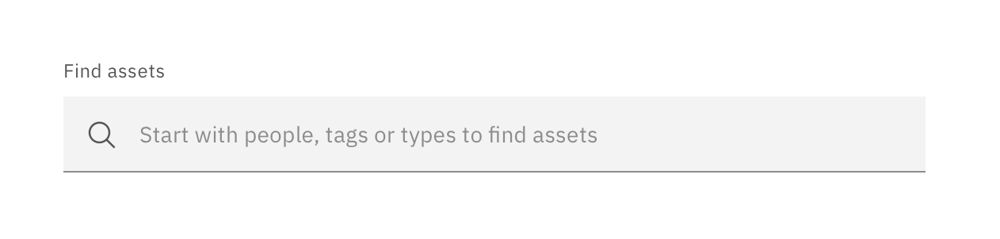
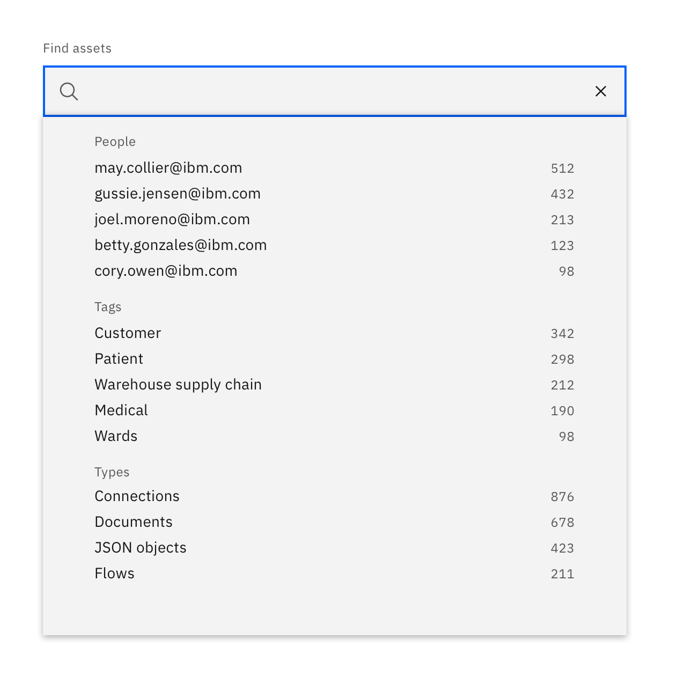
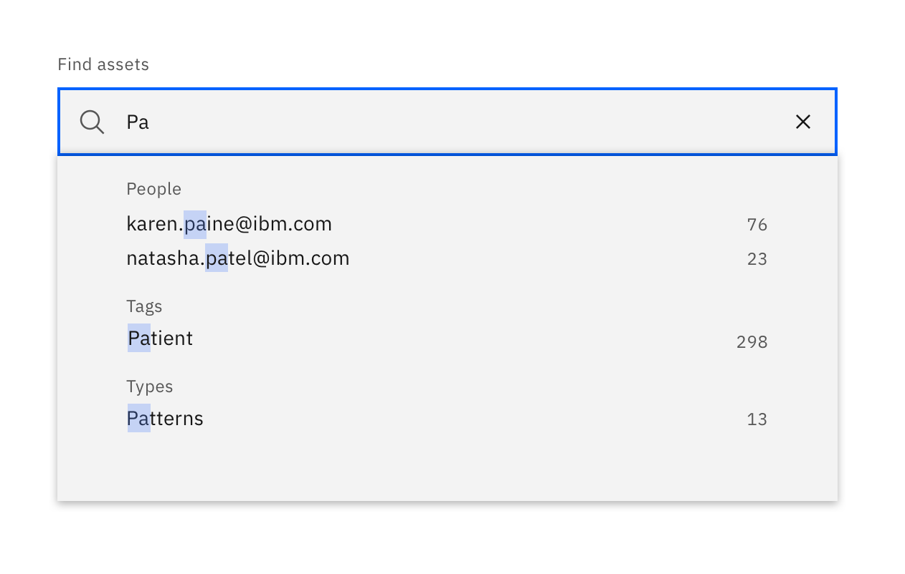
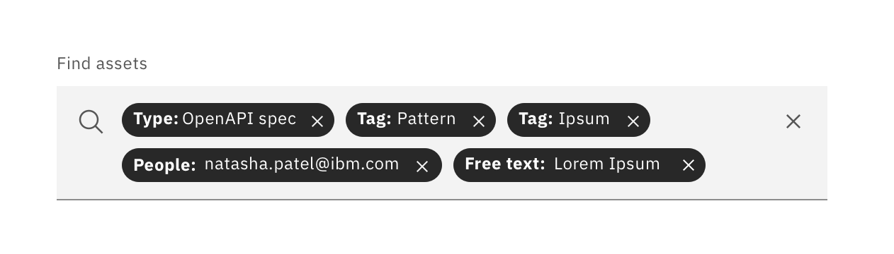

<InlineNotification kind="warning">

**Deprecated**  
This component is outdated and no longer recommended for use. Need this component or something similar? Tell us [here](https://github.ibm.com/CDAI-design/pal).   

It will be removed in the next major version.

</InlineNotification> 

<PageDescription>

_Filtering_ is the mechanism by which a user adds or removes data items from a displayed data set by turning on and off certain predefined attributes.
This addition to the [filtering pattern](https://www.carbondesignsystem.com/patterns/filtering) in Carbon provides _advanced filtering_ in the _selecting filters_ subsection. 

</PageDescription>

### Advanced filtering

_Advanced search_ can be used when the user requires to search and filter a list of items by choosing more than one filter from multiple filter categories. This pattern is especially useful when the number of items within each category is dynamic, such as filtering a table, by a user or user defined tags.

Advanced search is also commonly used when there is not the requried amount of space on the screen to accommodate a vertical list.

 
<Row>
<Column colLg={8}>

</Column>
</Row>
 
 

The filtering categories appear as headers within a dropdown space underneath a search field, with the top five items from within each section appearing as defaults within this space, along with the expected number of returns if the user was to select that option.

 
<Row>
<Column colLg={8}>

</Column>
</Row>
 
 

As the user types into the search field the categories of filters are themselves filtered by the text entered, with the matching text being highlighted.

 
<Row>
<Column colLg={8}>

</Column>
</Row>
 
 

Entering a search term which exactly matches an item within a drop down enters that filter into the search field as a tag with the appropriate label attached. Alternatively a user can select that item directly from the drop down by clicking on it. If the term entered into the search field doesn't match any values within the filter categories then that term is entered as a free text search.

 
<Row>
<Column colLg={8}>

</Column>
</Row>
 
 