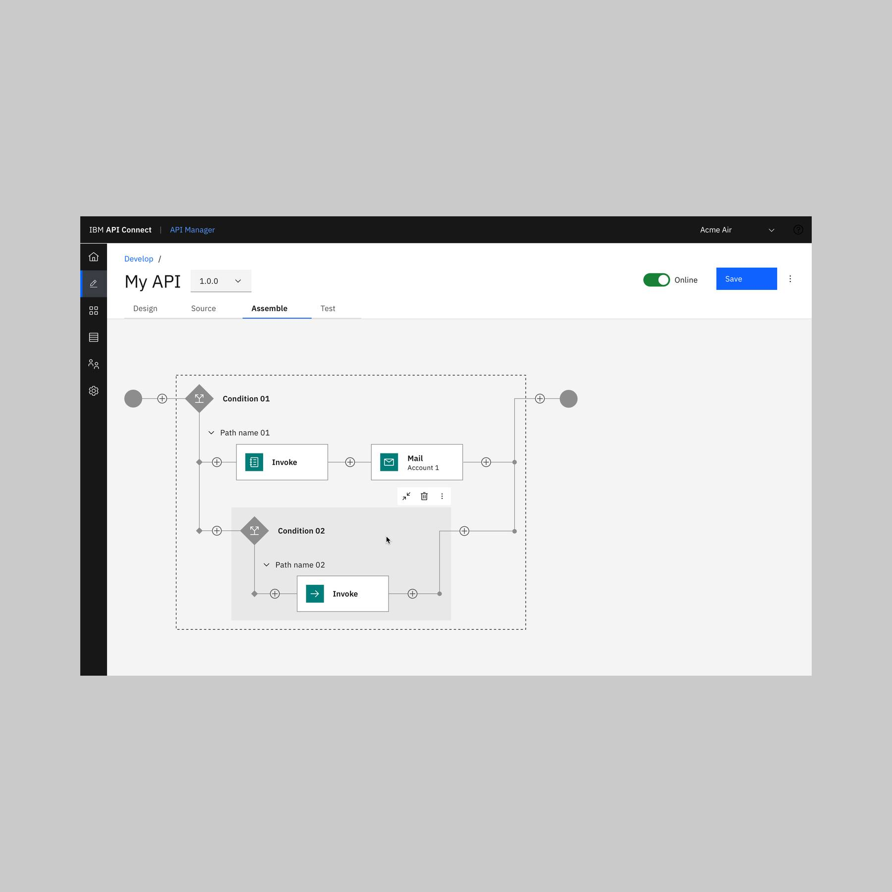
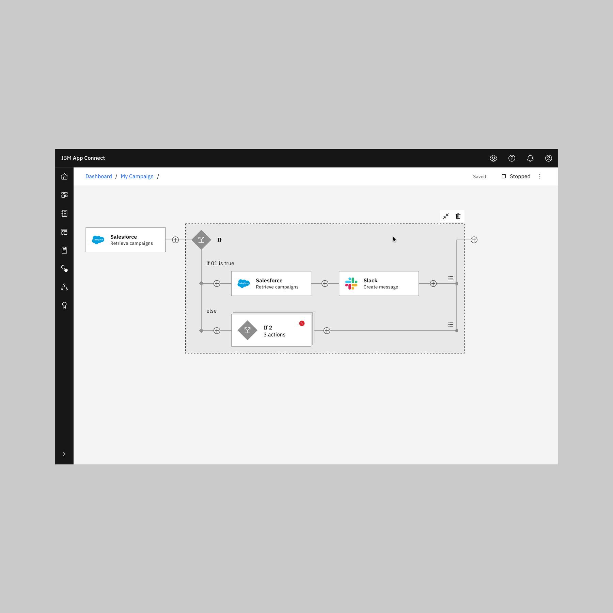
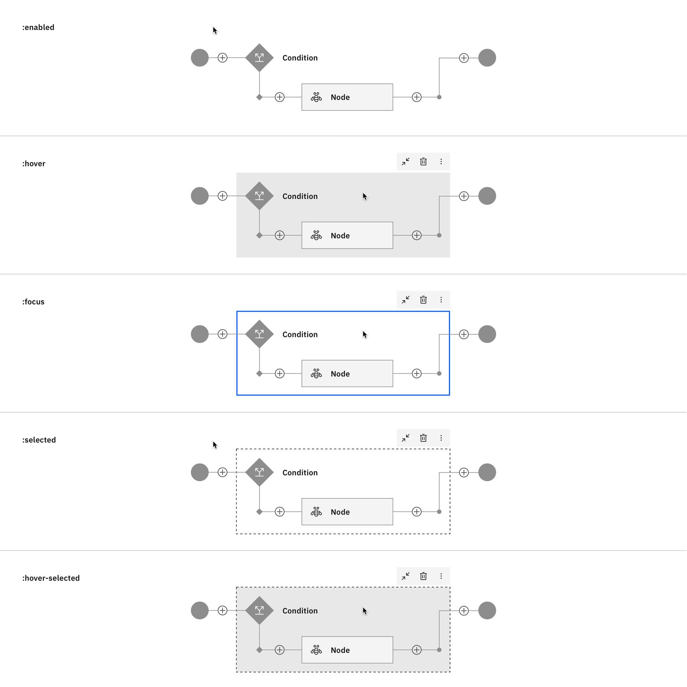
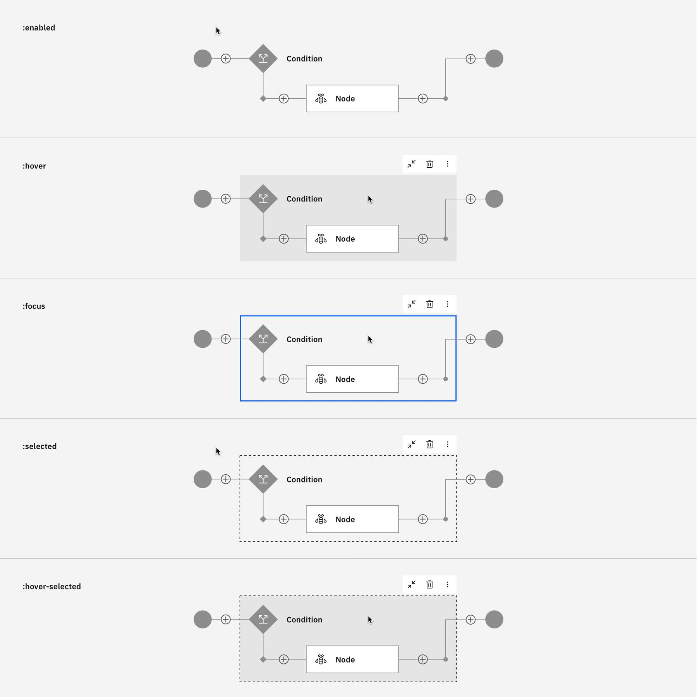
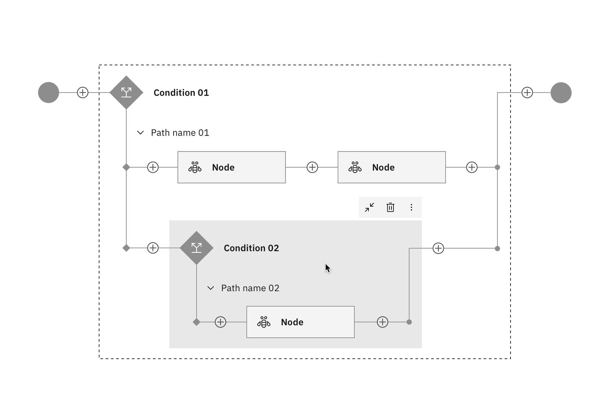
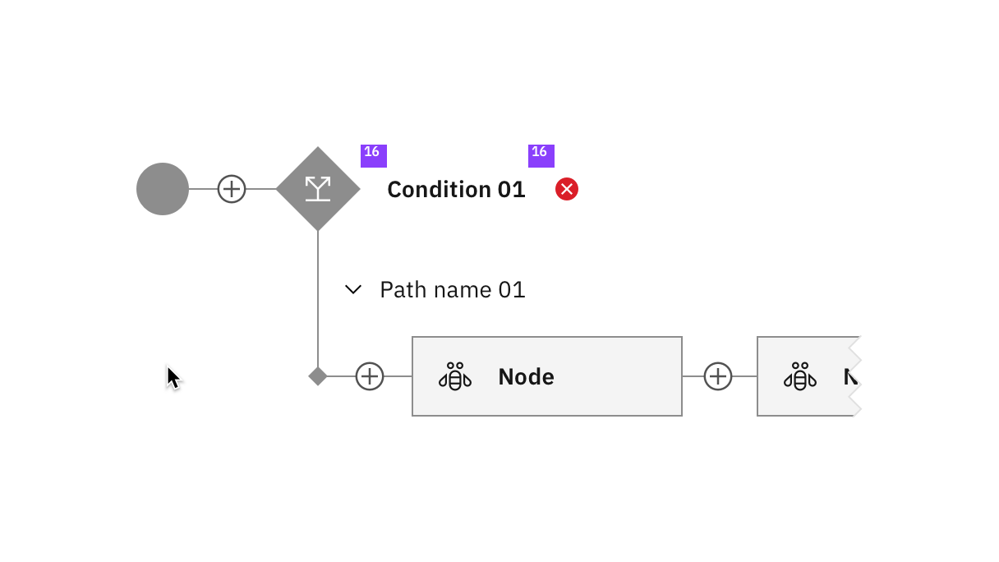

import { Breadcrumb, BreadcrumbItem } from "carbon-components-react";
import { Link } from "gatsby";

<Breadcrumb>
      <BreadcrumbItem href="/patterns/canvas/">
    Canvas
  </BreadcrumbItem>

  <BreadcrumbItem isCurrentPage href="/patterns/canvas/conditionals">
    Conditionals
  </BreadcrumbItem>
</Breadcrumb>

<PageDescription>

Conditionals are if/else statements that give users the ability to define complex and often iterative relationships based on boolean statements. They are depicted as nested content inside a flow, most often a prescriptive flow.

</PageDescription>

<AnchorLinks>
  <AnchorLink>Overview</AnchorLink>
  <AnchorLink>Gallery</AnchorLink>
  <AnchorLink>States</AnchorLink>
  <AnchorLink>Visual guidance</AnchorLink>
</AnchorLinks>

## Overview

The token rules for conditional states are based off of the same rules as [Card nodes.](nodes/card-nodes) However, instead of being applied to an individual canvas object, the tokens are applied to the space on the canvas that the conditional statement occupies.

<Row>
  <Column colMd={8} colLg={8}>

  </Column>
</Row>  

## Gallery

<ImageGallery>

<ImageGalleryImage alt="APIC" title="APIC" col={4}>

</ImageGalleryImage>  

<ImageGalleryImage alt="App Connect" title="App Connect" col={4}>

</ImageGalleryImage>  

</ImageGallery>

## States

Conditional states will follow the same rules and tokens as card nodes.

| State | Element      | Token (Default)     |
| -------- | --------- | ---------- |
| Enabled        | Background fill         | `$transparent`          |
| Hover        | Background fill         | `$hover-ui`          |
| Selected        | Outline         | `$ui-05`, 4 dash-4 gap          |
| Focus        | Border         | `$focus`          |

  

<Row>

<Column colLg={12}>
<Tabs>
<Tab label="White theme">

  

</Tab>

<Tab label="Gray 10 theme">

  

</Tab>

<Tab label="Gray 90 theme">

  

</Tab>

<Tab label="Gray 100 theme">

  

</Tab>

</Tabs>

</Column>

</Row>

### Nested conditionals

#### Condensed nested conditionals

When minimizing a nested conditional, the condensed area becomes the equivalent of a card node.

<Row>
  <Column colMd={4} colLg={8}>

  
1. **Condensed card node**: signifies expandable content
2. **Icon**: signifies the type of conditional content.

</Column>
</Row>  

 

#### Expanded nested conditionals

When nesting conditionals, the same rules will apply as card nodes. However, only the item receiving the interaction will show the state change.

<Row>
  <Column colMd={4} colLg={6}>

<Caption>
User hovers over the parent (Condition 01).
</Caption>
  
  </Column>

<Column colMd={4} colLg={6}>

<Caption>
User hovers over the child condition (Condition 02) after selecting the parent condition (Condition 01).
</Caption>

  </Column>
</Row>  

## Visual guidance

### Spacing

The interior padding of a conditional space is `16px` and the external margin spacing between the "+" icon and the conditional space is `16px`.

<Row>
  <Column colMd={4} colLg={12}>

  
</Column>
</Row>  

### Status

#### Condensed conditionals status

Status will mimic the spacing and [status indicator treatment](https://www.carbondesignsystem.com/patterns/status-indicator-pattern/#choosing-for-context) of the card node. 

<Row>
  <Column colMd={4} colLg={8}>

  
</Column>
</Row>  

#### Expanded conditionals status

The expanded state will place the status indicator `16px` to the right of the condition name for easy visual tracking.

<Row>
  <Column colMd={4} colLg={8}>

  
</Column>
</Row>  

