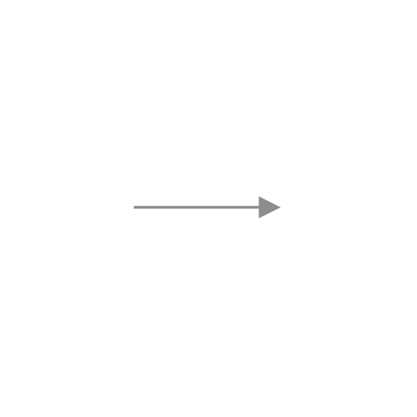
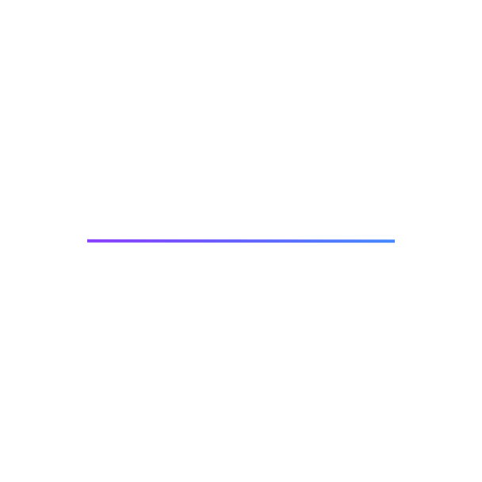

<- [Back to canvas overview](https://pages.github.ibm.com/cdai-design/pal/patterns/canvas/usage)

<PageDescription>

Links are the connective lines found between nodes on a canvas. They can be used to depict varying relationships through thickness, color, and other styles.

</PageDescription>

<AnchorLinks>
  <AnchorLink>Overview</AnchorLink>
  <AnchorLink>States</AnchorLink>
  <AnchorLink>Connections</AnchorLink>
  <AnchorLink>Routing</AnchorLink>
  <AnchorLink>Variants</AnchorLink>
</AnchorLinks>

## Overview

Differing products may have an assortment of names for links like connections, edges, noodles, or lines, but the premise is the same: defining relationship.

## States

The default state for node links is a `1px` thickness using a `$ui-04` color token. This provides a 3:1 minimum contrast against the `$ui-background` token of the canvas.  Links can be selected or hovered over to show more information about the connection between 2 points.

 

<Row>

<Column colLg={8}>
<Tabs>
<Tab label="White theme">

</Tab>

<Tab label="Gray 10 theme">

</Tab>

<Tab label="Gray 90 theme">

</Tab>

<Tab label="Gray 100 theme">

</Tab>

</Tabs>

</Column>

</Row>

## Connections

There are two types of link connection styles: **directional** and **relational**.

### Directional

When connecting links from node to node, there will often be a need to communicate the direction of the overall flow. This will be done with arrowheads. There are two arrowheads currently available: open and closed arrowheads. The default is the open arrowhead as it tends to communicate more clearly when other shapes are used at the ends of the links.

<InlineNotification> 

**Note:** The filled arrow is more visible in arrow-only diagrams. The open arrow is more distinguishable in multi-ending types of diagrams. Some notations like UML use both types to mean different things.

</InlineNotification>

<Row>
  <Column colMd={4} colLg={4}>

<Caption>
  16px open arrow (ui icon size)
  </Caption>

  </Column>

  <Column colMd={4} colLg={4}>

  

<Caption>
  8px x 8px filled arrow
  </Caption>

  </Column>
</Row>

### Relational

A variety of symbols can be used to show different types of relationships between nodes; such as squares, circles, diamonds, or even a port style that bisects a preexisting shape. 

<Row>

  <Column colMd={4} colLg={4}>

<Caption>
Square-8 x 8px
  </Caption>

  </Column>

  <Column colMd={4} colLg={4}>

<Caption>
 Diamond-7 x 7px
  </Caption>

  </Column>
  </Row>
  
<Row>

  <Column colMd={4} colLg={4}>

<Caption>
Circle-8 x 8px
  </Caption>

  </Column>

  <Column colMd={4} colLg={4}>

<Caption>
Block-8px
  </Caption>

  </Column>

</Row>
  
<Row>

  <Column colMd={4} colLg={4}>

<Caption>
Port-5 x 10px/7 x 8px
  </Caption>

  </Column>

  
</Row>

## Routing

The shapes made by the link lines will vary from product to product. Some may need a direct line from node to node while others might require beziers or elbow joints to keep the space legible between nodes.

<Row>
  <Column colMd={4} colLg={4}>

<Caption>
Straight corners   </Caption>

  </Column>

  <Column colMd={4} colLg={4}>

  

  <Caption>
Elbow corners  </Caption>

  </Column>

</Row>
  
<Row>

  <Column colMd={4} colLg={4}>

 

<Caption>
Straight lines
  </Caption>

  </Column>

  <Column colMd={4} colLg={4}>

   

   <Caption>
Bézier lines
  </Caption>

  </Column>
</Row>

## Variants

Style variants include the dashed line, double line, and colorized versions. Use cases might dictate a need to differentiate the way nodes are connected to show connection strength or even forms of status.

### Dashed line

Use dashed lines to show an attempted connection, weak connection, or other differentiator

<Row>
  <Column colMd={8} colLg={8}>

  </Column>
</Row>

### Double line

Can be used as a way of aggregating lines and an entire list of connections with these elements. Instead of having 10 lines, it would show 1 larger line.

<Row>
  <Column colMd={8} colLg={8}>

<Caption>
Two 1.5px lines, 2px of space between them
</Caption>

  </Column>
</Row>

### Colorized line 

Use color to show significance or a gradient to show direction. This should use at least a 3:1 contrast minimum.

Color should be used with an intent — however, do not rely on color alone to convey meaning.

<Row>
  <Column colMd={4} colLg={4}>

<Caption>
  Solid (Single color) line
</Caption>

  </Column>

  <Column colMd={4} colLg={4}>

  

<Caption>
  Gradient line
</Caption>

  </Column>
</Row>

