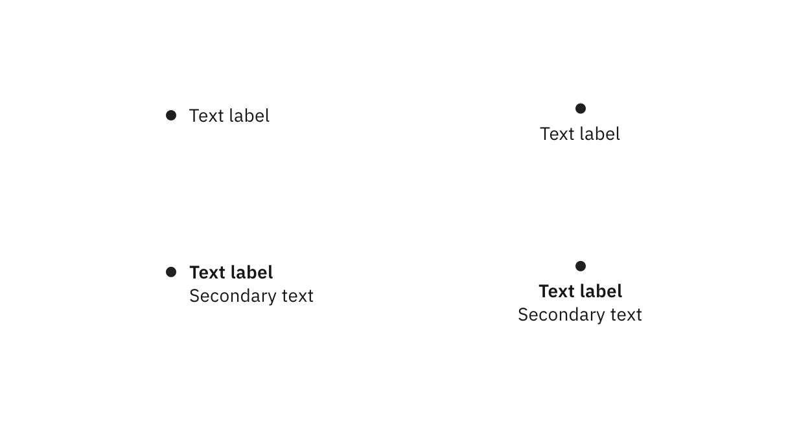
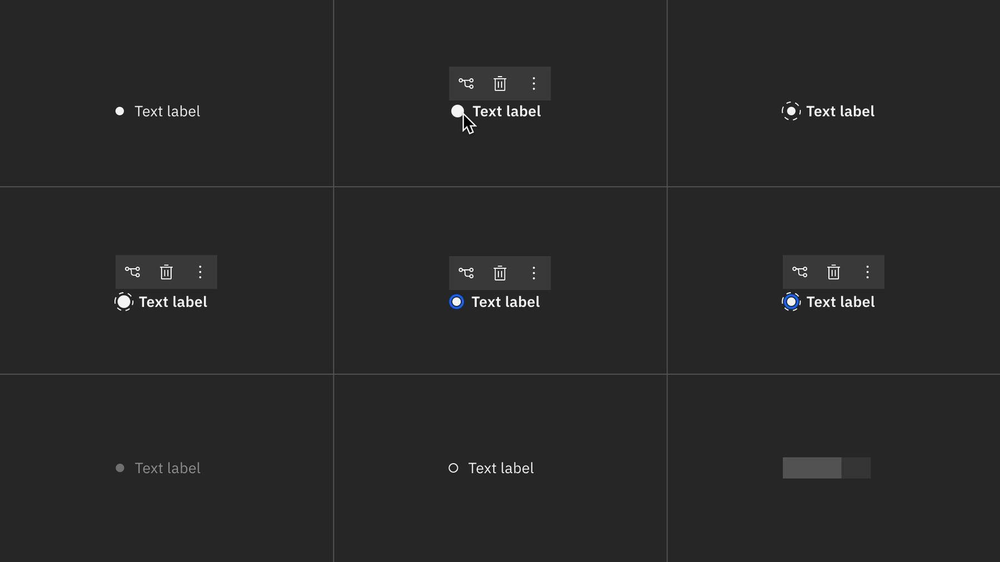

import { Link } from "gatsby";

<- [Back to nodes overview](https://pages.github.ibm.com/cdai-design/pal/patterns/canvas/nodes/nodes-overview)

<PageDescription>

Bullet nodes are the simplest of the node types, focusing strictly on a small shape and identifier text. 

</PageDescription>

<AnchorLinks>
  <AnchorLink>Overview</AnchorLink>
  <AnchorLink>Gallery</AnchorLink>
  <AnchorLink>States</AnchorLink>
  <AnchorLink>Visual guidance</AnchorLink>
</AnchorLinks>

## Overview

Bullet nodes are used to depict the most abbreviated form of visual relationships on canvases. These nodes are denoted by a single small shape and minimal text. Variants may exist in the form of differing shapes. However, the most common shape is a circle.

Dendrograms, also known as Tree Diagrams, are typically use bullet nodes and can be found [here](https://charts.carbondesignsystem.com/?path=/story/complex-charts-tree--dendrogram).

<Row>
  <Column colMd={8} colLg={8}>

  </Column>
</Row>  

## Gallery

<ImageGallery>

<ImageGalleryImage alt="Tririga" title="Tririga dendrogram" col={4}>

</ImageGalleryImage>  

</ImageGallery>

## Node states

Hover, focus, and any other node state that depicts button UX may have a minimum of zero buttons and a maximum of three buttons. All other actions should be placed into the `Overflow`.  button. 

| State | Element      | Token (Default)     |
| -------- | --------- | ---------- |
| Enabled        | Primary text         | `$body-short-01`          |
| Hover       | Primary text         | `$productive-heading-01`          |
| Hover        | Background fill         | `$hover-ui`          |
| Selected        | Bullet outline         | `$ui-05`, 4 dash-4 gap          |
| Focus        | Bullet border         | `$focus`          |
| Disabled        | Primary/Secondary text         | `$disabled-02`          |
| Read-only        | Bullet background fill         | `$ui-background`          |
| Read-only        | Bullet border         | `$ui-05`          |

  

<Row>

<Column colLg={12}>
<Tabs>
<Tab label="White theme">

  

</Tab>

<Tab label="Gray 10 theme">

  

</Tab>

<Tab label="Gray 90 theme">

  

</Tab>

<Tab label="Gray 100 theme">

  

</Tab>

</Tabs>

</Column>

</Row>

## Visual guidance

### Spacing

#### Enabled node spacing

Since space is quite limited on the bullet node, the separation of text and bullet is minimal and takes into account the vertical spacing already included in the text token; hence the variance between `8 pixels` and `10 pixels`.

<Row>
  <Column colMd={8} colLg={8}>

</Column>

</Row>

#### Hover node spacing

On hover, the bullet node's bullet increases in size to `12 pixels` from `8 pixels`, and the text becomes bold (if it is a single line of text).

Buttons appear on focus and/or hover and will appear in the upper left corner (or centered with text if text is centered below the bullet) with a 4px buffer and behave exactly like a standard small button.

<Row>
  <Column colMd={8} colLg={8}>

</Column>
</Row>
