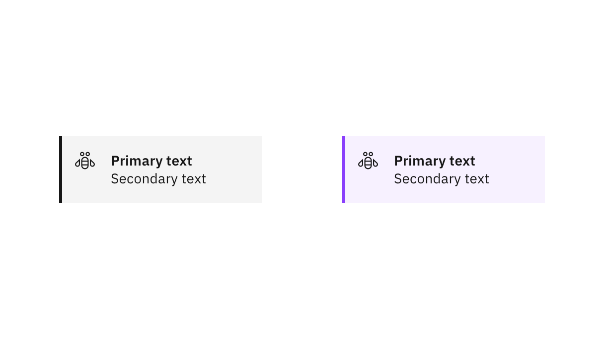
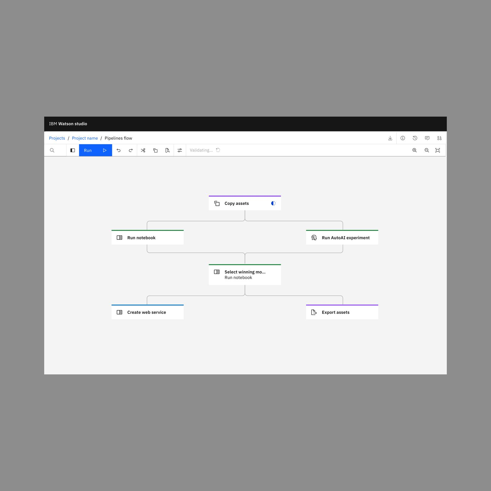
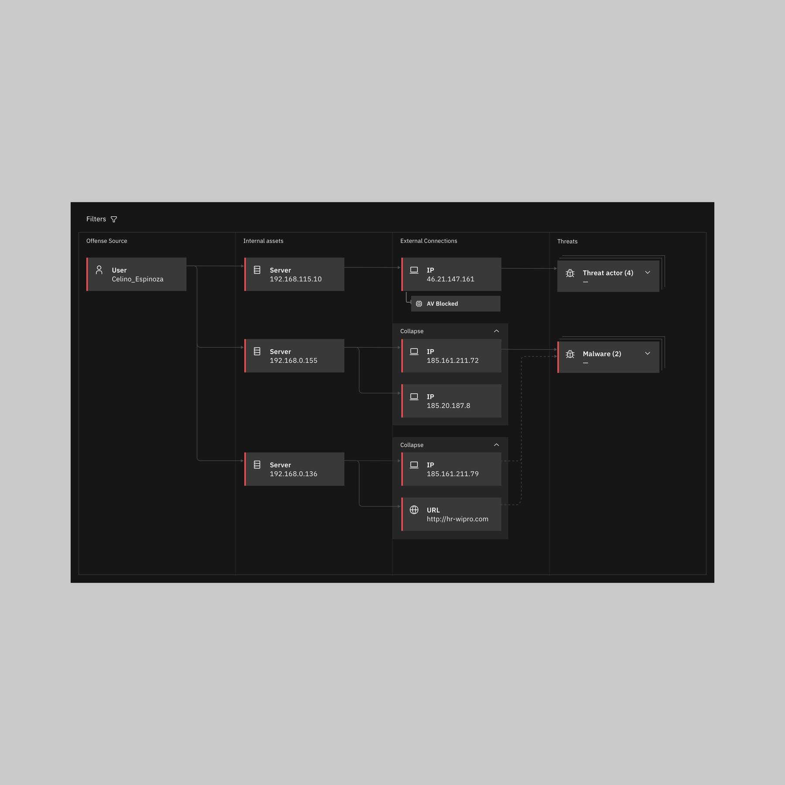
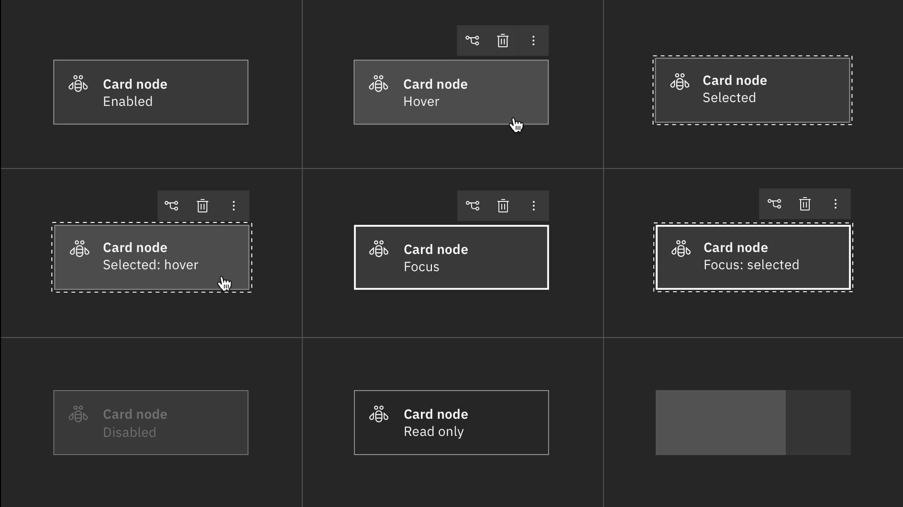

import { Breadcrumb, BreadcrumbItem } from "carbon-components-react";
import { Link } from "gatsby";

<- [Back to nodes overview](https://pages.github.ibm.com/cdai-design/pal/patterns/canvas/nodes/nodes-overview)

<PageDescription>

Card nodes tend to be the most complex of the node styles as they show more text details than the other two node types.

</PageDescription>

<AnchorLinks>
  <AnchorLink>Overview</AnchorLink>
  <AnchorLink>Gallery</AnchorLink>
    <AnchorLink>States</AnchorLink>
  <AnchorLink>Visual guidance</AnchorLink>
    <AnchorLink>Variants</AnchorLink>
</AnchorLinks>

## Overview

Cards nodes are a long-form visual representation best used when typography should be emphasized over icon. 
<Row>
  <Column colMd={8} colLg={8}>

</Column>
</Row>

### Gallery

<ImageGallery>

<ImageGalleryImage alt="datastage" title="DataStage" col={4}>

</ImageGalleryImage>  

<ImageGalleryImage alt="appConnect" title="App Connect" col={4}>

</ImageGalleryImage>

<ImageGalleryImage  alt="pipelines" title="Pipelines" col={4}>

</ImageGalleryImage> 

<ImageGalleryImage alt="swimlane" title="Security" col={4}>

</ImageGalleryImage>   

<ImageGalleryImage alt="API Connect" title="API Connect" col={4}>

</ImageGalleryImage>  

</ImageGallery>

## Node states

Card nodes exist in a bar format and an outlined format. These should not be combined.

`Hover`, `focus`, and any other node state that depicts button UX may have a minimum of zero buttons and a maximum of three buttons. All other buttons should be placed into the `Overflow` button. 

### Bar card nodes

| State | Element      | Token (Default)     |
| -------- | --------- | ---------- |
| Enabled        | Primary text         | `$productive-heading-01`          |
| Enabled        | Secondary text         | `$body-short-01`          |
| Enabled        | Background fill         | `$ui-01`          |
| Enabled        | Sidebar         | `$ui-05`          |
| Hover        | Background fill         | `$hover-ui`          |
| Selected        | Outline         | `$ui-05`, 4 dash-4 gap          |
| Focus        | Border         | `$focus`          |
| Disabled        | Background fill         | `$disabled-01`          |
| Disabled        | Sidebar         | `$disabled-02`          |
| Disabled        | Primary/Secondary text         | `$disabled-02`          |
| Read-only        | Background fill         | `$ui-background`          |
| Read-only        | Border         | `$ui-05`          |

  

<Row>

<Column colLg={12}>
<Tabs>
<Tab label="White theme">

  

</Tab>

<Tab label="Gray 10 theme">

  

</Tab>

<Tab label="Gray 90 theme">

  

</Tab>

<Tab label="Gray 100 theme">

  

</Tab>

</Tabs>

</Column>

</Row>

### Outline card nodes

| State | Element      | Token (Default)     |
| -------- | --------- | ---------- |
| Enabled        | Primary text         | `$productive-heading-01`          |
| Enabled        | Secondary text         | `$body-short-01`          |
| Enabled        | Background fill         | `$ui-01`          |
| Enabled        | Border/outline         | `$ui-04`          |
| Hover        | Background fill         | `$hover-ui`          |
| Selected        | Outline         | `$ui-05`, 4 dash-4 gap          |
| Focus        | Border/outline      | `$focus`         |
| Disabled        | Background fill         | `$disabled-01`          |
| Disabled        | Border/outline       | `$disabled-02`          |
| Disabled        | Primary/Secondary text         | `$disabled-02`          |
| Read-only        | Background fill         | `$ui-background`          |
| Read-only        | Border         | `$ui-05`          |

  

<Row>

<Column colLg={12}>
<Tabs>
<Tab label="White theme">

  

</Tab>

<Tab label="Gray 10 theme">

  

</Tab>

<Tab label="Gray 90 theme">

  

</Tab>

<Tab label="Gray 100 theme">

  

</Tab>

</Tabs>

</Column>

</Row>

## Visual guidance

### Spacing

#### Enabled node spacing

The spatial proportions of the card node is based on that of the standard [Carbon notification](https://www.carbondesignsystem.com/components/notification/style/#structure). 

<Row>
  <Column colMd={8} colLg={8}>

</Column>

</Row>

#### Using logos

There are occasions when a larger identifying visual must be used, and actual logos are required. Their presence must be more obvious than the standard `20px` icon and must be rendered at `32px` instead.

<Row>
  <Column colMd={8} colLg={8}>

</Column>
</Row>

#### Hover node spacing

Buttons appear on focus and/or hover and will appear in the upper right corner with a 4px buffer and behave exactly like a standard small button.

<Row>
  <Column colMd={8} colLg={8}>

</Column>
</Row>

## Variants

### Format variants

Card nodes can have four format variants: a bar that can be placed on the left side, top, or on the bottom of the node—depending on the direction of the represented flow, and an outline version that can be used for multiple card shapes, like rounded corners or pills. 

<Row>
  <Column colMd={8} colLg={8}>

</Column>
</Row>

### Shape variants

The default shape for card nodes is rectangular. However, oulined nodes can use a rounded rectangle or a pill shape. Only the rectangular-shaped card can be combined with a side or underbar.

<Row>
  <Column colMd={8} colLg={8}>

 

</Column>
</Row>

### Color variants

Card nodes can use default carbon tokens as well as custom colors. The colored nodes should be monochrome, using shades of the same color. Please follow the specs in the table below

| State | Element      | White     |   Gray 10 | Gray 90      | Gray 100     |
| -------- | --------- | ---------- | -------- | --------- | ---------- |
| Enabled        | Background fill    | `Color 10`    | `Color 20`   | `Color 80`    | `Color 90`          |
| Enabled        | Bar    | `Color 50` or darker  | `Color 50` or darker  | `Color 60` or lighter  | `Color 60` or lighter          |
| Enabled        | Outline    | `Color 50` or darker  | `Color 50` or darker  | `Color 60` or lighter  | `Color 60` or lighter          |
| Hover        | Background fill   | `Color 20`  | `Color 30`  | `Color 70`  | `Color 80`         |

 

### Status variants

In card nodes, status can be expressed in two different ways: one option is coloring the side bar using the support tokens, the other is using a status icon or shape in the upper right corner. When using the bar color to express status, make sure you have a secondary method of conveying the same meaning, using either text or the icon, to comply with color blindness accessibility standards. 

<Row>
  <Column colMd={4} colLg={4}>

#### Card node status icons

<Caption>

  Status icons should follow the pattern found in [Carbon](https://www.carbondesignsystem.com/patterns/status-indicator-pattern).

</Caption>

  </Column>

  <Column colMd={4} colLg={4}>

  #### Card node status bar

  

<Caption>
  
  Status bars use the same size as typical left borders but employ support colors.
  
</Caption>

  </Column>
</Row>

