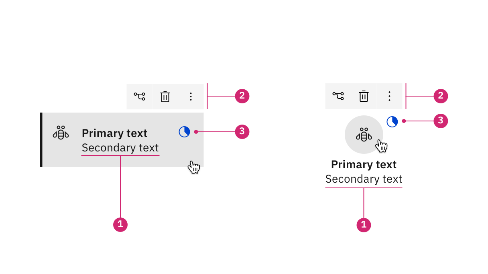
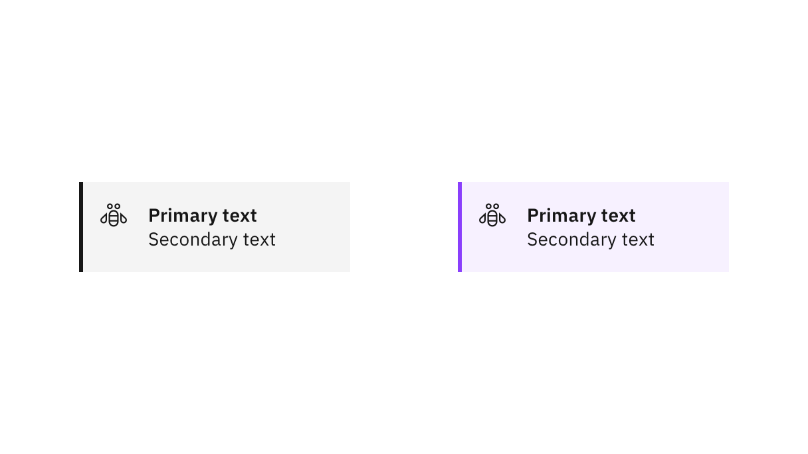
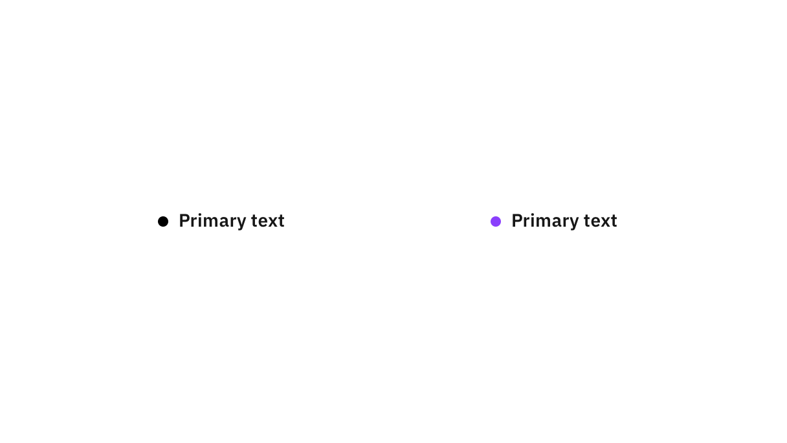

import { Breadcrumb, BreadcrumbItem } from "carbon-components-react";
import { Link } from "gatsby";

<Breadcrumb>
  <BreadcrumbItem href="/patterns/canvas/">
    Canvas
  </BreadcrumbItem>
  <BreadcrumbItem isCurrentPage href="/patterns/canvas/nodes/nodes-overview">
    Nodes overview
  </BreadcrumbItem>
</Breadcrumb>

<PageDescription>

Canvases use nodes as a way to depict relationships across an experience. Nodes can number in the thousands quite often and typically require some flexibility in their usage. 

</PageDescription>

<AnchorLinks>
  <AnchorLink>Overview</AnchorLink>
  <AnchorLink>Node types</AnchorLink>
  <AnchorLink>Related</AnchorLink>
</AnchorLinks>

## Overview

Node anatomy will vary per use case but is most often depicted using some combination of text and graphic.

<Row>
  <Column colMd={8} colLg={8}>

</Column>
</Row>

Anatomy of a node (card and shape nodes):
1. Text identifier (Primary/secondary text)
2. Icon identifier (Optional but recommended)
3. Interactive elements (Typically found in hover or focus states)
4. Status (Optional)

## Node types

Nodes have three distinct types that address particular use cases: **cards**, **shapes**, and **bullets**.

### Card nodes

[Card nodes](card-nodes) are used for prescriptive canvases (e.g.- in visual programming) and several non-prescriptive canvas experiences.  

<Row>
  <Column colMd={8} colLg={8}>

</Column>
</Row>

### Shape nodes

[Shape nodes](shape-nodes) are best used when icons need to receive the emphasis for the gestalt. These nodes are more short-form compared to the card nodes and are beneficial when a distinct shape is required when using several thousand nodes on a canvas.  

<Row>
  <Column colMd={8} colLg={8}>

</Column>
</Row>

### Bullet nodes

[Bullet nodes](bullet-nodes) are the most visually abbreviated gestalt. Bullets are the most short-form node type as they are represented only by a small shape and minimal text. They are used mostly in [tree diagrams](https://www.carbondesignsystem.com/data-visualization/complex-charts#tree-diagrams).  

<Row>
  <Column colMd={8} colLg={8}>

</Column>
</Row>

## Related

- [Notifications](https://www.carbondesignsystem.com/components/notification/style#structures)
- [Status indicators](https://www.carbondesignsystem.com/patterns/status-indicator-pattern/)
- [Tiles](https://www.carbondesignsystem.com/components/tile/usage/#formatting)