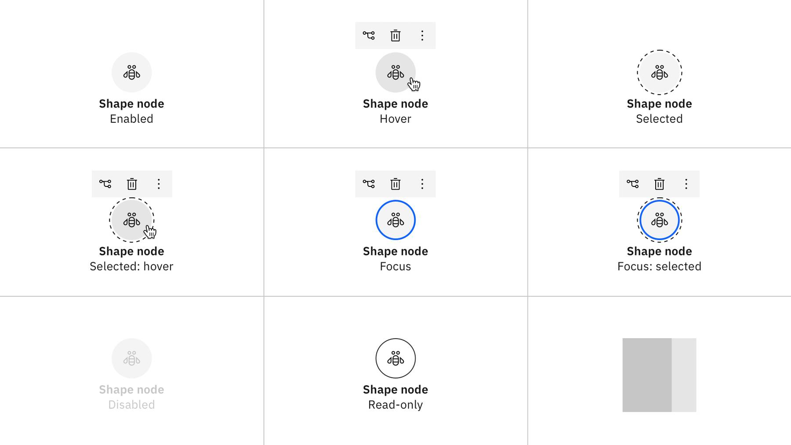
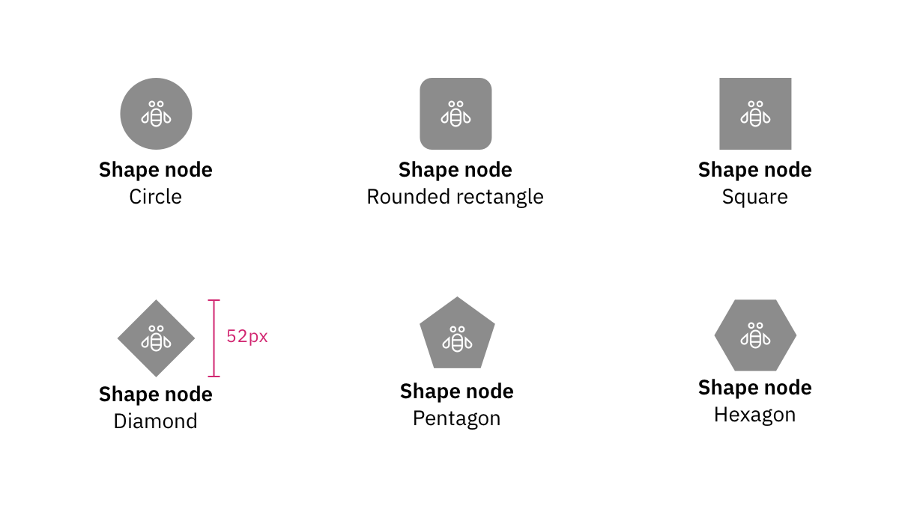

import { Breadcrumb, BreadcrumbItem } from "carbon-components-react";
import { Link } from "gatsby";

<- [Back to nodes overview](https://pages.github.ibm.com/cdai-design/pal/patterns/canvas/nodes/nodes-overview)

<PageDescription>

Shape nodes, true to their name, emphasize the shapes surrounding their icon identifiers. Text is typically lower hierarchically compared to Card nodes as the user will rely on the gestalt of the shapes to scan for the node they need to configure.

</PageDescription>

<AnchorLinks>
  <AnchorLink>Overview</AnchorLink>
  <AnchorLink>Gallery</AnchorLink>
  <AnchorLink>States</AnchorLink>
  <AnchorLink>Visual guidance</AnchorLink>
    <AnchorLink>Variants</AnchorLink>
</AnchorLinks>

## Overview

Shape nodes are most often found in [non-prescriptive canvases](../canvas-style#non-prescriptive-flows). Distinctive shapes can be combined with icons to establish meaning.

<Row>

 <Column colMd={8} colLg={8}>

 

 </Column>
</Row>

## Gallery

<ImageGallery>

<ImageGalleryImage alt="Modeler" title="Modeler flows" col={4}>

</ImageGalleryImage>  

<ImageGalleryImage alt="Tririga" title="Tririga" col={4}>

</ImageGalleryImage>  

</ImageGallery>

## States

### Shape nodes

Both high- and low-contrast settings exist for card nodes. These contrast settings should not be combined.

`Hover`, `focus`, and any other node state that depicts button UX may have a minimum of zero buttons and a maximum of three buttons. All other buttons should be placed into the `Overflow` button. 

<InlineNotification>

The examples show the low contrast node version. High-contrast and outlined versions are also available.

</InlineNotification>

| State | Element      | Token (Low-contrast)     | Token (High-contrast)     |
| -------- | --------- | ---------- | ---------- |
| Enabled        | Primary text         | `$productive-heading-01`          | `$productive-heading-01`          |
| Enabled        | Secondary text         | `$body-short-01`          | `$body-short-01`           |
| Enabled        | Background fill         | `$ui-01`          | `$ui-01`          |
| Enabled        | Border/outline         | `$ui-04`          | N/A          |
| Hover        | Background fill         | `$hover-ui`          | `$hover-secondary`             |
| Selected        | Outline         | `$ui-05`, 4 dash-4 gap          | `$productive-heading-01`          |
| Focus        | Border/outline      | `$focus`         | `$focus`+ 1px padding         |
| Disabled        | Background fill         | `$disabled-01`          | `$productive-heading-01`          |
| Disabled        | Border/outline       | `$disabled-02`          | `$disabled-02`          |
| Disabled        | Primary/Secondary text         | `$disabled-02`          | `$disabled-02`            |
| Read-only        | Background fill         | `$ui-background`          | `$ui-background`              |
| Read-only        | Border         | `$ui-05`          | `ui-05`         |

 

<Row>

<Column colLg={12}>
<Tabs>
<Tab label="White theme">

  

</Tab>

<Tab label="Gray 10 theme">

  

</Tab>

<Tab label="Gray 90 theme">

  

</Tab>

<Tab label="Gray 100 theme">

  

</Tab>

</Tabs>

</Column>

</Row>

## Visual guidance

### Spacing

Shape nodes have two configurations to account for when considering their spacing: **Text below** and **Text on the right**. 

The most popular tends to be the **Text below** option due to its footprint.

<Row>

 <Column colMd={8} colLg={8} >

 </Column>

</Row>

### Hover buttons

Buttons appear on focus and/or hover and will appear centered on top of the node, with a 4px buffer. Their position is fixed—independent of node shape or state.

<Row>
  <Column colMd={4} colLg={4}>

 

 <Caption>

 **Hover state:** buttons spacing, circle node

 </Caption>

  </Column>
  <Column colMd={4} colLg={4}>

 

 <Caption>

**Hover state:** buttons spacing, square node

 </Caption>

  </Column>

</Row>

 ## Variants

### Shape variants

For shape nodes, a wide variety of shapes can be used to convey meaning. Other shapes are permissible but should be used with restraint.

<InlineNotification>

`Diamonds` have slightly altered heights due to how they take up space. They are 52px tall instead of the standard 48px tall.

</InlineNotification>

<Row>
  <Column colMd={8} colLg={8}>

</Column>
</Row>

### Format variants

Shape nodes can have two format variants: solid and outlined. The solid version can be low contrast and high contrast. The fill color in the solid high contrast version and the outline color in the outlined version meet contrast accessibility. The low contrast nodes are accessible, but the shapes in those nodes are not. Do not use varying shapes when using low contrast nodes.

<Row>
  <Column colMd={8} colLg={8}>

</Column>
</Row>

### Color variants

Shape nodes might use several color variants from high-contrast gray to low-contrast gray. They may also employ actual color (which might also be high- or low-contrast.)

To prevent issues with color-blind users, it is advised to assign one color to a specific shape and not deviate. This way any time a user encounters a particular node with a background color, its shape will consistently correlate. 

| State | Element      | White     |   Gray 10 | Gray 90      | Gray 100     |
| -------- | --------- | ---------- | -------- | --------- | ---------- |
| Enabled        | Background fill    | `Color 10`    | `Color 20`   | `Color 80`    | `Color 90`          |
| Enabled        | Bar    | `Color 50` or darker  | `Color 50` or darker  | `Color 60` or lighter  | `Color 60` or lighter          |
| Enabled        | Outline    | `Color 50` or darker  | `Color 50` or darker  | `Color 60` or lighter  | `Color 60` or lighter          |
| Hover (low-contrast)       | Background fill   | `Color 20`  | `Color 30`  | `Color 70`  | `Color 80`         |
| Hover (high-contrast)       | Background fill   | enabled color plus 1 step   | enabled color plus 1 step   | enabled color minus 1 step        | enabled color minus 1 step        |

 

<Row>

<Column colLg={8}>
<Tabs>
<Tab label="White theme">

  

</Tab>

<Tab label="Gray 10 theme">

  

</Tab>

<Tab label="Gray 90 theme">

  

</Tab>

<Tab label="Gray 100 theme">

  

</Tab>

</Tabs>

</Column>

</Row>

### Status variants

In shape nodes, status can be expressed by using a status icon or shape in the upper right corner. Statuses should follow the pattern found in [Carbon](https://www.carbondesignsystem.com/patterns/status-indicator-pattern/#choosing-for-context).

<Row>
  <Column colMd={8} colLg={8}>

</Column>
</Row>
