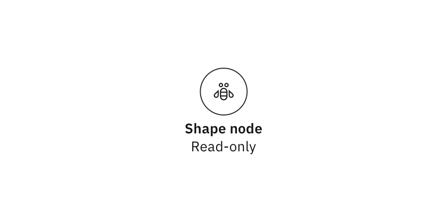

<- [Back to canvas overview](https://pages.github.ibm.com/cdai-design/pal/patterns/canvas/usage)

<PageDescription>

A read-only canvas will occur when users have view permissions and cannot edit the file, or perhaps when another user is editing; thus locking out others to prevent changes.

</PageDescription>

<AnchorLinks>
  <AnchorLink>Overview</AnchorLink>
  <AnchorLink>States</AnchorLink>
  <AnchorLink>Visual guidance</AnchorLink>
  <AnchorLink>Variants</AnchorLink>
</AnchorLinks>

## Overview

Users may find themselves in a variety of scenarios where the canvas may be viewed but not edited. 

As such, users will be greeted with a badge on the canvas stating that this is a read-only (or locked canvas) scenario. Just as important: prior to ever viewing the canvas, a user should receive UX clues letting them know that the file they were about to access would be uneditable to them. 

_This can be done easily with a lock icon or an icon explaining the file's contents are "uneditable"._

<InlineNotification>

**Note:** The guidance on this page will focus exclusively on the content of the canvas as opposed to read-only states for components found in a configuration side panel

</InlineNotification>

## States

### Canvas design

#### Standard view

The canvas will remain unchanged and will continue to use `$ui-background` as its color token. The **read-only badge** will be horizontally-centered and `16px` from the top of the canvas.

<Row>

  <Column colMd={8} colLg={8}>

  </Column>
  
  </Row>  

#### Side panels

When side panels open to configure nodes, the badge will horizontally-center itself on whatever canvas is visible. 

<Row>

  <Column colMd={8} colLg={8}>

  </Column>
  
  </Row>  

### Badge design

The badge has two states: enabled and focus.

<Row>
  <Column colMd={6} colLg={4}>

<Caption>

Enabled state

</Caption>

  </Column>

<Column colMd={6} colLg={4}>

<Caption>

Focus state

</Caption>

  </Column>
</Row>  

### Node design

Nodes will use the wireframe-styled `Read-only` state found in the [Card nodes](/patterns/canvas/nodes/card-nodes#outline-card-nodes) and [Shape nodes](/patterns/canvas/nodes/shape-nodes#shape-nodes) guidance. 

#### Card node

<Row>
  <Column colMd={6} colLg={6} noGutterMdLeft>

  </Column>

</Row>  

| State | Element      | Token (Default)     |
| -------- | --------- | ---------- |
| Read-only        | Background fill         | `$ui-background`          |
| Read-only        | Border         | `$ui-05`          |

 

#### Shape node

<Row>
  <Column colMd={6} colLg={6} noGutterMdLeft>

  </Column>

</Row>  

| State | Element      | Token (Low-contrast)     | Token (High-contrast)     |
| -------- | --------- | ---------- | ---------- |
| Read-only        | Background fill         | `$ui-background`          | `$ui-background`              |
| Read-only        | Border         | `$ui-05`          | `ui-05`         |

## Visual guidance

### Style
<Row>
  <Column colMd={8} colLg={4}>

<Caption>

Badge background uses `$background-inverse`. Icon and `$productive-heading-01` text use `$inverse-01` color token.

</Caption>

  </Column>

  <Column colMd={8} colLg={4}>

<Caption>

Icon and text will be vertically and center-align to the badge.

</Caption>

  </Column>
  
  </Row>  

### Spacing

Badge content is evenly-spaced `16px` from side-to-side with a `20px` icon to the left of the text.

<Row>
  <Column colMd={8} colLg={8}>

  </Column>
</Row>  

## Variants

### Text

The badge currently has two text options: `Read-only` and `Locked.`
<Row>
  <Column colMd={6} colLg={4}>

<Caption>

  The "Read-only" badge appears when a user doesn't have permission to edit a particular file but still has the ability to view it.

</Caption>

  </Column>

<Column colMd={6} colLg={4}>

  <Caption>

  The "Locked" badge appears when a user is editing a file but another user accesses that file. 

  </Caption>

  </Column>
</Row>  

### Tooltips

Occasionally additional messaging is required to communicate things such as "X-user is currently editing this file". In these instances, tooltips are permitted. 

These tooltips can be either accessed by hovering over or focusing on the badge.

They should be center-aligned to the badge and use a tooltip with a center carat on top of the tooltip with a max-wdith of `192px`.

<Row>
  <Column colMd={8} colLg={8}>

  </Column>
</Row>  
