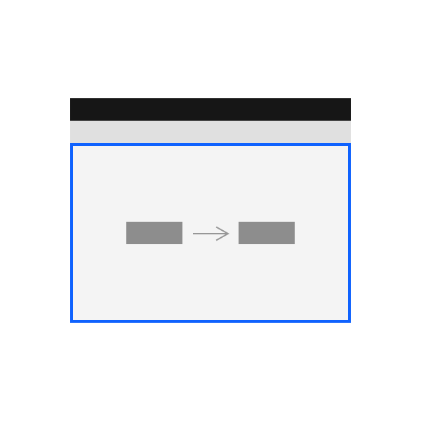
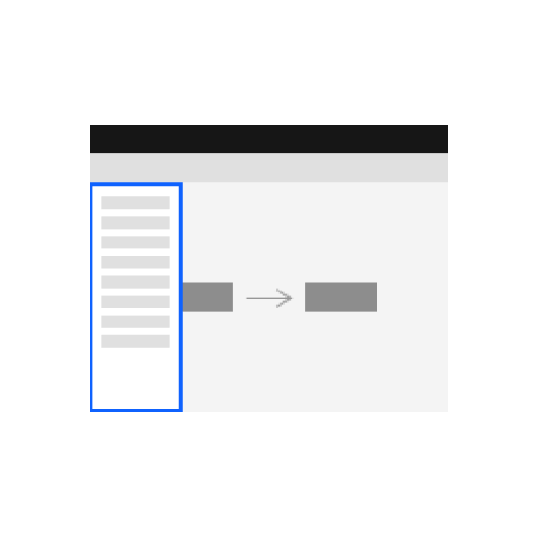
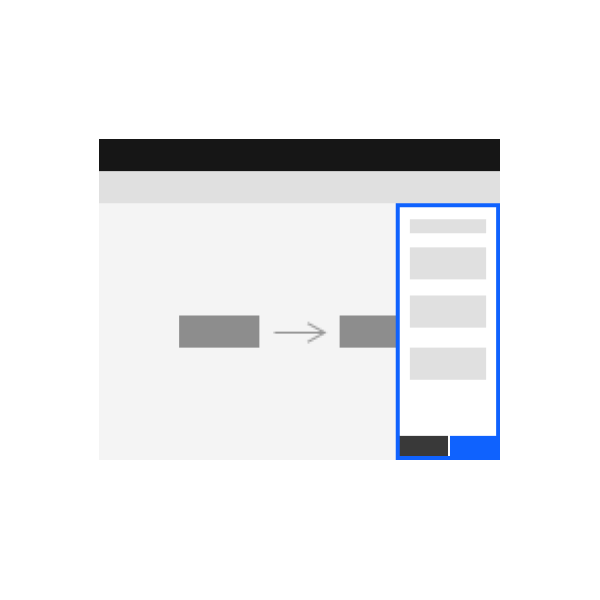

<InlineNotification>

**Under review**   
The Canvas patterns and components are under review. Please follow this documentation and check back often for updates. For immediate concerns, please contact <strong>Jennifer Jennings</strong> or <strong>Keesa Robinson.</strong>  

</InlineNotification> 

<PageDescription>

Canvases allow users to build visual representations of systems. They are most appropriately used when there is a need to display deep complexity and relationships across those systems.

</PageDescription>

<AnchorLinks>
  <AnchorLink>Overview</AnchorLink>
  <AnchorLink>When to use</AnchorLink>
  <AnchorLink>Gallery</AnchorLink>
  <AnchorLink>Related</AnchorLink>
  <AnchorLink>References</AnchorLink>
</AnchorLinks>

## Overview

Canvases are environments in which interactive nodes connect to one another. They are often drag-and-drop interfaces but are not limited only to that definition.

 

<Row className="image-card-group">

<Column colMd={3} colLg={3} noGutterSm>

<ImageCard 
sub-title="Canvas style"
sub-titleColor="dark"
hoverColor="dark"
href="/patterns/canvas/canvas-style">

</ImageCard>

<ImageCard 
sub-title="Palettes – coming soon"
sub-titleColor="dark"
hoverColor="dark"
href="#"
disabled>

</ImageCard>

<ImageCard 
sub-title="Keyboard commands (a11y) – coming soon"
sub-titleColor="dark"
hoverColor="dark"
href="/patterns/canvas/keyboard-commands"
disabled
>

</ImageCard>

</Column>

<Column colMd={3} colLg={3} noGutterSm>

<ImageCard 
sub-title="Nodes"
sub-titleColor="dark"
hoverColor="dark"
href="/patterns/canvas/nodes/nodes-overview">

</ImageCard>

<ImageCard 
sub-title="Toolbars – coming soon"
sub-titleColor="dark"
hoverColor="dark"
href="#"
disabled>

</ImageCard>

<ImageCard 
sub-title="Read-only canvas"
sub-titleColor="dark"
hoverColor="dark"
href="/patterns/canvas/read-only-canvas"
>

</ImageCard>

</Column>

<Column colMd={3} colLg={3} noGutterSm>

<ImageCard 
sub-title="Links"
sub-titleColor="dark"
hoverColor="dark"
href="/patterns/canvas/links">

</ImageCard>

<ImageCard 
sub-title="Navigation – coming soon"
sub-titleColor="dark"
hoverColor="dark"
href="#"
disabled>

</ImageCard>

<ImageCard 
sub-title="Node annotation – coming soon"
sub-titleColor="dark"
hoverColor="dark"
href="#"
disabled>

</ImageCard>

</Column>

<Column colMd={3} colLg={3} noGutterSm>

<ImageCard 
sub-title="Node configuration"
sub-titleColor="dark"
hoverColor="dark"
href="/patterns/canvas/node-configuration">

</ImageCard>

<ImageCard 
sub-title="Cursor settings"
sub-titleColor="dark"
hoverColor="dark"
href="/patterns/canvas/cursor-settings"
>

</ImageCard>

<ImageCard 
sub-title="Conditionals (Prescriptive canvas – coming soon"
sub-titleColor="dark"
hoverColor="dark"
href="conditionals"
disabled
>

</ImageCard>

</Column>

</Row>

### Gallery

<ImageGallery>

<ImageGalleryImage alt="appConnect" title="appConnect" col={3}>

</ImageGalleryImage>

<ImageGalleryImage  alt="pipelines" title="Pipelines" col={3}>

</ImageGalleryImage>

<ImageGalleryImage alt="swimlane" title="Security" col={3}>

</ImageGalleryImage>  

<ImageGalleryImage alt="tririga" title="Tririga" col={3}>

</ImageGalleryImage>  

<ImageGalleryImage alt="datastage" title="DataStage" col={3}>

</ImageGalleryImage>  

<ImageGalleryImage alt="playbookDesigner" title="Playbook Designer" col={3}>

</ImageGalleryImage>

<ImageGalleryImage alt="Modeler flows" title="Modeler flows" col={3}>

 

</ImageGalleryImage>  

<ImageGalleryImage alt="Tririga" title="Tririga dendrogram" col={3}>

</ImageGalleryImage>  

</ImageGallery>

## Related

- [Disabled states](https://www.carbondesignsystem.com/patterns/disabled-states/)
- [Network diagrams](https://www.carbondesignsystem.com/data-visualization/complex-charts#network-diagrams)
- [Overflow menu](https://www.carbondesignsystem.com/components/overflow-menu/usage/)
- [Status indicators](https://www.carbondesignsystem.com/patterns/status-indicator-pattern/)
- [Tile](https://www.carbondesignsystem.com/components/tile/usage/)
- [Tooltip](https://www.carbondesignsystem.com/components/tooltip/usage/)

## References

- [NNG Drag and Drop Heuristic](https://www.nngroup.com/articles/drag-drop/)
- [NNG Cards component](https://www.nngroup.com/articles/cards-component/)

## Contributors

- Jennifer Jennings (Lead)
- Keesa Robinson (Lead)
- Diana Stanciulescu
- Eva Dage 
- Terra Banal
