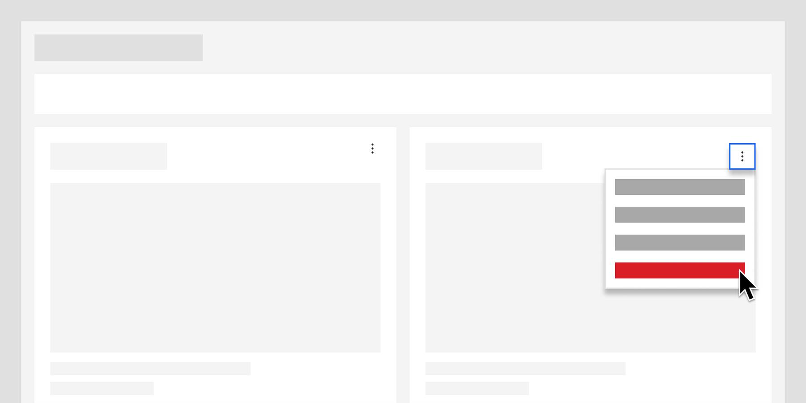

export const Title = () => (
  
    Additive and   destructive functions
  
);

<InlineNotification>

**Note:** While there are distinct deletion/removal patterns already found in the [Carbon for IBM Products](https://pages.github.ibm.com/cdai-design/pal/patterns/removing/usage) site, the information below more directly relates to dashboard interactions.

</InlineNotification>

<- [Back to dashboard overview](https://pages.github.ibm.com/cdai-design/pal/patterns/dashboards/usage)

<PageDescription>

Page description text to come. Page description text to come. Page description text to come. Page description text to come. Page description text to come. Page description text to come. Page description text to come. 

</PageDescription>

<AnchorLinks>
  <AnchorLink>Overview</AnchorLink>
  <AnchorLink>When to use</AnchorLink>
  <AnchorLink>References</AnchorLink>
</AnchorLinks>

## Overview

Text to come.

<Row>
  <Column colMd={4} colLg={8}>

</Column>
</Row>

## Duplicating cards

Users can duplicate an existing card on the dashboard if they want to use a similar format, but display different data.  To duplicate a card, go to the actions menu on the card and select Duplicate card. The new copy of the card will be positioned next to the original card, pushing the surrounding cards to the next available spot.
Duplicate card

### Best practices

- Do rename the duplicated card to be unique from the original.
- Do place the duplicated card next to the original card by default.
- Don't place the duplicated card in the empty spot after the last card.

## Deleting cards 

To delete a card on the dashboard, go to the actions menu on the card and select Delete card. Delete should be highlighted as a danger action in the menu.

## Delete confirmation

For direct edit, the user should be prompted with a delete confirmation modal when deleting a card. For controlled edit, if the edit mode supports the Undo action, a delete confirmation is not required.
Delete card

