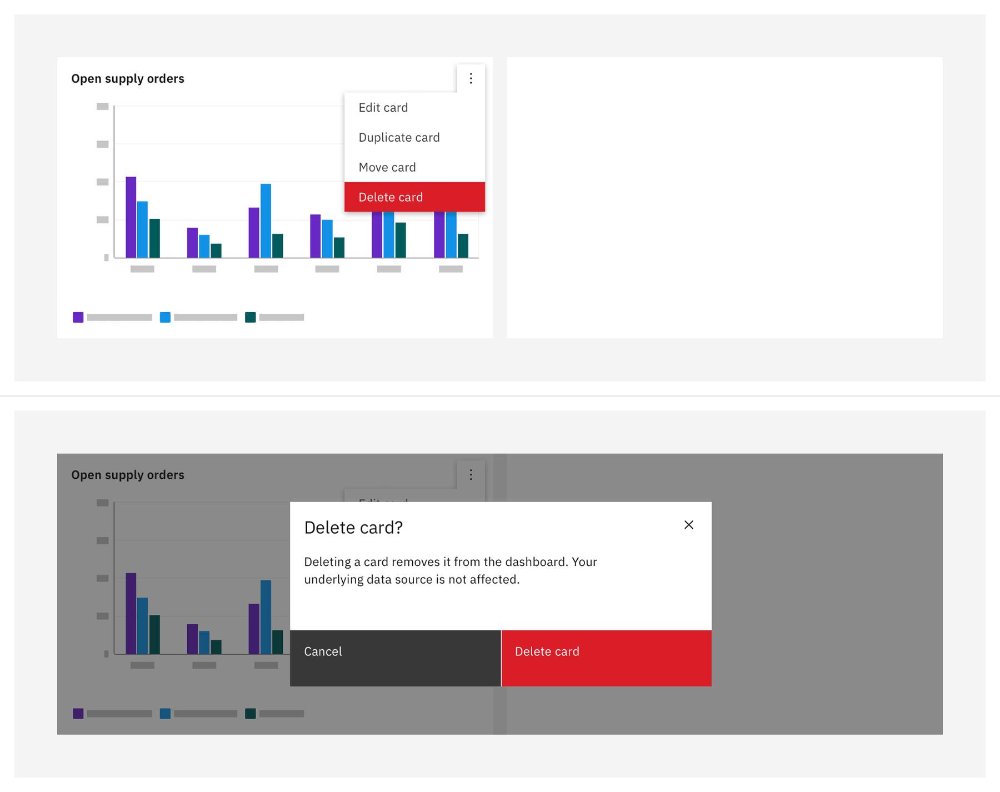

export const Title = () => (
  
    Additive and   destructive functions
  
);

<InlineNotification>

**Note:** While there are distinct deletion/removal patterns already found in the [Carbon for IBM Products](https://pages.github.ibm.com/cdai-design/pal/patterns/removing/usage) site, the information below more directly relates to dashboard interactions.

</InlineNotification>

<- [Back to dashboard overview](https://pages.github.ibm.com/cdai-design/pal/patterns/dashboards/usage)

<PageDescription>

The additive and destructive functions involved here will focus on the cards themselves. This will include card creation, card duplication and card deletion.

Any sort of alteration of preexisting cards will fall under the purview of `Edit`.

</PageDescription>

<AnchorLinks>
  <AnchorLink>Overview</AnchorLink>
  <AnchorLink>Adding cards</AnchorLink>
  <AnchorLink>Duplicating cards</AnchorLink>
  <AnchorLink>Deleting cards</AnchorLink>
</AnchorLinks>

## Overview

Adding, duplicating, and deleting cards will all behave quite similarly to the editing of the larger scale dashboard but will have a much more granular end result. 

<Row>
  <Column colMd={4} colLg={8}>

</Column>
</Row>

## Adding cards

To add a new card, use the side panel for card selection and configuration. A new card can be dragged from the side panel or gets added to the end of the dashboard upon click. The page will scroll to the placement of the new card on the dashboard.

#### Drag and drop

Users can select a card from the gallery and then drag and drop it onto the dashboard.

<Row>
  <Column colMd={4} colLg={8}>

</Column>
</Row>

<Caption>
Example of adding a card using drag and drop
</Caption>

#### Keyboard controls

Make the add interactions accessible for non-mouse users by providing an Add button on the card when it’s in focus.

<Row>
  <Column colMd={4} colLg={8}>

</Column>
</Row>

<Caption>
Example of adding a card through the configuration panel with add on focus
</Caption>

## Duplicating cards

Users can duplicate an existing card on the dashboard if they want to use a similar format, but display different data.  To duplicate a card, go to the actions menu on the card and select Duplicate card. The new copy of the card will be positioned next to the original card, pushing the surrounding cards to the next available spot.

<Row>
  <Column colMd={4} colLg={8}>

</Column>
</Row>

## Duplicating cards

Users can duplicate an existing card on the dashboard if they want to use a similar format, but display different data.  To duplicate a card, go to the actions menu on the card and select Duplicate card. The new copy of the card will be positioned next to the original card, pushing the surrounding cards to the next available spot.
Duplicate card

### Best practices

- Do rename the duplicated card to be unique from the original.
- Do place the duplicated card next to the original card by default.
- Don't place the duplicated card in the empty spot after the last card.

## Deleting cards 

To delete a card on the dashboard, go to the actions menu on the card and select `Delete card`. _Delete should be highlighted as a danger action in the menu._

### Delete confirmation

For direct edit, the user should be prompted with a delete confirmation modal when deleting a card. For controlled edit, if the edit mode supports the Undo action, a delete confirmation is not required.

<Row>
  <Column colMd={4} colLg={8}>

</Column>
</Row>

