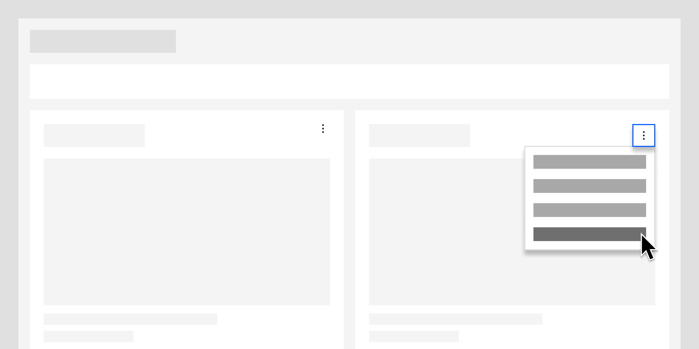

<InlineNotification>

**Note:** While there are distinct editing patterns already found in the [Carbon for IBM Products](https://pages.github.ibm.com/cdai-design/pal/patterns/edit/usage) site, the information below more directly relates to dashboard interactions.

</InlineNotification>

<- [Back to dashboard overview](https://pages.github.ibm.com/cdai-design/pal/patterns/dashboards/usage)

<PageDescription>

Page description to come.

</PageDescription>

<AnchorLinks>
  <AnchorLink>Overview</AnchorLink>
  <AnchorLink>Move cards</AnchorLink>
  <AnchorLink>Resizing cards</AnchorLink>
</AnchorLinks>

## Overview

copy coming.

<Row>
  <Column colMd={4} colLg={8}>

</Column>
</Row>

## Move cards

Two ways to move cards are available: drag and drop or keyboard controls when in a move card mode.

#### Drag and drop

You can move the card in any direction by clicking the card, dragging it to your desired location, and dropping it.

#### Keyboard controls

To access the move card mode, go to the actions menu on the card and select `Move card`, which puts the card in a selected state. Use keyboard `arrow keys` to move it to across the dashboard. After the card is in the new position, press the `Enter` key to set the card’s position.

## Resizing cards
Two ways are available to resize cards: dragging the edges of the card or selecting preset sizes in the configuration panel.

#### Drag and drop

Dragging the edges of the card will snap the card to the next width and height available. The user can drag the sides or the corners of the cards to adjust the card size. When dragging to resize, the new card size will automatically push the surrounding cards to the next available spot on the dashboard.

#### Keyboard controls

Resizing a card can also be done with a keyboard to make the interaction accessible. Provide preset sizes as a card configuration option in the side panel, which allows the user to `tab` to the menu option and select an appropriate size for the card.

