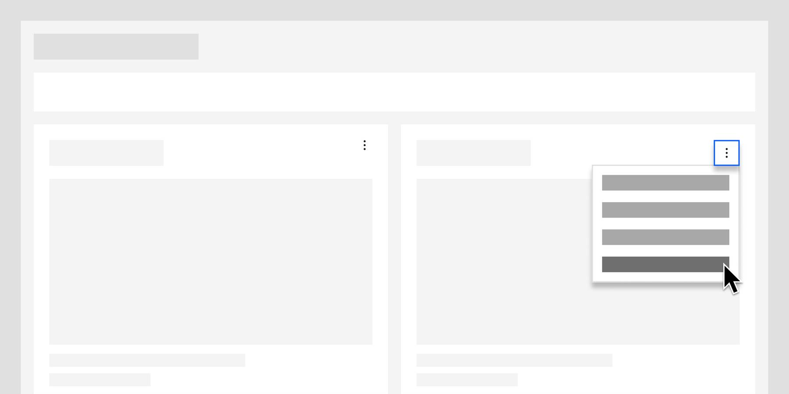

<- [Back to dashboard overview](https://pages.github.ibm.com/cdai-design/pal/patterns/dashboards/usage)

<PageDescription>

There are additional functions available to dashboard cards; such as filtering content or performing bulk actions 

</PageDescription>

## Overview

Beyond adding, deleting, and editing, users will find they need to perform more distinct functions in their dashboard cards. This section will contain those functions.

The following content remains to be added:

- Bulk card actions
- Filter on dashboard
- Filter by date
- Set alerts
- Share card
- Show trends
- Switch chart type

<Row>
  <Column colMd={4} colLg={8}>

</Column>
</Row>
