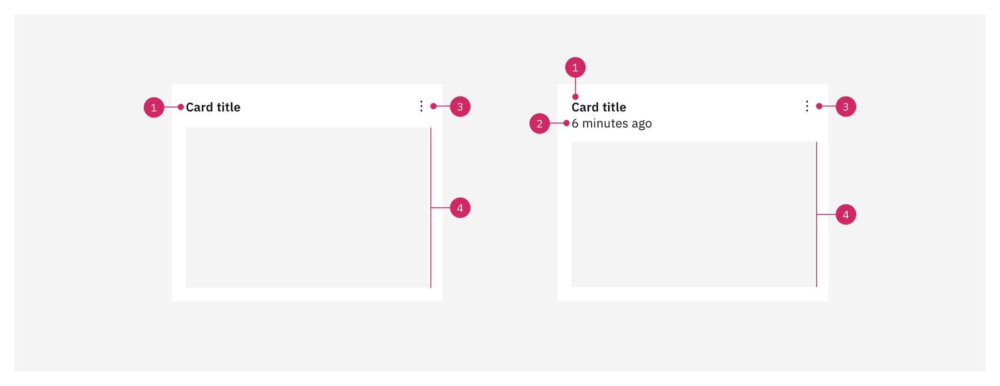

<- [Back to dashboard overview](https://pages.github.ibm.com/cdai-design/pal/patterns/dashboards/usage)

<PageDescription>

Card functions will be differentiated from dashboard functions by calling attention to more granular dashboard actions. 

</PageDescription>

<AnchorLinks>
  <AnchorLink>Overview</AnchorLink>
  <AnchorLink>Specs</AnchorLink>
</AnchorLinks>

## Overview

Card functions will be broken down according to their core functions: 

- adding and destroying cards
- editing cards
- filtering cards
- performing miscellaneous other functions

<Row>
  <Column colMd={4} colLg={8}>

</Column>
</Row>

## Specs

Dashboards contain many types of cards that can be used to display data in different formats.

  #### Anatomy of a card

Cards are comprised of some or all of the following elements:

<Row>
  <Column colMd={4} colLg={8}>

</Column>
</Row>

1. **Title (optional):** Summarizes the information contained in the card. It can wrap up to two lines. Text on the card should use sentence-style capitalization.
2. **Subtitle (optional):** Provides additional information about the card information.
3. **Actions (optional):** Contains actionable items users can take on the overall card.
4. **Body:** Contains the main information summarized in the card. It can contain components, such as tables and data visualizations, and can be interactive.

### Defining card proportion 

Card sizes are [hybrid boxes](https://www.carbondesignsystem.com/guidelines/2x-grid/overview#hybrid-boxes) that have fluid widths and fixed heights. Five different card sizes are available. Choose a size that works best for the amount of content you have in your card. 

Pair card sizes together to fit the full 16-column width; for example, pair four `xsmall` cards together, or pair one `xsmall` and one `medium` card together to fill the full 16-columns.

<Row>
  <Column colMd={4} colLg={8}>

</Column>
</Row>

#### Card sizes

- `xsmall`: 4 columns
- `small`: 6 columns
- `medium`: 8 columns
- `large`: 12 columns
- `xlarge`: 16 columns

#### Height

A recommended set of fixed card heights for dashboards are based on the 2:1 ratio of the xsmall card. You can achieve the next card height by stacking two of the xsmall cards on top of each other with 16px padding in between.

<Row>
  <Column colMd={4} colLg={8}>

_Example:_
- Base `xsmall` card height = **152px**
- **152px** + 16px + 152px = **320px**

</Column>
</Row>

