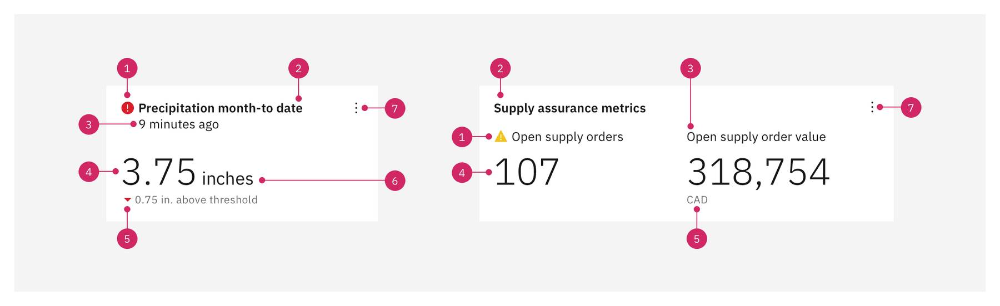
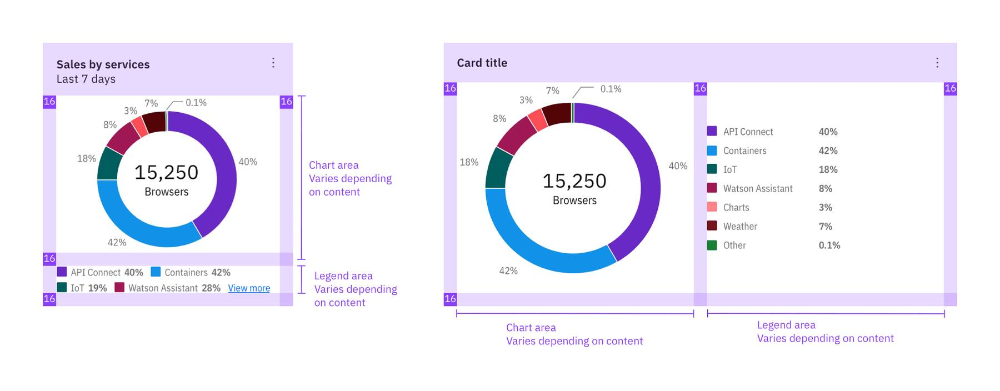

<- [Back to dashboard overview](https://pages.github.ibm.com/cdai-design/pal/patterns/dashboards/usage)

<PageDescription>

Various types of cards are used in dashboards to deliver a specific narrative. They can range in purpose from static to fully-interactive depending on the user's need.  

</PageDescription>

<AnchorLinks>
  <AnchorLink>Overview</AnchorLink>
  <AnchorLink>Value cards</AnchorLink>
  <AnchorLink>Charts</AnchorLink>
  <AnchorLink>Interactive maps</AnchorLink>

</AnchorLinks>

## Overview

The following covers the most common card types typically used on dashboards, but it is not an exhaustive list. 

| Type        |      Purpose      |   Context |
| ------------- | ----------- | ----- |
| [Value cards](#value-cards)      | Highlight a single metric. | Show the progress of a key performance indicator.|
| [Charts](#charts)     |   Visualize data or transform raw data into easy-to-interpret insights.     |   Show the time-to-failure for a range of assets.  |
| [Interactive maps](#interactive-maps) |   Show data of interest within a geographic area.   |    Show the locations of overdue work orders or a weather forecast map for a service area. |

## Value cards

Value cards highlight a single metric of data or a group of single metrics and often display a total, average, or trend.

#### Anatomy of a value card

Value cards are comprised of some or all of the following elements:

<Row>
  <Column colMd={4} colLg={8}>

</Column>
</Row>

1. **Status (optional):**  An icon that indicates the status of the metric.
2. **Title (optional):** A summary of the information contained in the card. It can wrap up to two lines.
3. **Subtitle (optional):**  Additional information about the card.
4. **Value:** A single summary of the data. It can be a numeric value or text.
5. **Metrics (optional):** Supporting information about the value, such as an object, trend, multiplier, or currency.
6. **UOM (optional):**  The unit of measurement for the data, such as a height measurement like inches.
7. **Actions (optional):**  Actionable items users can take on the overall card.

#### When to use

- Use when you want to measure progress or the distance to a goal.
- Use when you want to show the status of something.
- Use when you’re constrained for space and want to highlight a summary of data.

#### Best practices

- Keep the metric information short and easy for users to understand quickly.
- If the values are often long, use the next card width size to avoid truncation.
- Group related values together into one card when appropriate but try not to add more than 4-5 in a row.
- Consider how your values will truncate in smaller screen sizes/spaces (i.e. 400,000 on a desktop can also be written as 400K on mobile).
- White space is okay — optimize for enough space for your content so it doesn’t truncate.

## Charts

Using charts on dashboards offers a way to visualize data sets that provides the ability for a company to clearly display how key aspects of their business are performing. Every chart should tell a story and should reflect the content on the page where it is found.

The [Data Visualization](https://www.carbondesignsystem.com/data-visualization/chart-types) section in the Carbon Design System details the use, styling, and creation of charts. We recommend that you refer to this section for guidance on identifying the visualization purpose, and choosing the appropriate chart type.

This section is focused on a synthesized set of criteria specific to using any chart on a dashboard.

#### Anatomy of a chart card

Charts are comprised of all or some of the following elements:

<Row>
  <Column colMd={4} colLg={8}>

</Column>
</Row>

1. **Title:** A summary of the information contained in the chart. It can wrap up to two lines.
2. **Chart:** The visual representation of the information.
3. **Legend:** Key information that shows what is represented by each color in the chart.
4. **Actions (optional):** Actionable items users can take on the overall card.

#### Legend placement

The chart itself varies in size depending on the size of the card and whether you place your legend at the bottom or to the right of the chart. When you place the legend to the right of the chart, the width is determined by the content of the legend. The chart gets smaller when the legend gets wider or taller. When the legend is at the bottom and it has more than 2 rows of content, there is a “View More” link that expands the legend and pushes the chart up or left to reveal the entire legend. When the legend is to the right of the chart, the max width will be 16px to the right of the chart plus padding.

<Row>
  <Column colMd={4} colLg={8}>

</Column>
</Row>
<Caption>
Legend placement, to the bottom (left) and the right (right) of a chart
</Caption>

#### Best practices: 

- Choose a chart type that will display the data in the clearest way for the user.
- Choose a card size that best fits the chart layout.
- Use the Carbon Charts color palettes based on your needs:
  - If you need to show status, use the alert palette.
  - If you have more than 5 values on the chart, use the categorical color palette.

## Interactive maps

This section is focused on a synthesized set of criteria specific to using maps on a dashboard.

For dynamic, real-time mapping, Carbon has created four themes using [Mapbox](https://www.mapbox.com/). For more information, see the [Advanced charts](https://www.carbondesignsystem.com/data-visualization/advanced-charts#mapbox) section in Carbon’s Data visualization. These base maps are monochromatic and are useful if you want the map layers to be the focal point and don’t necessarily need to see realistic terrain or water.

If you plan to use weather-specific maps in your application, a set of custom Mapbox maps are available, including a [dark map](https://api.mapbox.com/styles/v1/weather/cjzsuqltv0bzr1cqlg5cgvrzy.html?fresh=true&title=view&access_token=pk.eyJ1Ijoid2VhdGhlciIsImEiOiJjaWk2bzk1eG8wMXJhdHdrZjJjMmJxNzJjIn0.kYeed_5RIEgpXcqodNVR4w), [light map](https://api.mapbox.com/styles/v1/weather/cjza6kkx1015b1cnwrt2qh1xd.html?fresh=true&title=view&access_token=pk.eyJ1Ijoid2VhdGhlciIsImEiOiJjaWk2bzk1eG8wMXJhdHdrZjJjMmJxNzJjIn0.kYeed_5RIEgpXcqodNVR4w), and [satellite map](https://api.mapbox.com/styles/v1/weather/cjza6kkx1015b1cnwrt2qh1xd.html?fresh=true&title=view&access_token=pk.eyJ1Ijoid2VhdGhlciIsImEiOiJjaWk2bzk1eG8wMXJhdHdrZjJjMmJxNzJjIn0.kYeed_5RIEgpXcqodNVR4w). These custom weather maps include additional details in the terrain, water, map markers, and map layers.

For more information on using maps related to weather on your dashboards, contact [Pam Erickson](https://w3.ibm.com/#/people/5G4553897).

#### Anatomy of a map card

Most charts have a margin surrounding the chart itself. _Maps are an exception to the rule in that they are full-bleed on at least 2 sides: left and right._ 

If there is no title, actions, or legend, then the map can bleed on all four sides.

Legends that require the full breadth of the Carbon charts palette should use either the White or the Gray 100 style for the most accessible results.

Maps are comprised of all or some of the following elements:

<Row>
  <Column colMd={4} colLg={8}>

</Column>
</Row>

1. **Title (optional):** A summary of the information contained in the map. It can wrap up to two lines.
2. **Map:** The visual representation of the information.
3. **Legend:** Key information that shows what is represented by each color in the map.
4. **Actions (optional):** Actionable items users can take on the overall card.
5. **Map controls:** Interactive mechanisms that allow you to interact with the map, such as  zoom controls and map layers.

#### Legend placement

The map itself varies in size depending on the size of the card. The height is determined by the height of the legend content. When the legend is at the bottom, and it has more than 2 rows of content, there is a “View more” link that expands the legend and pushes the map up to reveal the entire legend.

<Row>
  <Column colMd={4} colLg={8}>

</Column>
</Row>

#### Best practices: 

- Use the Carbon Charts color palettes based on your needs:
- If you need to show status, use the alert palette.
  - If you have more than 5 values on the chart, use the categorical color palette.
  - If you need users to interact with the map, choose a size large enough be useful.
