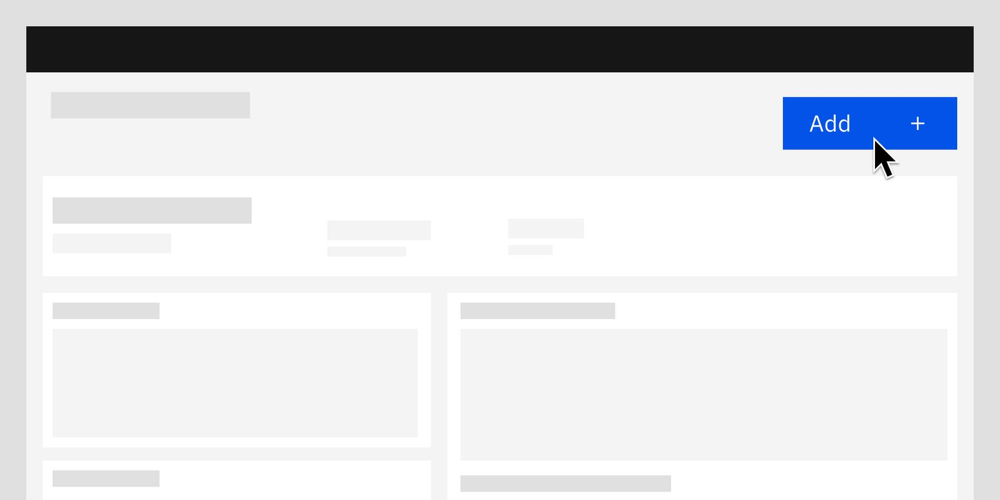

export const Title = () => (
  
    Additive and   destructive functions
  
);

<- [Back to dashboard overview](https://pages.github.ibm.com/cdai-design/pal/patterns/dashboards/usage)

<PageDescription>

Additive and destructive functions are the primary functions of a dashboard. Good examples include creating or deleting the dashboards.

</PageDescription>

<AnchorLinks>
  <AnchorLink>Overview</AnchorLink>
  <AnchorLink>Creating dashboards</AnchorLink>
  <AnchorLink>Creating views</AnchorLink>
  <AnchorLink>Adding sections</AnchorLink>
  <AnchorLink>Deleting dashboards</AnchorLink>

</AnchorLinks>

## Overview

The additive and destructive functions involved here will focus on the dashboard itself. This will include creating net new views, adding sections, or removing entire dashboards. 

Any sort of alteration of preexisting dashboards will fall under the purview of `Edit`.

<Row>
  <Column colMd={4} colLg={8}>

</Column>
</Row>

## Creating dashboards 
	
Depending on the amount of information that is required, users can either create dashboards using a simple modal or a full-page wizard.

#### Modals

Modals should be used when users do not need to provide a lot of information and only a dashboard name and description is required.

<Row>
  <Column colMd={4} colLg={8}>

</Column>
</Row>

#### Wizards

Wizards should be used when more information is required to create a dashboard and can include some or all of the following steps:
- Providing a name and description.
- Choosing the layout, either a blank dashboard or an existing template, if available.
- Selecting the data source for the data that is displayed on the dashboard.
- Assigning users and their permissions.
- Completing any other steps that may be relevant to your application.
- The use case may occasionally call for a tearsheet. Guidance is found [here](https://pages.github.ibm.com/cdai-design/pal/components/tearsheet/usage/). 

<Row>
  <Column colMd={4} colLg={8}>

</Column>
</Row>

## Creating views

Views are an optional way to organize data and related cards within a dashboard. If permitted, users can create, edit, and delete views.  Like dashboards, views can be created through a simple modal or a full-page wizard.

Users can create views by clicking the `Add button (+)` in the tab area to open the modal or wizard. After the views have been created, they can be edited or deleted using the same direct edit or controlled edit configuration patterns that were established at the dashboard level.

View-level actions should be placed below the tab area.

#### Modals

- Modals should be used when users do not need to provide a lot of information and only a view name and description is required.

<Row>
  <Column colMd={4} colLg={8}>

</Column>
</Row>

#### Wizards

Wizards should be used when more information is required to create a view and can include some or all of the following steps:

- Providing a name and description.
- Choosing the layout, either a blank view or an existing template, if available.
- Selecting the data source for the data that is displayed in the view.
- Assigning users and their permissions.
- Completing any other steps that may be relevant to your application.
- The use case may occasionally call for a tearsheet. Guidance is found [here](https://pages.github.ibm.com/cdai-design/pal/components/tearsheet/usage/). 

<Row>
  <Column colMd={4} colLg={8}>

</Column>
</Row>

## Adding sections

Sections can be used to organize cards that have related content, and they can be collapsible, which facilitates quicker navigation of dashboards that contain a lot of content. Sections can be available in the gallery with pre-defined cards already selected or empty for users to customize.

#### Editing a section

- For direct edit, the edit section menu is always visible in the section header toolbar.
- For controlled edit, the edit section menu only appears in the section header toolbar when the dashboard is in edit mode.

<Row>
  <Column colMd={4} colLg={8}>

</Column>
</Row>

## Deleting dashboards

With permission, the user can delete dashboards directly from the dashboard or the dashboard list page. When deleting a dashboard, the user will be prompted with a Delete confirmation modal.

<Row>
  <Column colMd={4} colLg={8}>

</Column>
</Row>

<InlineNotification>

**Note:** While there are distinct deletion/removal patterns already found in the [Carbon for IBM Products](https://pages.github.ibm.com/cdai-design/pal/patterns/removing/usage) site, the information below more directly relates to dashboard interactions.

</InlineNotification>

#### Dashboard

For both direct and controlled edit, the user can delete a dashboard from the dashboard actions in the header area.

<Row>
  <Column colMd={4} colLg={8}>

</Column>
</Row>

#### Dashboard list page

Users can delete dashboards from the dashboard list page, without needing to drill into the dashboard each time.

<Row>
  <Column colMd={4} colLg={8}>

</Column>
</Row>
