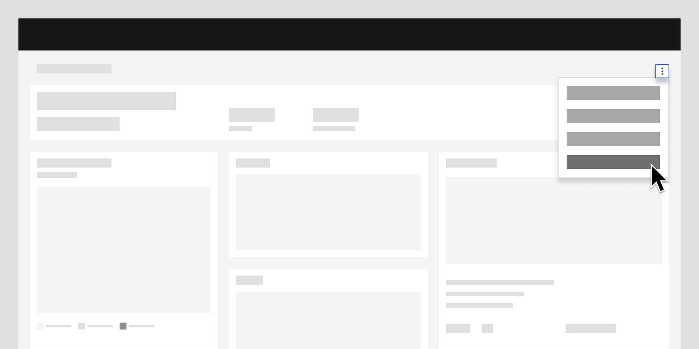

<InlineNotification>

**Note:** While there are distinct editing patterns already found in the [Carbon for IBM Products](https://pages.github.ibm.com/cdai-design/pal/patterns/edit/usage) site, the information below more directly relates to dashboard interactions.

</InlineNotification>

<- [Back to dashboard overview](https://pages.github.ibm.com/cdai-design/pal/patterns/dashboards/usage)

<PageDescription>

After a dashboard has been created, additional configuration is often required. This is where "edit" comes into play.

</PageDescription>

<AnchorLinks>
  <AnchorLink>Overview</AnchorLink>
  <AnchorLink>Configuring dashboards</AnchorLink>
  <AnchorLink>Direct edit</AnchorLink>
  <AnchorLink>Controlled edit</AnchorLink>
</AnchorLinks>

## Overview

Editing is one of the most foundational functions in UX and follows suit when dashboards are being used. Editing allows users to append their entries, adjust mistakes, or create more concise parameters.  

<Row>
  <Column colMd={4} colLg={8}>

</Column>
</Row>

## Configuring dashboards

Multiple configuration variations exist and are based on the different levels of permissions or controls that are available to the user. The type of variation you use is determined by the purpose of the dashboard and the level of configuration that the user requires to meet their goals.

Two primary configuration variants are discussed below: `Direct edit` and `Controlled edit`.

### Deciding what to use

| Variations  |  Description |  Usage  |
| ---  --- | ---  --- | --- --- |
| Direct edit | Users can directly make changes to the dashboard, like adding or moving cards. |  Use when dashboards are limited to individual users and are generally low risk to edit. |
| Controlled edit | An edit button is available on the dashboard that gives users the ability to add, edit, and delete cards. | Use when dashboards are shared between multiple users and an accidental change would affect other users.|

## Direct edit

Direct edit allows users to make changes directly to the dashboard, such as adding or moving cards. Changes made to the dashboard in direct edit mode are implicitly saved.

#### Anatomy of direct edit
Direct edit is comprised of the following components:

<Row>
  <Column colMd={4} colLg={8}>

</Column>
</Row>

1. **Add card:** An add button that opens the gallery panel and allows users to add new cards.
2. **Card overflow menu:** Edit controls on each individual card that opens the configuration panel.

#### When to use

- Use when dashboards are limited to individual users.
- Use when editing dashboards is a low risk.

## Controlled edit

On a controlled edit dashboard, an edit button is available on the dashboard that enables the user to add, edit, and delete cards. When a controlled edit dashboard is opened, it is in a read-only view mode. Changes that are made in controlled edit mode are explicitly saved.

#### Anatomy of controlled edit
Controlled edit is comprised of the following components:

<Row>
  <Column colMd={4} colLg={8}>

</Column>
</Row>

1. **Edit:** Action button to trigger the full edit mode.
2. **Save and Cancel:** Actions to apply or cancel the changes made in edit mode.
3. **Card overflow menu:** Additional edit controls on each individual card.
4. **Panel:** Main panel used for adding and configuring cards.

#### When to use

- Use when dashboards are shared between multiple users and an accidental change would affect other users.
- Use when a user often wants to make multiple changes across the dashboard at once.

