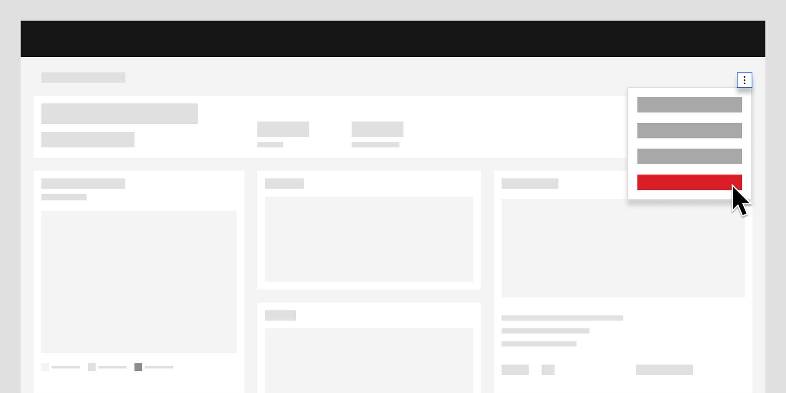

<- [Back to dashboard overview](https://pages.github.ibm.com/cdai-design/pal/patterns/dashboards/usage)

<PageDescription>

Dashboard functions will be differentiated from Card functions by calling attention to bigger picture dashboard actions. Card functions will instead refer to actions taken specific to card UX.

</PageDescription>

## Overview

Dashboards functions will be broken down according to their core intent: 

- adding or deleting dashboards
- editing dashboards
- filtering dashboards
- refreshing dashboards
- committing bulk actions

<Row>
  <Column colMd={4} colLg={8}>

</Column>
</Row>

