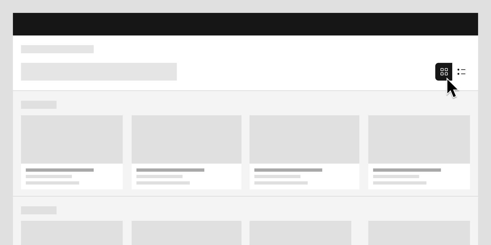

<- [Back to dashboard overview](https://pages.github.ibm.com/cdai-design/pal/patterns/dashboards/usage)

<PageDescription>

A dashboard list page allows you to manage, organize, and drill in to any dashboard you have access to. 

</PageDescription>

<AnchorLinks>
  <AnchorLink>Overview</AnchorLink>
  <AnchorLink>Anatomy of a dashboard list page</AnchorLink>
  <AnchorLink>When to use</AnchorLink>
  <AnchorLink>When not to use</AnchorLink>
  <AnchorLink>Best practices</AnchorLink>
</AnchorLinks>

## Overview

A dashboard list page may often be called “Dashboards” in the UI. They can also be organized into sections or favorited and pinned to the top of the page. 

<Row>
  <Column colMd={4} colLg={8}>

</Column>

</Row>

<Caption>

Dashboards can be shown in either card or list views.

</Caption>

<Row>
  <Column colMd={4} colLg={4}>

Show an image with a breadcrumb and use the following text:

</Column>

</Row>

After clicking on a dashboard, users can regain access to the dashboard list page by clicking the breadcrumb above the dashboard page header.

## Anatomy of a dashboard list page

Dashboard list pages are comprised of some or all of the following elements:

<Row>
  <Column colMd={4} colLg={8}>

</Column>
</Row>

1. **Create new dashboard button:** Opens the dashboard creation wizard or modal.
2. **Card/list view toggle:** Switches the dashboard list page between a grid view and a table view of dashboards.
3. **Search:** Searches across all dashboard titles
4. **Dashboards:** Shows all of the dashboards you have access to, which can be organized into favorites or sections.
5. **Favorites icon:** Pins dashboards to the top of the card view or list view for easier access.
6. **Section:** A partitioned area of the dashboard used to separate and group similar content.

## When to use

- Use to manage and organize multiple dashboards.
- Use when users can create custom dashboards.
- Use when users have not specified a landing page.

## When not to use
- Don’t use if your product only has a single dashboard.

## Best practices
- If the user has access to several dashboards, use sections or allow the user to favorite dashboards they frequently access to help them organize.
- If the user has not specified a landing page, use the dashboard list page as the landing page.
- If the user has chosen a specific dashboard as their landing page, include the dashboard list page in the breadcrumb area so the user can still access it.
- Include dashboard-level actions on the list page so users have a quick way to manage their dashboards (e.g. edit, delete, share).