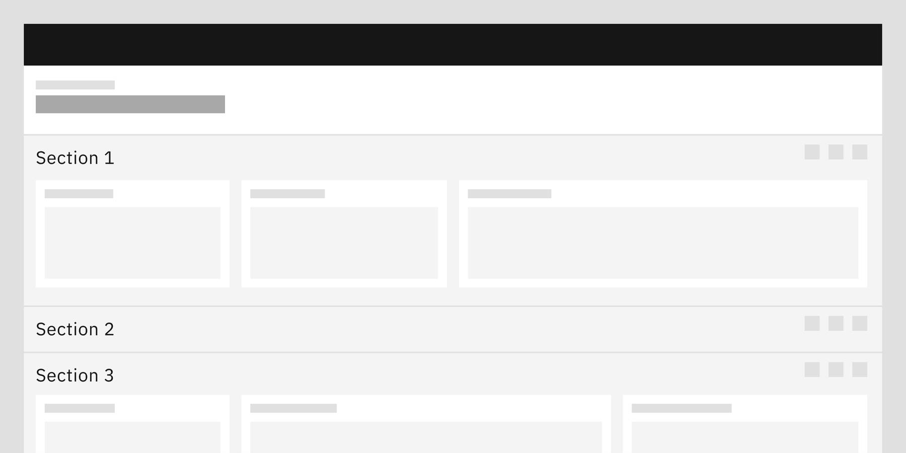

<- [Back to dashboard overview](https://pages.github.ibm.com/cdai-design/pal/patterns/dashboards/usage)

<PageDescription>

Since a dashboard's primary role is enabling your user to establish a narrative, you'll need to give them tools to operate. 

The most effective of these tools is **hierarchy**. 

</PageDescription>

## Overview

Dashboard hierarchy can be broken into three main hierarchical tools: **dashboard list pages**, **views**, and **sections**. Each hierarchical tool has a specific purpose and can be combined with one another to establish a variety of meanings and outcomes.

<Row>
  <Column colMd={4} colLg={8}>

</Column>
</Row>

According to the image above, you'll notice that the hierarchical tools can be arranged in a number of ways. The most linear setup would use all the hierarchical tools available. To do that, one would follow the solid line from **Application/Platform** all the way to **cards**.

However, to create a specific narrative, permutations of that setup make sense. There are many dashboards that are made of only **cards** and forego **views** or **sections** entirely.

### Dashboard list page

**Dashboard list pages** establish a collection of **dashboards** that may be viewed in either **card** format or a more traditional table-based list.

<Row>
  <Column colMd={4} colLg={8}>

</Column>
</Row>

### Views

**Views** allow the user to dig into tabbed portions of a dashboard. Where the **dashboard list page** is used to separate varying dashboards, **views** are used to separate larger-scaled content/concepts found inside specific dashboards.

_(Description needs further enhancement by team)_

<Row>
  <Column colMd={4} colLg={8}>

</Column>
</Row>

### Sections

**Sections** are partitioned regions that could be found either inside a **dashboard**, or more specifically, inside a **view**. These page regions are typically expandable and contain various forms of **cards** and data visualizations.

<Row>
  <Column colMd={4} colLg={8}>

</Column>
</Row>

