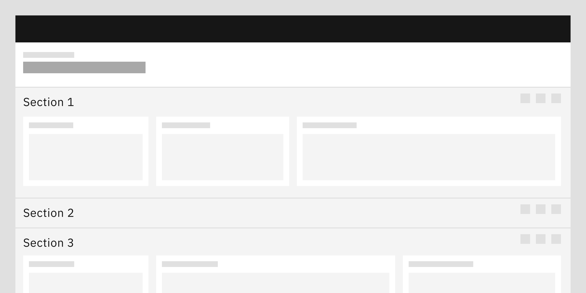

<- [Back to dashboard overview](https://pages.github.ibm.com/cdai-design/pal/patterns/dashboards/usage)

<PageDescription>

**Sections** are an optional way to organize data and related cards within a dashboard. 

Sections vary from **views** in that they are more closely and directly related to the information found in **cards**.

</PageDescription>

<AnchorLinks>
  <AnchorLink>Overview</AnchorLink>
  <AnchorLink>Specs</AnchorLink>
  <AnchorLink>Anatomy of a section</AnchorLink>
  <AnchorLink>Best practices</AnchorLink>
</AnchorLinks>

## Overview

Sections will behave as a region that groups similar information in order to reduce the visual drag of a dashboard experience.

If permitted, users can create, edit, move, and delete sections. A section always spans the full width of the chosen layout:

- If a dashboard uses the basic grid, the section spans the full width of the grid.
- If a dashboard is divided into columns, the section spans the full width of the column.

<Row>
  <Column colMd={4} colLg={8}>

</Column>
</Row>

## Specs

<Row>
  <Column colMd={4} colLg={8}>

  Use `$productive-heading-03` for the section title and `$spacing-03` above and below the section title. This will yield a total height of 48px. 
  
  At the bottom of the section, use the 24px tall `$spacing-06` token. 

   

</Column>
</Row>

## Anatomy of a section

Sections are comprised of some or all of the following elements:

<Row>
  <Column colMd={4} colLg={8}>

</Column>
</Row>

1. **Upper divider line:** Visually separates the section from the content above it.
2. **Title:** Identifies the purpose of the section.
3. **Description (optional):** Provides additional information about the section.
4. **Actions:** Allow users to modify the section as a whole, such as edit the section, or interact with the content. Section edit actions are in an overflow menu and include: Edit section , Duplicate, Move up, Move down, and Remove section. Content interactions might include Search, Set date range, Collapse / Expand and any other custom interactions that an offering team wants to include.
5. **Expand/collapse:** Allows the content within the section to be expanded or collapsed to save vertical space.
6. **Content area:** Contains the cards that are available within the section.
7. **Lower divider line (optional):** Visually separates the section from the content below it.

## Best practices

- If a section is followed by another section, only the upper divider line is necessary. In this case, the upper divider line from the subsequent section will also mark the end of the previous section.
- Include both an upper and lower divider line only when the section is the last of a sequence and is followed by cards not contained within a section.
- The actions available on a section may differ across offerings, depending on the needs of the end user. However, if users are permitted to create sections, they should at minimum always have the ability to add and remove cards from the section and delete the section.
- Stack sections one immediately after the other with no added spacing between the sections.
